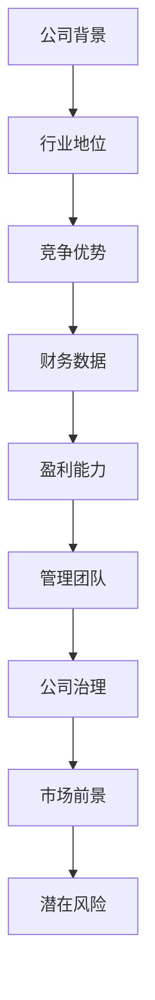
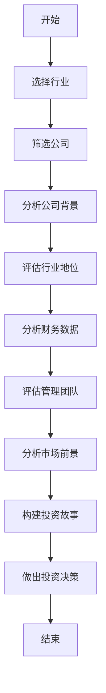

                 

# 彼得林奇的"讲故事"投资法

> 关键词：彼得林奇，投资法，讲故事，基本面分析，投资策略，风险管理

> 摘要：本文深入探讨了彼得林奇的"讲故事"投资法，分析了其核心理念、方法论和实战应用。通过系统化的方法，我们揭示了如何通过深入分析公司背景、财务数据、管理团队和市场前景，构建投资故事，从而做出科学的投资决策。本文结合技术语言和逻辑推理，为投资者提供了从理论到实践的完整指导。

---

# 第一部分：彼得林奇"讲故事"投资法的背景与核心理念

# 第1章：彼得林奇"讲故事"投资法的背景介绍

## 1.1 投资领域的核心问题与挑战

### 1.1.1 投资领域的核心问题
- **问题背景**：投资领域存在信息不对称、市场波动性和个体决策偏差等问题，导致传统投资方法的局限性。
- **问题描述**：传统投资方法依赖于技术指标或市场情绪，难以捕捉公司的长期价值。
- **问题解决**：彼得林奇提出通过深入分析公司基本面，构建投资故事，从而做出长期投资决策。
- **边界与外延**：故事化投资法不仅适用于股票，还可扩展到其他资产类别，如债券和房地产。

### 1.1.2 传统投资方法的局限性
- **图表分析法**：依赖历史价格走势，无法反映公司内在价值。
- **市场情绪法**：容易受到短期市场波动影响，忽视长期价值。
- **随机漫步理论**：认为市场是随机的，忽视了基本面分析的重要性。

### 1.1.3 彼得林奇投资法的创新性
- **核心理念**：通过深入分析公司的基本面，构建投资故事，识别长期价值。
- **创新点**：将公司视为一个“故事”，从多个维度分析其发展逻辑和潜在价值。

## 1.2 "讲故事"投资法的核心概念

### 1.2.1 "讲故事"投资法的定义
- **定义**：通过分析公司的历史、行业地位、财务数据、管理团队和市场前景，构建一个完整的“投资故事”，从而评估其投资价值。
- **关键特征**：
  - **系统性**：从多个维度全面分析公司。
  - **逻辑性**：通过因果关系构建投资逻辑。
  - **可验证性**：通过数据和事实验证投资故事的合理性。

### 1.2.2 投资故事的核心要素
- **公司背景**：行业地位、竞争优势、历史发展。
- **财务数据**：收入、利润、资产负债情况。
- **管理团队**：领导层稳定性、决策能力。
- **市场前景**：行业发展趋势、潜在机会与风险。

### 1.2.3 "讲故事"投资法与传统投资方法的区别
- **区别维度**：
  | 对比维度 | 传统投资法 | "讲故事"投资法 |
  |----------|------------|----------------|
  | 分析重点 | 市场价格、技术指标 | 公司基本面、长期价值 |
  | 分析深度 | 浅层分析 | 深度分析 |
  | 投资决策 | 短期决策 | 长期决策 |

## 1.3 彼得林奇投资法的理论基础

### 1.3.1 基本面分析的核心要素
- **财务数据**：收入、利润、现金流、资产负债表。
- **行业地位**：市场占有率、竞争优势、行业趋势。
- **管理团队**：领导层能力、公司治理结构。

### 1.3.2 价值投资的哲学与原则
- **价值投资的核心原则**：买入被市场低估的优质资产。
- **彼得林奇的投资哲学**：通过深入研究公司基本面，寻找具有长期增长潜力的公司。

### 1.3.3 "讲故事"方法与传统基本面分析的结合
- **结合点**：将基本面分析结果转化为投资故事，通过逻辑推理得出投资结论。

## 1.4 本章小结
- 通过分析投资领域的核心问题，介绍了“讲故事”投资法的核心概念和理论基础，为后续的系统分析奠定了基础。

---

# 第二部分：彼得林奇"讲故事"投资法的核心概念与原理

# 第2章：彼得林奇"讲故事"投资法的核心要素

## 2.1 公司背景与行业地位

### 2.1.1 公司背景的分析维度
- **公司历史**：成立时间、发展历程。
- **行业地位**：市场占有率、竞争对手分析。
- **竞争优势**：核心竞争力、护城河。

### 2.1.2 行业地位的评估指标
- **市场集中度**：CR4、CR8。
- **行业周期**：增长期、成熟期、衰退期。
- **政策环境**：行业政策、税收优惠。

### 2.1.3 竞争优势的识别方法
- **成本优势**：规模效应、供应链优势。
- **技术优势**：专利数量、研发能力。
- **品牌优势**：品牌影响力、客户忠诚度。

## 2.2 财务数据与盈利能力

### 2.2.1 财务数据的分析框架
- **收入与利润**：收入增长率、净利润率。
- **现金流**：经营活动现金流、自由现金流。
- **资产负债表**：资产周转率、负债结构。

### 2.2.2 盈利能力的评估指标
- **ROE**：净资产收益率。
- **ROA**：资产回报率。
- **毛利率**：产品盈利能力。

### 2.2.3 财务健康性的判断标准
- **流动性**：流动比率、速动比率。
- **偿债能力**：负债率、利息覆盖倍数。
- **盈利能力**：净利润率、EBITDA。

## 2.3 管理团队与公司治理

### 2.3.1 管理团队的分析维度
- **领导层**：董事长、CEO的背景与能力。
- **管理风格**：决策风格、团队稳定性。
- **激励机制**：股权激励、奖金制度。

### 2.3.2 公司治理的评估指标
- **董事会结构**：独立董事比例、董事会效率。
- **股东权益**：股东权利、股东大会决策流程。
- **透明度**：信息披露质量、财报准确性。

### 2.3.3 团队稳定性与决策能力
- **团队稳定性**：高管 turnover率。
- **决策能力**：战略规划、执行能力。
- **激励机制**：员工激励效果。

## 2.4 市场前景与潜在风险

### 2.4.1 市场前景的分析方法
- **行业趋势**：市场规模、增长潜力。
- **市场需求**：消费者偏好、产品生命周期。
- **技术创新**：技术进步对行业的影响。

### 2.4.2 潜在风险的识别与评估
- **行业风险**：政策风险、技术风险。
- **财务风险**：流动性风险、偿债风险。
- **市场风险**：价格波动、竞争风险。

### 2.4.3 风险与收益的平衡点
- **风险评估**：通过概率和影响分析。
- **收益评估**：通过DCF模型、PEG指标。
- **风险控制**：设定止损点、分散投资。

## 2.5 本章小结
- 本章详细分析了“讲故事”投资法的核心要素，包括公司背景、财务数据、管理团队和市场前景，为后续的系统分析奠定了基础。

---

# 第三部分：彼得林奇"讲故事"投资法的系统分析与架构设计

# 第3章：彼得林奇"讲故事"投资法的系统分析

## 3.1 投资故事的分析框架

### 3.1.1 公司背景与行业地位的分析流程
- **步骤1**：分析公司历史与行业地位。
- **步骤2**：识别竞争优势与市场前景。
- **步骤3**：评估行业周期与政策环境。

### 3.1.2 财务数据与盈利能力的分析流程
- **步骤1**：分析收入与利润。
- **步骤2**：评估现金流与资产负债表。
- **步骤3**：计算盈利能力指标。

### 3.1.3 管理团队与公司治理的分析流程
- **步骤1**：分析管理团队稳定性。
- **步骤2**：评估公司治理结构。
- **步骤3**：评估激励机制。

### 3.1.4 市场前景与潜在风险的分析流程
- **步骤1**：分析行业趋势。
- **步骤2**：识别潜在风险。
- **步骤3**：评估风险与收益平衡点。

## 3.2 投资故事的构建逻辑

### 3.2.1 投资故事的逻辑框架
- **框架**：公司背景 → 行业地位 → 财务数据 → 管理团队 → 市场前景 → 投资逻辑。

### 3.2.2 投资故事的构建步骤
- **步骤1**：收集公司信息。
- **步骤2**：分析核心要素。
- **步骤3**：构建投资逻辑。
- **步骤4**：验证投资故事。

### 3.2.3 投资故事的验证方法
- **验证维度**：财务数据、行业趋势、市场反馈。
- **验证工具**：DCF模型、SWOT分析、情景分析。

## 3.3 投资故事的可视化工具

### 3.3.1 公司分析的框架图

### 3.3.2 投资决策的流程图

## 3.4 本章小结
- 本章通过构建系统的分析框架和流程图，详细阐述了如何通过“讲故事”投资法进行投资决策，为读者提供了清晰的分析路径。

---

# 第四部分：彼得林奇"讲故事"投资法的实战应用与案例分析

# 第4章：彼得林奇"讲故事"投资法的实战案例

## 4.1 案例分析：微软公司

### 4.1.1 公司背景
- **成立时间**：1975年。
- **行业地位**：全球最大的软件公司。
- **竞争优势**：操作系统垄断、云服务龙头。

### 4.1.2 财务数据
- **收入**：年收入超过1000亿美元。
- **利润**：净利润率保持在30%以上。
- **现金流**：自由现金流强劲。

### 4.1.3 管理团队
- **CEO**：萨提亚·纳德拉，领导能力出色。
- **管理风格**：注重创新与合作。
- **激励机制**：员工持股计划。

### 4.1.4 市场前景
- **行业趋势**：云服务增长迅速。
- **市场需求**：企业数字化转型需求旺盛。
- **潜在风险**：反垄断风险、技术替代风险。

## 4.2 案例分析：亚马逊公司

### 4.2.1 公司背景
- **成立时间**：1994年。
- **行业地位**：全球最大的电商平台。
- **竞争优势**：物流网络、Prime会员体系。

### 4.2.2 财务数据
- **收入**：年收入超过4000亿美元。
- **利润**：净利润率逐年提升。
- **现金流**：自由现金流稳定增长。

### 4.2.3 管理团队
- **CEO**：安迪·贾西，领导亚马逊云服务（AWS）。
- **管理风格**：数据驱动、客户至上。
- **激励机制**：股票期权激励。

### 4.2.4 市场前景
- **行业趋势**：电子商务持续增长。
- **市场需求**：Prime会员需求强劲。
- **潜在风险**：市场竞争加剧、数据隐私风险。

## 4.3 案例分析：特斯拉公司

### 4.3.1 公司背景
- **成立时间**：2003年。
- **行业地位**：全球领先的电动汽车制造商。
- **竞争优势**：垂直整合、技术创新。

### 4.3.2 财务数据
- **收入**：年收入超过800亿美元。
- **利润**：净利润率逐步提高。
- **现金流**：自由现金流波动较大。

### 4.3.3 管理团队
- **CEO**：埃隆·马斯克，愿景远大。
- **管理风格**：目标导向、注重技术创新。
- **激励机制**：股票期权激励、员工持股计划。

### 4.3.4 市场前景
- **行业趋势**：电动汽车市场增长迅速。
- **市场需求**：环保政策推动、消费者需求增加。
- **潜在风险**：技术竞争、政策风险。

## 4.4 本章小结
- 通过分析微软、亚马逊和特斯拉的案例，展示了如何通过“讲故事”投资法进行投资决策，验证了该方法的有效性。

---

# 第五部分：彼得林奇"讲故事"投资法的进阶策略与风险管理

# 第5章：彼得林奇"讲故事"投资法的进阶策略

## 5.1 "讲故事"投资法的进阶策略

### 5.1.1 组合投资策略
- **核心仓位**：投资于具有长期增长潜力的公司。
- **卫星仓位**：投资于高风险高回报的创新公司。
- **防御仓位**：投资于防御性行业，如公用事业、消费品。

### 5.1.2 行业轮换策略
- **行业选择**：根据经济周期选择行业。
- **轮换时机**：根据行业趋势和估值水平决定轮换时间。
- **风险控制**：通过分散投资降低行业轮换风险。

### 5.1.3 估值策略
- **内在价值计算**：使用DCF模型、可比公司分析。
- **安全边际**：买入价格低于内在价值。
- **动态估值**：根据市场变化调整估值模型。

## 5.2 风险管理策略

### 5.2.1 风险识别与评估
- **系统性风险**：市场风险、政策风险。
- **非系统性风险**：公司特有风险、行业风险。
- **风险评估**：通过情景分析、压力测试。

### 5.2.2 风险控制方法
- **分散投资**：通过投资不同行业、不同公司分散风险。
- **止损策略**：设定止损点，避免重大损失。
- **动态调整**：根据市场变化和公司情况动态调整投资组合。

## 5.3 本章小结
- 本章介绍了“讲故事”投资法的进阶策略，包括组合投资、行业轮换和估值策略，同时强调了风险管理的重要性。

---

# 第六部分：彼得林奇"讲故事"投资法的总结与展望

# 第6章：彼得林奇"讲故事"投资法的总结与展望

## 6.1 总结

### 6.1.1 核心内容回顾
- **投资理念**：通过基本面分析构建投资故事，识别长期价值。
- **分析框架**：公司背景、财务数据、管理团队、市场前景。
- **实战案例**：微软、亚马逊、特斯拉的分析与投资逻辑。

### 6.1.2 投资方法总结
- **系统性**：从多个维度全面分析公司。
- **逻辑性**：通过因果关系构建投资逻辑。
- **可验证性**：通过数据和事实验证投资故事。

## 6.2 展望

### 6.2.1 未来趋势
- **技术进步**：人工智能在投资分析中的应用。
- **数据驱动**：大数据分析在投资决策中的作用。
- **全球化**：跨国投资的挑战与机遇。

### 6.2.2 对投资者的建议
- **持续学习**：关注行业动态和技术进步。
- **注重基本面**：深入分析公司基本面，构建投资故事。
- **风险管理**：制定合理的风险管理策略，避免重大损失。

## 6.3 本章小结
- 总结了“讲故事”投资法的核心内容，展望了未来投资领域的趋势和挑战，为投资者提供了宝贵的建议。

---

# 附录：彼得林奇"讲故事"投资法的工具与资源

## 附录A：投资分析工具

### 1. DCF模型
- **定义**：通过现金流折现计算公司内在价值。
- **公式**：
  $$
  \text{企业价值} = \sum_{t=1}^{n} \frac{\text{现金流}_t}{(1 + r)^t} + \frac{\text{终值}}{(1 + r)^n}
  $$
- **应用场景**：评估公司未来现金流的现值。

### 2. SWOT分析
- **定义**：评估公司内部优势和劣势，外部机会和威胁。
- **步骤**：
  1. 列出内部优势和劣势。
  2. 列出外部机会和威胁。
  3. 综合分析，制定策略。

### 3. 情景分析
- **定义**：评估不同市场情景下的投资表现。
- **步骤**：
  1. 定义不同情景（牛市、熊市、震荡市）。
  2. 评估公司在不同情景下的表现。
  3. 制定投资策略。

## 附录B：投资资源推荐

### 1. 书籍推荐
- 《彼得林奇的成功投资》。
- 《投资最重要的事情》。

### 2. 网站推荐
- [Morningstar](https://www.morningstar.com)：公司基本面分析。
- [Seeking Alpha](https://www.seekingalpha.com)：投资观点与分析。

### 3. 工具推荐
- Excel：财务分析工具。
- Python：量化分析工具。
- Bloomberg：实时市场数据。

---

# 作者：AI天才研究院/AI Genius Institute & 禅与计算机程序设计艺术 /Zen And The Art of Computer Programming

---

以上是完整的目录大纲，文章内容需要根据上述结构进行详细撰写，每个部分都需要展开具体的分析和论述，确保逻辑清晰、内容详实。

