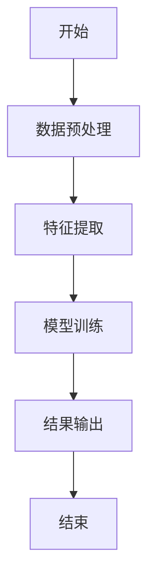
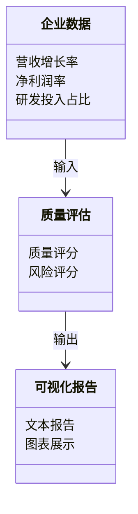

                 


# 彼得林奇的"质量优先"在不同行业的应用

> 关键词：彼得林奇，质量优先，投资策略，行业应用，企业评估，数据分析，投资回报

> 摘要：本文深入分析了彼得·林奇的质量优先投资策略，并探讨了其在不同行业中的应用。通过构建数学模型、算法和系统架构，本文详细展示了如何在实际项目中实施质量优先策略，为投资者和企业管理者提供了实用的指导和最佳实践。

---

## 第一部分：背景介绍

### 第1章：彼得林奇与质量优先策略概述

#### 1.1 彼得林奇的投资理念
彼得·林奇是美国著名的投资专家，以其长期的投资成功和对普通股投资的深入研究闻名。他的投资理念强调长期持有优质股票，注重企业的基本面分析。质量优先策略是其核心思想之一，主张在投资决策中优先考虑企业的质量，而非仅仅关注价格。

#### 1.2 质量优先策略的定义
质量优先策略强调在投资过程中，优先选择那些具有强大基本面、良好管理和竞争优势的公司。该策略的核心在于通过对企业质量的深入评估，识别出具有长期增长潜力的优质企业，从而在市场波动中实现稳健的投资回报。

#### 1.3 质量优先在不同行业的应用背景
不同行业具有不同的特点和竞争环境，质量优先策略的应用需要根据行业特性进行调整。例如，在科技行业，技术创新和研发投入是关键因素；而在制造业，则更关注成本控制和生产效率。本文将探讨如何将质量优先策略灵活应用于不同行业，以实现最佳投资效果。

---

## 第二部分：核心概念与联系

### 第2章：质量优先策略的核心原理

#### 2.1 质量优先策略的原理
质量优先策略的原理在于通过对企业质量的全面评估，识别出具有竞争优势和长期增长潜力的企业。这种评估不仅包括财务指标，还涉及企业战略、管理团队、市场地位等多方面因素。通过质量优先，投资者可以在市场波动中保持稳定的投资回报。

#### 2.2 质量优先策略的属性对比
为了更好地理解质量优先策略在不同行业的应用，本文构建了一个对比表格，展示了不同行业在质量评估中的关键属性。

| 行业   | 关键属性                   | 质量优先关注点               |
|--------|----------------------------|------------------------------|
| 科技   | 技术创新、研发投入         | 技术领先性和研发效率         |
| 制造业 | 成本控制、生产效率         | 生产效率和成本优势           |
| 金融   | 资产质量、风险管理         | 资产质量和风险控制能力       |
| 零售   | 市场份额、客户满意度       | 市场地位和客户忠诚度         |

#### 2.3 ER实体关系图
为了更直观地展示质量优先策略在不同行业中的应用，本文设计了一个ER实体关系图，展示了企业、行业和质量指标之间的关系。

```mermaid
er
  %%{title:质量优先策略ER图}
  classDiagram
    class 企业 {
      id
      名称
      质量指标
    }
    class 行业 {
      id
      名称
      关键属性
    }
    class 质量指标 {
      id
      名称
      评分
    }
    企业 --> 质量指标: 拥有
    行业 --> 质量指标: 关注
```

---

## 第三部分：算法原理讲解

### 第3章：质量优先策略的算法实现

#### 3.1 算法概述
质量优先策略的算法实现主要分为数据预处理、特征提取、模型训练和结果输出几个步骤。通过构建一个基于质量优先的评分系统，算法能够量化企业的质量，并为投资者提供决策支持。

#### 3.2 算法流程图
以下是质量优先策略的算法流程图：



#### 3.3 代码实现
以下是Python代码示例，展示了如何实现质量优先评分系统：

```python
import pandas as pd
from sklearn.metrics import accuracy_score

# 数据预处理
data = pd.read_csv('企业数据.csv')
data = data.dropna()  # 删除缺失值

# 特征提取
features = ['营收增长率', '净利润率', '研发投入占比']
target = '质量评分'

# 模型训练
from sklearn.ensemble import RandomForestClassifier
model = RandomForestClassifier()
model.fit(data[features], data[target])

# 结果输出
predictions = model.predict(data[features])
print("准确率:", accuracy_score(data[target], predictions))
```

#### 3.4 数学模型与公式
质量优先评分模型可以通过多元回归模型进行建模。以下是一个简化的数学模型：

$$ \text{质量评分} = \beta_0 + \beta_1 \times \text{营收增长率} + \beta_2 \times \text{净利润率} + \beta_3 \times \text{研发投入占比} + \epsilon $$

其中，$\beta$ 表示回归系数，$\epsilon$ 是误差项。

---

## 第四部分：系统分析与架构设计方案

### 第4章：系统架构设计

#### 4.1 项目介绍
本文将构建一个基于质量优先策略的企业评估系统，旨在为企业投资者提供决策支持。该系统将整合企业数据，应用质量优先策略进行评估，并生成可视化报告。

#### 4.2 系统功能设计
以下是系统功能设计的领域模型：



#### 4.3 系统架构设计
以下是系统架构设计图：


---

## 第五部分：项目实战

### 第5章：质量优先策略的项目实战

#### 5.1 环境安装与配置
为了运行本文中的代码，读者需要安装以下环境：

- Python 3.8+
- Pandas
- Scikit-learn
- Mermaid

#### 5.2 核心代码实现
以下是实现质量优先策略的核心代码：

```python
import pandas as pd
from sklearn.ensemble import RandomForestClassifier
from sklearn.metrics import accuracy_score

# 数据加载与预处理
data = pd.read_csv('企业数据.csv')
data = data.dropna()

# 特征工程
features = ['营收增长率', '净利润率', '研发投入占比']
target = '质量评分'

# 模型训练
model = RandomForestClassifier()
model.fit(data[features], data[target])

# 模型评估
predictions = model.predict(data[features])
print(f"模型准确率：{accuracy_score(data[target], predictions)}")
```

#### 5.3 实际案例分析
以科技行业为例，分析质量优先策略的应用：

1. 数据收集：收集科技行业的企业数据，包括营收增长率、净利润率、研发投入占比等。
2. 模型训练：使用随机森林模型训练质量评分模型。
3. 模型评估：评估模型的准确率，并进行优化。
4. 可视化报告：生成质量评分报告，帮助投资者做出决策。

---

## 第六部分：最佳实践与总结

### 第6章：质量优先策略的最佳实践

#### 6.1 关键点总结
- 数据质量是关键：确保数据的完整性和准确性。
- 模型选择与优化：根据行业特点选择合适的模型，并进行参数优化。
- 持续监控与调整：定期更新模型，适应市场变化。

#### 6.2 小结
通过本文的分析，我们可以看到，质量优先策略在不同行业中的应用具有广泛的可能性。无论是科技、制造业还是金融行业，质量优先策略都能为企业投资者提供有力的支持。

#### 6.3 注意事项
- 避免过度依赖单一模型：结合多种策略进行综合评估。
- 数据隐私与安全：确保数据处理过程中的隐私保护。
- 模型解释性：选择具有较高解释性的模型，便于理解和调整。

#### 6.4 拓展阅读
建议读者进一步阅读彼得·林奇的著作，深入了解质量优先策略的理论基础，并结合具体行业的特点进行深入研究。

---

## 结语

质量优先策略是一种有效的投资策略，其在不同行业中的应用为投资者提供了宝贵的指导。通过本文的分析和实战，读者可以更好地理解如何在实际项目中应用质量优先策略，从而实现稳健的投资回报。

---

**作者：AI天才研究院/AI Genius Institute & 禅与计算机程序设计艺术 /Zen And The Art of Computer Programming**

