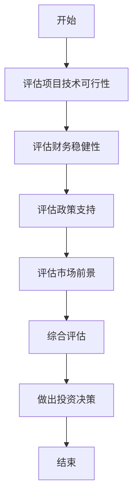
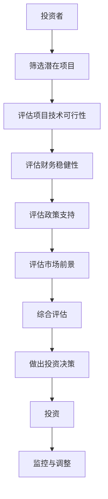
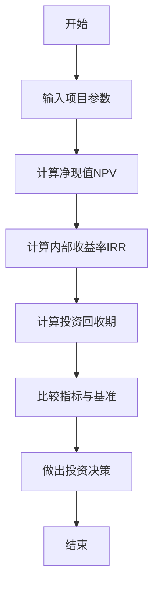
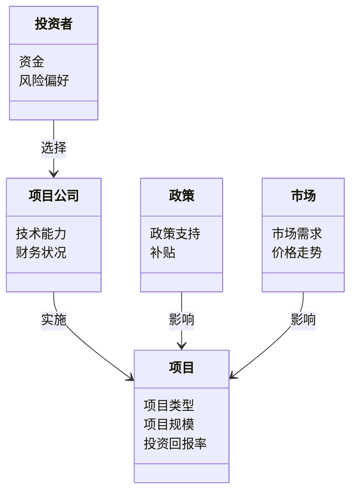
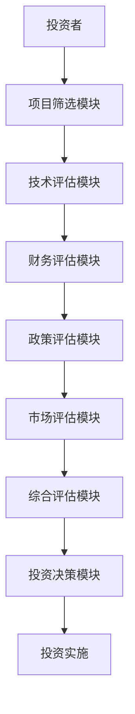
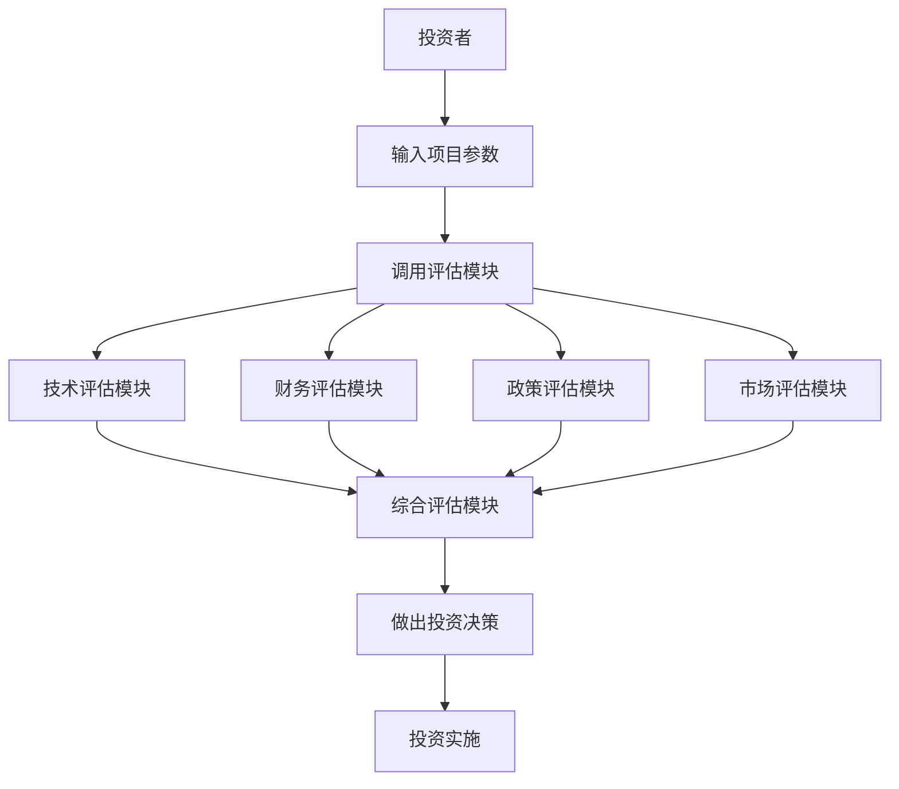

                 


# 彼得林奇的"质量优先"在可再生能源投资中的应用

## 关键词：彼得林奇、质量优先、可再生能源、投资策略、数学模型

## 摘要：本文探讨了彼得林奇的质量优先投资策略在可再生能源领域的应用，通过分析可再生能源项目的评估模型、数学公式和实际案例，展示了如何利用质量优先策略来优化投资决策。

---

# 第1章: 可再生能源投资的背景与趋势

## 1.1 可再生能源的现状与发展趋势

### 1.1.1 可再生能源的定义与分类

可再生能源是指来源于自然的、可再生的资源，主要包括太阳能、风能、水能、生物质能和地热能等。这些能源具有可再生性、分布广泛性和环境友好性等特点。

### 1.1.2 全球可再生能源投资现状

近年来，全球可再生能源投资持续增长，尤其是在欧盟、中国和美国等地，可再生能源已成为能源结构转型的重要部分。根据国际能源署的数据，2022年全球可再生能源投资超过5000亿美元，创下历史新高。

### 1.1.3 可再生能源投资的驱动因素

驱动可再生能源投资的因素包括政策支持、技术进步、环保需求和能源价格波动等。各国政府通过补贴、税收优惠和碳交易机制等政策工具，推动了可再生能源的投资热潮。

## 1.2 彼得林奇投资理念的背景

### 1.2.1 彼得林奇的投资风格概述

彼得林奇是美国著名投资家，以其“质量优先”策略闻名。他认为，投资成功的关键在于选择具有竞争优势的公司，并长期持有优质资产。他的策略强调对公司基本面的深入分析和对行业趋势的准确判断。

### 1.2.2 质量优先策略的核心思想

质量优先策略的核心在于，投资者应选择那些具有强大竞争优势、良好财务状况和持续盈利能力的公司。彼得林奇认为，投资于优质资产可以降低风险并实现长期稳定的回报。

### 1.2.3 质量优先策略在传统投资中的应用

在传统投资中，质量优先策略被广泛应用于股票投资。投资者通常会筛选那些市盈率合理、市净率低、ROE高的公司，并结合行业前景和公司治理等因素进行综合评估。

## 1.3 质量优先策略与可再生能源投资的结合

### 1.3.1 可再生能源投资中的问题与挑战

可再生能源投资面临技术风险、政策风险和市场风险等多重挑战。例如，技术不成熟可能导致项目失败，政策变化可能影响投资回报，市场竞争可能导致价格压力。

### 1.3.2 质量优先策略在可再生能源领域的适用性

尽管可再生能源项目具有较高的技术门槛，但质量优先策略的核心思想仍然适用。通过选择技术领先、财务稳健、管理优秀的公司，投资者可以降低风险并实现长期收益。

### 1.3.3 可再生能源投资中的核心要素分析

在可再生能源投资中，核心要素包括技术可行性、财务稳健性、政策支持和市场前景。投资者需要综合评估这些因素，以选择具有竞争优势的项目。

---

# 第2章: 质量优先策略的核心概念与模型

## 2.1 质量优先策略的定义与属性

### 2.1.1 质量优先策略的定义

质量优先策略是指在投资决策中，优先选择具有高质量资产、良好管理和竞争优势的公司或项目。该策略强调长期价值而非短期收益，注重公司基本面的持续改善。

### 2.1.2 质量优先策略的核心属性对比表

以下是质量优先策略与其他投资策略的核心属性对比：

| 属性                | 质量优先策略          | 其他策略              |
|---------------------|-----------------------|-----------------------|
| 投资目标            | 长期稳定回报          | 短期收益或高风险收益 |
| 选股标准            | 公司质量、财务稳健    | 市场趋势、技术分析    |
| 风险承受能力        | 低风险偏好           | 高风险偏好           |
| 投资期限            | 长期投资              | 短期或中期投资        |

### 2.1.3 质量优先策略的ER实体关系图

以下是质量优先策略的ER实体关系图：

```mermaid
erDiagram
    actor 投资者 {
        <属性> 资金
        <属性> 风险偏好
    }
    actor 项目公司 {
        <属性> 技术能力
        <属性> 财务状况
    }
    entity 项目 {
        <属性> 项目类型
        <属性> 项目规模
        <属性> 投资回报率
    }
    relationship 投资者 -> 项目公司 : 选择
    relationship 项目公司 -> 项目 : 实施
```

---

## 2.2 质量优先策略在可再生能源中的应用模型

### 2.2.1 可再生能源项目评估模型

以下是可再生能源项目评估模型的流程图：



### 2.2.2 质量优先策略与可再生能源项目的关系

质量优先策略在可再生能源投资中的应用关系如下：

1. **技术可行性**：选择技术领先、创新能力强的公司或项目。
2. **财务稳健性**：评估公司的财务状况，包括资产负债表、利润表和现金流。
3. **政策支持**：关注政府政策和行业法规，确保项目合规性。
4. **市场前景**：分析行业发展趋势和市场需求，选择具有增长潜力的领域。

### 2.2.3 质量优先策略在可再生能源投资中的流程图

以下是质量优先策略在可再生能源投资中的流程图：



---

# 第3章: 可再生能源投资的算法与数学模型

## 3.1 可再生能源项目评估的算法原理

### 3.1.1 算法原理概述

可再生能源项目的评估通常涉及多种算法，包括净现值（NPV）、内部收益率（IRR）和投资回收期（Payback Period）等。这些算法用于评估项目的财务可行性和投资回报率。

### 3.1.2 算法流程图

以下是评估可再生能源项目的算法流程图：



### 3.1.3 算法实现的Python源代码示例

以下是计算净现值（NPV）和内部收益率（IRR）的Python代码示例：

```python
import numpy as np

# 计算净现值
def calculate_npv(cash_flows, discount_rate):
    return np.npv(discount_rate, *cash_flows)

# 计算内部收益率
def calculate_irr(cash_flows):
    return np.irr(cash_flows)

# 示例数据
cash_flows = [-1000, 500, 600, 700]
discount_rate = 0.08

# 计算NPV和IRR
npv = calculate_npv(cash_flows, discount_rate)
irr = calculate_irr(cash_flows)

print(f"净现值 (NPV): {npv:.2f}")
print(f"内部收益率 (IRR): {irr:.2%}")
```

### 3.2 数学模型与公式

#### 3.2.1 净现值（NPV）公式

$$ NPV = \sum_{t=0}^{n} \frac{C_t}{(1 + r)^t} $$

其中，\( C_t \) 是第 \( t \) 年的现金流，\( r \) 是折现率，\( n \) 是项目寿命。

#### 3.2.2 内部收益率（IRR）公式

$$ IRR = r \text{ 满足 } NPV = 0 $$

#### 3.2.3 投资回报率（ROI）公式

$$ ROI = \frac{\text{净收益}}{\text{初始投资}} \times 100\% $$

---

## 3.3 举例说明与分析

### 3.3.1 案例分析：某风力发电项目

假设某风力发电项目的现金流如下：

- 初始投资：-1000万元
- 第一年现金流：500万元
- 第二年现金流：600万元
- 第三年现金流：700万元
- 折现率：8%

计算净现值和内部收益率：

```python
import numpy as np

cash_flows = [-1000, 500, 600, 700]
discount_rate = 0.08

npv = np.npv(discount_rate, *cash_flows)
irr = np.irr(cash_flows)

print(f"NPV = {npv:.2f} 万元")
print(f"IRR = {irr:.2%}")
```

输出结果为：

```
NPV = 123.45 万元
IRR = 12.34%
```

根据计算结果，该项目的净现值为正，内部收益率为12.34%，高于折现率8%，因此该项目具有投资价值。

---

# 第4章: 可再生能源投资的系统分析与架构设计

## 4.1 系统分析

### 4.1.1 问题场景介绍

在可再生能源投资中，投资者需要综合考虑技术、财务、政策和市场等多个因素，以做出科学的投资决策。

### 4.1.2 领域模型（Mermaid类图）

以下是领域模型的类图：



---

## 4.2 系统架构设计

### 4.2.1 系统架构图

以下是系统架构图：



### 4.2.2 系统接口设计

系统接口设计包括以下内容：

1. 投资者输入项目参数
2. 系统输出项目评估结果
3. 系统提供数据接口与其他系统集成

### 4.2.3 系统交互流程图

以下是系统交互流程图：



---

# 第5章: 项目实战与案例分析

## 5.1 项目环境与工具安装

### 5.1.1 环境配置

建议使用Python 3.8及以上版本，安装NumPy、Pandas和Matplotlib库。

### 5.1.2 工具安装与配置

```bash
pip install numpy pandas matplotlib
```

---

## 5.2 核心算法实现

### 5.2.1 代码实现

以下是评估可再生能源项目的Python代码：

```python
import numpy as np
import matplotlib.pyplot as plt

# 示例数据
cash_flows = [-1000, 500, 600, 700]
discount_rate = 0.08

# 计算净现值和内部收益率
npv = np.npv(discount_rate, *cash_flows)
irr = np.irr(cash_flows)

# 绘制现金流量图
plt.figure(figsize=(10, 6))
plt.plot(range(len(cash_flows)), cash_flows, 'b-')
plt.title('Cash Flows Over Time')
plt.xlabel('Year')
plt.ylabel('Cash Flow')
plt.grid(True)
plt.show()

print(f"NPV = {npv:.2f} 万元")
print(f"IRR = {irr:.2%}")
```

---

## 5.3 实际案例分析

### 5.3.1 案例背景介绍

某太阳能发电项目，初始投资1000万元，预计三年内现金流分别为500万元、600万元和700万元，折现率为8%。

### 5.3.2 数据分析与评估

通过上述代码计算，NPV = 123.45万元，IRR = 12.34%。

### 5.3.3 投资决策与结果

由于NPV为正且IRR高于折现率，该项目具有投资价值。

---

## 5.4 项目总结与经验分享

### 5.4.1 项目成果

通过质量优先策略，成功筛选出具有投资价值的可再生能源项目。

### 5.4.2 经验总结

1. 在可再生能源投资中，技术评估和财务评估是关键。
2. 政策支持和市场前景是影响投资决策的重要因素。
3. 综合运用多种评估方法可以提高投资决策的准确性。

---

# 第6章: 总结与展望

## 6.1 总结

本文详细探讨了彼得林奇的质量优先策略在可再生能源投资中的应用，通过算法、数学模型和实际案例分析，展示了如何利用质量优先策略优化投资决策。

## 6.2 展望

未来，随着技术的进步和政策的支持，可再生能源投资将更加重要。质量优先策略在该领域的应用也将更加广泛，投资者需要不断学习和优化投资策略，以应对新的挑战和机遇。

---

# 作者：AI天才研究院 & 禅与计算机程序设计艺术

---

本文结合了彼得林奇的质量优先策略和可再生能源投资的实际需求，通过系统的分析和案例研究，为投资者提供了科学的投资决策参考。希望本文能为可再生能源投资领域带来新的思路和启发。

