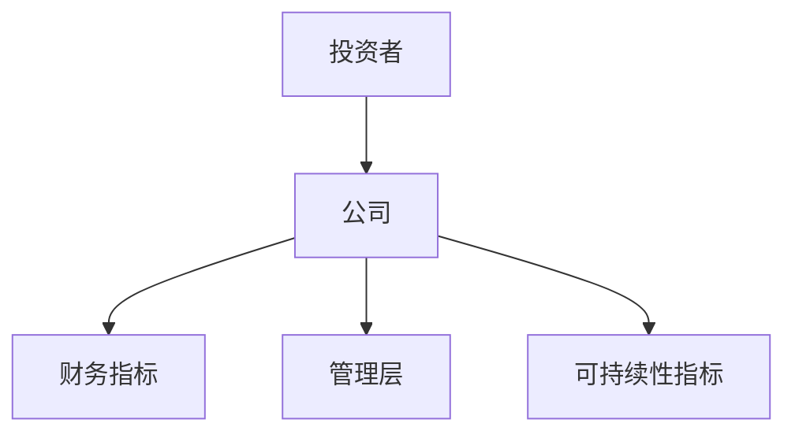
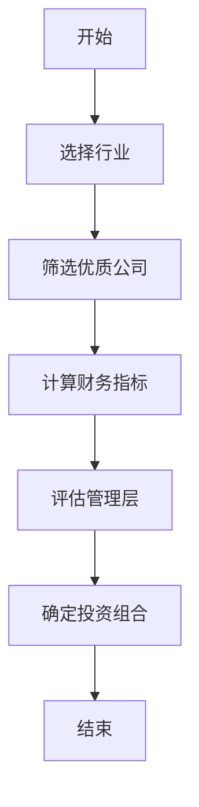
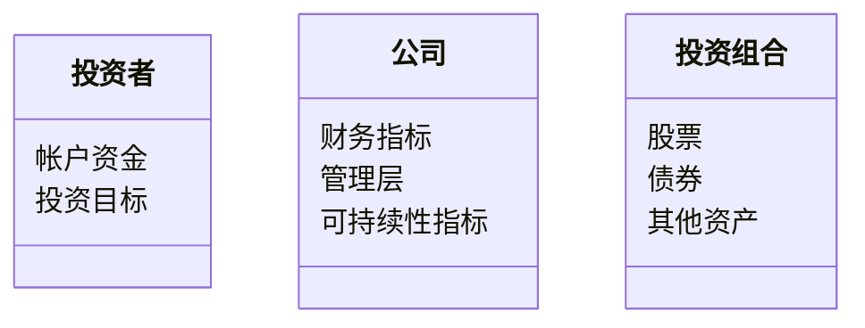
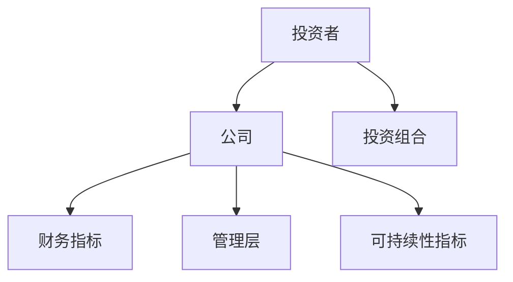

                 

# 彼得林奇的"质量优先"在可持续发展投资中的应用

> **关键词**：彼得·林奇，质量优先，可持续发展投资，投资策略，ESG，财务指标

> **摘要**：本文详细探讨了彼得·林奇的“质量优先”投资策略在可持续发展投资中的应用。通过对质量优先策略的背景、核心概念、算法原理、系统架构以及实际案例的分析，展示了如何将这一策略与可持续发展投资相结合，实现长期稳定的收益。文章还结合了ESG投资框架，探讨了质量优先策略在不同经济周期下的表现，并提出了相应的投资建议和注意事项。

---

## 第一部分：质量优先投资的背景与基础

### 第1章：质量优先投资概述

#### 1.1 质量优先投资的核心概念
质量优先投资是一种以公司质量为核心的投资策略，强调选择那些具有持续盈利能力、强大竞争优势和良好治理结构的公司进行长期投资。这种策略的核心在于通过精选优质企业，避免短期市场波动的影响，从而实现长期稳定的收益。

#### 1.2 可持续发展投资的背景与现状
可持续发展投资（Sustainable Investment）是一种将环境（Environmental）、社会（Social）和治理（Governance）因素纳入投资决策的投资方式。随着全球对气候变化、社会责任和公司治理的关注增加，可持续发展投资逐渐成为主流。

---

### 第2章：彼得·林奇的质量优先投资策略

#### 2.1 彼得·林奇投资哲学的核心思想
彼得·林奇是全球著名的投资专家，他的投资哲学强调长期持有优质股票，避免短期市场波动的影响。他认为，投资的核心在于选择那些具有强大竞争优势、稳定盈利能力以及良好治理结构的公司。

#### 2.2 质量优先策略的实施步骤
1. **确定投资目标**：明确投资的长期目标和风险承受能力。
2. **选择优质公司**：通过财务指标、行业地位和管理层能力等多维度筛选优质企业。
3. **构建投资组合**：将资金分配到不同行业的优质公司中，分散风险。
4. **定期调整与优化**：根据市场变化和公司基本面调整投资组合。

---

## 第二部分：质量优先投资的核心概念与联系

### 第3章：质量优先投资的核心概念与联系

#### 3.1 质量优先策略的属性特征对比表
| 属性         | 特征 |
|--------------|------|
| 公司质量     | 高ROE、高ROIC、稳定的盈利能力 |
| 行业地位     | 市场领导者、高进入壁垒 |
| 财务状况     | 低负债率、健康的现金流 |
| 管理团队     | 高效、透明的管理 |
| 可持续性     | 符合ESG标准 |

#### 3.2 质量优先策略的ER实体关系图

---

### 第4章：质量优先投资的算法原理

#### 4.1 质量优先策略的数学模型
$$ \text{投资价值} = \frac{\text{未来现金流}}{\text{折现率}} $$

#### 4.2 算法流程图

---

## 第三部分：质量优先投资的系统分析与架构设计

### 第5章：质量优先投资的系统分析与架构设计

#### 5.1 系统功能设计

#### 5.2 系统架构设计

---

## 第四部分：质量优先投资的项目实战

### 第6章：质量优先投资的项目实战

#### 6.1 实际案例分析
以苹果公司为例，分析其是否符合质量优先和可持续发展投资的标准。通过计算ROE、ROIC等财务指标，并结合ESG评分，评估其投资价值。

---

## 第五部分：质量优先投资的总结与展望

### 第7章：质量优先投资的总结与展望

#### 7.1 总结
质量优先投资是一种以公司质量为核心的投资策略，结合可持续发展投资的ESG框架，可以在实现长期稳定收益的同时，推动社会和环境的可持续发展。

#### 7.2 展望
随着全球对可持续发展的关注增加，质量优先投资的应用前景广阔。未来的研究可以进一步探索如何将ESG指标与质量优先策略更有机结合，并开发更多创新的投资工具。

---

## 第六部分：质量优先投资的最佳实践与注意事项

### 第8章：质量优先投资的最佳实践

#### 8.1 投资建议
1. **长期持有优质股票**：避免频繁交易，降低交易成本。
2. **关注公司基本面**：定期分析公司的财务报表和管理层变动。
3. **分散投资风险**：通过投资组合分散行业和公司的风险。
4. **关注ESG因素**：将环境、社会和治理因素纳入投资决策。

#### 8.2 注意事项
1. **避免盲目跟风**：不要因市场热点而忽视公司的基本面。
2. **定期调整组合**：根据市场变化和公司情况调整投资组合。
3. **关注政策变化**：政策变化可能对行业和公司产生重大影响。

---

## 作者简介

作者：AI天才研究院/AI Genius Institute & 禅与计算机程序设计艺术/Zen And The Art of Computer Programming

---

通过本文的系统分析和实际案例，我们展示了彼得·林奇的“质量优先”投资策略在可持续发展投资中的应用。希望本文能够为投资者提供有价值的参考和启发。

