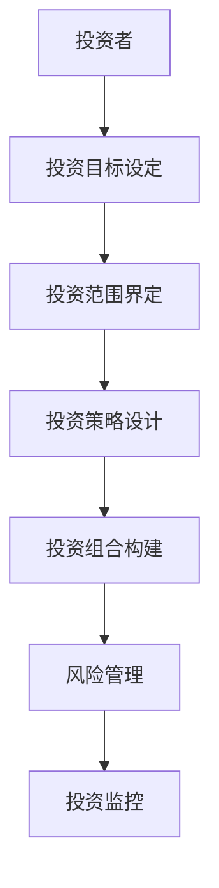
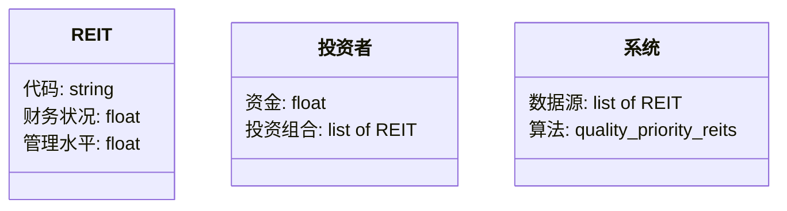
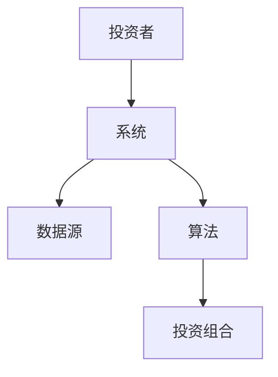
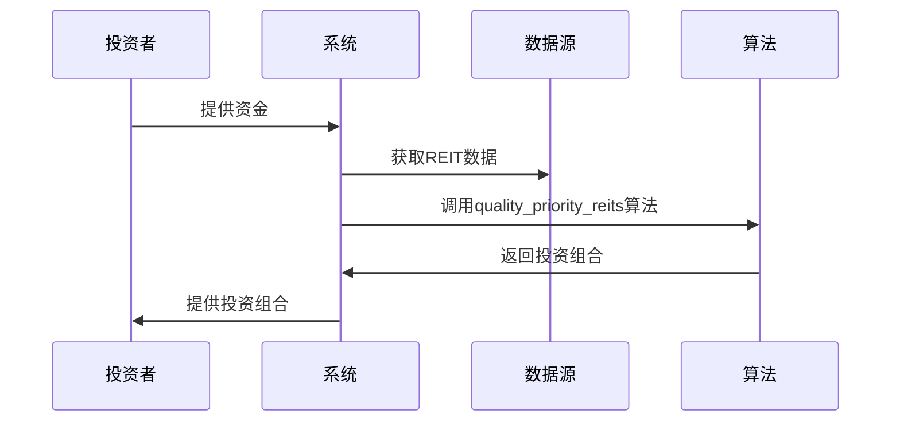

                 


---

# 彼得林奇的"质量优先"在新兴市场基础设施REITs投资中的应用

## 关键词：REITs，彼得林奇，质量优先，投资策略，算法设计，系统分析

## 摘要：本文探讨了彼得林奇的"质量优先"投资理念在新兴市场基础设施REITs投资中的应用。通过系统分析和算法设计，本文提出了基于质量优先的REITs投资策略，并通过实际案例分析验证了该策略的有效性。文章还详细介绍了REITs投资的系统架构和交互流程，为投资者提供了实用的指导。

---

## 第1章：引言

### 1.1 什么是REITs？

#### 1.1.1 REITs的定义与特点

REITs（房地产投资信托基金）是一种通过汇集资金投资于房地产项目，并将收益按比例分配给投资者的金融工具。其特点包括：

- **高流动性**：投资者可以像买卖股票一样交易REITs。
- **分散风险**：通过投资多样化的房地产项目降低风险。
- **高收益潜力**：房地产市场的增值潜力较大。

#### 1.1.2 新兴市场REITs的特殊性

新兴市场REITs具有以下特点：

- **高增长潜力**：新兴市场经济发展迅速，房地产需求旺盛。
- **高风险**：政策、经济波动等风险较高。
- **多样性**：新兴市场中的REITs可能涉及住宅、商业、工业等多种类型的房地产。

#### 1.1.3 彼得林奇投资理念的简介

彼得·林奇是全球著名的投资专家，他强调"质量优先"的投资理念，即选择具有持续增长潜力和良好管理的公司进行投资。

---

### 1.2 本书的研究背景与意义

#### 1.2.1 REITs在新兴市场的投资价值

新兴市场的REITs由于其高增长潜力和多样性，吸引了越来越多的投资者。

#### 1.2.2 彼得林奇"质量优先"理念的适用性

彼得林奇的理念在新兴市场REITs投资中具有重要的应用价值，尤其是在筛选优质公司和降低投资风险方面。

#### 1.2.3 本书的研究目标与方法

本文旨在探讨彼得林奇的"质量优先"理念在新兴市场REITs投资中的具体应用，通过系统分析和算法设计，提出一种基于质量优先的REITs投资策略。

---

## 第2章：REITs的定义与分类

### 2.1 REITs的基本概念

#### 2.1.1 REITs的起源与发展

REITs起源于20世纪60年代的美国，随后在全球范围内迅速发展。

#### 2.1.2 REITs的运作模式

REITs通过汇集资金投资于房地产项目，并将收益分配给投资者。

#### 2.1.3 REITs的分类与特点

REITs可以分为住宅类、商业类、工业类等多种类型。

---

### 2.2 新兴市场REITs的特点

#### 2.2.1 新兴市场的经济特征

新兴市场经济发展迅速，但政策和经济波动较大。

#### 2.2.2 新兴市场REITs的行业分布

新兴市场REITs涉及住宅、商业、工业等多种行业。

#### 2.2.3 新兴市场REITs的风险与机遇

新兴市场REITs的风险较高，但增长潜力巨大。

---

## 第3章：彼得林奇"质量优先"理念的核心要素

### 3.1 彼得林奇投资理念的概述

#### 3.1.1 "质量优先"的定义

"质量优先"是指在投资过程中优先选择具有高质量和持续增长潜力的公司。

#### 3.1.2 "质量优先"的投资策略

彼得林奇的"质量优先"策略包括以下步骤：

1. **筛选优质公司**：选择具有强大财务实力和良好管理的公司。
2. **长期投资**：避免频繁交易，长期持有优质公司股票。
3. **分散投资**：通过投资多种优质公司降低风险。

#### 3.1.3 彼得林奇的成功案例

彼得林奇在波士顿有限合伙基金的投资中，通过"质量优先"策略取得了巨大成功。

---

### 3.2 "质量优先"在REITs投资中的应用

#### 3.2.1 REITs投资中的质量评估

在REITs投资中，质量评估包括以下指标：

- **财务状况**：公司资产负债表、盈利能力等。
- **管理水平**：公司管理团队的能力和经验。
- **行业地位**：公司在行业中的地位和竞争力。

#### 3.2.2 "质量优先"与REITs投资的结合

将彼得林奇的"质量优先"理念应用于REITs投资，可以通过筛选优质公司降低风险并提高收益。

#### 3.2.3 彼得林奇理念在新兴市场的适用性

在新兴市场中，彼得林奇的"质量优先"理念同样适用，尤其是在选择具有强大财务实力和良好管理的公司。

---

## 第4章：REITs投资的系统分析

### 4.1 系统分析的基本框架

#### 4.1.1 投资目标的确定

投资者需要明确投资目标，如追求高收益或降低风险。

#### 4.1.2 投资范围的界定

根据投资目标，确定投资的范围和领域。

#### 4.1.3 投资策略的设计

设计基于"质量优先"的REITs投资策略。

---

### 4.2 REITs投资的系统架构

#### 4.2.1 系统架构图

以下是REITs投资系统的架构图：



#### 4.2.2 系统功能模块

REITs投资系统包括以下功能模块：

- **投资目标设定**：确定投资目标和期望收益。
- **投资范围界定**：选择投资的行业和地域。
- **投资策略设计**：设计基于"质量优先"的REITs投资策略。
- **投资组合构建**：根据策略构建投资组合。
- **风险管理**：监控和管理投资风险。
- **投资监控**：实时监控投资组合的表现。

#### 4.2.3 系统接口设计

REITs投资系统的接口设计包括：

- **输入接口**：投资者的投资目标和资金。
- **输出接口**：投资组合的构建和调整建议。

---

### 4.3 REITs投资的交互流程

#### 4.3.1 投资者与市场的交互

投资者通过市场交易REITs产品。

#### 4.3.2 系统与数据源的交互

系统从数据源获取REITs的相关信息。

#### 4.3.3 系统与投资决策的交互

系统根据"质量优先"策略生成投资建议。

---

## 第5章：REITs投资的算法与数学模型

### 5.1 REITs投资的算法原理

#### 5.1.1 算法原理

基于彼得林奇的"质量优先"理念，设计以下算法：

1. **数据收集**：收集REITs的相关数据，包括财务指标和管理水平。
2. **质量评估**：根据设定的标准评估REITs的质量。
3. **投资决策**：根据质量评估结果进行投资决策。

#### 5.1.2 算法实现

以下是算法的Python实现：

```python
def quality_priority_reits(reits_data):
    # 筛选优质公司
    quality_reits = []
    for reit in reits_data:
        if reit['财务状况'] > 70 and reit['管理水平'] > 80:
            quality_reits.append(reit)
    # 构建投资组合
    investment_portfolio = []
    for reit in quality_reits:
        investment_portfolio.append(reit['代码'])
    return investment_portfolio

# 示例数据
reits_data = [
    {'代码': 'A', '财务状况': 80, '管理水平': 90},
    {'代码': 'B', '财务状况': 70, '管理水平': 85},
    {'代码': 'C', '财务状况': 60, '管理水平': 70},
]

# 调用算法
portfolio = quality_priority_reits(reits_data)
print("投资组合：", portfolio)
```

---

### 5.2 REITs投资的数学模型

#### 5.2.1 数学模型

以下是REITs投资的数学模型：

$$
\text{投资价值} = \text{财务状况} \times 0.4 + \text{管理水平} \times 0.6
$$

---

## 第6章：REITs投资的项目实战

### 6.1 项目背景

本项目旨在通过彼得林奇的"质量优先"理念，筛选优质REITs并构建投资组合。

---

### 6.2 系统功能设计

#### 6.2.1 领域模型

以下是领域模型的类图：



---

### 6.3 系统架构设计

以下是系统架构图：



---

### 6.4 系统交互设计

以下是系统交互流程图：



---

## 第7章：结论与展望

### 7.1 本书的总结

本文探讨了彼得林奇的"质量优先"理念在新兴市场REITs投资中的应用，并通过系统分析和算法设计，提出了一种基于质量优先的REITs投资策略。

---

### 7.2 本书的展望

未来的研究可以进一步探讨彼得林奇理念在其他类型REITs投资中的应用，以及如何通过技术手段进一步优化投资策略。

---

## 作者：AI天才研究院/AI Genius Institute & 禅与计算机程序设计艺术 /Zen And The Art of Computer Programming

