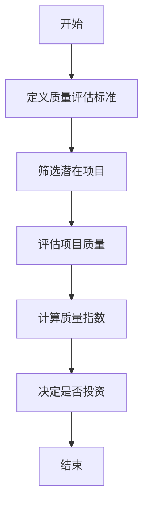
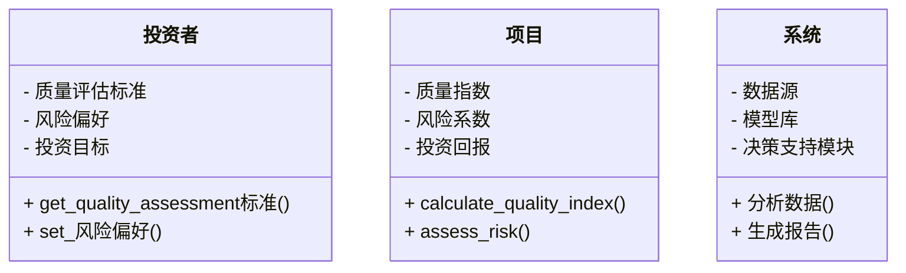
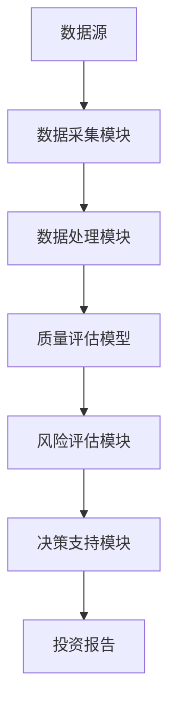

                 


# 彼得林奇的"质量优先"在新兴市场基础设施投资中的应用

## 关键词：彼得林奇，质量优先，新兴市场，基础设施投资，投资策略

## 摘要：  
本文深入探讨了彼得林奇的“质量优先”投资理念在新兴市场基础设施投资中的应用。通过分析质量优先的核心概念、算法原理、系统架构设计以及实际案例，展示了如何将这一策略有效应用于新兴市场的基础设施项目选择和投资决策中。文章结合理论与实践，提供了一套基于质量优先的新兴市场基础设施投资解决方案，为投资者提供了清晰的指导和实践路径。

---

## 第一部分: 背景介绍

### 第1章: 彼得林奇的"质量优先"投资理念

#### 1.1 质量优先的核心概念

##### 1.1.1 投资的基本原理  
投资的本质是通过选择优质的资产或公司，实现长期稳定的收益。彼得林奇强调，投资的核心在于选择那些具备持续增长潜力和良好管理能力的公司。

##### 1.1.2 质量优先的定义  
质量优先是一种投资策略，强调在选择投资标的时，优先考虑公司的质量因素，如财务健康、管理团队、行业地位等。这种策略注重长期价值，而非短期市场波动。

##### 1.1.3 质量优先与新兴市场的关联  
新兴市场通常具有较高的增长潜力，但也伴随着更高的风险。质量优先策略可以帮助投资者在新兴市场中筛选出具备长期增长潜力的公司，降低投资风险。

---

#### 1.2 新兴市场基础设施投资的背景

##### 1.2.1 新兴市场的特点  
新兴市场通常具有快速的经济增长、庞大的人口基数和未满足的需求，这些因素为基础设施投资提供了巨大的机会。

##### 1.2.2 基础设施投资的重要性  
基础设施是经济发展的基石，其投资能够带动相关产业的发展，改善居民生活质量，同时为投资者带来稳定的收益。

##### 1.2.3 市场风险与机遇  
新兴市场存在政治风险、经济波动等不确定性，但同时也提供了较高的回报潜力。质量优先策略可以帮助投资者在风险可控的前提下，抓住市场机遇。

---

## 第二部分: 核心概念与联系

### 第2章: 质量优先与基础设施投资的结合

#### 2.1 核心概念的原理

##### 2.1.1 投资质量的定义  
在基础设施投资中，质量优先意味着选择那些具备良好财务状况、管理能力和市场地位的公司或项目。

##### 2.1.2 基础设施项目的质量评估  
评估基础设施项目的质量需要考虑多个因素，包括项目的经济效益、社会稳定影响、环境可持续性等。

##### 2.1.3 质量优先策略的实施步骤  
1. 确定投资目标和范围  
2. 选择具备高质量特性的项目  
3. 进行风险评估和管理  
4. 监测和调整投资组合

---

#### 2.2 概念属性特征对比表

| **属性**         | **质量优先**                          | **非质量优先**                          |
|-------------------|---------------------------------------|------------------------------------------|
| 质量标准          | 高质量、可持续性                      | 低质量、短期性                          |
| 投资风险          | 较低                                  | 较高                                    |
| 投资回报          | 稳定且长期                            | 波动性大，回报不稳定                    |
| 适用场景          | 新兴市场基础设施投资                  | 成熟市场或短期投机性投资                |

---

#### 2.3 ER实体关系图  
以下是质量优先策略的实体关系图：

```mermaid
erd
actor(投资者) -->
project(基础设施项目) -->
criteria(质量评估标准) -->
risk_assessment(风险评估) -->
return(投资回报)
```

---

## 第三部分: 算法原理讲解

### 第3章: 质量优先策略的算法模型

#### 3.1 算法原理

##### 图3.1: 质量优先策略的流程图  



---

#### 3.2 数学模型

##### 公式3.1：质量评估指数的计算  

$$
\text{质量评估指数} = \frac{\text{财务健康度} \times \text{管理能力} \times \text{市场地位}}{\text{风险系数}}
$$  

其中：
- 财务健康度：公司财务状况的健康程度，范围为1-5分。
- 管理能力：公司管理团队的能力，范围为1-5分。
- 市场地位：公司在市场中的地位，范围为1-5分。
- 风险系数：根据市场环境调整的风险系数，范围为0.8-1.2。

---

#### 3.3 代码实现

##### 代码3.1：质量评估指数的计算  

```python
def calculate_quality_index(financial_health, management_capability, market_position, risk_coefficient):
    return (financial_health * management_capability * market_position) / risk_coefficient

# 示例
financial_health = 4
management_capability = 4
market_position = 4
risk_coefficient = 1.0

quality_index = calculate_quality_index(financial_health, management_capability, market_position, risk_coefficient)
print(f"质量评估指数为：{quality_index}")
```

---

## 第四部分: 系统分析与架构设计方案

### 第4章: 投资决策支持系统

#### 4.1 问题场景

##### 4.1.1 投资决策的复杂性  
新兴市场的基础设施投资涉及多个因素，包括经济、政治、社会等，决策过程复杂且风险较高。

##### 4.1.2 系统的需求分析  
- 实时数据采集与分析  
- 质量评估模型的构建与应用  
- 投资决策支持与优化  

---

#### 4.2 系统功能设计

##### 图4.1: 系统功能的类图  



---

#### 4.3 系统架构设计

##### 图4.2: 系统架构的流程图  



---

## 第五部分: 项目实战

### 第5章: 实战案例分析

#### 5.1 环境配置

##### 5.1.1 数据源的选择  
选择新兴市场中的若干基础设施项目，收集其财务数据、管理团队信息、市场地位等数据。

##### 5.1.2 工具的安装  
安装Python和相关数据分析库（如Pandas、NumPy）。

---

#### 5.2 核心代码实现

##### 代码5.1：质量评估指数的计算  

```python
import pandas as pd

# 示例数据
data = {
    '公司名称': ['A公司', 'B公司', 'C公司'],
    '财务健康度': [4, 3, 5],
    '管理能力': [4, 5, 3],
    '市场地位': [3, 4, 4],
    '风险系数': [1.0, 1.2, 0.8]
}

df = pd.DataFrame(data)

# 计算质量评估指数
df['质量评估指数'] = df.apply(lambda x: (x['财务健康度'] * x['管理能力'] * x['市场地位']) / x['风险系数'], axis=1)

print(df)
```

---

#### 5.3 案例分析

##### 案例5.1：某新兴市场的基础设施投资分析  

假设我们选择了一个新兴市场中的三个基础设施项目，分别为A公司、B公司和C公司。根据上述代码计算质量评估指数，结果如下：

| 公司名称 | 质量评估指数 |
|---------|-------------|
| A公司   | 16.0        |
| B公司   | 10.0        |
| C公司   | 25.0        |

根据质量评估指数，C公司具有最高的质量评估指数，因此应优先考虑投资C公司。

---

## 第六部分: 总结与展望

### 第6章: 经验总结

#### 6.1 成功的关键因素  
- 选择具备高质量特性的项目  
- 合理评估风险并进行有效的风险管理  
- 持续监控和调整投资组合  

#### 6.2 注意事项  
- 新兴市场的风险较高，需谨慎评估  
- 质量优先策略需结合市场实际情况进行调整  
- 投资决策应基于详实的数据和科学的模型  

---

## 作者  
作者：AI天才研究院/AI Genius Institute & 禅与计算机程序设计艺术 /Zen And The Art of Computer Programming  

---

通过本文的详细分析和实际案例，我们展示了彼得林奇的“质量优先”策略在新兴市场基础设施投资中的应用。这一策略不仅能够帮助投资者降低风险，还能提高投资回报。未来，随着技术的进步和市场的变化，质量优先策略将不断完善，为投资者提供更加科学的决策支持。

