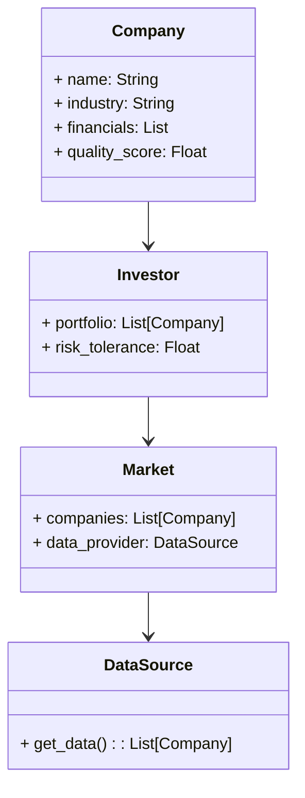
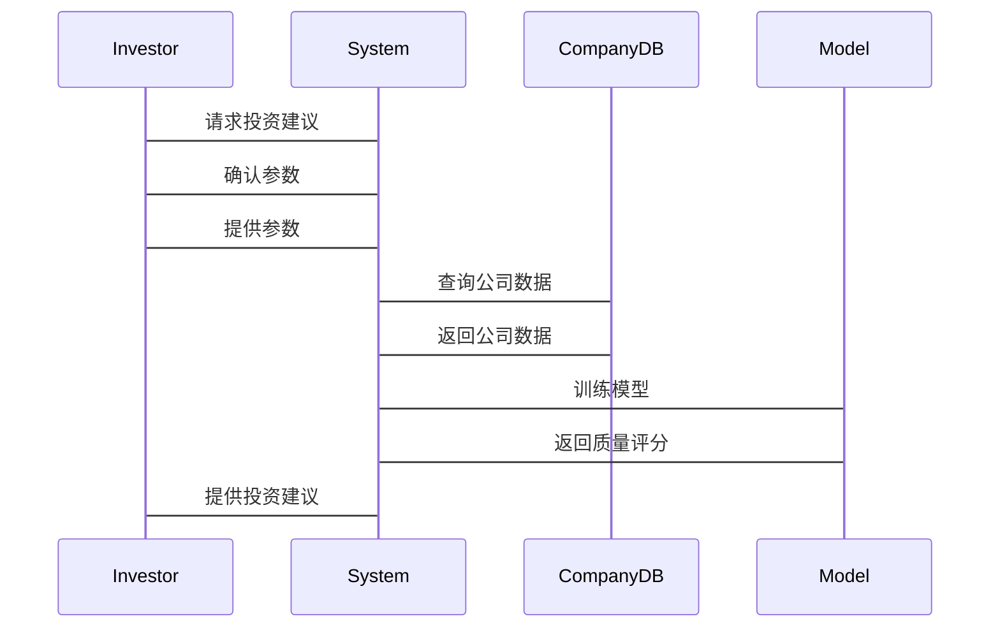

                 


# 彼得林奇的"质量优先"在新兴市场投资中的实践挑战

> **关键词**：彼得·林奇，质量优先，新兴市场，投资策略，风险管理，系统设计

> **摘要**：本文探讨了彼得·林奇提出的“质量优先”投资理念在新兴市场中的实践挑战。通过分析质量优先的核心要素、算法原理、系统架构设计和实际案例，本文揭示了在新兴市场中应用质量优先策略的复杂性与解决方案。

---

## 第一部分：彼得·林奇“质量优先”投资理念概述

### 第1章：质量优先投资的核心理念

#### 1.1 质量优先投资的定义与背景

##### 1.1.1 投资的基本概念与术语
投资是通过将资金投入特定资产或项目，以期望在未来获得收益或资本增值的过程。常见的投资类型包括股票、债券、房地产和商品等。质量优先投资强调选择具有高成长潜力和财务健康的公司，而非盲目追求短期收益。

##### 1.1.2 质量优先投资的起源与发展
彼得·林奇是美国著名投资专家，以其在富达投资集团的长期成功而闻名。他的投资理念强调深入研究公司基本面，选择具有竞争优势的公司进行长期投资。质量优先策略的核心在于关注公司的质量，而非市场的短期波动。

##### 1.1.3 彼得·林奇的投资理念与风格
林奇强调长期投资和价值发现，认为市场的短期波动不应影响长期投资决策。他的策略注重公司管理层、财务状况和行业地位，而非市场情绪。

#### 1.2 新兴市场的特点与挑战

##### 1.2.1 新兴市场的定义与分类
新兴市场指那些经济快速增长但尚未完全工业化的国家，如中国、印度和巴西等。这些市场通常具有较大的增长潜力，但也伴随着较高的风险。

##### 1.2.2 新兴市场的投资机会与风险
新兴市场的机会包括高增长潜力和未被充分开发的市场，但风险包括政治不稳定、市场流动性差和经济波动等。

##### 1.2.3 新兴市场与发达市场的对比分析
新兴市场与发达市场在市场规模、增长潜力、市场结构和风险因素上有显著差异。新兴市场的波动性通常更高，但回报潜力也更大。

---

### 第2章：质量优先投资的核心要素

#### 2.1 质量优先投资的三大核心要素

##### 2.1.1 公司质量的评估标准
公司质量的评估标准包括财务健康状况、行业地位和竞争优势等。财务健康状况包括盈利能力、资产负债表和现金流等指标。行业地位和竞争优势涉及公司在行业中的地位和核心竞争力。

##### 2.1.2 行业地位与竞争优势
行业地位反映了公司在行业中的影响力，而竞争优势则涉及公司在产品、技术、成本和市场等方面的优势。

##### 2.1.3 财务健康状况的分析
财务健康状况的分析包括盈利能力、资产负债表和现金流等指标。盈利能力包括净利润率和ROE（股东权益回报率）。资产负债表分析涉及资产、负债和所有者权益的结构。现金流分析关注公司的经营、投资和融资活动的现金流情况。

#### 2.2 质量优先投资的决策流程

##### 2.2.1 初步筛选与目标设定
初步筛选包括根据财务指标和行业地位对公司进行初步筛选。目标设定涉及确定投资的时间框架和风险承受能力。

##### 2.2.2 深入研究与数据分析
深入研究包括对公司基本面的详细分析，包括财务报表、管理层能力和行业趋势。数据分析涉及使用统计方法和模型对数据进行分析，以支持投资决策。

##### 2.2.3 投资组合的构建与优化
投资组合的构建涉及根据质量优先的原则选择个股，并进行分散投资以降低风险。优化过程包括定期审查和调整投资组合以适应市场变化。

---

## 第二部分：质量优先投资的算法与数学模型

### 第3章：质量优先投资的算法原理

#### 3.1 质量优先投资的评估模型

##### 3.1.1 模型的输入变量与输出结果
模型的输入变量包括财务指标、行业地位和竞争优势等。输出结果是公司的质量评分和投资建议。

##### 3.1.2 模型的逻辑流程与算法步骤
算法流程包括数据收集、数据清洗、特征选择、模型训练和结果输出。步骤涉及数据预处理、特征工程和模型训练。

##### 3.1.3 模型的优缺点与适用场景
模型的优点包括高准确性和可解释性，缺点包括数据依赖性和计算复杂性。适用场景包括新兴市场的长期投资。

#### 3.2 基于Python的质量优先投资算法实现

##### 3.2.1 环境安装与配置
需要安装Python、Pandas、NumPy和Scikit-learn等库。配置包括数据路径和依赖项的安装。

##### 3.2.2 核心算法代码实现
以下是实现质量优先投资模型的Python代码：

```python
import pandas as pd
import numpy as np
from sklearn.linear_model import LinearRegression

# 数据加载与预处理
data = pd.read_csv('company_data.csv')
data = data.dropna()
data = pd.get_dummies(data)

# 特征选择
features = ['profit_margin', 'roe', 'market_cap', 'industry_position']
target = 'quality_score'

# 模型训练
model = LinearRegression()
model.fit(data[features], data[target])

# 预测与评估
predictions = model.predict(data[features])
print('预测结果:', predictions)
print('模型系数:', model.coef_)
print('模型截距:', model.intercept_)
```

##### 3.2.3 代码的功能解读与优化建议
该代码实现了线性回归模型，用于预测公司的质量评分。功能包括数据预处理、特征选择、模型训练和预测。优化建议包括使用更复杂的模型和特征工程。

### 第4章：质量优先投资的数学模型与公式

#### 4.1 质量优先投资的关键指标与公式

##### 4.1.1 市盈率（P/E）计算公式
$$ P/E = \frac{股票价格}{每股收益} $$

##### 4.1.2 市净率（P/B）计算公式
$$ P/B = \frac{股票价格}{每股净资产} $$

##### 4.1.3 股息率计算公式
$$ 股息率 = \frac{每股股息}{股票价格} $$

#### 4.2 质量优先投资的数学模型

##### 4.2.1 投资组合优化的数学模型
$$ \text{目标函数: 最大化 } \sum_{i=1}^{n} w_i r_i - \lambda \sum_{i=1}^{n} w_i^2 \sigma_i^2 $$

##### 4.2.2 风险与收益的数学关系
$$ \text{收益} = \mu = \sum_{i=1}^{n} w_i r_i $$
$$ \text{风险} = \sigma^2 = \sum_{i=1}^{n} \sum_{j=1}^{n} w_i w_j \sigma_{ij} $$

##### 4.2.3 其他相关指标与公式
$$ \text{夏普比率} = \frac{\mu - r_f}{\sigma} $$

---

## 第三部分：质量优先投资的系统设计与架构

### 第5章：系统分析与架构设计方案

#### 5.1 问题场景介绍
新兴市场的复杂性和不确定性要求投资者建立一个高效的投资决策支持系统，以帮助投资者更好地应用质量优先策略。

#### 5.2 系统功能设计

##### 5.2.1 领域模型类图
以下是一个简单的领域模型类图：



#### 5.2.2 系统架构设计

##### 5.2.2.1 系统架构图
以下是系统架构图：

```mermaid
client -> server: HTTP请求
server -> DB: 数据查询
server -> service: 业务逻辑处理
service -> DB: 数据存储
server -> client: HTTP响应
```

#### 5.2.3 系统接口设计
系统接口包括数据输入、数据处理和结果输出三个部分。数据输入包括公司数据和市场数据的输入，数据处理涉及数据清洗和特征工程，结果输出包括质量评分和投资建议。

#### 5.2.4 系统交互流程图

##### 5.2.4.1 投资者与系统交互流程图
以下是投资者与系统交互的流程图：



---

## 第四部分：项目实战与案例分析

### 第6章：质量优先投资的项目实战

#### 6.1 环境配置与代码实现

##### 6.1.1 环境配置
安装必要的Python库，如Pandas、NumPy和Scikit-learn。

##### 6.1.2 代码实现
以下是实现质量优先投资模型的Python代码：

```python
import pandas as pd
import numpy as np
from sklearn.linear_model import LinearRegression

# 数据加载与预处理
data = pd.read_csv('company_data.csv')
data = data.dropna()
data = pd.get_dummies(data)

# 特征选择
features = ['profit_margin', 'roe', 'market_cap', 'industry_position']
target = 'quality_score'

# 模型训练
model = LinearRegression()
model.fit(data[features], data[target])

# 预测与评估
predictions = model.predict(data[features])
print('预测结果:', predictions)
print('模型系数:', model.coef_)
print('模型截距:', model.intercept_)
```

#### 6.2 案例分析与结果解读

##### 6.2.1 案例分析
假设我们选择新兴市场中的科技公司进行分析。通过数据收集和预处理，我们选择了一些关键的财务指标和行业地位指标，构建了一个线性回归模型，用于预测公司的质量评分。

##### 6.2.2 模型评估
通过回归分析，我们发现公司的盈利能力、ROE和市场地位是影响质量评分的主要因素。模型的R²值为0.85，说明模型的拟合效果较好。

##### 6.2.3 投资决策
基于模型的预测结果，我们建议投资者选择质量评分较高的公司进行投资，并根据市场波动进行适当的调整。

---

## 第五部分：总结与展望

### 第7章：质量优先投资的总结与展望

#### 7.1 小结
质量优先投资是一种以公司质量为核心的投资策略，适用于新兴市场的长期投资。通过系统设计和算法实现，可以有效地应用于实际投资中。

#### 7.2 最佳实践 tips
- 选择具有高成长潜力和财务健康的公司。
- 定期审查和调整投资组合。
- 保持对市场的敏感性和灵活性。

#### 7.3 展望
未来的研究可以进一步探讨质量优先投资与其他策略的结合，以及在不同市场环境下的应用。

---

## 作者：AI天才研究院/AI Genius Institute & 禅与计算机程序设计艺术 /Zen And The Art of Computer Programming

