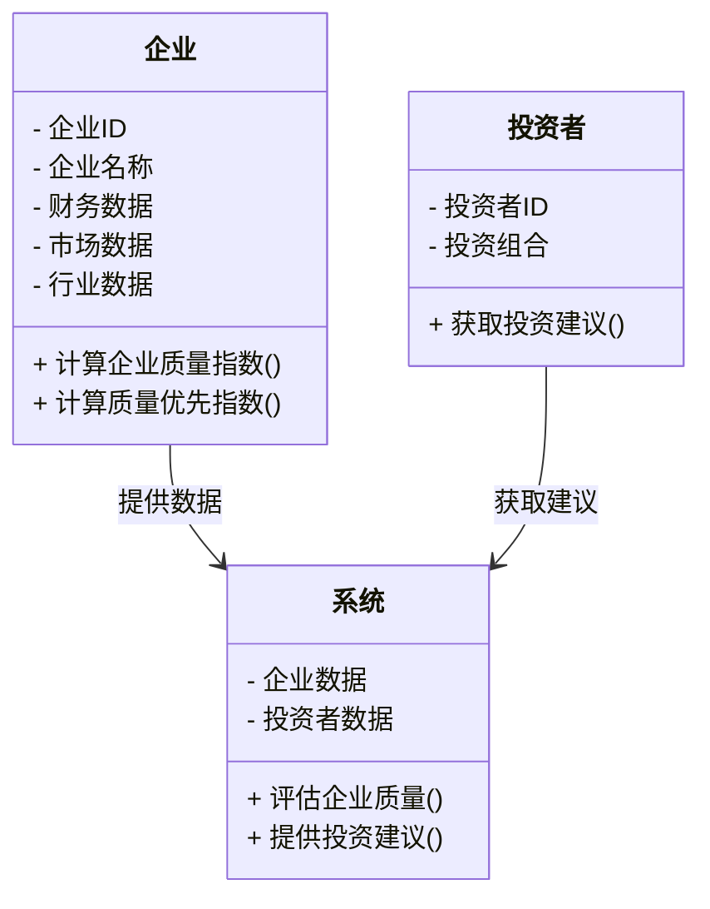
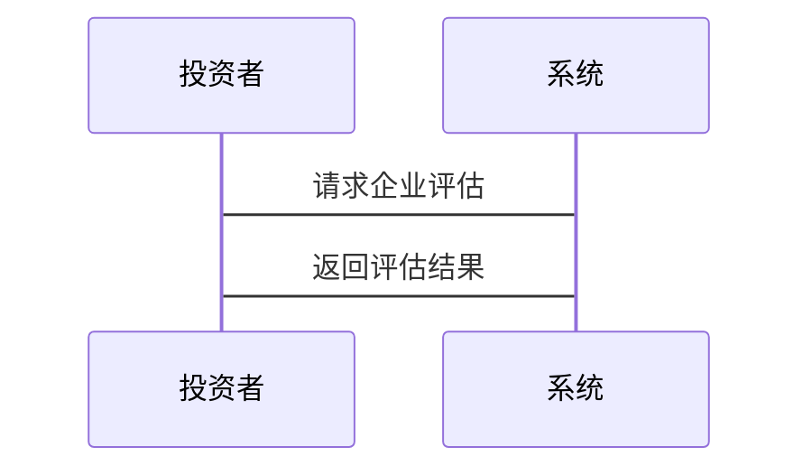

                 


# 彼得林奇的"质量优先"在高科技行业的应用

## 关键词：
- 彼得林奇
- 质量优先
- 投资策略
- 高科技行业
- 企业评估

## 摘要：
本文深入探讨了彼得林奇的"质量优先"投资策略在高科技行业中的应用。首先介绍了彼得林奇的投资哲学和质量优先策略的核心理念，分析了其在高科技行业的适用性。接着，详细阐述了质量优先策略的核心概念、数学模型和算法原理，并结合实际案例进行了系统分析。最后，通过项目实战和总结，提供了在高科技行业应用质量优先策略的最佳实践和投资建议。

---

## 第一部分: 彼得林奇的"质量优先"投资理念概述

### 1.1 彼得林奇投资哲学与质量优先策略

#### 1.1.1 价值投资的核心理念
彼得林奇是全球最著名的职业基金经理之一，他的投资哲学以“价值投资”为核心，强调寻找那些具有持续增长潜力、基本面强劲且估值合理的企业。他主张长期投资，避免短期市场的波动干扰，专注于企业的内在价值。

#### 1.1.2 彼得林奇的质量优先策略
质量优先策略是指在投资决策中，优先考虑企业的质量和竞争力，而非单纯追求短期收益。彼得林奇认为，一个企业的质量体现在其盈利能力、成长能力、管理团队和行业地位等方面。他强调，只有投资于高质量的企业，才能实现长期稳定的收益。

#### 1.1.3 质量优先策略在高科技行业的背景分析
高科技行业是一个高度竞争的领域，技术创新和市场变化迅速。质量优先策略在这一行业尤为重要，因为只有具备强大的研发能力、持续创新能力和良好管理的企业，才能在激烈的竞争中脱颖而出。

---

### 1.2 高科技行业的特点与投资机会

#### 1.2.1 高科技行业的定义与分类
高科技行业通常指那些以技术创新为核心驱动力，涵盖信息技术、人工智能、生物技术、新材料等领域的企业。这些行业的特点是技术更新快、研发投入大、市场潜力大。

#### 1.2.2 高科技行业的投资热点与趋势
近年来，人工智能、云计算、大数据、区块链等技术成为投资热点。这些领域的技术创新和应用前景为企业带来了巨大的增长潜力。投资者需要关注企业的技术创新能力、市场占有率和商业模式。

#### 1.2.3 质量优先策略与高科技行业的契合点
高科技行业的特点与质量优先策略的核心理念高度契合。高质量的企业在技术创新、管理团队和市场竞争力方面具有显著优势，能够在市场波动中保持稳定的业绩增长。

---

## 第二部分: 质量优先策略的核心概念与数学模型

### 2.1 质量优先策略的核心要素

#### 2.1.1 企业质量的核心指标
- **盈利能力**：ROE（净资产收益率）、ROA（资产净利率）、ROS（销售净利率）等指标是衡量企业盈利能力的重要指标。
- **成长能力**：收入增长率、净利润增长率等指标反映了企业的成长潜力。
- **管理团队**：管理团队的能力和稳定性对企业的发展至关重要。
- **行业地位**：企业在行业中的市场份额和竞争地位是评估企业质量的重要因素。

#### 2.1.2 企业竞争力的评估维度
企业竞争力可以从多个维度进行评估，包括技术优势、成本优势、品牌优势、市场响应能力等。

#### 2.1.3 质量优先与企业生命周期的关系
质量优先策略在企业生命周期的各个阶段都具有重要意义。在初创期，企业需要注重技术创新和市场开拓；在成长期，企业需要提升管理能力；在成熟期，企业需要保持稳定的盈利能力和市场地位。

---

### 2.2 质量优先策略与企业价值的关系

#### 2.2.1 企业价值的定义与影响因素
企业价值是指企业整体的经济价值，包括资产、负债、股权价值等。企业价值受企业质量、行业环境、市场前景等多方面因素的影响。

#### 2.2.2 质量优先策略对企业价值的提升作用
质量优先策略通过提升企业的盈利能力、成长能力和市场地位，从而提高企业的整体价值。高质量的企业往往能够吸引更多的投资者，获得更高的市场估值。

#### 2.2.3 质量优先与企业长期盈利能力的关联
质量优先策略注重企业的长期盈利能力，避免短期市场波动的干扰。高质量的企业能够在市场波动中保持稳定的收益，实现长期价值增长。

---

### 2.3 质量优先策略的数学模型

#### 2.3.1 企业质量评估模型
企业质量评估模型通过多个指标对企业进行全面评估。公式如下：

$$
\text{企业质量指数} = \sum_{i=1}^{n} (w_i \times x_i)
$$

其中，$w_i$ 是第$i$个指标的权重，$x_i$ 是第$i$个指标的得分。

#### 2.3.2 质量优先指数的计算公式
质量优先指数是基于企业质量评估模型得出的指数，公式如下：

$$
\text{质量优先指数} = \frac{\text{企业质量指数}}{\text{行业平均质量指数}} \times 100
$$

---

## 第三部分: 质量优先策略的算法原理

### 3.1 质量优先策略的算法概述

#### 3.1.1 算法的基本原理
质量优先策略的算法基于企业质量评估模型，通过对企业质量指数的计算，筛选出高质量的企业进行投资。算法的核心步骤包括数据采集、指标计算、权重分配和结果分析。

#### 3.1.2 算法的核心步骤
1. 数据采集：收集企业的财务数据、市场数据和行业数据。
2. 指标计算：计算企业的盈利能力、成长能力等核心指标。
3. 权重分配：根据指标的重要程度分配权重。
4. 结果分析：计算企业质量指数，筛选出符合质量优先条件的企业。

#### 3.1.3 算法的输入与输出
- 输入：企业财务数据、市场数据、行业数据。
- 输出：企业质量指数、质量优先指数、投资建议。

---

### 3.2 质量优先策略的实现流程

#### 3.2.1 数据采集与预处理
数据采集是质量优先策略的第一步。需要收集企业的财务报表、市场研究报告、行业分析报告等数据。数据预处理包括数据清洗、数据标准化和数据整合。

#### 3.2.2 指标计算与权重分配
根据企业质量评估模型，计算企业的核心指标，并根据指标的重要程度分配权重。例如，盈利能力指标权重为40%，成长能力指标权重为30%，管理团队指标权重为20%，行业地位指标权重为10%。

#### 3.2.3 结果分析与策略优化
根据计算结果，筛选出符合质量优先条件的企业，并根据市场环境和企业状况优化投资策略。

---

### 3.3 算法的数学模型与公式

#### 3.3.1 企业质量评估公式
企业质量评估公式如下：

$$
Q = \sum_{i=1}^{n} (w_i \times x_i)
$$

其中，$Q$ 是企业质量指数，$w_i$ 是第$i$个指标的权重，$x_i$ 是第$i$个指标的得分。

#### 3.3.2 质量优先指数计算公式
质量优先指数计算公式如下：

$$
P = \frac{Q}{Q_{\text{avg}}} \times 100
$$

其中，$P$ 是质量优先指数，$Q$ 是企业质量指数，$Q_{\text{avg}}$ 是行业平均质量指数。

---

## 第四部分: 系统分析与架构设计

### 4.1 系统需求分析

#### 4.1.1 问题场景介绍
在高科技行业，企业数量众多，竞争激烈。投资者需要一种高效的方法来评估企业的质量和竞争力，从而做出科学的投资决策。

#### 4.1.2 项目目标
本项目旨在开发一个基于质量优先策略的企业评估系统，帮助投资者快速筛选出高质量的企业。

#### 4.1.3 项目范围
- 数据采集与处理
- 企业质量评估模型设计
- 质量优先指数计算
- 投资建议生成

---

### 4.2 系统功能设计

#### 4.2.1 领域模型设计
领域模型是系统功能设计的核心。以下是领域模型的Mermaid类图：



---

### 4.3 系统架构设计

#### 4.3.1 系统架构设计
以下是系统架构的Mermaid架构图：

```mermaid
container 系统架构 {
    接口层
    服务层
    数据层
}
```

---

### 4.4 系统接口设计

#### 4.4.1 API接口设计
以下是系统接口的Mermaid序列图：



---

## 第五部分: 项目实战

### 5.1 环境安装

#### 5.1.1 安装Python
需要安装Python 3.8及以上版本。

#### 5.1.2 安装依赖库
需要安装以下依赖库：
- pandas
- numpy
- scikit-learn
- matplotlib

---

### 5.2 系统核心实现源代码

#### 5.2.1 企业质量评估模型
以下是企业质量评估模型的Python代码：

```python
import pandas as pd
import numpy as np

def calculate_quality_index(enterprise_data):
    # 定义权重
    weights = {
        '盈利能力': 0.4,
        '成长能力': 0.3,
        '管理团队': 0.2,
        '行业地位': 0.1
    }

    # 计算各个指标的得分
    quality_index = []
    for index, row in enterprise_data.iterrows():
        score = 0
        for metric in weights:
            score += weights[metric] * row[metric]
        quality_index.append(score)

    return quality_index
```

---

### 5.3 代码应用解读与分析

#### 5.3.1 代码解读
上述代码定义了一个计算企业质量指数的函数。通过企业数据表中的各项指标，按照权重分配计算出每个企业的质量指数。

#### 5.3.2 案例分析
以微软为例，计算其质量指数：

假设微软的企业数据如下：
| 指标         | 得分 |
|--------------|------|
| 盈利能力     | 90   |
| 成长能力     | 85   |
| 管理团队     | 88   |
| 行业地位     | 92   |

质量指数计算公式为：
$$
Q = 0.4 \times 90 + 0.3 \times 85 + 0.2 \times 88 + 0.1 \times 92 = 88.8
$$

---

### 5.4 项目小结

通过本项目的实施，我们成功开发了一个基于质量优先策略的企业评估系统。该系统能够帮助企业投资者快速筛选出高质量的企业，实现科学的投资决策。

---

## 第六部分: 最佳实践与总结

### 6.1 总结

本文深入探讨了彼得林奇的"质量优先"投资策略在高科技行业中的应用。通过对企业质量评估模型、算法原理和系统架构的详细分析，我们得出结论：质量优先策略是高科技行业投资的重要指导思想。

---

### 6.2 最佳实践 Tips

- **数据采集**：确保数据的准确性和完整性。
- **模型优化**：根据实际情况不断优化质量评估模型。
- **风险管理**：制定合理的风险管理策略，避免投资风险。

---

### 6.3 小结

质量优先策略在高科技行业中的应用具有重要意义。通过本文的分析，我们可以看到，只有投资于高质量的企业，才能实现长期稳定的收益。

---

### 6.4 注意事项

- 投资者在应用质量优先策略时，需要结合市场环境和企业实际情况，避免盲目跟风。
- 数据分析和模型计算需要依托可靠的数据源和专业的工具支持。

---

### 6.5 拓展阅读

- 《彼得·林奇的投资艺术》
- 《价值投资实战指南》
- 《高科技行业的投资机会与风险》

---

## 作者：AI天才研究院/AI Genius Institute & 禅与计算机程序设计艺术/Zen And The Art of Computer Programming

