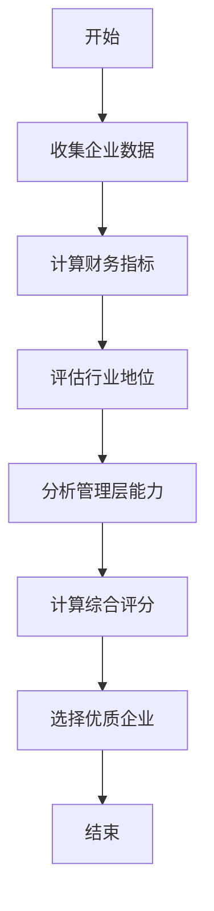
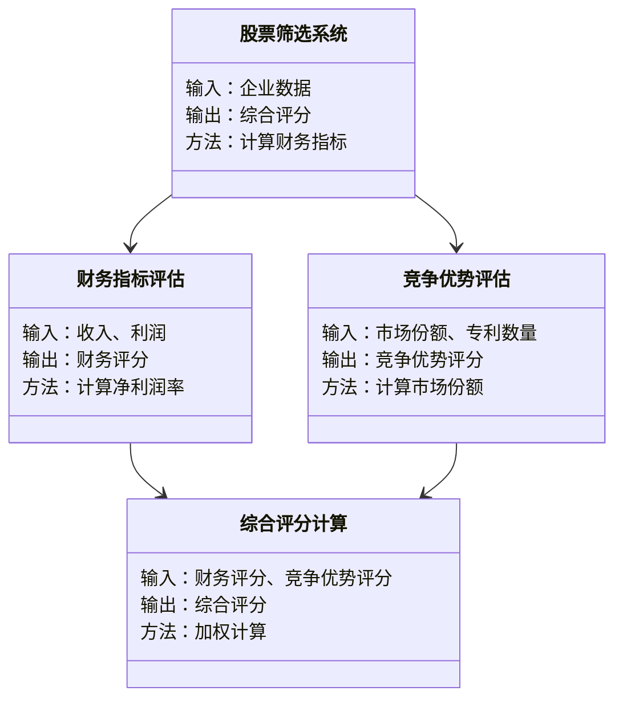
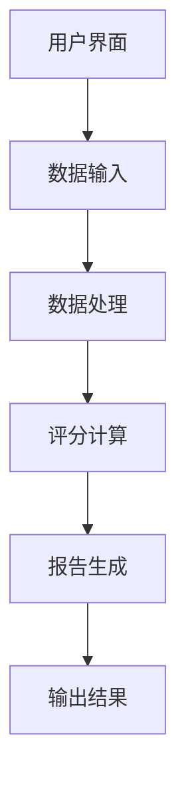

                 


# 彼得林奇的"质量优先"选股标准

> 关键词：彼得林奇，质量优先，选股标准，投资策略，价值投资

> 摘要：本文深入分析了彼得·林奇的“质量优先”选股标准，从背景介绍、核心概念、算法原理、系统分析、项目实战到最佳实践，全面阐述了这一选股方法的理论基础和实际应用。文章通过详细讲解质量优先选股法的核心标准、实施步骤、数学模型以及系统架构，帮助读者掌握这一经典投资策略。

---

## 第一部分: 背景介绍

### 第1章: 彼得林奇与质量优先选股法

#### 1.1 彼得林奇的背景与投资理念
彼得·林奇（Peter Lynch）是美国著名投资家，被誉为“普通投资者的圣经作者”。他在富达投资集团（Fidelity）任职期间，管理着麦哲伦基金，创造了年均29%的回报率，成为投资领域的传奇。彼得林奇的投资理念强调长期价值投资，注重企业质量而非短期市场波动。

#### 1.2 质量优先选股法的定义与特点
质量优先选股法是指在选股过程中，优先关注企业的内在质量和长期发展潜力，而非短期市场波动。其核心在于通过对企业基本面的深入分析，选择那些具有持续竞争优势、良好财务状况和优秀管理团队的企业。

#### 1.3 质量优先选股法的适用场景
该方法适用于长期投资者和价值投资者，尤其适合在市场波动较大时寻找具有抗跌能力的优质企业。然而，其局限性在于对市场周期的适应性较弱，且对行业特定风险的敏感性较低。

---

## 第二部分: 核心概念与联系

### 第2章: 质量优先选股法的核心标准

#### 2.1 财务指标分析
质量优先选股法强调对企业财务健康状况的全面评估，重点关注以下指标：
- **营业收入与利润分析**：衡量企业盈利能力。
- **利润率与ROE分析**：评估企业盈利效率。
- **负债率与现金流分析**：分析企业的财务风险和流动性。

#### 2.2 行业地位与竞争优势
企业应具备以下特征：
- **行业地位的评估**：企业在行业中的市场份额和影响力。
- **核心竞争优势的识别**：企业的技术、品牌或成本优势。
- **可持续竞争优势的判断**：竞争优势的长期性和稳定性。

#### 2.3 管理层能力与企业治理
管理层的能力和决策对企业价值至关重要：
- **管理层能力的评估标准**：包括管理经验、决策能力和过往业绩。
- **企业治理结构的分析**：公司治理的透明度和规范性。
- **管理层决策对股价的影响**：管理层的战略决策对股价波动的影响。

---

## 第三部分: 算法原理与数学模型

### 第3章: 质量优先选股法的数学模型与算法原理

#### 3.1 质量优先选股法的数学模型
质量优先选股法通过对企业质量的多维度评估，构建一个综合评分系统。其核心公式如下：

$$
\text{综合评分} = \sum (\text{指标权重} \times \text{指标评分})
$$

其中，指标权重根据其重要性分配，指标评分基于企业表现进行打分。

#### 3.2 算法原理的详细讲解
以下是质量优先选股法的算法流程图：



#### 3.3 举例说明与实际案例分析
以下是一个具体的选股案例：

**案例：某科技企业的质量评估**

1. **财务指标分析**：
   - 营业收入：$$ \text{年增长率} = \frac{\text{当年收入} - \text{上年收入}}{\text{上年收入}} $$
   - 净利润率：$$ \text{净利润率} = \frac{\text{净利润}}{\text{营业收入}} $$

2. **行业地位与竞争优势**：
   - 市场份额：$$ \text{市场份额} = \frac{\text{企业收入}}{\text{行业总收入}} $$
   - 技术创新：评估企业的研发能力和专利数量。

3. **管理层能力**：
   - 管理层稳定性：评估管理层的变动情况。
   - 管理层决策：分析管理层的战略决策对企业的长期影响。

---

## 第四部分: 系统分析与架构设计方案

### 第4章: 系统分析与架构设计方案

#### 4.1 问题场景介绍
为了实现质量优先选股法的自动化，我们设计了一个基于Python的选股系统，用于实时评估企业质量并生成投资报告。

#### 4.2 系统功能设计（领域模型）



#### 4.3 系统架构设计



---

## 第五部分: 项目实战

### 第5章: 项目实战

#### 5.1 环境安装
- Python 3.8+
- Pandas、NumPy、Scikit-learn库

#### 5.2 核心实现代码

```python
import pandas as pd

def calculate_profit_margin(revenue, net_income):
    return net_income / revenue * 100

def calculate_market_share(company_revenue, industry_revenue):
    return company_revenue / industry_revenue * 100

def quality_priority_stock_selector(dataframe):
    dataframe['利润率'] = dataframe.apply(lambda x: calculate_profit_margin(x['营收'], x['净利润']), axis=1)
    dataframe['市场份额'] = dataframe.apply(lambda x: calculate_market_share(x['营收'], x['行业总营收']), axis=1)
    dataframe['综合评分'] = dataframe['利润率'] * 0.4 + dataframe['市场份额'] * 0.6
    return dataframe

# 示例数据
data = {
    '公司': ['公司A', '公司B', '公司C'],
    '营收': [100, 200, 150],
    '净利润': [20, 40, 30],
    '行业总营收': [500, 600, 550]
}
df = pd.DataFrame(data)
result = quality_priority_stock_selector(df)
print(result)
```

#### 5.3 代码应用解读
上述代码实现了一个简单的质量优先选股系统，计算企业的利润率和市场份额，并根据权重计算综合评分。用户可以根据实际需求扩展功能，例如加入更多的财务指标和行业分析。

---

## 第六部分: 最佳实践与总结

### 第6章: 最佳实践

#### 6.1 投资策略小结
- **长期视角**：关注企业的长期发展潜力。
- **分散投资**：避免过度集中，降低风险。
- **持续学习**：保持对市场的敏感性和对企业基本面的深入理解。

#### 6.2 注意事项
- **市场波动**：质量优先策略在市场波动时可能表现不佳。
- **数据质量**：确保输入数据的准确性和完整性。
- **模型优化**：根据市场变化不断优化选股模型。

#### 6.3 拓展阅读
- 《彼得·林奇的投资策略》
- 《价值投资经典案例分析》

---

## 作者：AI天才研究院/AI Genius Institute & 禅与计算机程序设计艺术 /Zen And The Art of Computer Programming

