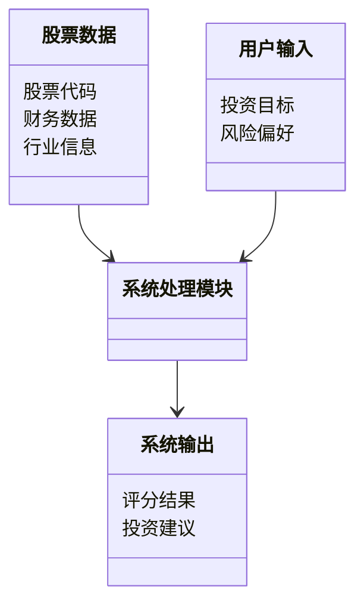
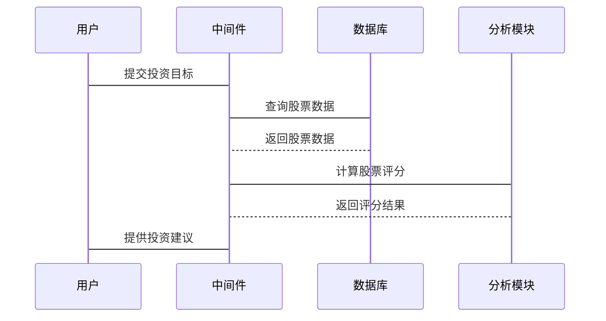

                 


# 彼得林奇的"质量优先"选股清单

## 关键词：
- 投资策略
- 质量优先
- 股票分析
- 选股模型
- 财务指标

## 摘要：
彼得林奇的“质量优先”选股策略是一种以公司质量为核心的投资方法，强调通过基本面分析和财务指标评估来选择具有长期竞争优势的公司。本文将详细探讨这一策略的核心概念、数学模型、算法实现以及实际应用，帮助投资者更好地理解和应用这一选股方法。

---

## 第一部分: 质量优先策略的背景与核心概念

### 第1章: 投资的基本概念

#### 1.1 投资的定义与分类
- 投资的定义：将资金投入某个项目或资产，以期获得收益的行为。
- 投资的分类：包括股票、债券、基金、房地产等多种形式。
- 股票投资的核心要素：市场风险、流动性、收益性。

#### 1.2 彼得林奇的选股理念
- 彼得林奇的简介：美国著名投资家，强调基本面分析和长期投资。
- 质量优先策略的核心思想：选择具有强大竞争优势和良好财务状况的公司。
- 质量优先与价值投资的联系与区别：
  - 联系：两者都注重公司质量，追求长期收益。
  - 区别：价值投资更注重价格与价值的匹配，而质量优先更注重公司的基本面和成长潜力。

#### 1.3 质量优先策略的背景
- 质量优先策略的起源：基于对市场的长期观察和实践总结。
- 质量优先策略在现代投资中的地位：成为机构投资者和散户的重要参考。
- 质量优先策略的适用场景与边界：适用于成熟市场，但在新兴市场需调整策略。

### 第2章: 质量优先策略的核心要素

#### 2.1 质量优先策略的定义与特点
- 定义：通过分析公司的财务状况、行业地位和竞争优势，选择具有长期增长潜力的公司。
- 核心特征：
  - 重视公司质量，而非短期价格波动。
  - 强调长期投资，避免频繁交易。
  - 注重财务健康和竞争优势。

#### 2.2 质量优先策略的关键要素
- 公司基本面分析：
  - 营业收入：公司收入的稳定性和增长性。
  - 净利润：公司盈利能力和利润质量。
  - 财务杠杆：公司的债务水平和偿债能力。
- 财务指标的重要性：
  - 市盈率（P/E）：衡量股票价格与每股收益的比率。
  - 市净率（P/B）：衡量股票价格与每股净资产的比率。
  - 净利润率：衡量公司盈利能力。
- 行业地位与竞争优势：
  - 市场占有率：公司在行业中的地位。
  - 核心竞争力：公司的技术、品牌或成本优势。

#### 2.3 质量优先策略的实施步骤
- 确定投资目标：明确投资期限、风险承受能力和收益目标。
- 收集与分析数据：通过财务报表和行业报告获取信息。
- 评估与筛选股票：根据财务指标和行业地位进行筛选。
- 调整与优化投资组合：根据市场变化和个人目标进行动态调整。

---

## 第二部分: 质量优先策略的数学模型与算法

### 第3章: 质量优先策略的数学模型

#### 3.1 质量优先策略的数学模型
- 财务指标的量化分析：
  - 营业收入增长率：衡量公司收入增长能力。
  - 净利润率：衡量公司盈利能力。
  - 财务杠杆：衡量公司债务风险。
- 股票估值的公式推导：
  - 内在价值公式：$内在价值 = \frac{现金流}{贴现率}$
  - 市盈率公式：$P/E = \frac{股价}{每股收益}$
  - 市净率公式：$P/B = \frac{股价}{每股净资产}$
- 质量优先评分体系的构建：
  - 综合评分模型：$综合评分 = \alpha \times 财务指标 + \beta \times 行业地位 + \gamma \times 竞争优势$

#### 3.2 质量优先策略的算法实现
- 数据预处理与清洗：
  - 数据清洗：处理缺失值、异常值。
  - 数据标准化：统一数据格式和单位。
- 财务指标的加权计算：
  - 权重分配：根据指标重要性分配权重。
  - 加权计算：$加权评分 = \sum (权重_i \times 指标_i)$
- 股票评分的排序与筛选：
  - 评分排序：从高到低排序。
  - 筛选策略：根据评分阈值筛选优质股票。

#### 3.3 质量优先策略的优化与改进
- 算法的优化方向：
  - 动态调整权重：根据市场变化调整指标权重。
  - 引入机器学习：利用回归分析或聚类分析优化评分模型。
- 不同市场的适用性调整：
  - 行业差异：不同行业适用不同的评分标准。
  - 市场周期：根据市场周期调整策略。

---

## 第三部分: 质量优先策略的系统分析与架构设计

### 第4章: 系统功能设计

#### 4.1 项目介绍
- 系统目标：构建一个基于质量优先策略的选股系统。
- 项目背景：帮助投资者快速筛选优质股票，降低投资风险。

#### 4.2 系统功能设计
- 领域模型设计：使用Mermaid类图描述系统功能模块。


#### 4.3 系统架构设计
- 使用Mermaid架构图描述系统架构：


#### 4.4 系统接口设计
- API接口：
  - 数据接口：获取股票数据。
  - 评分接口：返回股票评分。
  - 建议接口：提供投资建议。

#### 4.5 系统交互设计
- 使用Mermaid序列图描述用户与系统的交互：


---

## 第四部分: 质量优先策略的项目实战

### 第5章: 项目实战

#### 5.1 环境安装
- 安装Python和必要的库：
  - pandas：数据处理。
  - matplotlib：数据可视化。
  - numpy：数值计算。

#### 5.2 核心实现
- 股票数据获取与清洗：
  ```python
  import pandas as pd
  data = pd.read_csv('stock_data.csv')
  data = data.dropna().reset_index(drop=True)
  ```
- 财务指标计算：
  ```python
  data['ROE'] = data['净利润'] / data['股东权益']
  data['ROE'].describe()
  ```
- 股票评分模型实现：
  ```python
  def calculate_score(row):
      score = row['ROE'] * 0.4 + row['营收增长率'] * 0.3 + row['市场占有率'] * 0.3
      return score
  data['评分'] = data.apply(calculate_score, axis=1)
  ```

#### 5.3 案例分析
- 案例背景：假设我们有某行业的10只股票数据。
- 数据分析与解读：
  - 计算每只股票的评分。
  - 根据评分排序，筛选出评分前3的股票。
- 实际案例的详细分析：
  ```python
  top_stocks = data.sort_values('评分', ascending=False).head(3)
  print(top_stocks[['股票代码', '评分', 'ROE', '营收增长率', '市场占有率']])
  ```

#### 5.4 项目小结
- 项目总结：通过编程实现质量优先策略，能够快速筛选优质股票。
- 注意事项：数据来源的可靠性、模型的可解释性、算法的可扩展性。

---

## 第五部分: 最佳实践与小结

### 第6章: 最佳实践

#### 6.1 小结
- 质量优先策略的核心在于公司质量的分析。
- 通过数学模型和算法优化，能够提高选股效率。

#### 6.2 注意事项
- 数据的准确性和完整性：确保数据来源可靠。
- 模型的动态调整：根据市场变化调整权重和参数。
- 风险管理：合理分配投资比例，避免过度集中。

#### 6.3 拓展阅读
- 推荐书籍：《彼得·林奇的投资艺术》。
- 推荐网站：Yahoo Finance、Morningstar。

---

## 作者：
AI天才研究院/AI Genius Institute  
禅与计算机程序设计艺术/Zen And The Art of Computer Programming

