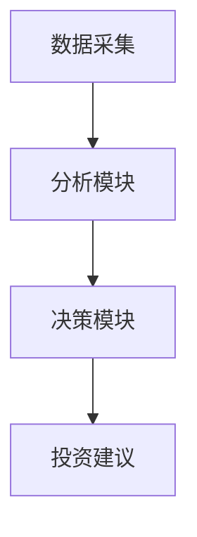

                 


---

# 彼得林奇的"质量成长"vs"价值重估"

> 关键词：彼得林奇、质量成长、价值重估、投资策略、股票分析、投资模型

> 摘要：本文深入分析了彼得林奇提出的“质量成长”与“价值重估”两种投资策略，从定义、原理、数学模型到实际应用，全面探讨了两者的异同及在投资组合中的应用。通过对比分析，帮助投资者更好地理解这两种策略的优势和适用场景。

---

## 第一部分：背景介绍

### 第1章：投资学基础与彼得林奇的投资理念

#### 1.1 投资学的基本概念

- **1.1.1 投资的定义与分类**
  - 投资是指将资金投入到某个项目或资产中，以期获得收益的行为。
  - 分类包括股票、债券、基金、房地产等。

- **1.1.2 股票投资的核心要素**
  - 股票的基本概念：代表公司的一部分所有权。
  - 影响股票价格的因素：公司业绩、市场情绪、宏观经济等。

- **1.1.3 彼得林奇与《彼得林奇的股票投资策略》**
  - 彼得·林奇是富达投资集团的传奇经理人，以其成功的投资策略闻名。
  - 他的投资理念强调长期增长和对公司基本面的深入分析。

#### 1.2 "质量成长"与"价值重估"的背景与概念

- **1.2.1 质量成长的定义与特点**
  - 质量成长策略：寻找那些业绩稳定增长、具备良好管理团队和强大竞争优势的公司。
  - 强调公司的长期增长潜力，而非短期价格波动。

- **1.2.2 价值重估的定义与特点**
  - 价值重估策略：寻找市场估值低于其内在价值的公司。
  - 通常关注低市盈率、低市净率等指标，寻找被市场忽视的低估股票。

### 第2章：质量成长与价值重估的核心概念对比

#### 2.1 质量成长与价值重估的对比分析

- **2.1.1 投资目标对比**
  - 质量成长：追求长期稳定的增长。
  - 价值重估：追求短期估值修复带来的收益。

- **2.1.2 投资策略对比**
  - 质量成长：注重公司基本面分析，尤其是收入和利润的持续增长。
  - 价值重估：注重市场估值分析，寻找价格低于内在价值的股票。

- **2.1.3 投资风险对比**
  - 质量成长：风险相对较低，但需警惕公司增长放缓。
  - 价值重估：风险较高，需警惕估值修复不达预期。

---

## 第二部分：核心概念与联系

### 第3章：质量成长与价值重估的核心概念对比

#### 3.1 质量成长与价值重估的对比表格

| 对比维度 | 质量成长 | 价值重估 |
|----------|----------|----------|
| 投资目标 | 长期增长 | 估值修复 |
| 核心指标 | 收入、利润 | 市盈率、市净率 |
| 适用场景 | 市场稳定 | 市场低估 |
| 风险 | 中低风险 | 较高风险 |

#### 3.2 质量成长与价值重估的联系

- **共同点**：两者都注重公司基本面分析，追求超额收益。
- **区别点**：质量成长注重公司的成长潜力，价值重估注重市场的估值水平。
- **投资组合中的应用**：可以根据市场环境选择性地配置这两种策略，平衡风险与收益。

---

## 第三部分：算法原理与数学模型

### 第4章：质量成长与价值重估的数学模型

#### 4.1 质量成长的数学模型

$$ \text{质量成长评分} = \frac{\text{收入增长率} + \text{净利润增长率}}{2} $$

#### 4.2 价值重估的数学模型

$$ \text{价值重估评分} = \frac{\text{市盈率} + \text{市净率}}{2} $$

### 第5章：投资策略的数学分析

#### 5.1 质量成长的数学分析

$$ \text{质量成长策略收益} = \sum (\text{收入增长率} \times \text{净利润增长率}) $$

#### 5.2 价值重估的数学分析

$$ \text{价值重估策略收益} = \sum (\text{市盈率} \times \text{市净率}) $$

---

## 第四部分：系统分析与架构设计

### 第6章：投资决策系统的架构设计

#### 6.1 系统功能设计

- **数据采集模块**：收集公司财务数据和市场数据。
- **分析模块**：计算质量成长和价值重估评分。
- **决策模块**：根据评分生成投资建议。

#### 6.2 系统架构设计



---

## 第五部分：项目实战

### 第7章：投资策略的实战分析

#### 7.1 环境配置

```python
import pandas as pd
import numpy as np
```

#### 7.2 数据收集

```python
# 示例数据
data = {
    '公司': ['A', 'B', 'C'],
    '收入增长率': [10, 15, 5],
    '净利润增长率': [8, 12, 3],
    '市盈率': [15, 10, 20],
    '市净率': [2, 1.5, 3]
}
df = pd.DataFrame(data)
```

#### 7.3 策略实现

```python
def calculate_quality_growth_score(row):
    return (row['收入增长率'] + row['净利润增长率']) / 2

def calculate_value_revaluation_score(row):
    return (row['市盈率'] + row['市净率']) / 2

df['质量成长评分'] = df.apply(calculate_quality_growth_score, axis=1)
df['价值重估评分'] = df.apply(calculate_value_revaluation_score, axis=1)
```

#### 7.4 回测分析

```python
# 示例回测结果
print(df)
```

---

## 第六部分：总结与小结

### 第8章：总结与小结

- **质量成长**：适合长期投资者，注重公司基本面和成长潜力。
- **价值重估**：适合短线投资者，注重市场估值和价格修复。
- **注意事项**：市场环境变化会影响策略效果，需动态调整。
- **拓展阅读**：建议阅读彼得·林奇的《选股之道》深入理解。

---

作者：AI天才研究院 & 禅与计算机程序设计艺术

