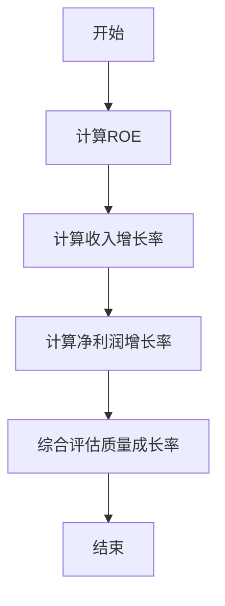
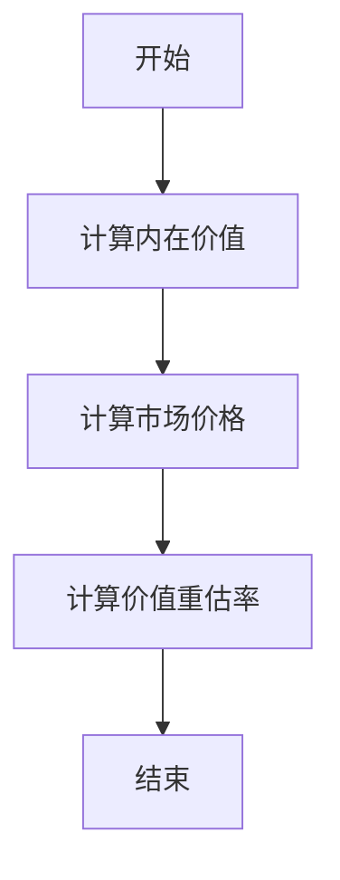
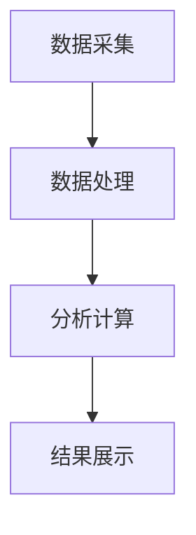

                 


# 彼得林奇的"质量成长"vs"价值重估"在不同市值公司中的应用

## 关键词：
彼得林奇，质量成长，价值重估，投资策略，市值公司，算法原理，系统设计

## 摘要：
本文深入分析了彼得·林奇提出的“质量成长”和“价值重估”两种投资策略，并探讨了它们在不同市值公司中的应用。通过理论分析、算法推导、系统设计和项目实战，详细阐述了这两种策略的核心概念、数学模型和实际应用场景，帮助读者更好地理解和应用这些投资策略。

---

# 第一章：彼得林奇投资理念概述

## 1.1 彼得林奇投资理念的核心思想
### 1.1.1 价值投资的基本原则
- 质量第一，其次是数量。
- 长期投资，避免频繁交易。
- 专注于企业基本面分析。

### 1.1.2 质量成长与价值重估的定义
- 质量成长：指公司通过自身质量的提升，实现持续增长的过程。
- 价值重估：指市场对公司的价值重新评估的过程。

## 1.2 质量成长与价值重估的背景
### 1.2.1 投资市场的演变
- 从传统投资到现代投资策略的转变。
- 市场波动与企业基本面的关系。

### 1.2.2 质量成长与价值重估的提出背景
- 经济周期对投资策略的影响。
- 投资者对长期稳定回报的需求。

## 1.3 本书的研究意义
### 1.3.1 研究质量成长与价值重估的重要性
- 为投资者提供科学的投资依据。
- 帮助投资者在不同市值公司中做出明智决策。

### 1.3.2 研究在不同市值公司中的应用价值
- 为不同规模的企业提供投资价值评估方法。
- 帮助投资者识别优质成长型公司和被低估的价值型公司。

---

# 第二章：质量成长与价值重估的核心概念

## 2.1 质量成长的定义与特征
### 2.1.1 质量成长的定义
- 质量成长是指公司通过提升产品质量、优化管理、技术创新等方式实现的持续增长。

### 2.1.2 质量成长的核心特征
- 高ROE（净资产收益率）。
- 稳定的收入和利润增长。
- 强大的竞争优势。

### 2.1.3 质量成长与企业生命周期的关系
- 企业生命周期的不同阶段与质量成长的关系。

## 2.2 价值重估的定义与特征
### 2.2.1 价值重估的定义
- 价值重估是指市场对公司的内在价值重新评估的过程。

### 2.2.2 价值重估的核心特征
- 市场波动性。
- 公司基本面变化。
- 投资者情绪的影响。

### 2.2.3 价值重估与市场波动的关系
- 市场波动对价值重估的影响。
- 投资者如何利用市场波动进行价值重估。

## 2.3 质量成长与价值重估的对比分析
### 2.3.1 概念对比表
| 比较维度 | 质量成长 | 价值重估 |
|----------|----------|----------|
| 定义     | 公司自身质量提升 | 市场对公司的价值重新评估 |
| 关注点   | 企业基本面 | 市场情绪和波动 |
| 适用场景 | 长期投资 | 短期市场机会 |

### 2.3.2 ER实体关系图
```mermaid
er
actor 投资者
actor 公司
actor 市场
```

---

# 第三章：质量成长与价值重估的算法原理

## 3.1 质量成长的算法
### 3.1.1 质量成长率的计算
- 质量成长率 = (净利润增长率 + 收入增长率) / 2
- 通过mermaid流程图展示计算步骤：


### 3.1.2 Python实现
```python
def calculate_quality_growth(roe, revenue_growth, net_profit_growth):
    quality_growth = (revenue_growth + net_profit_growth) / 2
    return quality_growth

# 示例
roE = 15%
revenue_growth = 10%
net_profit_growth = 12%
result = calculate_quality_growth(roE, revenue_growth, net_profit_growth)
print(result)  # 输出质量成长率
```

## 3.2 价值重估的算法
### 3.2.1 价值重估率的计算
- 价值重估率 = 市场价格 / 内在价值
- 通过mermaid流程图展示计算步骤：


### 3.2.2 Python实现
```python
def calculate_value_revaluation(intrinsic_value, market_price):
    value_revaluation = market_price / intrinsic_value
    return value_revaluation

# 示例
intrinsic_value = 50
market_price = 60
result = calculate_value_revaluation(intrinsic_value, market_price)
print(result)  # 输出价值重估率
```

---

# 第四章：质量成长与价值重估的数学模型

## 4.1 质量成长的数学模型
### 4.1.1 质量成长率的公式推导
$$
\text{质量成长率} = \frac{\text{净利润增长率} + \text{收入增长率}}{2}
$$
- 示例计算：
$$
\text{净利润增长率为20%，收入增长率为15%}
$$
$$
\text{质量成长率} = \frac{20\% + 15\%}{2} = 17.5\%
$$

## 4.2 价值重估的数学模型
### 4.2.1 价值重估率的公式推导
$$
\text{价值重估率} = \frac{\text{市场价格}}{\text{内在价值}}
$$
- 示例计算：
$$
\text{内在价值为100，市场价格为120}
$$
$$
\text{价值重估率} = \frac{120}{100} = 1.2
$$

---

# 第五章：投资分析系统的架构设计

## 5.1 问题场景介绍
- 投资者如何选择优质成长型公司和价值重估型公司。
- 不同市值公司如何应用质量成长和价值重估策略。

## 5.2 系统功能设计
### 5.2.1 数据采集模块
- 数据来源：财务报表、市场数据。
- 数据处理：清洗、转换。

### 5.2.2 分析计算模块
- 计算质量成长率和价值重估率。
- 生成分析报告。

### 5.2.3 结果展示模块
- 可视化图表：柱状图、折线图。
- 投资建议：基于分析结果给出投资建议。

## 5.3 系统架构设计


## 5.4 接口设计
### 5.4.1 数据接口
- REST API：用于数据采集和传输。

### 5.4.2 用户接口
- Web界面：方便用户查看分析结果。

---

# 第六章：项目实战——不同市值公司的投资分析

## 6.1 环境安装
- 安装Python和相关库（Pandas、NumPy、Matplotlib）。

## 6.2 核心实现
### 6.2.1 数据采集
```python
import pandas as pd

data = pd.read_csv('company_data.csv')
```

### 6.2.2 计算质量成长率和价值重估率
```python
def calculate_quality_growth(roe, revenue_growth, net_profit_growth):
    return (revenue_growth + net_profit_growth) / 2

def calculate_value_revaluation(intrinsic_value, market_price):
    return market_price / intrinsic_value
```

## 6.3 实际案例分析
### 6.3.1 案例一：小型公司
- 数据分析：质量成长率较高，价值重估率较低。
- 投资建议：适合长期投资。

### 6.3.2 案例二：大型公司
- 数据分析：质量成长率稳定，价值重估率合理。
- 投资建议：适合稳健投资。

## 6.4 项目小结
- 通过实际案例分析，验证了质量成长和价值重估策略的有效性。

---

# 第七章：总结与展望

## 7.1 全文总结
- 彼得林奇的质量成长和价值重估策略在不同市值公司中的应用。
- 投资分析系统的构建与实现。

## 7.2 最佳实践 tips
- 理解公司基本面，选择优质成长型公司。
- 灵活运用价值重估策略，捕捉市场机会。
- 结合市场环境，调整投资策略。

## 7.3 未来研究方向
- 结合其他投资策略，优化投资模型。
- 利用大数据和AI技术，提升分析效率。

---

# 作者：AI天才研究院/AI Genius Institute & 禅与计算机程序设计艺术/Zen And The Art of Computer Programming

---

这篇博客文章通过详细分析彼得林奇的质量成长和价值重估策略，结合算法原理、数学模型和系统设计，为投资者提供了科学的投资方法和实际应用案例，帮助读者在不同市值公司中做出明智的投资决策。

