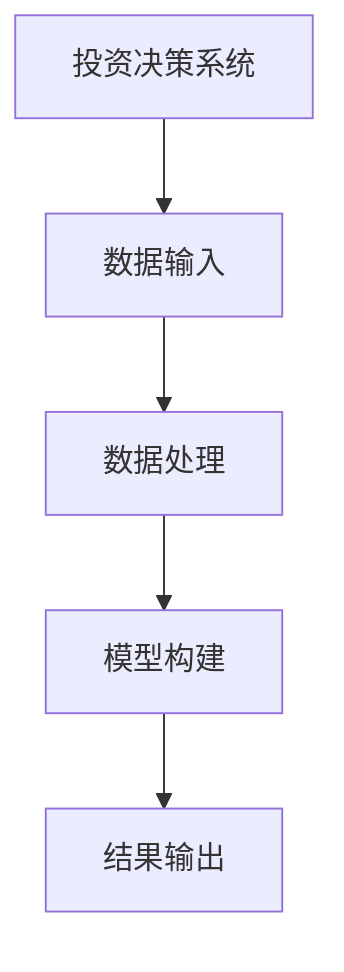

                 

# 彼得林奇的"质量成长"vs"价值重估"在不同市值段的应用比较

## 关键词：
彼得·林奇，质量成长，价值重估，投资策略，市值段分析，股票选择，投资模型

## 摘要：
本文深入探讨了彼得·林奇提出的“质量成长”与“价值重估”两种投资策略在不同市值段中的应用。通过分析这两种策略的核心要素、适用场景以及数学模型，本文揭示了它们在小盘股、中盘股和大盘股中的具体应用方式，并通过案例分析和系统架构设计，帮助投资者更好地理解和应用这些策略。文章还比较了两种策略的优缺点，并提供了投资决策系统的构建方法和数学模型，以辅助投资者在实际操作中做出明智的选择。

---

# 第一部分：引言

## 1.1 投资理念概述

### 1.1.1 彼得·林奇的投资哲学
彼得·林奇是全球著名投资家，以其对成长型股票的深刻理解和独特见解闻名。他强调长期投资、基本面分析和对公司的深入研究。他的投资哲学的核心在于寻找那些具有持续增长潜力的公司，并在市场波动中抓住投资机会。

### 1.1.2 质量成长与价值重估的定义
- **质量成长**：指选择那些具有强大基本面、良好管理团队和持续增长潜力的公司进行投资。这种策略注重公司的内在质量，而非短期市场波动。
- **价值重估**：指寻找那些市场价格低于其内在价值的股票，即市场对公司价值的低估。这种策略关注的是市场波动带来的投资机会。

### 1.1.3 本书的目的与结构
本文旨在通过分析彼得·林奇的“质量成长”与“价值重估”策略，探讨这两种策略在不同市值段中的应用。文章结构包括：引言、质量成长策略、价值重估策略、策略比较、数学模型、案例分析和总结。

---

# 第二部分：质量成长策略

## 2.1 质量成长的定义与核心要素

### 2.1.1 质量成长的定义
质量成长策略强调选择那些具有以下特征的公司：
- 公司具有持续增长的潜力。
- 公司基本面良好，包括健康的财务状况和盈利能力。
- 公司具有强大的竞争优势和市场地位。

### 2.1.2 核心要素：优质公司的标准
优质公司的标准可以归纳为以下几点：
1. **盈利能力**：公司过去几年的盈利能力稳定且持续增长。
2. **财务状况**：公司财务健康，负债率低，现金流充裕。
3. **竞争优势**：公司具有独特的竞争优势，例如品牌、技术或市场地位。
4. **管理团队**：公司管理团队稳定且有良好的业绩记录。

### 2.1.3 质量成长的数学模型
质量成长的评估公式可以表示为：
$$
\text{质量成长评分} = \frac{\text{净利润增长率} + \text{营业收入增长率} + \text{ROE}}{3}
$$
其中，ROE（净资产收益率）是衡量公司盈利能力的重要指标。

---

## 2.2 质量成长在不同市值段的应用

### 2.2.1 小盘股的质量成长机会
小盘股通常具有较高的增长潜力，但风险也较大。质量成长策略在小盘股中的应用需要关注公司的成长性和财务健康状况。

### 2.2.2 中盘股的质量成长策略
中盘股介于小盘股和大盘股之间，具有较高的增长潜力和相对较低的波动性。质量成长策略在中盘股中需要关注公司的持续增长能力和竞争优势。

### 2.2.3 大盘股的质量成长挑战
大盘股通常具有较高的市场地位和稳定的盈利能力，但增长潜力相对有限。质量成长策略在大盘股中的应用需要关注公司的持续增长能力。

---

# 第三部分：价值重估策略

## 3.1 价值重估的定义与核心要素

### 3.1.1 价值重估的定义
价值重估策略强调寻找那些市场价格低于其内在价值的股票。这种策略关注的是市场波动带来的投资机会，而非公司的基本面。

### 3.1.2 核心要素：低估股票的识别
低估股票的识别标准可以归纳为以下几点：
1. **市盈率**：市盈率低于行业平均水平。
2. **市净率**：市净率低于行业平均水平。
3. **股息率**：股息率较高，且稳定。

### 3.1.3 价值重估的数学模型
价值重估的评估公式可以表示为：
$$
\text{内在价值} = \text{净利润} \times \text{市盈率倍数}
$$

---

## 3.2 价值重估在不同市值段的应用

### 3.2.1 小盘股的价值重估机会
小盘股由于市场关注度较低，容易被市场低估。价值重估策略在小盘股中的应用需要关注公司的内在价值和市场波动。

### 3.2.2 中盘股的价值重估策略
中盘股具有较高的市场关注度，但仍然可能被市场低估。价值重估策略在中盘股中的应用需要关注公司的内在价值和市场波动。

### 3.2.3 大盘股的价值重估挑战
大盘股由于市场关注度高，通常不易被低估。价值重估策略在大盘股中的应用需要关注市场波动和公司的内在价值。

---

# 第四部分：质量成长与价值重估的比较

## 4.1 战略比较与适用场景

### 4.1.1 质量成长与价值重估的对比分析
- **质量成长**：注重公司的基本面和成长潜力，适合长期投资。
- **价值重估**：注重市场的低估机会，适合短期投资。

### 4.1.2 不同市场环境下的策略选择
- **牛市**：质量成长策略表现较好。
- **熊市**：价值重估策略表现较好。

### 4.1.3 风险与收益的平衡
质量成长策略的风险较低，但收益较为稳定；价值重估策略的风险较高，但收益潜力更大。

---

# 第五部分：系统架构与数学模型

## 5.1 投资决策系统的构建

### 5.1.1 数据收集与处理
投资决策系统需要收集以下数据：
- 公司的财务数据。
- 市场数据。
- 行业数据。

### 5.1.2 模型构建与验证
投资决策系统需要构建以下模型：
- 质量成长评分模型。
- 价值重估评分模型。

### 5.1.3 系统架构的Mermaid图

---

## 5.2 数学模型与公式

### 5.2.1 质量成长的评估公式
$$
\text{质量成长评分} = \frac{\text{净利润增长率} + \text{营业收入增长率} + \text{ROE}}{3}
$$

### 5.2.2 价值重估的评估公式
$$
\text{内在价值} = \text{净利润} \times \text{市盈率倍数}
$$

---

# 第六部分：案例分析与实战

## 6.1 案例分析

### 6.1.1 质量成长策略的案例
假设我们选择一家小盘股公司，其净利润增长率和营业收入增长率为20%，ROE为15%，则质量成长评分为：
$$
\text{质量成长评分} = \frac{20 + 20 + 15}{3} = 15
$$
评分较高，适合投资。

### 6.1.2 价值重估策略的案例
假设我们选择一家市盈率低于行业平均水平的公司，其净利润为100万元，行业平均市盈率为15，则其内在价值为：
$$
\text{内在价值} = 100 \times 15 = 1500 \text{万元}
$$
如果当前市值低于1500万元，则适合投资。

---

## 6.2 项目小结

### 6.2.1 项目总结
通过本文的分析，我们可以看出质量成长和价值重估策略在不同市值段中的应用各有优劣。投资者需要根据市场环境和个人风险偏好选择合适的策略。

### 6.2.2 投资建议
- **长期投资者**：更适合选择质量成长策略。
- **短期投资者**：更适合选择价值重估策略。

### 6.2.3 注意事项
- 投资者需要对市场环境和公司基本面有深入的了解。
- 投资需要分散风险，避免过度集中。

---

# 第七部分：总结

## 7.1 投资策略的核心要点
- 质量成长策略注重公司的基本面和成长潜力。
- 价值重估策略注重市场的低估机会。

## 7.2 未来展望
随着市场环境的变化，投资者需要不断调整投资策略。未来，人工智能和大数据技术将为投资决策提供更多的支持。

---

作者：AI天才研究院/AI Genius Institute & 禅与计算机程序设计艺术 /Zen And The Art of Computer Programming

