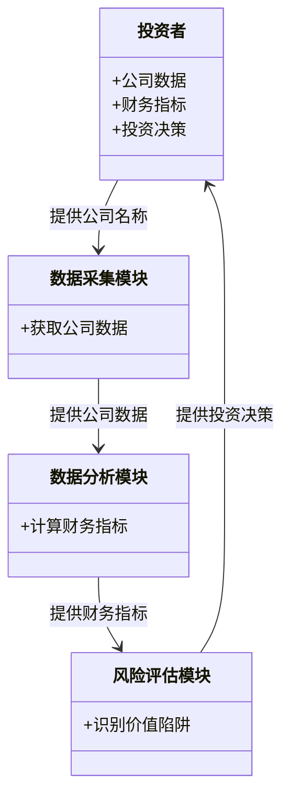
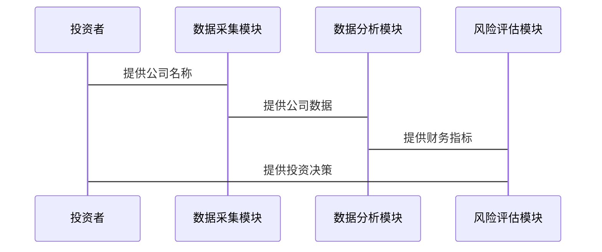

                 


```markdown
# 彼得林奇的"质量成长"vs"价值陷阱"

> 关键词：彼得·林奇，质量成长，价值陷阱，投资策略，选股标准，风险评估，投资理念

> 摘要：本文深入探讨了彼得·林奇提出的“质量成长”与“价值陷阱”两个投资理念，通过对比分析，详细讲解了质量成长股的核心特征与价值陷阱的识别方法，结合数学模型与算法，系统地分析了投资决策框架与策略实现。

---

## 第1章: 彼得林奇投资理念的背景与基础

### 1.1 彼得·林奇及其投资风格

#### 1.1.1 彼得·林奇的生平简介
彼得·林奇（Peter Lynch）是美国著名的职业基金经理人，被誉为“股神”之一，曾管理富达麦哲伦基金（Fidelity Magellan Fund），创造了年化29%的复合增长率。他的投资理念以选股而非选时著称，强调长期持有优质成长股。

#### 1.1.2 林奇的投资哲学与理念
林奇的投资哲学的核心在于寻找那些具有持续增长潜力的公司，这些公司不仅财务健康、管理优秀，还能在行业内保持竞争优势。他反对短期交易和市场预测，主张通过深入研究公司基本面来进行投资决策。

#### 1.1.3 林奇投资方法的核心思想
林奇的核心思想是“投资于你了解的公司”，即选择那些投资者熟悉且具备持续增长能力的股票。他认为市场波动是投资者的盟友，而非敌人。

### 1.2 "质量成长"与"价值陷阱"的定义与区别

#### 1.2.1 质量成长股的定义与特征
质量成长股是指那些具有优秀基本面、持续增长潜力、管理团队稳定、行业地位突出的公司股票。这些公司通常具有较高的ROE（净资产收益率）、稳定的收入增长和健康的财务状况。

#### 1.2.2 价值陷阱的定义与特征
价值陷阱是指那些看似估值低廉，但实际上存在严重问题（如财务恶化、竞争力下降、行业衰退）的公司股票。这些股票看似便宜，但买入后可能持续亏损，甚至无法回收投资。

#### 1.2.3 质量成长与价值陷阱的对比分析
| 特性               | 质量成长股                   | 价值陷阱                  |
|--------------------|-----------------------------|---------------------------|
| 公司基本面         | 财务健康，增长潜力大         | 财务恶化，增长潜力小       |
| 估值               | 合理或略微高估               | 看似低估                  |
| 投资风险           | 较低                        | 较高                      |
| 管理团队           | 稳定且优秀                  | 不稳定或低效              |
| 行业地位           | 领先或竞争优势明显          | 行业衰退或竞争力不足      |

### 1.3 质量成长与价值陷阱的投资策略

#### 1.3.1 质量成长股的投资逻辑
1. **选择具有持续增长能力的公司**：关注收入和利润的持续增长。
2. **重视财务健康**：确保公司具备健康的财务状况，如低负债率、高毛利率等。
3. **关注管理团队**：选择管理团队稳定且有良好记录的公司。

#### 1.3.2 价值陷阱的投资风险
1. **财务恶化风险**：公司可能因管理不善或行业衰退导致财务状况恶化。
2. **估值误导风险**：低估值可能是公司内在价值低的表现，而非暂时的市场低估。
3. **流动性风险**：价值陷阱股票往往流动性差，难以在市场低迷时变现。

#### 1.3.3 林奇选股标准的详细解读
林奇的选股标准包括：
1. **收入与利润增长**：公司过去5年的收入和利润增长率应保持稳定。
2. **财务健康**：低负债率、高毛利率、健康的现金流。
3. **行业地位**：公司在行业中应具有领先地位或竞争优势。
4. **管理团队**：管理团队稳定且有良好的市场声誉。

### 1.4 本章小结

#### 1.4.1 质量成长与价值陷阱的核心概念
- 质量成长股：优质、持续增长的公司。
- 价值陷阱：看似便宜但存在严重问题的公司。

#### 1.4.2 林奇投资策略的总结
- 选择质量成长股，避免价值陷阱。
- 通过基本面分析和财务指标筛选优质股票。

---

## 第2章: 质量成长股的核心特征与分析方法

### 2.1 质量成长股的定义与分类

#### 2.1.1 质量成长股的定义
质量成长股是指那些具有优秀基本面、持续增长潜力、管理团队稳定且行业地位突出的公司股票。

#### 2.1.2 质量成长股的分类
1. **稳定增长型**：收入和利润稳步增长，无重大波动。
2. **快速成长型**：收入和利润增长迅速，行业前景广阔。
3. **周期成长型**：在行业周期性波动中仍能保持增长。

### 2.2 质量成长股的分析框架

#### 2.2.1 公司基本面分析
- **收入与利润增长**：检查过去5年的收入和利润增长率。
- **财务健康**：关注毛利率、净利率、负债率等指标。
- **现金流**：健康的现金流是公司财务健康的重要指标。

#### 2.2.2 财务指标分析
- **ROE（净资产收益率）**：衡量公司盈利能力的重要指标。
- **收入增长率**：反映公司业务扩展能力。
- **净利率**：衡量公司盈利能力。

#### 2.2.3 行业地位与竞争优势分析
- **市场占有率**：公司在行业中的市场份额。
- **竞争优势**：公司的核心竞争力，如技术、品牌、成本优势等。

### 2.3 质量成长股的筛选标准

#### 2.3.1 盈利能力分析
- **ROE**：ROE应高于行业平均水平。
- **净利润率**：净利润率应保持稳定或增长。

#### 2.3.2 财务健康性分析
- **资产负债率**：资产负债率应低于行业平均水平。
- **现金流**：公司应有健康的自由现金流。

#### 2.3.3 市场地位与品牌影响力
- **品牌价值**：公司品牌价值高，市场影响力大。
- **客户忠诚度**：客户对公司产品或服务有较高的忠诚度。

### 2.4 本章小结

#### 2.4.1 质量成长股的核心特征
- 优质成长股具有稳定的收入和利润增长、健康的财务状况、强大的行业地位和竞争优势。

#### 2.4.2 筛选标准的总结
- 通过基本面分析、财务指标分析和行业地位分析，筛选出具有持续增长潜力的公司。

---

## 第3章: 价值陷阱的识别与避免

### 3.1 价值陷阱的定义与分类

#### 3.1.1 价值陷阱的定义
价值陷阱是指那些看似估值低廉，但实际上存在严重问题（如财务恶化、竞争力下降、行业衰退）的公司股票。

#### 3.1.2 价值陷阱的分类
1. **财务恶化型**：公司财务状况恶化，如高负债、低毛利率、现金流为负。
2. **行业衰退型**：行业整体衰退，市场需求下降，公司难以维持增长。
3. **管理问题型**：公司管理层存在问题，如内部腐败、战略失误等。

### 3.2 价值陷阱的识别方法

#### 3.2.1 财务指标分析
- **高负债率**：资产负债率过高，财务风险大。
- **低毛利率**：毛利率过低，盈利能力差。
- **现金流为负**：公司现金流为负，难以维持正常运营。

#### 3.2.2 公司基本面分析
- **收入下降**：公司收入连续下滑。
- **利润亏损**：公司连续亏损，无法扭亏为盈。
- **市场份额下降**：公司在行业中的市场份额不断下降。

#### 3.2.3 行业趋势分析
- **行业衰退**：行业整体需求下降，市场萎缩。
- **竞争加剧**：行业竞争激烈，公司难以维持竞争优势。

### 3.3 价值陷阱的案例分析

#### 3.3.1 典型价值陷阱案例
以某家制造企业为例，假设该公司过去几年收入和利润持续下滑，毛利率不断下降，现金流为负，且行业整体需求疲软。这些因素都表明该公司可能是一个价值陷阱。

#### 3.3.2 案例分析与经验总结
通过分析该案例，我们可以得出以下结论：
1. **收入与利润下降**：公司业务可能受到市场需求下降或管理不善的影响。
2. **毛利率下降**：公司成本控制能力减弱，或产品价格下降。
3. **现金流为负**：公司可能面临资金链断裂的风险。

### 3.4 本章小结

#### 3.4.1 价值陷阱的核心特征
- 价值陷阱是指那些看似估值低廉，但实际上存在严重问题的公司股票。

#### 3.4.2 识别方法的总结
- 通过财务指标分析、公司基本面分析和行业趋势分析，识别出那些存在严重问题的公司，避免陷入价值陷阱。

---

## 第4章: 林奇选股标准的数学模型与算法

### 4.1 质量成长股的评分系统

#### 4.1.1 质量评分模型
$$ \text{质量评分} = 0.3 \times \text{ROE} + 0.3 \times \text{毛利率} + 0.4 \times \text{收入增长率} $$

#### 4.1.2 成长评分模型
$$ \text{成长评分} = 0.4 \times \text{收入增长率} + 0.3 \times \text{利润增长率} + 0.3 \times \text{市场份额增长率} $$

#### 4.1.3 综合评分公式
$$ \text{综合评分} = 0.5 \times \text{质量评分} + 0.5 \times \text{成长评分} $$

### 4.2 价值陷阱识别的数学模型

#### 4.2.1 价值陷阱识别公式
$$ \text{价值陷阱风险} = \begin{cases} 
\text{高} & \text{if } \text{ROE} < 0 \text{且 } \text{毛利率} < 20\% \text{且 } \text{现金流为负} \\
\text{中} & \text{if } \text{ROE} < 10\% \text{且 } \text{毛利率} < 30\% \text{且 } \text{现金流为负} \\
\text{低} & \text{otherwise} 
\end{cases} $$

#### 4.2.2 财务指标权重分配
- ROE：30%
- 毛利率：30%
- 现金流：40%

#### 4.2.3 模型验证与优化
通过历史数据验证模型的准确性，并根据实际表现进行参数调整，以提高模型的预测能力。

### 4.3 算法实现与代码示例

#### 4.3.1 Python代码实现
```python
def calculate_quality_score(roe, gross_margin, revenue_growth):
    return 0.3 * roe + 0.3 * gross_margin + 0.4 * revenue_growth

def calculate_growth_score(revenue_growth, profit_growth, market_share_growth):
    return 0.4 * revenue_growth + 0.3 * profit_growth + 0.3 * market_share_growth

def calculate_overall_score(quality_score, growth_score):
    return 0.5 * quality_score + 0.5 * growth_score

def is_value_trap(roe, gross_margin, cash_flow):
    if roe < 0 and gross_margin < 20 and cash_flow < 0:
        return "高"
    elif roe < 10 and gross_margin < 30 and cash_flow < 0:
        return "中"
    else:
        return "低"
```

#### 4.3.2 算法流程图
```mermaid
graph TD
    A[开始] -> B[输入ROE,毛利率,现金流]
    B -> C[计算质量评分]
    B -> D[计算成长评分]
    B -> E[计算综合评分]
    E -> F[判断是否为价值陷阱]
    F -> G[输出结果]
    G -> H[结束]
```

### 4.4 本章小结

#### 4.4.1 数学模型的总结
- 通过数学模型量化公司质量与成长潜力，帮助投资者更科学地进行选股决策。

#### 4.4.2 算法实现的要点
- 使用Python代码实现评分系统，通过流程图展示算法步骤，确保模型的准确性和可操作性。

---

## 第5章: 投资决策框架与系统架构设计

### 5.1 投资决策框架

#### 5.1.1 问题场景介绍
投资者需要通过分析公司基本面和财务指标，筛选出具有持续增长潜力的公司，避免陷入价值陷阱。

#### 5.1.2 系统功能设计
1. **数据采集**：获取公司基本面数据，如收入、利润、毛利率等。
2. **数据分析**：计算各项财务指标，评估公司质量与成长潜力。
3. **风险评估**：识别价值陷阱，避免投资风险。

#### 5.1.3 系统架构设计


#### 5.1.4 系统接口设计
- 数据输入接口：接受公司名称和相关数据。
- 数据处理接口：计算各项财务指标。
- 结果输出接口：提供投资决策建议。

#### 5.1.5 系统交互流程图


### 5.2 项目实战

#### 5.2.1 环境安装
- 安装Python和相关库（如Pandas、NumPy）。

#### 5.2.2 系统核心实现源代码
```python
import pandas as pd
import numpy as np

def load_data(company_name):
    # 加载公司数据
    data = pd.read_csv(f"{company_name}.csv")
    return data

def calculate_metrics(data):
    # 计算各项指标
    roe = data['net_profit'] / data['equity']
    gross_margin = data['gross_profit'] / data['revenue']
    revenue_growth = (data['revenue'].pct_change() * 100).mean()
    return roe, gross_margin, revenue_growth

def assess_value_trap(roe, gross_margin, revenue_growth):
    if roe < 0 and gross_margin < 20 and revenue_growth < 5:
        return "高"
    elif roe < 10 and gross_margin < 30 and revenue_growth < 10:
        return "中"
    else:
        return "低"

def main():
    company_name = "example_company"
    data = load_data(company_name)
    roe, gross_margin, revenue_growth = calculate_metrics(data)
    value_trap_risk = assess_value_trap(roe, gross_margin, revenue_growth)
    print(f"{company_name}的价值陷阱风险为：{value_trap_risk}")

if __name__ == "__main__":
    main()
```

#### 5.2.3 代码应用解读与分析
1. **数据加载**：从CSV文件加载公司数据。
2. **指标计算**：计算ROE、毛利率和收入增长率。
3. **风险评估**：通过预设条件判断公司是否为价值陷阱。
4. **结果输出**：输出公司价值陷阱风险等级。

### 5.3 案例分析与详细讲解

#### 5.3.1 案例分析
以某公司为例，假设其ROE为-5%，毛利率为15%，收入增长率为3%。根据模型，该公司属于“高”价值陷阱风险。

#### 5.3.2 详细讲解
通过分析该公司的情况，可以发现其财务状况恶化，收入增长乏力，很可能是一个价值陷阱。

### 5.4 本章小结

#### 5.4.1 项目实战的总结
- 通过实际案例分析，验证模型的有效性。
- 使用Python代码实现投资决策系统，帮助投资者筛选优质成长股，避免价值陷阱。

#### 5.4.2 注意事项
- 数据来源要可靠。
- 模型需要根据市场变化进行调整和优化。
- 投资者应结合市场环境和公司具体情况，灵活运用模型。

---

## 第6章: 最佳实践与投资策略优化

### 6.1 最佳实践 tips

#### 6.1.1 长期投资，避免短期波动
- 投资者应关注公司的长期增长潜力，而非短期市场波动。

#### 6.1.2 定期复盘与调整
- 定期检查投资组合，根据公司最新财报和市场变化进行调整。

#### 6.1.3 分散投资，降低风险
- 避免将所有资金投入到单一股票，分散投资以降低风险。

### 6.2 小结

#### 6.2.1 投资理念的总结
- 选择质量成长股，避免价值陷阱。
- 通过基本面分析和财务指标筛选优质股票。

#### 6.2.2 风险管理的总结
- 识别潜在风险，制定合理的风险管理策略。
- 定期复盘与调整投资组合。

### 6.3 注意事项

#### 6.3.1 数据的准确性
- 数据来源要可靠，确保分析结果的准确性。

#### 6.3.2 模型的局限性
- 模型是基于历史数据和假设条件的，实际结果可能因市场变化而有所不同。

#### 6.3.3 投资者的心理因素
- 投资者应保持理性，避免情绪化决策。

### 6.4 拓展阅读

#### 6.4.1 推荐书籍
1. 《彼得·林奇的成功投资》
2. 《股票投资策略》
3. 《价值投资：从格雷厄姆到巴菲特》

#### 6.4.2 相关文章
- 彼得·林奇的投资策略解析
- 价值陷阱的识别与规避

---

## 作者：AI天才研究院/AI Genius Institute & 禅与计算机程序设计艺术 /Zen And The Art of Computer Programming
```

