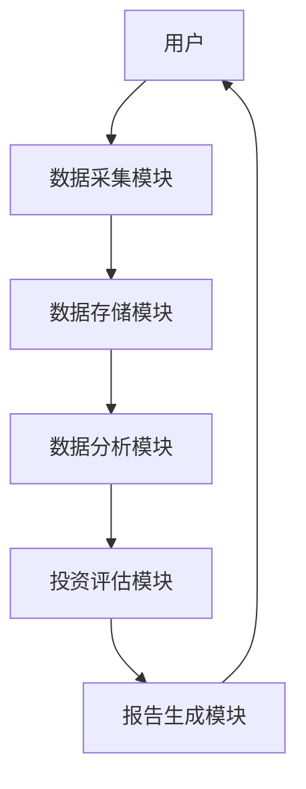

                 


# 彼得林奇的"质量成长"在循环经济企业中的应用

## 关键词：质量成长, 循环经济, 投资策略, 可持续发展, 企业评估

## 摘要：  
彼得·林奇的质量成长投资策略强调选择具有长期增长潜力、竞争优势和财务健康的企业。本文探讨如何将这一策略应用于循环经济企业，分析其核心概念、算法原理、系统架构及项目实战，展示质量成长在循环经济中的实际应用和价值。

---

# 第1章：质量成长与循环经济的概述

## 1.1 质量成长的定义与核心理念

质量成长是一种投资策略，关注那些具备长期增长潜力、竞争优势和财务健康的企业。其核心理念包括：

- **内在价值**：企业的真实价值远高于其市场价值。
- **长期增长**：选择能够在经济周期中持续增长的企业。
- **竞争优势**：企业具备难以复制的竞争优势。

质量成长与传统投资策略的区别：

| 特性 | 质量成长 | 传统投资 |
|------|----------|----------|
| 投资目标 | 长期增长企业 | 短期收益 |
| 关注点 | 内在价值、竞争优势 | 市场波动、技术分析 |

## 1.2 循环经济的定义与特点

循环经济以减少资源消耗和废物产生为目标，强调资源的高效利用和循环再利用。其特点包括：

- **资源效率**：最大化资源利用。
- **闭环模式**：从资源到产品再到再生资源的循环。
- **可持续性**：减少环境影响。

## 1.3 质量成长在循环经济中的应用背景

循环经济企业的发展现状：快速增长，但面临资源依赖和环境压力。质量成长在循环经济中的潜在价值：通过投资可持续、有竞争力的企业，实现长期收益。质量成长与循环经济结合的必要性：满足可持续发展需求，实现经济与环境的双赢。

---

# 第2章：质量成长的核心概念分析

## 2.1 质量成长的核心原理

质量成长的内在逻辑：通过分析企业的财务、管理、市场地位等因素，评估其长期增长潜力。质量成长与企业可持续发展的关系：质量成长关注企业的长期盈利能力，而可持续发展关注企业的环境和社会责任。

## 2.2 循环经济企业的特征分析

循环经济企业的核心特征：资源高效利用、循环模式、环境友好。竞争优势：资源成本低、市场认可度高、创新能力强。挑战与机遇：政策风险与市场机会并存。

## 2.3 质量成长与循环经济的联系

质量成长在循环经济中的体现：投资那些在资源利用和环保方面表现优秀的循环经济企业。质量成长与循环经济的协同发展：企业通过质量成长策略获得资金支持，投资者通过循环经济企业实现可持续收益。

---

# 第3章：质量成长的算法原理

## 3.1 质量成长的算法概述

质量成长的算法基于对企业财务、市场和管理的综合评估。步骤包括：数据收集、关键指标筛选、企业评分、投资决策。实现方式：通过数据分析和评分模型确定投资标的。

## 3.2 循环经济企业的质量成长算法实现

使用Python编写数据分析脚本，评估企业的财务健康和市场地位。代码示例：

```python
import pandas as pd

def assess_quality_growth(financial_data, market_position):
    # 财务健康评估
    roe = financial_data['roa']
    revenue_growth = financial_data['revenue_growth']
    # 市场地位评估
    market_share = market_position['market_share']
    competitive_advantage = market_position['competitive_advantage']
    # 综合评分
    score = (roe + revenue_growth + market_share + competitive_advantage) / 4
    return score

# 示例数据
financial_data = {'roa': 15, 'revenue_growth': 20}
market_position = {'market_share': 30, 'competitive_advantage': 25}
score = assess_quality_growth(financial_data, market_position)
print(f"企业质量成长评分为：{score}")
```

---

# 第4章：质量成长的系统分析与架构设计

## 4.1 系统功能设计

系统功能模块包括：数据采集、分析评估、投资决策支持、报告生成。交互流程：用户输入数据，系统分析并提供投资建议。

## 4.2 系统架构设计

采用微服务架构，确保系统的灵活性和可扩展性。系统架构图：



---

# 第5章：质量成长的项目实战

## 5.1 项目环境的安装与配置

安装Python、Pandas、NumPy等工具，配置数据源。环境需求：Python 3.8+，Jupyter Notebook，数据接口访问权限。

## 5.2 项目核心代码的实现

编写数据分析和评估代码，实现企业评分和投资建议。代码示例：

```python
import pandas as pd
import numpy as np

def calculate_financial_health(financial_data):
    # 计算财务健康指数
    current_ratio = financial_data['current_ratio']
    net_profit_margin = financial_data['net_profit_margin']
    revenue_growth = financial_data['revenue_growth']
    return (current_ratio + net_profit_margin + revenue_growth) / 3

# 示例数据
financial_data = {
    'current_ratio': 2.5,
    'net_profit_margin': 12,
    'revenue_growth': 15
}

health_score = calculate_financial_health(financial_data)
print(f"财务健康指数：{health_score}")
```

---

# 第6章：质量成长的最佳实践与小结

## 6.1 质量成长的最佳实践

- **长期视角**：关注企业的长期增长潜力。
- **数据驱动**：依靠数据分析和模型进行决策。
- **风险管理**：定期评估和调整投资组合。

## 6.2 小结

彼得林奇的质量成长策略在循环经济企业中具有重要应用价值。通过综合分析企业的财务、市场和竞争优势，投资者可以选择具备可持续发展能力的企业，实现长期收益。

## 6.3 注意事项

- 投资者需定期评估企业表现，及时调整投资策略。
- 需关注宏观经济和政策变化对循环经济的影响。

## 6.4 拓展阅读

- 彼得林奇的《投资之道》
- 循环经济相关书籍和研究报告

---

# 作者

作者：AI天才研究院/AI Genius Institute & 禅与计算机程序设计艺术 /Zen And The Art of Computer Programming

