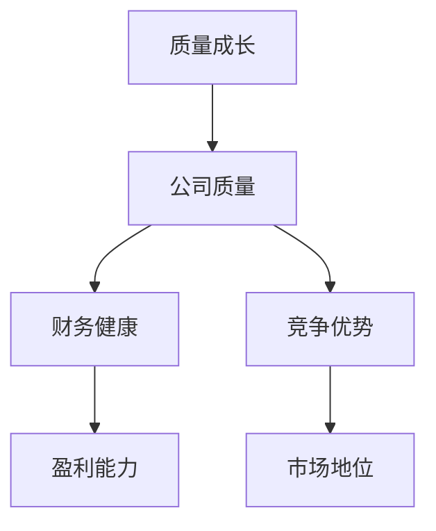
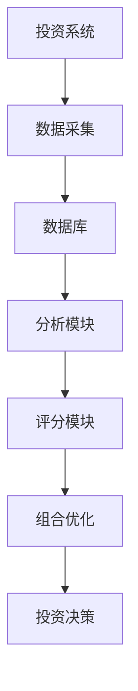

                 


# 彼得林奇的"质量成长"在新经济公司中的应用

## 关键词：
- 彼得林奇
- 质量成长
- 新经济公司
- 投资策略
- 财务分析

## 摘要：
本文探讨彼得林奇的“质量成长”投资策略在新经济公司中的应用，分析其在科技、互联网等行业的适应性，并结合实际案例，提供系统化的投资方法和策略。

---

# 第1章: 背景与基础

## 1.1 质量成长投资的定义与核心要素
质量成长投资关注那些具有强大财务健康、竞争优势和持续盈利能力的公司。其核心在于在合理估值下投资于优质企业，注重ROE、现金流和市场地位等指标。

## 1.2 彼得林奇的贡献与投资理念
彼得林奇作为传奇基金经理，强调长期投资于优质公司，避免短期波动干扰。其质量成长策略注重企业基本面，避免过度关注市场情绪。

## 1.3 新经济公司的特点与挑战
新经济公司以科技、互联网为主，具有高增长、高波动性，同时面临技术迭代快、竞争激烈等挑战，这些特点对质量成长策略的应用提出更高要求。

---

# 第2章: 质量成长投资的核心概念与联系

## 2.1 核心概念对比表
| 核心要素 | 传统成长投资 | 质量成长投资 |
|----------|--------------|--------------|
| 盈利能力 | 侧重未来增长 | 侧重当前盈利 |
| 财务健康 | 侧重杠杆率   | 侧重现金流   |
| 竞争优势 | 侧重市场地位 | 侧重创新壁垒 |

## 2.2 实体关系图


---

# 第3章: 算法原理与数学模型

## 3.1 质量成长投资的评估指标
- ROE：衡量企业盈利能力，公式：$$ROE = \frac{净利润}{平均股东权益}$$
- 市盈率：衡量估值，公式：$$P/E = \frac{股价}{每股收益}$$
- 现金流：评估企业财务健康，公式：$$FCF = \text{现金流}$$

## 3.2 投资组合评分算法
```python
def calculate_roe(financial_data):
    net_profit = financial_data['net_profit']
    average_equity = financial_data['average_equity']
    return net_profit / average_equity

def calculate_pe_ttm(stock_price, financial_data):
    eps_ttm = financial_data['eps_ttm']
    return stock_price / eps_ttm

def quality_growth_score(stock_data):
    roe = calculate_roe(stock_data)
    pe = calculate_pe_ttm(stock_data)
    cash_flow = stock_data['cash_flow']
    score = 0.4 * roe + 0.3 * (1 / pe) + 0.3 * cash_flow
    return score
```

---

# 第4章: 系统分析与架构设计

## 4.1 系统架构图


## 4.2 功能模块实现
- 数据采集：收集公司财务数据、市场数据等。
- 分析模块：计算ROE、市盈率等指标。
- 评分模块：根据算法计算质量成长评分。
- 组合优化：构建最优投资组合。

---

# 第5章: 项目实战

## 5.1 案例分析
选择科技公司作为案例，分析其ROE、现金流等指标，计算质量成长评分，构建投资组合，并评估风险。

## 5.2 代码实现
```python
import pandas as pd

def main():
    stock_data = pd.read_csv('stocks.csv')
    scores = []
    for stock in stock_data['symbol']:
        data = stock_data[stock_data['symbol'] == stock]
        roe = calculate_roe(data)
        pe = calculate_pe_ttm(data)
        cash_flow = data['cash_flow'].values[0]
        score = 0.4 * roe + 0.3 * (1 / pe) + 0.3 * cash_flow
        scores.append((stock, score))
    scores_df = pd.DataFrame(scores, columns=['symbol', 'score'])
    scores_df.to_csv('scores.csv', index=False)

if __name__ == "__main__":
    main()
```

---

# 第6章: 最佳实践与总结

## 6.1 经验总结
- 重视基本面分析
- 稳健构建投资组合
- 定期评估和调整

## 6.2 小结
本文系统阐述了彼得林奇的质量成长策略在新经济公司的应用，通过理论分析和实战案例，提供了可操作的指导。

---

作者：AI天才研究院/AI Genius Institute & 禅与计算机程序设计艺术 /Zen And The Art of Computer Programming

