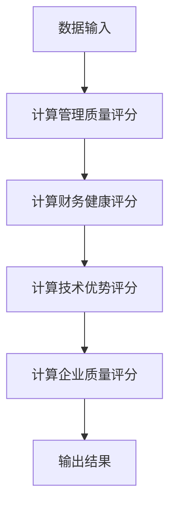
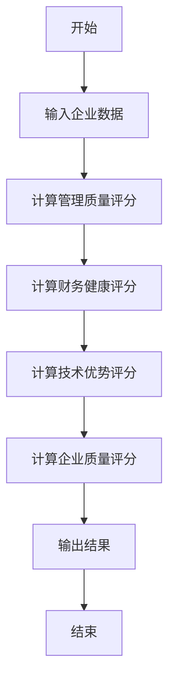
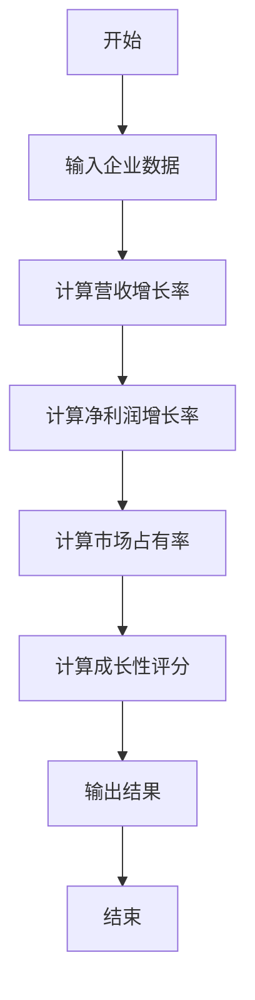
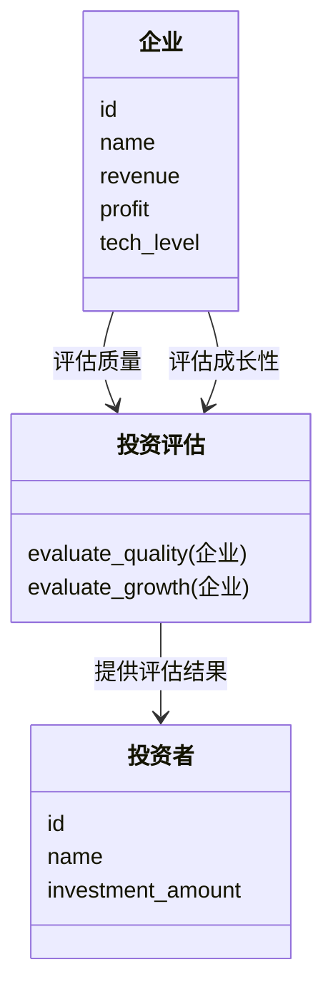
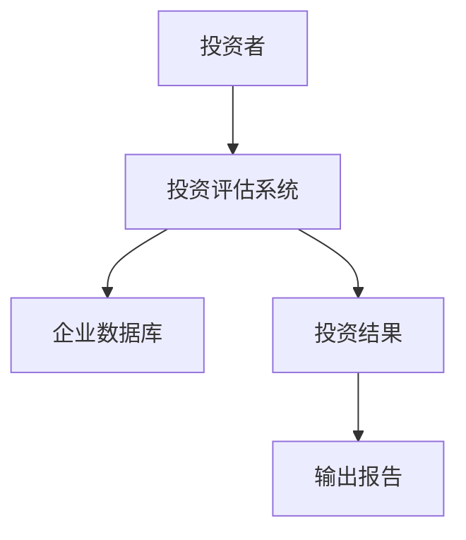

                 


# 彼得林奇的"质量成长"在环保科技企业中的应用

## 关键词：
- 彼得林奇
- 质量成长
- 环保科技企业
- 投资策略
- 算法原理

## 摘要：
本文详细探讨了彼得林奇的"质量成长"投资策略在环保科技企业中的应用。通过分析环保科技企业的现状、挑战以及质量成长策略的核心要素，本文提出了一个基于质量成长策略的投资模型，并结合实际案例进行了详细分析。文章还探讨了算法原理、系统架构设计以及项目实战，为投资者提供了系统的指导和实用建议。

---

## 第1章：环保科技企业的背景与挑战

### 1.1 环保科技企业的定义与现状
#### 1.1.1 环保科技企业的定义
环保科技企业是指专注于环境保护技术开发、应用和推广的企业，涵盖清洁能源、污染治理、资源循环利用等领域。

#### 1.1.2 当前环保科技企业的市场现状
环保科技企业正面临快速发展的机遇，但同时也面临技术壁垒高、市场竞争激烈、政策依赖性强等挑战。

#### 1.1.3 环保科技企业面临的挑战
- 技术创新压力大
- 市场竞争激烈
- 政策不确定性

### 1.2 质量成长投资策略概述
#### 1.2.1 投资策略的定义
质量成长策略是指选择具有高质量和持续成长潜力的企业进行投资。

#### 1.2.2 质量成长策略的核心要素
- 企业质量：管理质量、财务健康、技术优势
- 成长潜力：市场地位、盈利能力、创新能力强

#### 1.2.3 环保科技企业与质量成长策略的契合点
环保科技企业的技术创新性和可持续发展潜力与质量成长策略高度契合。

---

## 第2章：质量成长策略与环保科技企业的契合

### 2.1 质量成长策略的核心概念
#### 2.1.1 质量成长策略的定义
质量成长策略强调投资于具有高质量和持续成长能力的企业。

#### 2.1.2 质量成长策略的核心要素对比表

| 要素         | 高质量企业 | 成长潜力企业 |
|--------------|------------|-------------|
| 管理质量     | 高          | 高           |
| 财务健康     | 高          | 中           |
| 技术优势     | 高          | 高           |
| 市场地位     | 中高        | 高           |
| 创新能力     | 中高        | 高           |

#### 2.1.3 质量成长策略的ER实体关系图
```mermaid
erDiagram
    customer[客户] {
        id
        name
    }
    enterprise[企业] {
        id
        name
        revenue
        profit
        tech_level
    }
    investment[投资] {
        id
        enterprise_id
        customer_id
        amount
        date
    }
    customer --> investment : 进行投资
    enterprise --> investment : 被投资
```

### 2.2 环保科技企业的质量成长特征
#### 2.2.1 企业质量评估的维度
- 管理团队能力
- 财务健康状况
- 技术创新性

#### 2.2.2 企业成长性的评估指标
- 营收增长率
- 净利润增长率
- 市场占有率

#### 2.2.3 环保科技企业的质量成长特征分析
环保科技企业具有较高的成长潜力，但需要关注技术创新和政策风险。

---

## 第3章：质量成长策略的算法原理

### 3.1 质量成长策略的评估模型
#### 3.1.1 企业质量评估的数学模型
企业质量评分公式：
$$
Q = \frac{M + F + T}{3}
$$
其中，$M$为管理质量评分，$F$为财务健康评分，$T$为技术优势评分。

#### 3.1.2 企业成长性预测的算法流程


### 3.2 算法流程图
#### 3.2.1 企业质量评估流程图


#### 3.2.2 企业成长性预测流程图


---

## 第4章：系统分析与架构设计

### 4.1 系统需求分析
#### 4.1.1 问题场景介绍
系统需要帮助投资者评估环保科技企业的质量和成长潜力，辅助投资决策。

#### 4.1.2 项目介绍
开发一个基于质量成长策略的环保科技企业投资评估系统。

### 4.2 系统功能设计
#### 4.2.1 领域模型类图


#### 4.2.2 系统架构设计图


### 4.3 系统接口与交互设计
#### 4.3.1 系统接口设计
- 输入接口：企业数据输入
- 输出接口：评估结果输出

#### 4.3.2 系统交互序列图
```mermaid
graph TD
    A[投资者] --> B[投资评估系统]: 提交企业数据
    B --> C[企业数据库]: 查询企业信息
    C --> B[返回企业信息]
    B --> A[输出评估结果]
```

---

## 第5章：项目实战与案例分析

### 5.1 环保科技企业投资案例
#### 5.1.1 案例背景介绍
某环保科技企业专注于清洁能源技术开发，具有较高的技术创新能力和稳定的财务状况。

#### 5.1.2 数据收集与分析过程
- 收集企业过去5年的财务数据
- 评估企业的管理质量、财务健康和技术创新能力
- 预测企业的成长性

#### 5.1.3 投资结果与分析
根据质量成长策略，该企业具有较高的投资价值。

---

## 第6章：质量成长策略的最佳实践

### 6.1 投资策略的注意事项
#### 6.1.1 风险管理
- 分散投资
- 定期评估

#### 6.1.2 调整策略的时机
- 行业政策变化
- 企业基本面变化

### 6.2 投资策略的小结
质量成长策略在环保科技企业中的应用需要结合行业特点，注重技术创新和财务健康。

---

## 第7章：拓展阅读与深入探讨

### 7.1 相关领域研究进展
- 环保科技领域的最新动态
- 投资策略的理论创新

### 7.2 拓展阅读推荐
- 推荐书籍：《彼得·林奇的投资智慧》
- 网络资源：环保科技行业报告

### 7.3 未来研究方向
- 新技术的应用
- 策略的优化与创新

---

## 作者：AI天才研究院/AI Genius Institute & 禅与计算机程序设计艺术 /Zen And The Art of Computer Programming

---

通过以上章节的详细划分，本文系统地探讨了彼得·林奇的质量成长策略在环保科技企业中的应用，从理论到实践，为投资者提供了系统的知识和实用的指导。

