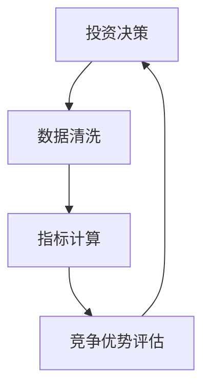
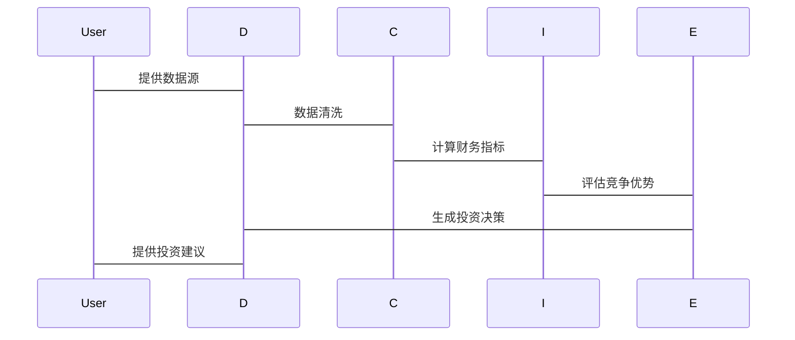

                 


# 彼得林奇的"质量成长"投资方法

## 关键词：
- 彼得林奇
- 质量成长
- 投资方法
- 财务指标
- 竞争优势

## 摘要：
本文深入分析了彼得林奇的“质量成长”投资方法，探讨其核心概念、投资策略及系统设计。通过详细阐述质量成长公司的特征、投资筛选标准及估值方法，结合实际案例，帮助读者理解并应用这一投资理念。

---

## 第一部分: 质量成长投资概述

### 第1章: 质量成长投资的核心概念

#### 1.1 投资的基本概念
- **投资定义**：将资金投入特定资产以获得收益的行为。
- **彼得林奇的投资理念**：选择质量成长公司，长期持有，追求稳健收益。
- **质量成长投资的背景**：20世纪80年代，彼得林奇通过这一方法在富达麦哲伦基金创造了卓越业绩。

#### 1.2 质量成长投资的核心要素
- **定义**：选择业绩持续增长、财务健康且具备竞争优势的公司。
- **与其他投资方法的区别**：不同于价值投资，注重内在价值而非价格波动。

---

## 第二部分: 质量成长公司的核心特征

### 第2章: 财务指标分析

#### 2.1 净利润与ROE
- **净利润**：公司盈利能力的关键指标，体现公司经营效率。
- **ROE（净资产收益率）**：衡量公司使用股东资产创造利润的能力，通常优质成长公司ROE高于行业平均水平。

#### 2.2 ROA与净利润率
- **ROA（资产净利率）**：衡量资产使用效率，高ROA表明公司资产利用高效。
- **净利润率**：反映公司盈利能力，优质成长公司通常保持稳定的高净利润率。

#### 2.3 财务指标对比
| 指标 | 含义 | 优质成长公司的特征 |
|------|------|---------------------|
| ROE | 净资产收益率 | 高于行业平均，持续增长 |
| ROA | 资产净利率 | 高效利用资产，稳定增长 |
| 净利润率 | 净利润与收入比值 | 高且稳定，抵御经济波动 |

### 第3章: 竞争优势分析

#### 3.1 护城河的定义
- **护城河**：公司竞争优势的来源，如专利、品牌、成本优势等，防止竞争对手侵蚀市场份额。

#### 3.2 不同行业的竞争优势对比
- **科技行业**：技术创新、研发能力是核心竞争优势。
- **消费行业**：品牌影响力和客户忠诚度是关键。

#### 3.3 质量成长公司的竞争优势特征
- 强大的市场地位：市场份额大，客户依赖度高。
- 持续创新能力：不断推出新产品或服务，保持增长动力。
- 财务健康：稳定的现金流和低债务水平，具备扩张能力。

---

## 第三部分: 投资方法论

### 第4章: 投资筛选标准

#### 4.1 PEG（市盈率相对盈利增长比率）
- **公式**：PEG = 市盈率 / 盈利增长率。
- **应用**：选择PEG小于1的公司，表明估值合理，成长性良好。

#### 4.2 市净率与ROE的结合
- **市净率**：市价与每股净资产的比率，低市净率表明资产估值合理。
- **ROE分析**：高ROE结合低市净率，表明公司资产使用效率高，估值合理。

### 第5章: 投资组合构建

#### 5.1 分散化原则
- **分散投资**：通过投资多个行业和公司的优质成长股，降低风险。

#### 5.2 长期持有策略
- **长期持有**：避免频繁交易，享受公司长期成长带来的收益。

#### 5.3 定期复盘与调整
- **季度复盘**：检查投资组合的表现，评估公司是否仍符合质量成长标准。
- **动态调整**：根据市场变化和公司发展情况，适时调整持仓。

---

## 第四部分: 系统分析与架构设计

### 第6章: 投资决策系统设计

#### 6.1 数据收集模块
- **数据源**：包括财务报表、行业报告、新闻资讯等。
- **数据清洗**：剔除无效或错误数据，确保数据准确性。

#### 6.2 财务指标分析模块
- **指标计算**：计算ROE、ROA、净利润率等关键指标。
- **对比分析**：将公司指标与行业平均值进行对比，识别优质公司。

#### 6.3 竞争优势评估模块
- **竞争优势识别**：通过行业地位、护城河等指标评估公司竞争优势。

### 第7章: 系统架构设计

#### 7.1 功能模块划分
- 数据收集模块、指标计算模块、竞争优势评估模块、投资决策模块。

#### 7.2 数据流图


#### 7.3 交互流程


---

## 第五部分: 项目实战

### 第8章: 环境配置与数据收集

#### 8.1 环境安装
- **Python安装**：安装Python 3.8及以上版本。
- **库安装**：使用pip安装pandas、numpy、scipy等库。

#### 8.2 数据收集
- **数据源选择**：从Yahoo Finance获取股票数据。
- **数据清洗**：处理缺失值和异常值。

### 第9章: 投资筛选系统实现

#### 9.1 核心算法实现
- **PEG计算**：编写函数计算PEG。
- **竞争优势评估**：编写函数评估公司的竞争优势。

#### 9.2 代码实现
```python
import pandas as pd
import numpy as np

def calculate_peg(ticker):
    # 获取数据
    df = get_data(ticker)
    pe = df['PE'].mean()
    peg = pe / df['Revenue Growth'].mean()
    return peg

def assess_competitive_advantage(ticker):
    peg = calculate_peg(ticker)
    if peg < 1:
        return 'Strong Competitive Advantage'
    else:
        return 'No Competitive Advantage'

# 示例使用
print(assess_competitive_advantage('AAPL'))
```

#### 9.3 结果分析
- **代码解释**：计算PEG并评估竞争优势，PEG小于1表明公司估值合理，成长性良好。
- **结果解读**：AAPL（苹果公司）的评估结果为“Strong Competitive Advantage”，表明其具备强大的竞争优势。

---

## 第六部分: 最佳实践

### 第10章: 小结

- **总结**：彼得林奇的质量成长投资方法强调选择具备强大竞争优势和财务健康的公司，通过长期持有实现稳健收益。
- **应用**：投资者应结合系统分析和实际数据，制定适合自己的投资策略。

### 第11章: 注意事项

- **风险提示**：市场波动和公司基本面变化可能影响投资结果。
- **持续学习**：投资需要不断学习和适应市场变化，定期复盘和调整投资组合。

### 第12章: 拓展阅读

- **推荐阅读书籍**：
  - 《彼得林奇的选股术》
  - 《投资最重要的简单常识》
- **在线资源**：学习投资分析工具和技术，如Python数据分析库pandas、numpy等。

---

## 作者：AI天才研究院/AI Genius Institute & 禅与计算机程序设计艺术 /Zen And The Art of Computer Programming

---

通过本文的详细分析，读者可以全面了解彼得林奇的质量成长投资方法，并通过系统设计和实战案例，掌握如何在实际投资中应用这一方法。

