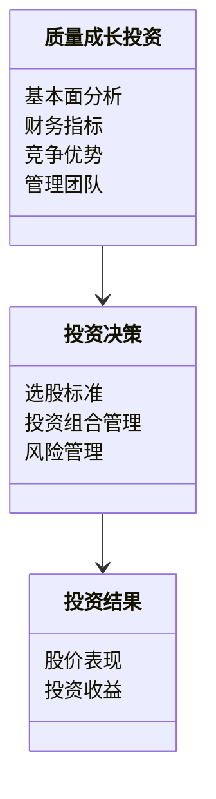
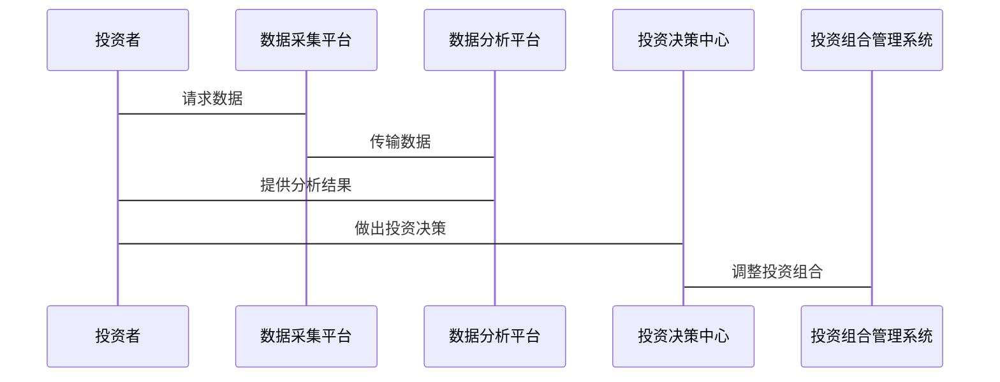

                 


# 彼得林奇的"质量成长"投资方法论

## 关键词：彼得林奇，质量成长，投资方法论，价值投资，基本面分析，长期增长，风险管理

## 摘要：  
彼得·林奇是全球著名的价值投资者，他的“质量成长”投资方法论强调通过深入的基本面分析，选择具有长期增长潜力的优秀企业进行投资。本文系统地解析了质量成长投资的核心概念、投资策略、选股标准以及风险管理方法，结合实际案例，深入分析了彼得·林奇的投资哲学和成功经验，为读者提供了清晰的理论指导和实践参考。

---

## 第1章 质量成长投资的背景与核心概念

### 1.1 投资学的基本概念

#### 1.1.1 投资的定义与分类
- 投资是指将资金投入到金融资产或实体资产中，以期望在未来获得收益的行为。
- 分类：股票投资、债券投资、房地产投资、商品投资等。

#### 1.1.2 股票投资的核心要素
- 股票价值：内在价值与市场价值。
- 投资回报：股息收益与资本增值。

#### 1.1.3 质量成长投资的起源与发展
- 质量成长投资起源于20世纪，强调通过选择具有高质量和成长潜力的公司进行长期投资。

### 1.2 彼得·林奇与质量成长投资

#### 1.2.1 彼得·林奇的生平简介
- 彼得·林奇是美国著名基金经理，以管理富达麦哲伦基金而闻名。
- 他的投资理念强调长期持有和深入的基本面分析。

#### 1.2.2 质量成长投资的核心理念
- 选择具有强大竞争优势、持续增长潜力和良好财务状况的公司。
- 避免短期市场波动，关注企业的长期价值。

#### 1.2.3 质量成长投资与价值投资的区别
- 价值投资：寻找被市场低估的股票。
- 质量成长投资：寻找具有高质量和成长潜力的股票。

### 1.3 质量成长投资的理论基础

#### 1.3.1 基本面分析的原理
- 基本面分析：通过对公司的财务状况、行业地位和管理层能力的分析，评估其投资价值。
- 关键指标：净利润率、ROE（净资产收益率）、营业收入增长率等。

#### 1.3.2 股东价值创造的机制
- 公司通过持续盈利和股东权益的增加，为投资者创造价值。
- 股东价值 = 股东权益 + 留存收益。

#### 1.3.3 经济周期与投资策略的关系
- 在不同经济周期下，投资策略应有所调整。
- 在经济增长期，成长型股票表现较好；在经济衰退期，价值型股票更具防御性。

---

## 第2章 质量成长投资的核心要素

### 2.1 质量成长投资的关键指标

#### 2.1.1 营业收入与净利润的关系
- 营业收入是公司业务规模的体现，净利润是公司盈利能力的直接反映。
- 净利润 = 营业收入 - 成本 - 费用。

#### 2.1.2 每股收益（EPS）的计算与分析
- EPS = 净利润 / 总股本。
- 高EPS不一定代表好公司，需结合市盈率和公司增长潜力分析。

#### 2.1.3 资产负债率与财务健康度
- 资产负债率 = 负债总额 / 资产总额。
- 低负债率通常意味着公司财务更健康，风险更低。

#### 2.1.4 现金流分析的重要性
- 现金流是公司运营和发展的血液。
- 自由现金流 = 经营活动现金流 - 资本支出。

### 2.2 质量成长公司的特征

#### 2.2.1 行业地位与竞争优势
- 公司在行业中的地位：是否是市场领导者或具有独特竞争优势。
- 竞争优势：成本优势、品牌优势、技术优势等。

#### 2.2.2 管理团队的稳定性与能力
- 管理层的稳定性：是否频繁更换或存在问题。
- 管理能力：是否具备战略眼光和执行力。

#### 2.2.3 财务健康与持续盈利能力
- 财务健康：收入稳定，利润持续增长，现金流充足。
- 持续盈利能力：公司是否能在不同经济环境下保持盈利。

#### 2.2.4 创新能力与市场拓展能力
- 创新能力：公司是否能不断推出新产品或服务。
- 市场拓展能力：是否能在现有市场中扩大份额，或开拓新市场。

### 2.3 质量成长投资的筛选标准

#### 2.3.1 市盈率与市净率的合理区间
- 市盈率（P/E）= 股价 / 每股净利润。
- 市净率（P/B）= 股价 / 每股净资产。
- 合理区间：根据行业和公司情况判断，过高或过低都可能存在问题。

#### 2.3.2 股息率与分红政策的稳定性
- 股息率 = 每股股息 / 股价。
- 稳定的分红政策：公司是否有持续派发股息的历史。

#### 2.3.3 股票流动性与市场规模
- 股票流动性：交易量大，买卖价差小。
- 市场规模：公司是否属于大盘股或小盘股。

#### 2.3.4 行业前景与宏观经济环境
- 行业前景：行业是否处于增长期或成熟期。
- 宏观经济环境：宏观经济政策对行业的影响。

---

## 第3章 彼得·林奇的投资哲学

### 3.1 林奇的投资理念

#### 3.1.1 长期投资与价值发现
- 林奇强调长期投资，避免短期市场波动的干扰。
- 价值发现：通过基本面分析，找到被市场低估的优质公司。

#### 3.1.2 避免短期波动，关注长期增长
- 短期波动：市场情绪和外部事件可能导致股价波动。
- 长期增长：公司基本面的持续改善是股价上涨的驱动因素。

#### 3.1.3 分散投资与风险控制
- 分散投资：通过投资多个行业和公司的股票，降低风险。
- 风险控制：定期评估投资组合，及时调整。

### 3.2 林奇的选股标准

#### 3.2.1 寻找具有持续增长潜力的公司
- 公司收入和利润持续增长。
- 行业地位稳固，竞争优势明显。

#### 3.2.2 重视公司的竞争优势与护城河
- 技术壁垒：公司拥有独特的技术或专利。
- 市场垄断：公司在某个市场领域具有垄断地位。

#### 3.2.3 分析公司的财务健康状况
- 财务报表分析：利润表、资产负债表、现金流量表。
- 关注现金流，尤其是经营活动现金流。

#### 3.2.4 关注管理层的诚信与能力
- 管理层诚信：公司管理层是否诚信，有无财务造假等问题。
- 管理能力：管理层是否具备战略眼光和执行力。

### 3.3 林奇的投资组合管理

#### 3.3.1 投资组合的构建
- 分散投资：投资于不同行业、不同规模的公司。
- 选择具有长期增长潜力的公司。

#### 3.3.2 定期评估与调整
- 定期检查投资组合，评估公司的基本面变化。
- 根据市场环境和公司情况，调整投资组合。

#### 3.3.3 风险管理
- 设置止损点：当股价下跌超过一定幅度时，及时止损。
- 风险分散：通过投资不同行业的公司，降低特定行业风险。

---

## 第4章 质量成长投资的系统分析与架构

### 4.1 问题场景介绍
- 投资者希望找到一种可靠的投资方法，实现资产的长期增值。
- 质量成长投资方法提供了一套基于基本面分析的投资策略。

### 4.2 系统功能设计

#### 4.2.1 领域模型（Mermaid 类图）


### 4.3 系统架构设计

#### 4.3.1 系统架构（Mermaid 架构图）
```mermaid
archi
    一个中心：投资决策中心
    两个平台：数据采集平台、数据分析平台
    三个系统：基本面分析系统、投资组合管理系统、风险管理系统
```

### 4.4 系统接口设计

#### 4.4.1 数据接口
- 数据源：财务报表、行业报告、市场数据。
- 数据接口：API接口，用于获取实时数据。

#### 4.4.2 用户界面
- 界面设计：简洁直观，方便投资者使用。
- 功能模块：选股工具、投资组合管理、风险评估。

### 4.5 系统交互（Mermaid 序列图）

#### 4.5.1 投资决策流程


---

## 第5章 项目实战：质量成长投资的实践应用

### 5.1 环境安装

#### 5.1.1 数据源获取
- 使用Yahoo Finance获取股票数据。
- 使用Python的pandas库进行数据处理。

#### 5.1.2 工具安装
- 安装Python、Jupyter Notebook、pandas、yfinance等库。

### 5.2 核心实现

#### 5.2.1 数据分析与可视化
- 使用Python代码获取并可视化股票数据。
- 代码示例：
  ```python
  import pandas as pd
  import yfinance as yf

  # 获取可口可乐的股票数据
  coca_cola = yf.download('KO', start='2020-01-01', end='2023-12-31')

  # 可视化股价走势
  coca_cola['Adj Close'].plot()
  plt.title('可口可乐股价走势')
  plt.show()
  ```

#### 5.2.2 投资组合管理
- 使用Python代码模拟投资组合。
- 代码示例：
  ```python
  import pandas as pd
  import numpy as np

  # 模拟投资组合
  stocks = ['KO', 'MSFT', 'AAPL']
  portfolio = pd.DataFrame()
  for stock in stocks:
      data = yf.download(stock, start='2020-01-01', end='2023-12-31')
      portfolio = pd.concat([portfolio, data['Adj Close']], axis=1)

  # 计算投资组合收益
  returns = portfolio.pct_change().dropna()
  portfolio_return = returns.mean().sort_values(ascending=False)
  print("投资组合收益：", portfolio_return)
  ```

### 5.3 案例分析

#### 5.3.1 案例一：可口可乐
- 可口可乐的财务状况：稳定的收入和利润，良好的现金流。
- 竞争优势：全球品牌影响力和分销网络。

#### 5.3.2 案例二：微软
- 微软的财务状况：持续增长的收入和利润，现金流充足。
- 竞争优势：技术领先，云服务市场占有率高。

### 5.4 小结
- 质量成长投资的核心是选择具有长期增长潜力的公司。
- 通过基本面分析和财务指标评估，可以筛选出优质的投资标的。

---

## 第6章 总结与展望

### 6.1 总结
- 质量成长投资是一种基于基本面分析的投资方法，强调选择具有长期增长潜力的公司。
- 彼得·林奇的投资哲学为投资者提供了重要的指导，即长期投资、深入分析和分散风险。

### 6.2 展望
- 随着市场环境的变化，质量成长投资需要不断调整和优化。
- 投资者应结合宏观经济环境和行业趋势，灵活运用质量成长投资策略。

---

## 作者：AI天才研究院/AI Genius Institute & 禅与计算机程序设计艺术 /Zen And The Art of Computer Programming

