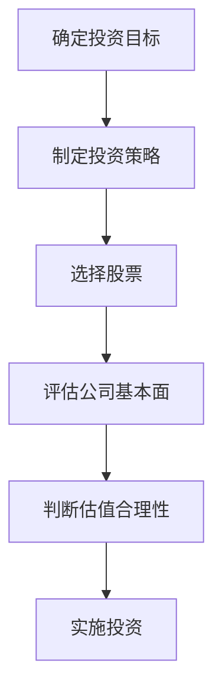

                 


```markdown
# 彼得林奇的"质量成长"股票特征

> 关键词：质量成长股，彼得·林奇，投资策略，选股标准，估值方法

> 摘要：本文深入探讨了彼得·林奇的质量成长股投资策略，分析了其核心概念、选股标准、估值方法及投资案例，提供了系统的投资流程和注意事项。

## 第1章：质量成长股的背景介绍

### 1.1 质量成长股的核心概念
#### 1.1.1 什么是质量成长股
质量成长股是指那些基本面良好、具有持续增长潜力的公司股票。这类股票不仅当前盈利稳定，且未来有较高的增长预期。

#### 1.1.2 质量成长股的定义与特征
- **定义**：质量成长股是那些盈利稳定、增长前景良好、行业地位稳固的公司股票。
- **特征**：盈利能力强、成长性高、财务健康、管理层优秀、竞争优势明显。

#### 1.1.3 质量成长股的边界与外延
- **边界**：仅限于基本面良好、有持续增长潜力的公司。
- **外延**：涵盖多个行业的优质成长股，但排除周期性股票和投机性股票。

### 1.2 质量成长股的投资背景
#### 1.2.1 现代投资组合理论的发展
现代投资组合理论强调分散投资和风险控制，为质量成长股投资提供了理论基础。

#### 1.2.2 质量成长股在投资组合中的地位
质量成长股通常作为核心持仓，为投资组合提供长期增长动力。

#### 1.2.3 质量成长股的市场表现与风险特征
质量成长股通常具有较高的波动性和收益潜力，但其风险相对可控，尤其在长期投资中表现突出。

## 第2章：彼得·林奇的投资理念

### 2.1 彼得·林奇的投资哲学
#### 2.1.1 长期投资与价值发现
林奇强调长期持有优质股票，避免频繁交易，以时间换空间。

#### 2.1.2 质量成长股的核心理念
投资于那些能够持续增长、市场份额稳定的公司，而非短期概念炒作的股票。

#### 2.1.3 投资者的心理与行为
林奇认为投资者应避免贪婪和恐惧，保持理性，耐心持有优质股票。

### 2.2 彼得·林奇的选股标准
#### 2.2.1 公司基本面分析
- 盈利能力：ROE、净利率等指标
- 财务健康：低负债率、健康的现金流
- 市场地位：行业龙头或竞争优势明显

#### 2.2.2 管理层能力评估
- 经验与背景
- 战略规划
- 诚信与责任感

#### 2.2.3 行业地位与竞争优势
- 行业前景
- 市场份额
- 核心竞争力

## 第3章：质量成长股的特征分析

### 3.1 质量成长股的核心要素
#### 3.1.1 盈利能力分析
- 净利润增长率
- 净资产收益率（ROE）
- 毛利率

#### 3.1.2 成长性评估
- 收入增长率
- 净利润增长率
- 新产品开发能力

#### 3.1.3 财务健康状况
- 低负债率
- 健康的现金流
- 足够的流动资金

### 3.2 质量成长股与其他股票的对比
#### 3.2.1 与价值股的对比
- 价值股：低估值，可能暂时被市场低估
- 质量成长股：高估值，但具备持续增长潜力

#### 3.2.2 与成长股的对比
- 成长股：高增长，但可能风险较高
- 质量成长股：平衡了成长性和稳定性

#### 3.2.3 与周期性股票的对比
- 周期性股票：受经济周期影响大
- 质量成长股：受经济周期影响较小，具备防御性

## 第4章：质量成长股的估值方法

### 4.1 常用估值指标
#### 4.1.1 市盈率（P/E）
$$P/E = \frac{市价}{每股净利润}$$

#### 4.1.2 市净率（P/B）
$$P/B = \frac{市价}{每股净资产}$$

#### 4.1.3 股息率
$$股息率 = \frac{每股股息}{市价}$$

### 4.2 估值模型与应用
#### 4.2.1 现金流折现模型（DCF）
$$DCF = \sum_{t=1}^{n} \frac{CF_t}{(1 + r)^t} + \frac{残值}{(1 + r)^n}$$
其中，CF_t为第t年的现金流，r为折现率。

#### 4.2.2 市盈率相对盈利增长比率（PEG）
$$PEG = \frac{P/E}{净利润增长率}$$

#### 4.2.3 相对估值法
与行业平均水平或竞争对手进行对比。

## 第5章：彼得·林奇的投资策略

### 5.1 质量成长股的投资策略
#### 5.1.1 长期持有策略
避免频繁交易，耐心持有优质股票，享受复利效应。

#### 5.1.2 分散投资策略
将资金分散投资于多个质量成长股，降低风险。

#### 5.1.3 买入并持有策略
选择优质股票后，长期持有，除非基本面发生重大变化。

### 5.2 投资组合管理
#### 5.2.1 资产配置与风险控制
根据市场环境调整股票与债券的比例，控制整体风险。

#### 5.2.2 定期复盘与调整
每季度或半年复盘一次，评估持仓表现，进行必要的调整。

#### 5.2.3 个股筛选与权重分配
根据选股标准筛选个股，根据成长性和估值情况分配持仓比例。

## 第6章：质量成长股的投资案例分析

### 6.1 经典投资案例
#### 6.1.1 微软公司
- 公司基本面：软件行业龙头，稳定的现金流，强大的研发能力。
- 投资理由：持续的增长潜力，高ROE，优秀的管理层。

#### 6.1.2 可口可乐公司
- 公司基本面：饮料行业巨头，全球品牌影响力，稳定的现金流。
- 投资理由：防御性强，高股息率，长期增长潜力。

#### 6.1.3 英特尔公司
- 公司基本面：半导体行业龙头，技术创新能力强。
- 投资理由：行业地位稳固，高ROE，持续的研发投入。

### 6.2 案例分析方法
#### 6.2.1 财务数据解读
分析收入、利润、现金流等财务指标，评估公司财务健康状况。

#### 6.2.2 竞争优势分析
考察公司的核心竞争力，如技术优势、品牌优势、成本优势等。

#### 6.2.3 行业趋势判断
分析行业发展趋势，判断公司未来的增长潜力。

## 第7章：质量成长股投资的系统化流程

### 7.1 投资流程概述
- 确定投资目标
- 制定投资策略
- 实施投资计划

### 7.2 投资流程的详细步骤
#### 7.2.1 确定选股标准
- 市场地位
- 盈利能力
- 管理层能力

#### 7.2.2 评估公司基本面
- 财务状况
- 行业地位
- 竞争优势

#### 7.2.3 判断估值合理性
- 使用多种估值方法评估，确保价格合理。

### 7.3 系统化流程图


## 第8章：质量成长股投资的注意事项

### 8.1 投资中的常见误区
#### 8.1.1 过度关注短期波动
质量成长股投资应注重长期，避免被短期市场波动干扰。

#### 8.1.2 忽视财务风险
即使成长性好的公司，也需关注其财务健康状况，避免高负债率或现金流不佳的公司。

#### 8.1.3 过度集中投资
应分散投资，降低风险。

### 8.2 投资中的风险管理
#### 8.2.1 定期复盘与调整
根据市场变化和个人财务状况，及时调整投资组合。

#### 8.2.2 设置止损点
为防止重大损失，可设置止损点，避免亏损过大。

#### 8.2.3 保持关注
定期关注持仓公司财报和行业动态，及时发现潜在风险。

## 第9章：最佳实践与小结

### 9.1 最佳实践 tips
- 长期持有优质股票，避免频繁交易。
- 分散投资，降低风险。
- 定期复盘，及时调整。

### 9.2 投资小结
质量成长股投资是一种长期策略，需要耐心和纪律。通过精选个股、合理估值和分散投资，可以实现稳健的长期收益。

## 附录

### 附录1：术语表
- 质量成长股：具备持续增长潜力和良好基本面的公司股票。
- 市盈率（P/E）：市价与每股净利润的比率。
- 现金流折现模型（DCF）：通过现金流折现计算公司价值的方法。

### 附录2：参考文献
- 彼得·林奇：《彼得·林奇的投资哲学》
- 巴菲特：《巴菲特的选股智慧》
- 罗斯·格雷厄姆：《证券分析》

作者：AI天才研究院/AI Genius Institute & 禅与计算机程序设计艺术 /Zen And The Art of Computer Programming
```

