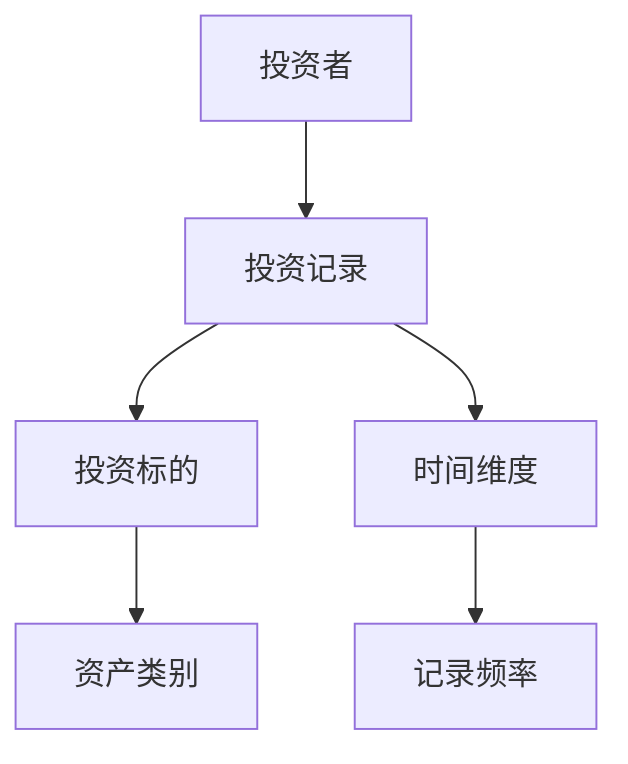
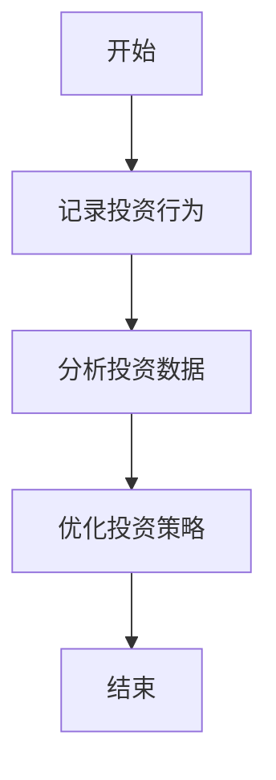
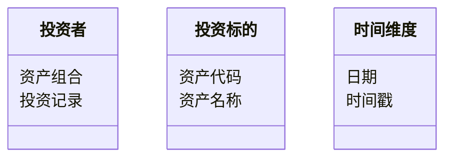
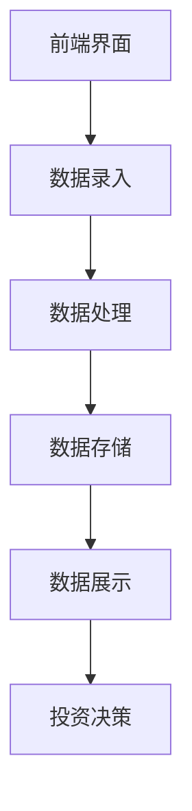
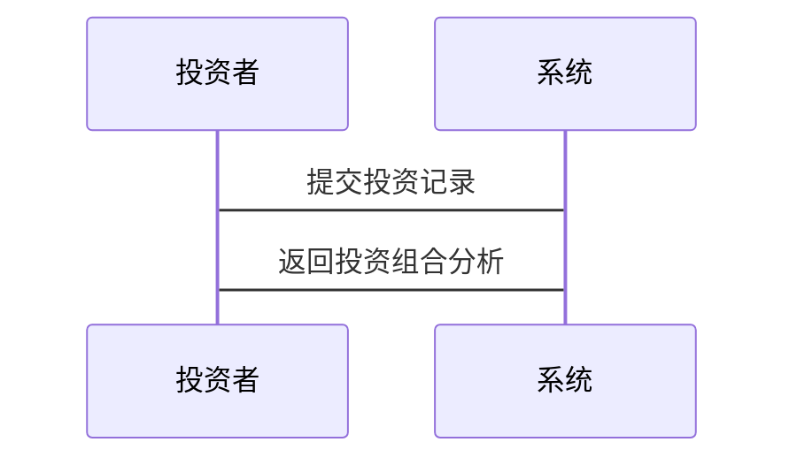

                 


---

# 彼得林奇的"跟踪记录"投资法

## 关键词
- 彼得林奇
- 跟踪记录
- 投资法
- 系统分析
- 项目实战

## 摘要
《彼得林奇的"跟踪记录"投资法》系统介绍了彼得·林奇的“跟踪记录”投资方法，从理论到实践，详细阐述了该方法的核心概念、算法原理、系统架构以及实际应用案例。通过丰富的图表和代码示例，帮助读者深入理解这一投资策略，并通过项目实战掌握其具体实施步骤。

---

## 第一部分: 背景介绍

### 第1章: 投资法的起源与核心概念

#### 1.1 投资法的起源
- 1.1.1 彼得林奇与他的投资理念
- 1.1.2 "跟踪记录"投资法的定义
- 1.1.3 投资法的背景与现状

#### 1.2 核心概念
- 1.2.1 问题背景与问题描述
- 1.2.2 问题解决的思路与方法
- 1.2.3 核心概念的边界与外延
- 1.2.4 核心要素组成与概念结构

### 第2章: "跟踪记录"投资法的核心概念与联系

#### 2.1 核心概念原理
- 2.1.1 跟踪记录法的数学模型
- 2.1.2 投资决策的逻辑框架
- 2.1.3 投资组合的优化策略

#### 2.2 核心概念属性特征对比
- 2.2.1 不同投资方法的对比分析
- 2.2.2 跟踪记录法与其他方法的异同
- 2.2.3 核心概念的特征总结

#### 2.3 ER实体关系图架构


---

## 第二部分: 算法原理讲解

### 第3章: 算法原理

#### 3.1 算法原理
- 3.1.1 跟踪记录法的算法流程


#### 3.2 算法实现
- 3.2.1 算法的数学模型
$$
\text{收益} = \sum_{i=1}^{n} (r_i \times w_i)
$$
其中，$r_i$ 表示第 $i$ 项资产的收益率，$w_i$ 表示第 $i$ 项资产的权重。

- 3.2.2 算法的Python实现
```python
def track_and_record(assets, weights):
    returns = [asset.return() for asset in assets]
    portfolio_return = sum(r * w for r, w in zip(returns, weights))
    return portfolio_return
```

---

## 第三部分: 系统分析与架构设计方案

### 第4章: 系统分析与架构设计

#### 4.1 问题场景介绍
- 4.1.1 项目背景
- 4.1.2 项目目标
- 4.1.3 项目范围
- 4.1.4 项目约束

#### 4.2 系统功能设计
- 4.2.1 领域模型


#### 4.3 系统架构设计


#### 4.4 系统接口设计
- 4.4.1 API接口定义
- 4.4.2 接口交互流程

#### 4.5 系统交互流程


---

## 第四部分: 项目实战

### 第5章: 项目实战

#### 5.1 环境安装
- 5.1.1 安装Python
- 5.1.2 安装相关库（如pandas、numpy）

#### 5.2 系统核心实现
```python
import pandas as pd
import numpy as np

def track_and_record(assets, weights):
    returns = [asset.return() for asset in assets]
    portfolio_return = sum(r * w for r, w in zip(returns, weights))
    return portfolio_return

# 示例数据
assets = [资产1, 资产2, 资产3]
weights = [0.3, 0.4, 0.3]
print(track_and_record(assets, weights))
```

#### 5.3 代码应用解读与分析
- 5.3.1 代码功能分析
- 5.3.2 代码运行结果解读
- 5.3.3 代码优化建议

#### 5.4 实际案例分析
- 5.4.1 案例背景
- 5.4.2 案例分析
- 5.4.3 案例结论

#### 5.5 项目小结
- 5.5.1 项目总结
- 5.5.2 经验与教训
- 5.5.3 改进方向

---

## 第五部分: 最佳实践

### 第6章: 最佳实践

#### 6.1 小结
- 6.1.1 核心内容回顾
- 6.1.2 知识点总结

#### 6.2 注意事项
- 6.2.1 实践中的注意事项
- 6.2.2 常见问题解答
- 6.2.3 风险提示

#### 6.3 拓展阅读
- 6.3.1 相关书籍推荐
- 6.3.2 相关文章链接
- 6.3.3 其他学习资源

---

## 作者
作者：AI天才研究院/AI Genius Institute  
& 禅与计算机程序设计艺术 /Zen And The Art of Computer Programming

