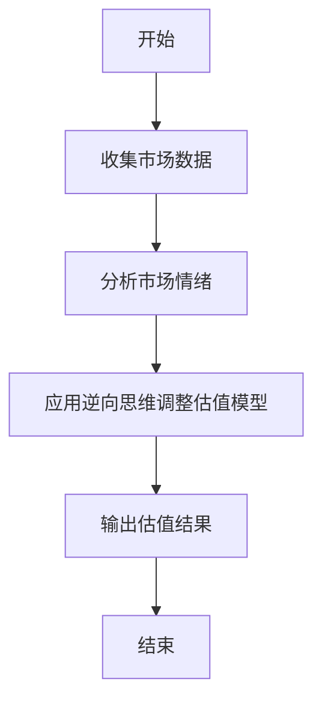
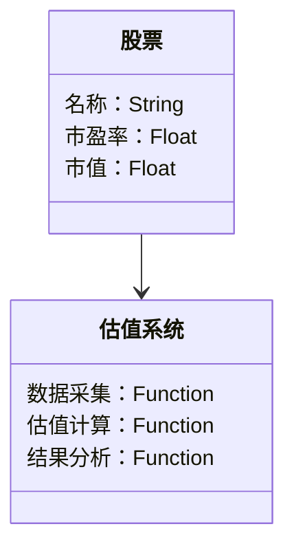
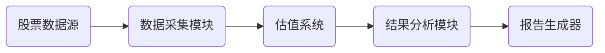

                 


# 彼得林奇的"逆向思维"在估值方法选择中的应用

> 关键词：逆向思维，估值方法，彼得林奇，投资策略，价值投资

> 摘要：本文探讨了彼得林奇的逆向思维在估值方法选择中的应用，分析了逆向思维的核心概念、算法原理、系统架构及其实战案例。通过对比传统估值方法，结合数学模型和系统设计，展示了逆向思维在提升估值准确性和投资决策中的独特优势。

---

## 第一部分: 逆向思维与估值方法的背景介绍

### 第1章: 逆向思维的定义与核心要素

#### 1.1 逆向思维的定义与核心要素

逆向思维是一种与传统正向思维相反的思维方式，它通过反向思考问题的本质，寻找解决问题的独特路径。在投资领域，逆向思维尤其重要，因为它可以帮助投资者在市场波动中发现被低估的机会。

- **逆向思维的定义**：逆向思维是指从问题的反面或对立面出发，寻找解决问题的方法或思路。
- **逆向思维的核心要素**：
  1. **反向思考**：从结果出发，推导原因。
  2. **反向验证**：通过验证反向假设的正确性，发现潜在机会。
  3. **反向决策**：在传统思路的对立面做出决策。

#### 1.2 彼得林奇的投资理念

彼得林奇是美国著名的投资经理，以其独特的投资风格和逆向思维闻名。他的投资理念强调长期价值，而非短期市场波动。

- **彼得林奇的生平与投资风格**：
  - 他在富达投资管理公司管理麦哲伦基金期间，创造了卓越的投资业绩。
  - 他注重基本面分析，寻找被市场低估的股票。
- **彼得林奇的估值方法**：
  - 他强调通过逆向思维寻找被市场忽视的公司。
  - 他关注企业的内在价值，而非市场情绪。

#### 1.3 逆向思维在估值中的重要性

- **传统估值方法的局限性**：
  - 市场情绪可能影响估值的准确性。
  - 高波动性可能导致估值偏差。
- **逆向思维的独特优势**：
  - 帮助发现被市场低估的投资机会。
  - 在市场恐慌时，逆向思维可以带来超额收益。

---

## 第2章: 逆向思维与估值方法的核心概念与联系

### 2.1 核心概念原理

#### 2.1.1 逆向思维的基本原理

逆向思维的基本原理是通过反向思考问题，寻找解决问题的独特路径。在估值方法中，逆向思维可以帮助投资者发现市场忽视的机会。

- **逆向思维的基本步骤**：
  1. 确定目标：明确估值目标。
  2. 反向思考：从目标的反面寻找线索。
  3. 验证假设：通过数据验证反向假设的正确性。

#### 2.1.2 估值方法的基本原理

估值方法通过对企业未来现金流的折现，评估其内在价值。常见的估值方法包括市盈率法、现金流折现法等。

- **传统估值方法的步骤**：
  1. 收集企业财务数据。
  2. 应用估值模型计算内在价值。
  3. 比较市场价与内在价值，判断是否低估或高估。

#### 2.1.3 逆向思维与估值方法的结合原理

逆向思维与估值方法的结合，主要体现在以下几个方面：

- **从结果出发**：通过分析市场反应，推导企业的潜在价值。
- **反向验证**：通过验证反向假设，调整估值模型。
- **反向决策**：在市场低估时买入，高估时卖出。

---

## 第3章: 逆向思维驱动的估值算法原理

### 3.1 算法原理讲解

#### 3.1.1 逆向思维驱动的估值算法步骤

逆向思维驱动的估值算法通过反向思考市场行为，调整估值模型。

- **算法步骤**：
  1. 收集市场数据。
  2. 分析市场情绪。
  3. 应用逆向思维调整估值模型。
  4. 输出估值结果。

#### 3.1.2 算法流程图

以下是一个简单的逆向思维驱动的估值算法流程图：



#### 3.1.3 算法实现的Python代码示例

以下是一个简单的Python代码示例，展示了如何应用逆向思维进行估值：

```python
import pandas as pd

def reverse_valuation(data):
    # 假设data是包含股票价格和市盈率的数据框
    # 应用逆向思维，寻找被低估的股票
    data['reverse_pe'] = 1 / data['pe']
    # 根据reverse_pe排序，选择前10%的股票
    undervalued_stocks = data.sort_values('reverse_pe', ascending=False).head(int(len(data)*0.1))
    return undervalued_stocks

# 示例数据
data = {
    'stock': ['A', 'B', 'C', 'D', 'E'],
    'pe': [15, 20, 10, 30, 8]
}
df = pd.DataFrame(data)
result = reverse_valuation(df)
print(result)
```

### 3.2 数学模型与公式

#### 3.2.1 逆向思维驱动的估值数学模型

逆向思维驱动的估值模型通过反向思考市场行为，调整传统估值模型。

- **反向市盈率公式**：
  $$ \text{反向市盈率} = \frac{1}{\text{市盈率}} $$
- **反向市值公式**：
  $$ \text{反向市值} = \frac{1}{\text{市值}} $$

---

## 第4章: 逆向思维驱动的估值系统分析与架构设计

### 4.1 问题场景介绍

#### 4.1.1 逆向思维在估值中的应用场景

- **市场恐慌时**：逆向思维可以帮助投资者发现被低估的机会。
- **市场高估时**：逆向思维可以帮助投资者避免损失。

#### 4.1.2 系统功能需求

- **数据采集**：收集市场数据。
- **估值计算**：应用逆向思维进行估值。
- **结果分析**：分析估值结果，生成报告。

#### 4.1.3 系统目标与边界

- **系统目标**：通过逆向思维驱动的估值算法，帮助投资者发现被低估的机会。
- **系统边界**：不包括市场预测和交易执行。

### 4.2 系统功能设计

#### 4.2.1 领域模型类图

以下是一个简单的领域模型类图：



#### 4.2.2 系统架构设计图

以下是一个简单的系统架构设计图：



---

## 第5章: 逆向思维驱动的估值系统实现

### 5.1 环境安装

为了运行以下代码，您需要安装以下Python库：

```bash
pip install pandas numpy
```

### 5.2 核心实现代码

以下是一个简单的Python代码示例，展示了如何应用逆向思维进行估值：

```python
import pandas as pd
import numpy as np

def reverse_valuation(data):
    # 计算反向市盈率
    data['reverse_pe'] = 1 / data['pe']
    # 根据反向市盈率排序
    data_sorted = data.sort_values('reverse_pe', ascending=False)
    # 选择前10%的股票
    undervalued_stocks = data_sorted.head(int(len(data) * 0.1))
    return undervalued_stocks

# 示例数据
data = {
    'stock': ['A', 'B', 'C', 'D', 'E'],
    'pe': [15, 20, 10, 30, 8]
}
df = pd.DataFrame(data)
result = reverse_valuation(df)
print(result)
```

### 5.3 实际案例分析

以下是一个实际案例分析：

假设我们有以下股票数据：

| 股票 | 市盈率 |
|------|--------|
| A    | 15     |
| B    | 20     |
| C    | 10     |
| D    | 30     |
| E    | 8      |

应用逆向思维驱动的估值算法，我们计算反向市盈率：

$$ \text{反向市盈率} = \frac{1}{\text{市盈率}} $$

结果如下：

| 股票 | 市盈率 | 反向市盈率 |
|------|--------|------------|
| A    | 15     | 0.0667     |
| B    | 20     | 0.05       |
| C    | 10     | 0.1        |
| D    | 30     | 0.0333     |
| E    | 8      | 0.125      |

根据反向市盈率排序，选择前10%的股票：

$$ \text{选择前10\%} = \text{5只股票的10\%} = 0.5 \text{只股票} $$

由于无法选择半只股票，我们可以选择前1只股票，即股票E。

---

## 第6章: 逆向思维驱动的估值系统小结

### 6.1 总结

通过本文的分析，我们可以看到，彼得林奇的逆向思维在估值方法选择中具有重要的应用价值。逆向思维可以帮助投资者在市场波动中发现被低估的机会，提升估值的准确性和投资决策的有效性。

### 6.2 注意事项

- **数据质量**：确保数据的准确性和完整性。
- **市场环境**：考虑市场环境和宏观经济因素。
- **风险管理**：合理控制投资风险。

### 6.3 拓展阅读

- 《彼得林奇的成功投资》
- 《逆向思维的投资艺术》

---

## 作者

作者：AI天才研究院/AI Genius Institute & 禅与计算机程序设计艺术 /Zen And The Art of Computer Programming

