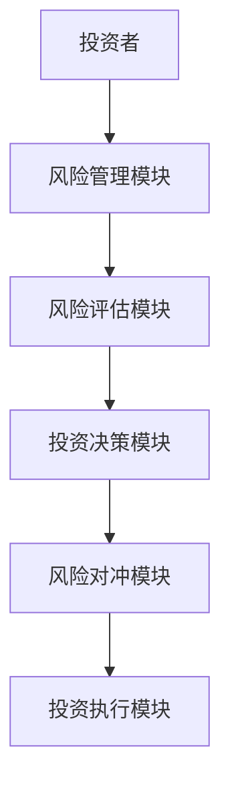
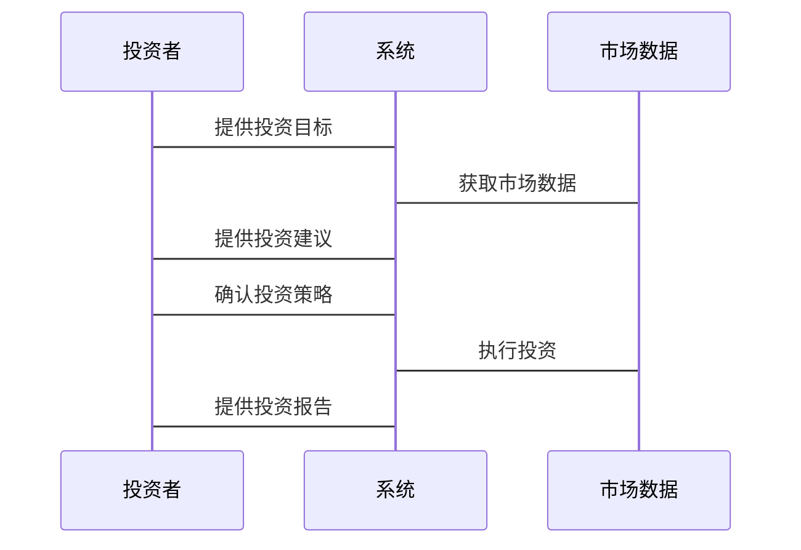

                 


# 彼得林奇的"逆向思维"在新兴市场债券投资中的运用

## 关键词：逆向思维, 彼得林奇, 新兴市场, 债券投资, 风险管理

## 摘要：本文深入探讨了彼得林奇的逆向思维在新兴市场债券投资中的应用，通过分析逆向思维的核心概念、数学模型、系统架构和实际案例，展示了如何利用逆向思维在新兴市场中寻找投资机会，优化风险管理，并实现长期稳定的收益。文章结合理论与实践，为投资者提供了丰富的策略和见解。

---

## 第1章: 逆向思维的定义与核心理念

### 1.1 逆向思维的定义

逆向思维是指从对立或相反的方向思考问题，寻找非直观的解决方案。在投资领域，逆向思维强调在市场低迷时寻找机会，在市场繁荣时保持谨慎。

#### 1.1.1 逆向思维的起源与背景

逆向思维的起源可以追溯到古希腊哲学家的辩证法，强调从对立面寻找真理。在投资领域，逆向思维的核心在于识别市场非理性行为，发现被低估的资产。

#### 1.1.2 彼得林奇逆向思维的核心理念

彼得林奇认为，市场波动是投资的机会，逆向思维帮助投资者在市场恐慌时买入优质资产，在市场狂热时卖出。

#### 1.1.3 逆向思维在投资中的重要性

逆向思维帮助投资者避免跟随市场情绪，降低投资风险，提高长期收益。

### 1.2 彼得林奇的逆向思维策略

#### 1.2.1 逆向思维的基本原则

- 市场先生：将市场波动视为机会，而非风险。
- 价值投资：寻找基本面良好的资产，逆市买入。
- 风险控制：通过分散投资和严格的风险管理降低风险。

#### 1.2.2 彼得林奇的投资哲学

- 长期视角：关注企业的长期价值，而非短期波动。
- 逆向操作：在市场低点买入，在市场高点卖出。

#### 1.2.3 逆向思维与传统投资策略的区别

| 方面         | 逆向思维       | 传统投资策略      |
|--------------|----------------|-------------------|
| 投资时机     | 市场低点买入     | 市场高点买入       |
| 风险管理     | 严格控制风险     | 依赖市场波动获利   |
| 投资标的     | 低估资产         | 高估值资产         |

---

## 第2章: 新兴市场债券投资的特点

### 2.1 新兴市场的定义与特点

新兴市场是指经济快速发展、市场机制逐步完善但尚未完全成熟的国家或地区。这些市场通常具有高增长潜力，但也伴随着较高的风险。

#### 2.1.1 新兴市场的经济特征

- 高经济增长率：新兴市场通常具有较高的GDP增长。
- 不完善市场机制：新兴市场可能在法律、监管等方面不够完善。
- 高波动性：新兴市场受国际资本流动影响较大。

#### 2.1.2 新兴市场债券市场的独特性

- 债券品种多样化：包括主权债券、企业债券等。
- 利率波动较大：新兴市场债券收益率较高，但波动性也大。
- 外部风险：受国际政治经济环境影响较大。

#### 2.1.3 新兴市场债券投资的风险与机遇

| 风险         | 机遇         |
|--------------|--------------|
| 汇率风险      | 高收益       |
| 利率风险      | 高增长潜力    |
| 政治风险      | 多样化投资标的  |

### 2.2 彼得林奇逆向思维在新兴市场的适用性

#### 2.2.1 新兴市场中的逆向投资机会

- 在市场恐慌时买入优质债券。
- 在市场乐观时卖出高估值债券。

#### 2.2.2 逆向思维在新兴市场中的具体表现

- 关注被市场低估的债券。
- 投资具有长期增长潜力的行业或企业。

#### 2.2.3 新兴市场债券投资的挑战与解决方案

- 汇率风险：通过套期保值降低汇率波动影响。
- 利率风险：分散投资，避免过度集中。
- 政治风险：选择政治稳定的国家或行业。

---

## 第3章: 逆向思维在债券分析中的应用

### 3.1 逆向思维的基本分析框架

#### 3.1.1 债券的基本分析要素

- 债券面值：债券的本金。
- 利率：债券的票面利率。
- 到期期限：债券的存续时间。
- 发行主体：债券的发行方。

#### 3.1.2 逆向思维在信用评级中的应用

通过分析发行方的财务状况、行业地位、管理能力等，判断其信用评级，寻找被低估的债券。

#### 3.1.3 逆向思维在债券价格波动中的预测作用

分析市场情绪，预测债券价格波动，寻找逆向投资机会。

### 3.2 逆向思维的具体分析方法

#### 3.2.1 债券收益率的逆向分析

通过比较债券的当前收益率与市场平均水平，寻找被低估的债券。

#### 3.2.2 债券价格与市场情绪的逆向关联

分析市场情绪，判断债券价格的高估或低估，进行逆向操作。

#### 3.2.3 逆向思维在债券组合管理中的应用

通过分散投资、动态调整债券组合，降低风险，提高收益。

### 3.3 实例分析: 彼得林奇的逆向思维在某新兴市场债券投资中的成功案例

#### 3.3.1 案例背景介绍

假设新兴市场某国债券收益率较高，但市场情绪悲观，债券价格被低估。

#### 3.3.2 逆向思维在该案例中的具体应用

- 分析债券的基本面，判断其具有较高的投资价值。
- 在市场低点买入债券，长期持有，获得超额收益。

#### 3.3.3 案例的启示与总结

逆向思维帮助投资者在市场恐慌时发现机会，实现超额收益。

---

## 第4章: 逆向思维与债券风险管理

### 4.1 风险管理的基本概念

#### 4.1.1 风险的定义与分类

- 市场风险：债券价格波动带来的风险。
- 利率风险：利率变动带来的风险。
- 信用风险：债券发行人违约的风险。

#### 4.1.2 债券投资中的主要风险类型

- 汇率风险：汇率波动影响债券价值。
- 利率风险：利率上升导致债券价格下跌。
- 信用风险：债券发行人违约。

### 4.2 逆向思维在风险评估中的应用

#### 4.2.1 逆向思维与风险识别

通过逆向思维，识别潜在风险，制定应对策略。

#### 4.2.2 逆向思维与风险量化

利用数学模型量化风险，评估逆向投资策略的有效性。

#### 4.2.3 逆向思维与风险对冲策略

通过金融衍生工具对冲风险，降低投资组合的波动性。

### 4.3 逆向思维在风险控制中的具体应用

#### 4.3.1 利用套期保值对冲汇率风险

- 通过外汇期货对冲汇率波动。
- 选择合适的产品，降低汇率风险。

#### 4.3.2 利用债券组合管理控制利率风险

- 通过债券久期管理，降低利率风险。
- 分散投资，避免过度集中。

#### 4.3.3 利用信用分析降低信用风险

- 严格评估债券发行人的信用状况。
- 避免投资高违约风险的债券。

---

## 第5章: 系统分析与架构设计方案

### 5.1 问题场景介绍

新兴市场债券投资面临复杂的市场环境和多种风险因素，投资者需要一个高效的风险管理系统来优化投资决策。

### 5.2 项目介绍

本项目旨在设计一个基于逆向思维的新兴市场债券投资系统，帮助投资者识别投资机会，优化风险管理。

### 5.3 系统功能设计

- 风险评估模块：评估债券的市场风险、利率风险和信用风险。
- 投资决策模块：基于逆向思维，推荐逆向投资策略。
- 风险管理模块：制定风险对冲策略，控制投资风险。

### 5.4 系统架构设计

#### 5.4.1 系统架构图



#### 5.4.2 系统接口设计

- 输入：市场数据、债券信息。
- 输出：投资建议、风险管理策略。

#### 5.4.3 系统交互设计



---

## 第6章: 项目实战

### 6.1 环境安装

- 安装Python编程环境。
- 安装必要的库，如numpy、pandas、scipy。

### 6.2 核心实现源代码

```python
import numpy as np
import pandas as pd

def inverse_thinking_bond_investment(bond_data):
    # 计算债券收益率
    yields = bond_data['yield']
    market_average = np.mean(yields)
    inverse_candidates = bond_data[yields < market_average]
    return inverse_candidates

# 示例数据
bond_data = {
    'bond_id': ['B1', 'B2', 'B3', 'B4'],
    'yield': [5, 6, 4, 7],
    'issuer': ['A', 'B', 'C', 'D']
}

# 调用函数
inverse_candidates = inverse_thinking_bond_investment(bond_data)
print("逆向思维推荐的债券:", inverse_candidates['bond_id'])
```

### 6.3 代码应用解读与分析

- 计算债券收益率的平均值，识别低于平均值的债券，作为逆向思维的投资标的。
- 分析债券的其他因素，如发行主体、期限等，进一步筛选投资标的。

### 6.4 案例分析

假设新兴市场某国债券收益率为6%，市场平均收益率为7%，则该债券被推荐为逆向思维的投资标的。

### 6.5 项目小结

通过代码实现逆向思维策略，投资者可以有效识别新兴市场中的低估债券，优化投资组合，降低风险。

---

## 第7章: 最佳实践与小结

### 7.1 最佳实践 tips

- 保持长期视角，避免短期波动影响。
- 严格控制风险，分散投资标的。
- 定期评估投资组合，调整策略。

### 7.2 小结

逆向思维是新兴市场债券投资中的重要策略，帮助投资者在市场波动中发现机会，优化风险管理，实现长期稳定的收益。

### 7.3 注意事项

- 风险管理是逆向思维成功的关键。
- 投资者需具备扎实的市场分析能力。
- 严格遵守投资纪律，避免情绪化决策。

### 7.4 拓展阅读

- 彼得林奇的《彼得林奇的投资哲学》。
- 新兴市场债券投资的相关书籍和研究报告。

---

## 作者：AI天才研究院/AI Genius Institute & 禅与计算机程序设计艺术 /Zen And The Art of Computer Programming

