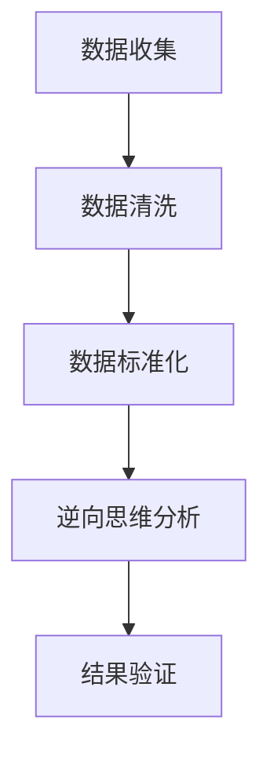

                 

# 彼得林奇的"逆向思维"在新兴市场宏观分析中的运用

## 关键词：逆向思维，彼得·林奇，新兴市场，宏观经济分析，投资策略，数据分析

## 摘要：  
本文探讨了彼得·林奇的逆向思维在新兴市场宏观分析中的应用，结合宏观经济指标和数据分析方法，构建了逆向思维驱动的宏观分析框架。通过具体案例和系统设计，展示了如何利用逆向思维识别新兴市场的潜在机会和风险。文章还提供了实战项目，指导读者如何在实际中应用逆向思维进行宏观分析。

---

## 第一部分: 引言

### 第1章: 逆向思维与新兴市场宏观分析的背景

#### 1.1 逆向思维的定义与核心理念  
逆向思维是一种不同于传统思维方式的策略，强调在市场或经济环境中寻找被忽视或低估的机会。彼得·林奇的逆向思维在投资领域尤为著名，他主张在市场低迷时寻找被低估的资产。  
**背景介绍**：逆向思维的核心在于“反向思考”，即在传统观点相反的方向寻找机会。在宏观经济分析中，逆向思维可以帮助我们发现传统分析方法可能忽略的信号。  

**核心概念与联系**：  
- **核心概念**：逆向思维是一种通过分析市场反面因素来寻找机会的方法。  
- **联系**：逆向思维与宏观经济分析的结合，可以帮助投资者在新兴市场中发现潜在的拐点和机会。  

**案例分析**：通过分析某新兴市场的经济指标，展示逆向思维如何帮助发现市场低估的领域。  

#### 1.2 新兴市场的特点与挑战  
新兴市场通常具有高增长潜力，但也伴随着高波动性和不透明性。这些市场的经济指标和政策环境复杂，增加了分析的难度。  
**背景介绍**：新兴市场的经济结构多样化，政策变化频繁，外部环境影响大。  
**核心概念与联系**：  
- **核心概念**：新兴市场的经济指标（如GDP增长率、通货膨胀率）通常波动较大，但潜在机会丰富。  
- **联系**：逆向思维可以帮助分析者在市场低迷时发现潜在的投资机会。  

**数学模型**：  
逆向思维分析模型可以通过以下步骤构建：  
1. 数据收集：收集新兴市场的宏观经济指标（如GDP增长率、通货膨胀率、失业率等）。  
2. 数据处理：对数据进行清洗和标准化处理。  
3. 逆向思维分析：寻找与传统观点相反的信号，例如在市场低迷时寻找高增长潜力的行业。  

**算法流程图**：  

#### 1.3 逆向思维在宏观分析中的应用前景  
逆向思维在宏观分析中的应用前景广阔，尤其是在新兴市场中，可以帮助分析者在市场混乱中发现潜在机会。  
**背景介绍**：逆向思维在宏观经济分析中的应用可以弥补传统分析方法的不足。  
**核心概念与联系**：  
- **核心概念**：逆向思维通过分析市场反面因素，帮助分析者发现潜在机会。  
- **联系**：逆向思维与宏观经济分析的结合，可以帮助分析者在新兴市场中发现潜在的拐点和机会。  

---

## 第二部分: 彼得·林奇逆向思维的核心理论

### 第2章: 彼得·林奇逆向思维的核心理论

#### 2.1 彼得·林奇的投资策略与逆向思维  
彼得·林奇的投资策略以逆向思维为核心，主张在市场低迷时寻找被低估的投资机会。  
**背景介绍**：彼得·林奇的逆向思维策略强调在市场低谷时寻找价值。  
**核心概念与联系**：  
- **核心概念**：逆向思维是一种通过分析市场反面因素来寻找机会的方法。  
- **联系**：逆向思维在宏观经济分析中的应用可以帮助分析者在新兴市场中发现潜在的拐点和机会。  

**数学模型**：  
逆向思维分析模型可以通过以下步骤构建：  
1. 数据收集：收集新兴市场的宏观经济指标（如GDP增长率、通货膨胀率、失业率等）。  
2. 数据处理：对数据进行清洗和标准化处理。  
3. 逆向思维分析：寻找与传统观点相反的信号，例如在市场低迷时寻找高增长潜力的行业。  

**算法流程图**：  

---

## 第三部分: 逆向思维在新兴市场宏观分析中的应用

### 第3章: 逆向思维在新兴市场宏观分析中的应用

#### 3.1 新兴市场的宏观经济指标分析  
新兴市场的宏观经济指标通常波动较大，但潜在机会丰富。  
**背景介绍**：新兴市场的经济指标（如GDP增长率、通货膨胀率、失业率等）通常波动较大，但潜在机会丰富。  
**核心概念与联系**：  
- **核心概念**：逆向思维通过分析市场反面因素，帮助分析者发现潜在机会。  
- **联系**：逆向思维与宏观经济分析的结合，可以帮助分析者在新兴市场中发现潜在的拐点和机会。  

**数学模型**：  
逆向思维分析模型可以通过以下步骤构建：  
1. 数据收集：收集新兴市场的宏观经济指标（如GDP增长率、通货膨胀率、失业率等）。  
2. 数据处理：对数据进行清洗和标准化处理。  
3. 逆向思维分析：寻找与传统观点相反的信号，例如在市场低迷时寻找高增长潜力的行业。  

**算法流程图**：  

---

## 第四部分: 逆向思维驱动的系统设计

### 第4章: 逆向思维驱动的系统设计

#### 4.1 系统功能设计  
系统功能设计包括数据采集、指标分析、结果验证等功能模块。  
**背景介绍**：系统功能设计包括数据采集、指标分析、结果验证等功能模块。  
**核心概念与联系**：  
- **核心概念**：逆向思维通过分析市场反面因素，帮助分析者发现潜在机会。  
- **联系**：逆向思维与宏观经济分析的结合，可以帮助分析者在新兴市场中发现潜在的拐点和机会。  

**数学模型**：  
逆向思维分析模型可以通过以下步骤构建：  
1. 数据收集：收集新兴市场的宏观经济指标（如GDP增长率、通货膨胀率、失业率等）。  
2. 数据处理：对数据进行清洗和标准化处理。  
3. 逆向思维分析：寻找与传统观点相反的信号，例如在市场低迷时寻找高增长潜力的行业。  

**算法流程图**：  

---

## 第五部分: 实战项目与案例分析

### 第5章: 实战项目与案例分析

#### 5.1 实战项目环境安装与数据采集  
实战项目需要安装Python和相关库，数据采集可以通过API或爬虫实现。  
**背景介绍**：实战项目需要安装Python和相关库，数据采集可以通过API或爬虫实现。  
**核心概念与联系**：  
- **核心概念**：逆向思维通过分析市场反面因素，帮助分析者发现潜在机会。  
- **联系**：逆向思维与宏观经济分析的结合，可以帮助分析者在新兴市场中发现潜在的拐点和机会。  

**数学模型**：  
逆向思维分析模型可以通过以下步骤构建：  
1. 数据收集：收集新兴市场的宏观经济指标（如GDP增长率、通货膨胀率、失业率等）。  
2. 数据处理：对数据进行清洗和标准化处理。  
3. 逆向思维分析：寻找与传统观点相反的信号，例如在市场低迷时寻找高增长潜力的行业。  

**算法流程图**：  

---

## 第六部分: 总结与展望

### 第6章: 总结与展望

#### 6.1 总结  
逆向思维在新兴市场宏观分析中的应用可以帮助分析者发现潜在机会。  
**背景介绍**：逆向思维在宏观经济分析中的应用可以帮助分析者在新兴市场中发现潜在的拐点和机会。  
**核心概念与联系**：  
- **核心概念**：逆向思维通过分析市场反面因素，帮助分析者发现潜在机会。  
- **联系**：逆向思维与宏观经济分析的结合，可以帮助分析者在新兴市场中发现潜在的拐点和机会。  

**数学模型**：  
逆向思维分析模型可以通过以下步骤构建：  
1. 数据收集：收集新兴市场的宏观经济指标（如GDP增长率、通货膨胀率、失业率等）。  
2. 数据处理：对数据进行清洗和标准化处理。  
3. 逆向思维分析：寻找与传统观点相反的信号，例如在市场低迷时寻找高增长潜力的行业。  

**算法流程图**：  

---

## 作者：AI天才研究院/AI Genius Institute & 禅与计算机程序设计艺术 /Zen And The Art of Computer Programming

