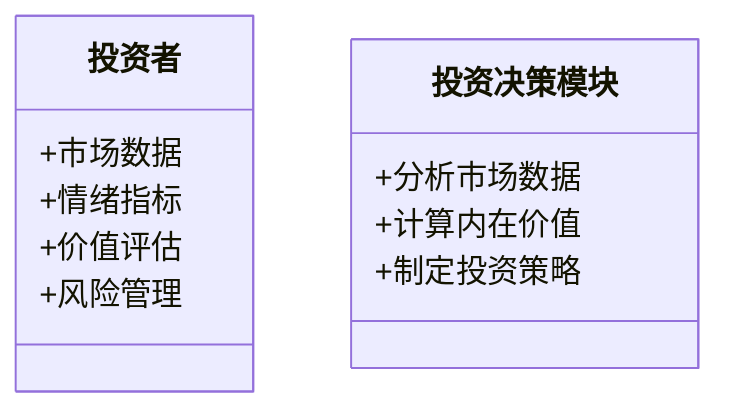

                 


# 彼得林奇的"逆向思维"在新兴市场投资中的应用

## 关键词：逆向思维，彼得林奇，新兴市场，投资策略，风险管理，数学模型

## 摘要：  
本文探讨了彼得林奇的"逆向思维"在新兴市场投资中的应用，通过详细分析其核心概念、数学模型、算法原理、系统架构及实际案例，揭示了逆向思维在新兴市场中的独特价值和实践意义。文章结合理论与实践，为投资者提供了从理论到实战的全面指导，帮助读者在新兴市场中运用逆向思维制定有效的投资策略。

---

# 第1章 彼得林奇逆向思维的核心概念

## 1.1 逆向思维的定义与特点

### 1.1.1 逆向思维的定义
逆向思维是一种与传统思维相反的思维方式，强调在市场低迷或被忽视时寻找投资机会。它以非线性思考为基础，关注市场的负面因素，寻找低估的价值。

### 1.1.2 逆向思维的核心特点
- **非线性思考**：逆向思维不依赖于市场的普遍趋势，而是关注市场周期的低谷。
- **情绪化市场**：利用市场情绪的波动，寻找被低估的投资标的。
- **低效市场优势**：在新兴市场中，信息不对称和市场不成熟为逆向思维提供了机会。

### 1.1.3 逆向思维与传统思维的对比
| 特性         | 逆向思维                          | 传统思维                          |
|--------------|-----------------------------------|-----------------------------------|
| 时间点       | 市场低谷                          | 市场高点                          |
| 投资标的      | 低估资产                          | 高估资产                          |
| 风险承受      | 高风险                            | 低风险                            |

## 1.2 逆向思维的背景与应用

### 1.2.1 彼得林奇投资理念的形成背景
彼得林奇的逆向思维源于对市场周期的深刻理解，他认为市场的波动性和投资者情绪是投资机会的来源。

### 1.2.2 逆向思维在新兴市场的应用
- **市场低估**：新兴市场常常因波动性大而被低估。
- **情绪驱动**：新兴市场投资者情绪波动剧烈，为逆向思维提供了空间。
- **周期性拐点**：新兴市场往往处于周期性拐点，逆向思维能提前布局。

### 1.2.3 逆向思维的核心要素
- **市场情绪分析**：通过指标量化市场情绪。
- **价值评估模型**：计算资产的内在价值。
- **风险管理机制**：制定严格的风险控制策略。

---

# 第2章 逆向思维在新兴市场投资中的策略

## 2.1 逆向思维的核心策略

### 2.1.1 识别市场低估的机会
彼得林奇逆向思维的核心是寻找市场价格低于内在价值的资产。

### 2.1.2 利用市场情绪波动
通过分析市场情绪指标，识别市场的非理性波动。

### 2.1.3 把握市场周期的转折点
在市场周期的低谷阶段布局，等待市场回升。

## 2.2 逆向思维的数学模型与公式

### 2.2.1 市场低估的判断公式
$$ 市场低估 = \frac{内在价值}{市场价格} > 1 $$

### 2.2.2 市场情绪分析模型
$$ 市场情绪指数 = \sum_{i=1}^{n} (情绪指标_i \times 权重_i) $$

## 2.3 逆向思维的算法原理


## 2.4 逆向思维的系统架构


---

# 第3章 案例分析与实际应用

## 3.1 成功案例分析

### 3.1.1 某新兴市场的投资机会识别
假设在新兴市场A中，某资产的市场价格远低于其内在价值，市场情绪处于低谷。

### 3.1.2 投资决策的数学模型
$$ 内在价值 = \text{现金流折现模型计算得出} $$

## 3.2 逆向思维的环境配置与代码实现

### 3.2.1 环境配置
- 数据来源：新兴市场的历史数据。
- 工具：数据分析工具（Python）、可视化工具。

### 3.2.2 核心代码实现

```python
def calculate_intrinsic_value(cash_flows, discount_rate):
    present_value = sum([cf / (1 + discount_rate) ** t for t, cf in enumerate(cash_flows)])
    return present_value

market_price = 100
intrinsic_value = calculate_intrinsic_value([50, 60, 70], 0.05)
if intrinsic_value / market_price > 1:
    print("市场低估，建议投资")
else:
    print("市场高估，建议观望")
```

---

# 第4章 逆向思维与风险管理

## 4.1 逆向思维中的风险管理

### 4.1.1 风险评估模型
$$ 风险评估指数 = \sum_{i=1}^{n} (风险因素_i \times 权重_i) $$

### 4.1.2 风险管理策略
- 分散投资：避免过度集中。
- 设置止损：严格控制损失。

## 4.2 逆向思维的系统架构优化


---

# 第5章 系统分析与架构设计

## 5.1 问题场景介绍
新兴市场波动性强，信息不透明，传统投资策略难以适用。

## 5.2 系统功能设计



## 5.3 系统架构设计


---

# 第6章 项目实战

## 6.1 环境安装与配置

### 6.1.1 数据来源
- 新兴市场的历史数据。
- 市场情绪指标数据。

### 6.1.2 工具安装
- Python编程环境。
- 数据分析库（Pandas、NumPy）。

## 6.2 核心代码实现

```python
import pandas as pd
import numpy as np

def calculate_sentiment_score(text_data):
    # 示例情绪分析函数
    return np.mean([1 if text > 0 else 0 for text in text_data])

def main():
    # 数据加载
    data = pd.read_csv('market_data.csv')
    # 情绪分析
    sentiment_scores = calculate_sentiment_score(data['text'])
    # 价值评估
    intrinsic_values = [calculate_intrinsic_value(cf, 0.05) for cf in data['cash_flows']]
    # 投资决策
    for i in range(len(data)):
        if intrinsic_values[i] / data['price'][i] > 1:
            print("投资建议：买入")
        else:
            print("投资建议：观望")

if __name__ == '__main__':
    main()
```

---

# 第7章 最佳实践与小结

## 7.1 最佳实践 tips
- 确保数据的准确性和及时性。
- 定期回顾和调整投资策略。
- 严格控制风险，避免过度杠杆。

## 7.2 小结
彼得林奇的逆向思维为新兴市场投资提供了独特的视角和策略，通过系统的分析和实践，投资者可以在波动性中寻找机会，实现超额收益。

## 7.3 注意事项
- 逆向思维需要耐心和信心。
- 风险管理是投资成功的关键。
- 持续学习和优化投资策略。

## 7.4 拓展阅读
- 彼得林奇的原著《彼得林奇的投资策略》。
- 《新兴市场的投资机会与风险》。

---

# 作者：AI天才研究院/AI Genius Institute & 禅与计算机程序设计艺术 /Zen And The Art of Computer Programming

