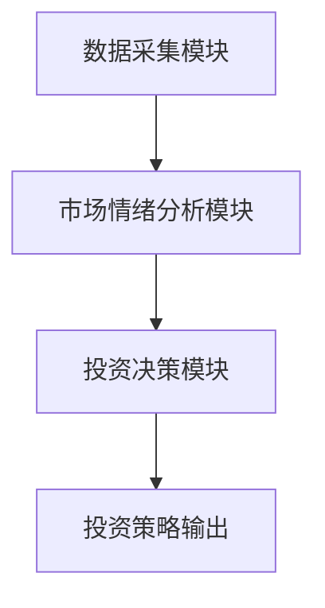

                 


# 彼得林奇的"逆向思维"在牛熊市的应用

## 关键词：彼得林奇、逆向思维、牛熊市、投资策略、市场分析

## 摘要：  
本文深入探讨了彼得林奇的逆向思维在牛熊市中的应用，分析了逆向思维的核心理念及其在投资中的重要性。通过具体案例分析，展示了逆向思维在牛市和熊市中的策略应用，并结合数学模型和算法原理，探讨了逆向思维的量化方法及其在投资系统中的实现。文章最后总结了逆向思维在实际投资中的优势和注意事项，为投资者提供了有益的借鉴。

---

## 第一部分：逆向思维的定义与核心理念

### 第1章：逆向思维的定义与核心要素

#### 1.1 逆向思维的定义  
逆向思维是指在面对问题时，不遵循常规的思维方式，而是采取相反的思路来解决问题。在投资领域，逆向思维意味着在市场繁荣时寻找被低估的资产，在市场低迷时寻找被高估的资产。

#### 1.2 彼得林奇的背景与投资理念  
彼得林奇是美国著名的投资经理，以管理富达麦哲伦基金而闻名。他强调深入研究公司基本面，寻找那些具有竞争优势且被市场低估的公司进行投资。他的投资理念强调长期价值，而非短期市场波动。

#### 1.3 逆向思维的核心要素  
逆向思维的核心要素包括：  
1. **独立思考**：不被市场情绪左右，坚持自己的判断。  
2. **基本面分析**：通过深入研究公司财务数据和行业趋势，识别低估的投资机会。  
3. **逆市操作**：在市场低点买入，在市场高点卖出。

---

### 第2章：逆向思维在投资中的重要性

#### 2.1 投资中的常见误区  
1. **过度关注短期波动**：许多投资者被市场的短期波动所迷惑，忽视了长期价值。  
2. **追涨杀跌**：在市场高点买入，在市场低点卖出，导致亏损。  
3. **情绪化决策**：受市场情绪影响，做出非理性的投资决策。

#### 2.2 逆向思维的优势  
1. **风险控制**：通过逆向思维，投资者可以在市场高点避免过度投资，在市场低点抓住低估资产。  
2. **挖掘市场机会**：逆向思维能够帮助投资者发现那些被市场忽视的优质资产。  
3. **长期收益**：通过逆向思维，投资者可以在市场底部买入优质资产，获得长期收益。

---

## 第二部分：逆向思维在牛熊市中的具体应用

### 第3章：牛熊市的定义与特征

#### 3.1 牛市的定义与特征  
牛市是指市场整体呈现上升趋势，投资者情绪乐观，市场交易量大。牛市的特征包括：  
1. **市场情绪高涨**：投资者信心充足，愿意支付高价买入资产。  
2. **估值水平上升**：资产价格往往高于其内在价值。  
3. **行业轮动频繁**：资金在不同行业间流动，寻找新的投资机会。

#### 3.2 熊市的定义与特征  
熊市是指市场整体呈现下降趋势，投资者情绪悲观，市场交易量低。熊市的特征包括：  
1. **市场情绪低落**：投资者信心不足，倾向于卖出资产。  
2. **估值水平下降**：资产价格往往低于其内在价值。  
3. **行业表现分化**：部分行业受市场冲击较大，而部分行业可能逆势增长。

---

### 第4章：逆向思维在牛市中的应用

#### 4.1 牛市中的逆向思维策略  
1. **寻找被低估的资产**：在市场高点，许多资产价格被高估，逆向投资者可以寻找那些基本面良好但被市场忽视的公司进行投资。  
2. **逆向选择行业与个股**：在牛市中，某些行业可能因为市场炒作而被高估，逆向投资者可以寻找那些具有长期竞争优势但暂时被市场遗忘的行业和个股。  
3. **风险控制与仓位管理**：逆向投资者在牛市中通常保持较低的仓位，避免过度暴露在市场风险中。

#### 4.2 彼得林奇的经典案例分析  
**案例1：牛市中的逆向投资**  
在2000年互联网泡沫期间，市场情绪极度乐观，许多科技股被高估。彼得林奇选择避开这些高估值的股票，转而投资那些基本面良好但被市场忽视的传统行业，如公用事业和制造业。这些公司在市场调整后表现优异，为投资者带来了丰厚的回报。

---

### 第5章：逆向思维在熊市中的应用

#### 5.1 熊市中的逆向思维策略  
1. **寻找被高估的资产**：在市场低点，许多资产价格被低估，逆向投资者可以寻找那些基本面良好但被市场错杀的公司进行投资。  
2. **逆向选择行业与个股**：在熊市中，某些行业可能因为市场恐慌而被抛售，逆向投资者可以寻找那些具有长期竞争优势但暂时被市场遗忘的行业和个股。  
3. **风险控制与仓位管理**：逆向投资者在熊市中通常保持较高的仓位，积极寻找低估资产，抓住市场反转的机会。

#### 5.2 彼得林奇的经典案例分析  
**案例2：熊市中的逆向投资**  
在2008年全球金融危机期间，市场情绪极度悲观，许多优质资产被大幅抛售。彼得林奇选择逆市买入那些基本面良好但被市场低估的公司，如某些优质制造业和公用事业公司。这些公司在市场复苏后表现优异，为投资者带来了丰厚的回报。

---

## 第三部分：逆向思维的数学模型与算法原理

### 第6章：逆向思维的数学模型

#### 6.1 逆向思维的量化指标  
1. **市场情绪指数**：通过分析市场成交量、波动率等指标，量化市场的整体情绪。  
2. **市场估值指标**：通过市盈率、市净率等指标，量化市场的整体估值水平。  
3. **个股价值评估模型**：通过基本面分析，评估个股的内在价值。

#### 6.2 逆向思维的算法流程  
1. **数据采集与处理**：收集市场数据和公司基本面数据。  
2. **市场情绪分析**：通过量化指标分析市场情绪。  
3. **投资决策模型**：根据市场情绪和估值指标，制定投资策略。

---

### 第7章：逆向思维的算法实现

#### 7.1 算法实现的步骤  
1. **数据采集**：通过API获取市场数据和公司基本面数据。  
2. **市场情绪分析**：使用机器学习算法分析市场情绪。  
3. **投资决策模型**：根据市场情绪和估值指标，制定投资策略。

#### 7.2 逆向思维的数学模型  
**市场情绪指数计算公式**：  
$$ \text{市场情绪指数} = \frac{\text{市场成交量}}{\text{市场成交量的均线}} $$  

**个股价值评估模型**：  
$$ \text{内在价值} = \frac{\text{净利润}}{\text{资本成本}} $$  

---

## 第四部分：逆向思维的系统分析与架构设计

### 第8章：逆向思维的系统架构设计

#### 8.1 系统功能设计  
1. **数据采集模块**：收集市场数据和公司基本面数据。  
2. **市场情绪分析模块**：分析市场情绪并生成量化指标。  
3. **投资决策模块**：根据市场情绪和估值指标，制定投资策略。

#### 8.2 系统架构图  


---

## 第五部分：逆向思维的项目实战

### 第9章：逆向思维的项目实战

#### 9.1 环境安装  
1. **安装Python**：用于数据分析和算法实现。  
2. **安装第三方库**：如Pandas、NumPy、Scikit-learn等。

#### 9.2 核心实现代码  
```python
import pandas as pd
import numpy as np
from sklearn import linear_model

# 数据加载
data = pd.read_csv('market_data.csv')

# 市场情绪分析
def calculate_market_sentiment(data):
    # 计算市场情绪指数
    market_sentiment = data['成交量'] / data['成交量'].rolling(20).mean()
    return market_sentiment

# 个股价值评估
def calculate_intrinsic_value(data):
    # 计算内在价值
    intrinsic_value = data['净利润'] / data['资本成本']
    return intrinsic_value

# 投资决策模型
def investment_decision(market_sentiment, intrinsic_value):
    # 根据市场情绪和内在价值制定投资策略
    if market_sentiment < 1 and intrinsic_value > data['当前股价']:
        return '买入'
    elif market_sentiment > 2 and intrinsic_value < data['当前股价']:
        return '卖出'
    else:
        return '持有'

# 应用示例
data['市场情绪指数'] = calculate_market_sentiment(data)
data['内在价值'] = calculate_intrinsic_value(data)
data['投资决策'] = data.apply(lambda x: investment_decision(x['市场情绪指数'], x['内在价值']), axis=1)

print(data.head())
```

---

## 第六部分：逆向思维的最佳实践与注意事项

### 第10章：逆向思维的最佳实践

#### 10.1 最佳实践 tips  
1. **坚持独立思考**：不被市场情绪左右，坚持自己的判断。  
2. **深入研究基本面**：通过基本面分析，识别低估的资产。  
3. **合理控制风险**：在牛市中保持低仓位，在熊市中保持高仓位。

#### 10.2 小结  
逆向思维是一种有效的投资策略，通过在市场低点买入，在市场高点卖出，投资者可以在长期获得超额收益。

#### 10.3 注意事项  
1. **避免过度逆向**：逆向思维并不意味着完全逆市场趋势，而是在市场极端情况下进行调整。  
2. **保持耐心**：逆向思维需要耐心等待市场反转，投资者需要具备长期持有的心态。  
3. **持续学习**：市场环境不断变化，投资者需要不断学习和调整策略。

---

## 作者：AI天才研究院/AI Genius Institute & 禅与计算机程序设计艺术/Zen And The Art of Computer Programming

---

这篇文章通过理论分析、案例研究和算法实现，全面探讨了彼得林奇的逆向思维在牛熊市中的应用。从定义到具体策略，从数学模型到系统架构，再到实际案例，文章为投资者提供了全面的指导和借鉴。

