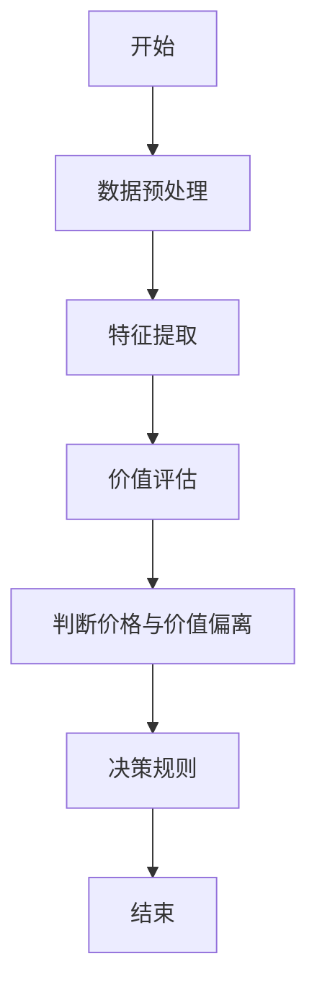
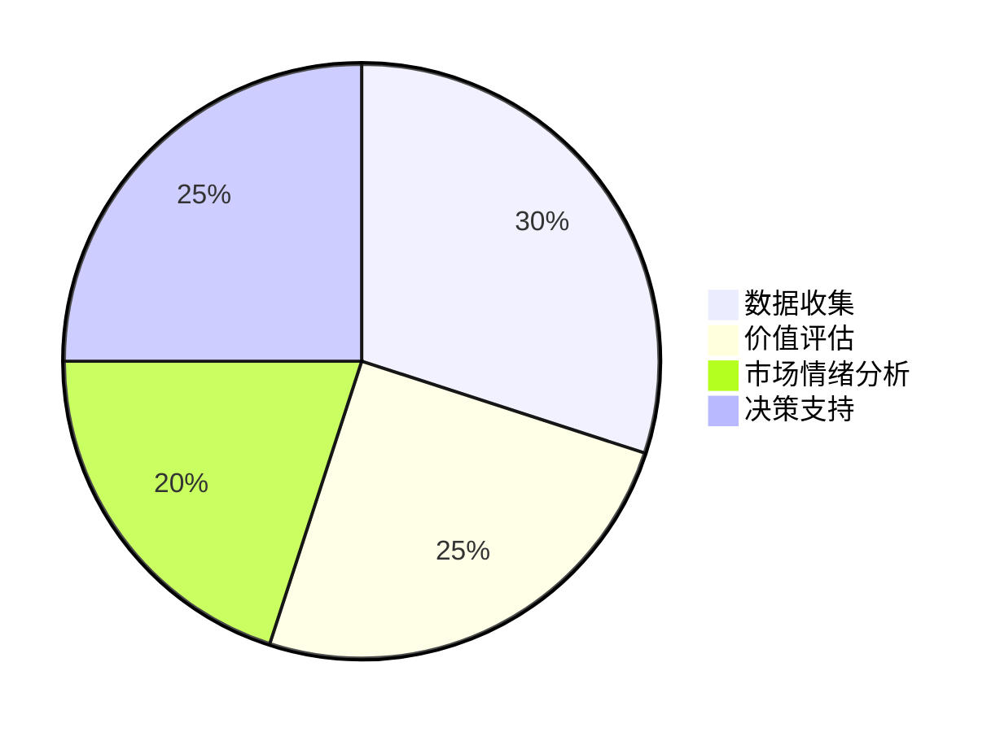

                 


# 彼得林奇的"逆向思维"投资技巧

> 关键词：彼得林奇，逆向思维，投资策略，价值评估，市场分析，风险管理

> 摘要：本文深入探讨了彼得林奇提出的逆向思维投资技巧，分析了其核心概念、算法原理、系统架构，并通过具体案例展示了如何在实际投资中应用这些策略。文章还总结了逆向思维的成功案例，提供了实用的建议和最佳实践。

---

# 引言

逆向思维是一种与传统投资策略相反的方法，强调在市场低迷时寻找被低估的投资机会。彼得林奇作为投资界的传奇人物，以其独特的逆向思维策略闻名。本文将系统地分析这一策略，帮助读者理解其背后的原理和应用方法。

---

# 第一部分：逆向思维的定义与背景

## 第1章：逆向思维的定义与背景

### 1.1 逆向思维的定义

逆向思维在投资中指的是在市场低迷或不景气时，寻找被低估的股票进行投资。这种方法的核心在于反向操作，即在市场底部买入，在市场顶部卖出。与传统的顺势投资不同，逆向思维强调在市场恐慌时寻找机会，而在市场狂热时保持冷静。

### 1.2 彼得林奇的背景

彼得·林奇是美国著名的投资专家，曾管理富达麦哲伦基金，取得了卓越的投资业绩。他的投资哲学强调长期持有优质股票，同时在市场低谷时买入被低估的股票。

### 1.3 逆向思维的哲学基础

逆向思维的哲学基础在于市场情绪的波动性。市场往往在情绪高涨时过度买入，在情绪低落时过度卖出。逆向思维通过分析市场情绪，寻找价格与价值的偏离点。

---

## 第2章：逆向思维的核心概念

### 2.1 市场情绪与逆向思维的关系

市场情绪可以通过投资者的行为和市场指标（如波动率、成交量）来衡量。逆向思维认为，市场情绪的极端化是投资机会的信号。例如，当市场情绪极度悲观时，可能是买入的好时机。

### 2.2 价值评估与逆向思维的结合

逆向思维强调价值评估，即寻找那些价格低于其内在价值的股票。通过分析财务指标（如市盈率、市净率、股息率等）来判断股票的低估程度。

### 2.3 市场周期与逆向思维的策略调整

市场周期分为上升周期和下降周期。在下降周期中，逆向思维策略更为适用，因为此时更容易找到被低估的股票。而在上升周期，投资者需要警惕市场的过热。

---

## 第3章：逆向思维的算法原理

### 3.1 数据预处理与特征提取

在应用逆向思维策略时，首先需要收集相关的市场数据，包括股票价格、财务指标、市场情绪指标等。数据预处理包括清洗数据、标准化处理等。

### 3.2 价值评估模型

构建一个价值评估模型，用于计算股票的内在价值。常用的模型包括股息折现模型（DDM）和内在价值模型。通过比较股票的市场价格与内在价值，判断股票是否被低估。

### 3.3 决策规则

制定明确的买卖决策规则。例如，当股票的价格低于其内在价值的一定比例时，买入；当价格远高于内在价值时，卖出。

### 3.4 逆向思维算法流程图



---

## 第4章：系统架构设计

### 4.1 系统功能设计

系统需要实现数据收集、价值评估、市场情绪分析、决策支持等功能。通过模块化设计，确保系统各部分协同工作。

### 4.2 系统架构图



---

## 第5章：项目实战

### 5.1 环境安装

需要安装Python、Pandas、NumPy等库。代码示例如下：

```python
import pandas as pd
import numpy as np

# 数据预处理
data = pd.read_csv('stock_data.csv')
data = data.dropna()
```

### 5.2 核心实现

构建逆向思维模型，计算股票的内在价值，并判断是否低估。

```python
def calculate_intrinsic_value(stock_data):
    # 示例：使用股息折现模型
    required_return = 0.1
    growth_rate = 0.05
    dividend = stock_data['Dividend'].iloc[-1]
    return dividend / (required_return - growth_rate)
```

### 5.3 案例分析

以某只股票为例，计算其市盈率和市净率，判断是否低估。

---

## 第6章：最佳实践与小结

### 6.1 小结

逆向思维是一种有效的投资策略，尤其是在市场低迷时。通过价值评估和市场情绪分析，投资者可以找到被低估的股票。

### 6.2 注意事项

逆向思维需要长期的市场观察和耐心。同时，投资者需要具备一定的财务分析能力，避免盲目跟风。

### 6.3 拓展阅读

推荐书籍：《彼得林奇的成功投资》。

---

# 结语

彼得林奇的逆向思维策略为投资者提供了独特的视角。通过系统的分析和实际案例的分析，读者可以更好地理解并应用这一策略。投资不仅是技术的较量，更是心态的考验，逆向思维需要投资者在市场恐慌时保持冷静，在市场狂热时保持理性。

---

# 作者

作者：AI天才研究院/AI Genius Institute & 禅与计算机程序设计艺术/Zen And The Art of Computer Programming

