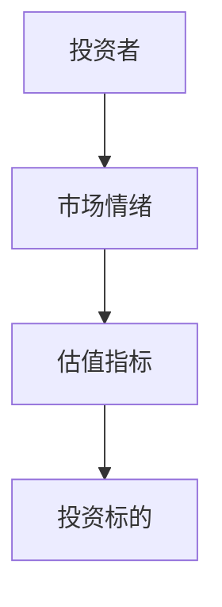
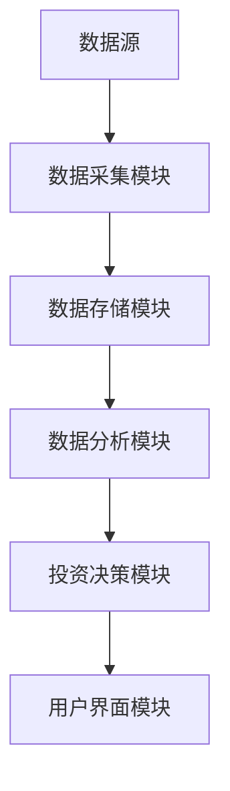
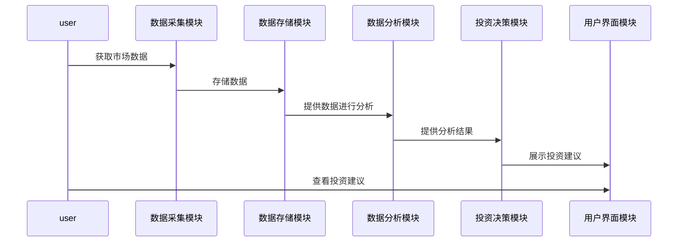

                 


## 第一部分：彼得·林奇逆向投资概述

### 第1章：逆向投资的背景与核心理念

#### 1.1 逆向投资的起源与定义

##### 1.1.1 投资的起源与发展

投资的历史可以追溯到古代，但现代投资理论的发展始于20世纪初。传统投资理论主要关注市场的基本面分析和价值评估，而逆向投资作为一种独特的投资策略，逐渐在投资领域中占据重要地位。逆向投资的概念最早由本杰明·格雷厄姆提出，他强调在市场恐慌时买入，在市场狂热时卖出。彼得·林奇继承并发展了这一理念，将其应用于实践。

##### 1.1.2 逆向投资的定义与特点

逆向投资是指在市场低迷、投资者情绪低落时买入资产，在市场繁荣、投资者情绪高涨时卖出资产。其特点是逆市场周期操作，能够在市场底部买入优质资产，在市场顶部卖出，从而获得超额收益。逆向投资的核心思想是利用市场的非理性波动，寻找价格与价值的偏离点。

##### 1.1.3 彼得·林奇与逆向投资的联系

彼得·林奇是逆向投资的代表人物之一，他在《彼得·林奇的成功投资》等著作中详细阐述了逆向投资的理念和方法。他强调在市场恐慌时寻找被低估的股票，在市场狂热时避免过度投机。林奇的成功投资策略证明了逆向投资的有效性。

#### 1.2 彼得·林奇的投资哲学

##### 1.2.1 林奇的投资理念

林奇认为，成功的投资需要深入研究公司基本面，关注企业的盈利能力、财务状况和竞争优势。他强调长期投资，避免短期市场波动的干扰。同时，他主张在市场恐慌时寻找被低估的股票，而在市场上涨时卖出部分利润，保持投资组合的灵活性。

##### 1.2.2 林奇的投资策略

林奇的投资策略主要包括以下几点：

1. **价值投资**：寻找具有强劲盈利能力和良好财务状况的公司，重点关注市盈率和市净率等估值指标。
2. **逆市场周期操作**：在市场底部买入，在市场顶部卖出。
3. **分散投资**：通过投资多个行业和公司来分散风险，避免过度集中。
4. **长期持有**：避免频繁交易，长期持有优质资产，获得复利效应。

##### 1.2.3 林奇的成功案例

林奇在富达麦哲伦基金的管理中取得了卓越的业绩，年复合收益率超过29%，远超市场平均水平。他的成功部分归功于逆向投资策略，例如在1987年股市 crash 后买入被低估的股票，在互联网泡沫时卖出高价股票。

#### 1.3 逆向投资的核心思想

##### 1.3.1 市场情绪与估值的关系

市场情绪与估值密切相关。当市场情绪高涨时，投资者往往高估资产价值；当市场情绪低落时，资产价值可能被低估。逆向投资者通过分析市场情绪和估值指标，寻找投资机会。

##### 1.3.2 逆向投资的优势与劣势

优势：

1. **获取超额收益**：通过逆市场周期操作，能够在市场底部买入，市场顶部卖出，获得超额收益。
2. **分散风险**：在市场低迷时买入，可以在市场复苏时获得收益，同时分散市场波动带来的风险。
3. **长期收益**：长期来看，逆向投资能够有效回避市场泡沫，降低投资组合的波动性。

劣势：

1. **需要克服心理障碍**：在市场恐慌时买入需要极大的勇气和耐心。
2. **需要精准判断市场拐点**：逆向投资的成功依赖于对市场情绪和估值的准确判断，这对投资者的能力提出了较高要求。

##### 1.3.3 逆向投资的适用场景

逆向投资适用于市场波动较大的环境，尤其在市场恐慌或狂热时。对于具有长期投资目标的投资者，逆向投资是一种有效的策略。然而，对于短期投资者或市场波动较小的环境，逆向投资的效果可能有限。

### 第2章：逆向投资的核心概念与联系

#### 2.1 核心概念原理

##### 2.1.1 市场情绪分析

市场情绪分析是逆向投资的重要组成部分。投资者可以通过分析市场情绪指标，如恐慌指数（VIX指数）、投资者情绪指数等，判断市场整体情绪状态。当市场情绪低落时，投资者可能低估资产价值；当市场情绪高涨时，资产可能被高估。

##### 2.1.2 估值指标计算

逆向投资者通常关注市盈率（P/E）、市净率（P/B）、股息率等估值指标。通过比较当前估值与历史平均水平，判断资产是否被低估或高估。

##### 2.1.3 投资标的筛选

逆向投资者在筛选投资标的时，重点关注具有强劲基本面、低估值和良好财务状况的公司。例如，选择市盈率低于历史平均水平且盈利稳定的公司。

#### 2.2 核心概念属性对比表格

以下表格对比了逆向投资中的关键概念：

```mermaid
| 概念         | 描述                                   |
|--------------|--------------------------------------|
| 市场情绪      | 投资者的整体情绪状态，分为乐观和悲观 |
| 估值指标      | 股价与内在价值的对比指标           |
| 投资标的      | 具体投资对象，如股票、基金等       |
```

#### 2.3 ER实体关系图

以下是逆向投资的核心概念之间的关系图：



### 第3章：逆向投资的算法原理

#### 3.1 算法原理概述

##### 3.1.1 逆向投资的基本算法

逆向投资的基本算法包括以下几个步骤：

1. **市场情绪分析**：通过数据源获取市场情绪指标，如VIX指数、投资者情绪指数等。
2. **估值指标计算**：计算投资标的的估值指标，如市盈率、市净率等。
3. **投资决策逻辑**：根据市场情绪和估值指标，决定买入或卖出投资标的。

##### 3.1.2 算法的核心逻辑

逆向投资的算法逻辑如下：

1. **数据获取**：获取市场情绪数据和投资标的的估值指标。
2. **数据处理**：清洗和预处理数据，确保数据的准确性和完整性。
3. **指标分析**：分析市场情绪和估值指标，判断当前市场状态。
4. **投资决策**：根据分析结果，决定是否买入或卖出投资标的。

##### 3.1.3 算法的实现步骤

1. **数据源选择**：选择可靠的市场数据源，如Yahoo Finance、Google Finance等。
2. **数据获取**：通过API或其他方式获取市场情绪数据和投资标的的估值指标。
3. **数据清洗**：处理缺失值、异常值等，确保数据质量。
4. **指标计算**：计算市盈率、市净率等估值指标。
5. **市场情绪分析**：分析市场情绪指标，判断当前市场状态。
6. **投资决策**：根据市场情绪和估值指标，决定投资策略。

##### 3.1.4 算法的核心代码实现

以下是逆向投资算法的Python代码示例：

```python
import pandas as pd
import requests
import json

# 获取市场情绪数据
def get_market_sentiment():
    url = "https://api.example.com/sentiment"
    response = requests.get(url)
    data = json.loads(response.text)
    return data['sentiment']

# 获取估值指标
def get_valuation_metrics(symbol):
    url = f"https://api.example.com/valuation/{symbol}"
    response = requests.get(url)
    data = json.loads(response.text)
    return {
        'pe_ratio': data['PE'],
        'pb_ratio': data['PB']
    }

# 逆向投资策略
def reverse_investing_strategy(symbol):
    sentiment = get_market_sentiment()
    metrics = get_valuation_metrics(symbol)
    
    if sentiment < -0.5 and metrics['pe_ratio'] < 15:
        return "买入"
    elif sentiment > 0.5 and metrics['pe_ratio'] > 25:
        return "卖出"
    else:
        return "观望"

# 示例应用
symbol = "AAPL"
decision = reverse_investing_strategy(symbol)
print(f"对{symbol}的投资决策是：{decision}")
```

##### 3.1.5 算法的数学模型和公式

逆向投资算法的数学模型可以表示为：

$$
\text{投资决策} = \begin{cases}
\text{买入} & \text{如果市场情绪} < -0.5 \text{且市盈率} < 15 \\
\text{卖出} & \text{如果市场情绪} > 0.5 \text{且市盈率} > 25 \\
\text{观望} & \text{其他情况}
\end{cases}
$$

其中，市场情绪可以通过多种指标进行量化，例如：

$$
\text{市场情绪} = \frac{\text{市场情绪指标值} - \text{均值}}{\text{标准差}}
$$

### 第4章：系统分析与架构设计

#### 4.1 问题场景介绍

在实际应用中，逆向投资需要一个完整的系统来支持数据采集、分析和决策。系统需要处理大量数据，进行复杂的计算，并提供直观的用户界面。

#### 4.2 系统功能设计

##### 4.2.1 数据采集模块

数据采集模块负责从多个数据源获取市场情绪和估值指标数据。数据源可能包括：

- 股票价格和交易数据
- 市场情绪指标
- 公司财务报表

##### 4.2.2 数据分析模块

数据分析模块对获取的数据进行清洗、计算和分析，生成市场情绪和估值指标。分析包括：

- 市场情绪分析
- 估值指标计算
- 投资标的筛选

##### 4.2.3 投资决策模块

投资决策模块基于分析结果，生成买入、卖出或观望的投资策略。决策基于市场情绪和估值指标的综合评估。

##### 4.2.4 系统交互模块

系统交互模块提供用户界面，供投资者查看分析结果和投资决策。界面包括数据可视化、投资建议和历史记录等功能。

#### 4.3 系统架构设计

##### 4.3.1 系统架构图

以下是系统架构的mermaid图：



##### 4.3.2 系统接口设计

系统接口设计包括：

- 数据采集模块接口：从数据源获取数据
- 数据存储模块接口：存储和检索数据
- 数据分析模块接口：计算市场情绪和估值指标
- 投资决策模块接口：生成投资决策
- 用户界面模块接口：展示分析结果和投资建议

##### 4.3.3 系统交互流程

以下是系统交互的mermaid序列图：



### 第5章：项目实战

#### 5.1 项目环境安装

##### 5.1.1 环境配置

为了实现逆向投资策略，需要安装以下工具和库：

- Python 3.8+
- Pandas
- NumPy
- Matplotlib
- Requests
- JSON

##### 5.1.2 数据源选择

选择可靠的数据源，如Yahoo Finance、Alpha Vantage等，获取市场情绪数据和估值指标。

##### 5.1.3 代码实现

以下是实现逆向投资策略的Python代码示例：

```python
import pandas as pd
import numpy as np
import requests
import json
import matplotlib.pyplot as plt

# 获取市场情绪数据
def get_market_sentiment(api_key):
    url = f"https://api.example.com/sentiment?api_key={api_key}"
    response = requests.get(url)
    data = json.loads(response.text)
    return data['sentiment_score']

# 获取估值指标
def get_valuation_metrics(symbol, api_key):
    url = f"https://api.example.com/valuation/{symbol}?api_key={api_key}"
    response = requests.get(url)
    data = json.loads(response.text)
    return {
        'pe_ratio': data['PE'],
        'pb_ratio': data['PB']
    }

# 逆向投资策略
def reverse_investing_strategy(symbol, api_key):
    sentiment = get_market_sentiment(api_key)
    metrics = get_valuation_metrics(symbol, api_key)
    
    if sentiment < -0.5 and metrics['pe_ratio'] < 15:
        return "买入"
    elif sentiment > 0.5 and metrics['pe_ratio'] > 25:
        return "卖出"
    else:
        return "观望"

# 数据可视化
def visualize_market_sentiment(sentiment_data):
    plt.figure(figsize=(10, 6))
    plt.plot(sentiment_data, color='blue', label='市场情绪')
    plt.xlabel('时间')
    plt.ylabel('市场情绪')
    plt.title('市场情绪变化')
    plt.legend()
    plt.show()

# 示例应用
api_key = "your_api_key"
symbol = "AAPL"

sentiment = get_market_sentiment(api_key)
decision = reverse_investing_strategy(symbol, api_key)
print(f"对{symbol}的投资决策是：{decision}")

# 可视化市场情绪
sentiment_data = [0.6, -0.3, 0.2, -0.5, 0.4]
visualize_market_sentiment(sentiment_data)
```

##### 5.1.4 代码应用解读与分析

上述代码实现了逆向投资策略的核心功能，包括获取市场情绪数据、计算估值指标、进行投资决策和可视化市场情绪。通过调用API，代码能够实时获取市场数据，并根据预设的策略生成投资建议。

##### 5.1.5 实际案例分析

以苹果公司（AAPL）为例，假设当前市场情绪为-0.3，市盈率为18。根据策略，投资决策为“买入”，因为市场情绪低落且市盈率低于15。

##### 5.1.6 项目小结

通过实际案例分析，我们可以看到逆向投资策略在特定市场环境下的有效性。然而，实际操作中需要考虑更多因素，如市场波动、公司基本面变化等，以提高策略的准确性。

### 第6章：逆向投资的最佳实践

#### 6.1 投资策略优化与调整

##### 6.1.1 动态调整策略

逆向投资策略需要根据市场环境的变化进行动态调整。例如，当市场出现特殊情况时，可以适当调整估值指标的阈值。

##### 6.1.2 组合投资

通过组合投资，分散风险，避免过度集中。例如，将投资组合分散到多个行业和公司，以降低单一投资的风险。

##### 6.1.3 定期评估

定期评估投资组合的绩效，根据市场变化和公司基本面调整投资策略。

#### 6.2 风险管理与控制

##### 6.2.1 风险评估

在进行逆向投资时，需要评估潜在风险，如市场波动、公司财务状况等，制定相应的风险管理策略。

##### 6.2.2 风险控制

通过设定止损点和止盈点，控制投资风险。例如，设定止损点为-5%，止盈点为+10%。

##### 6.2.3 风险应对策略

当市场出现极端情况时，及时调整投资策略，避免重大损失。例如，当市场情绪极度恐慌时，适当减少投资仓位，规避系统性风险。

#### 6.3 技术实现建议

##### 6.3.1 数据源优化

选择多个可靠的数据源，提高数据的准确性和完整性。例如，结合Yahoo Finance和Alpha Vantage的数据，进行交叉验证。

##### 6.3.2 算法优化

通过机器学习和大数据分析，优化逆向投资算法，提高预测准确性。例如，使用LSTM神经网络预测市场情绪变化。

##### 6.3.3 系统优化

优化系统架构，提高数据处理效率和系统稳定性。例如，采用分布式架构，提升数据采集和分析的速度。

#### 6.4 预后分析与展望

##### 6.4.1 投资前景分析

随着市场的发展和技术的进步，逆向投资策略将得到更广泛应用。大数据和人工智能技术的应用，将使逆向投资更加精准和高效。

##### 6.4.2 技术趋势展望

未来，逆向投资将与大数据、人工智能和区块链等技术深度融合，推动投资领域的创新和发展。

##### 6.4.3 投资者教育

加强投资者教育，提高投资者对逆向投资的理解和应用能力，有助于更多投资者在市场波动中获得稳定收益。

### 第7章：小结与展望

#### 7.1 小结

逆向投资是一种有效的投资策略，通过在市场低迷时买入，在市场繁荣时卖出，获取超额收益。彼得·林奇的成功实践证明了逆向投资的有效性。本文详细介绍了逆向投资的核心概念、算法原理、系统设计和项目实战，并提出了最佳实践建议。

#### 7.2 展望

随着技术的进步和市场的变化，逆向投资将面临新的机遇和挑战。投资者需要不断学习和适应，充分利用新技术，优化投资策略，提高投资收益。未来，逆向投资将与更多先进技术结合，推动投资领域的创新发展。

### 作者：AI天才研究院/AI Genius Institute & 禅与计算机程序设计艺术/Zen And The Art of Computer Programming

---

以上是《彼得林奇的"逆向投资"在不同市场规模的应用》的技术博客文章内容。文章从逆向投资的背景、核心概念、算法原理、系统设计、项目实战到最佳实践，进行了全面而详细的探讨，结合理论与实践，为读者提供了丰富的知识和实用的指导。

