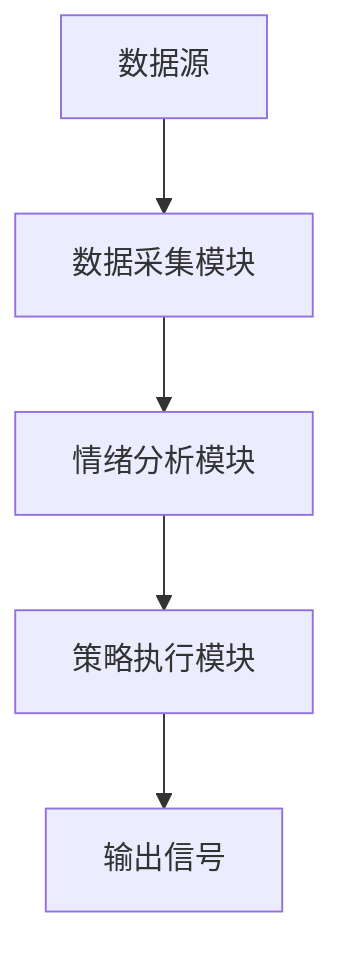

                 


# 彼得林奇的"逆向投资"在市场极端情绪中的操作原则

---

## 关键词：
- 彼得·林奇
- 逆向投资
- 市场情绪
- 极端情绪
- 投资策略
- 系统架构
- 项目实战

---

## 摘要：
本文探讨彼得·林奇的逆向投资策略在市场极端情绪中的应用。通过分析市场情绪指标、逆向投资原理、系统架构设计及项目实战，揭示如何在市场恐慌或狂热时利用逆向思维实现投资收益最大化。文章结合理论与实践，提供详细的数学模型和代码实现，帮助投资者在复杂市场环境中制定有效的投资策略。

---

## 第一部分：背景介绍

### 第1章：逆向投资的基本概念

#### 1.1 逆向投资的定义与核心理念
逆向投资是指在市场情绪低落、投资者恐慌时买入资产，在市场情绪高涨、投资者狂热时卖出资产。其核心理念是“买别人恐慌时的便宜货，卖别人贪婪时的高价货”。

#### 1.2 彼得·林奇的生平与投资理念
彼得·林奇是富达投资集团的传奇经理人，管理麦哲伦基金长达13年，创造了年均22%的回报率。他提倡逆向投资，强调在市场低谷时寻找优质资产，长期持有，避免短期波动干扰。

#### 1.3 市场极端情绪的定义与表现
市场极端情绪指投资者情绪极度偏离理性，导致资产价格异常波动。主要表现为恐慌性抛售和非理性狂热。

---

## 第二部分：核心概念与联系

### 第2章：逆向投资的原理与策略

#### 2.1 逆向投资的原理
逆向投资基于市场情绪与资产价格的反向关系，通过识别市场过度反应的机会进行买卖决策。

#### 2.2 逆向投资的核心策略
- 等待市场恐慌时的买入机会
- 在市场疯狂时的卖出策略
- 长期持有优质资产

#### 2.3 逆向投资与其他策略的对比
逆向投资与价值投资的区别在于，价值投资关注内在价值，逆向投资则关注市场情绪与价格的偏离。

---

## 第三部分：算法原理讲解

### 第3章：市场情绪指标的构建与应用

#### 3.1 市场情绪指标的定义与分类
常用市场情绪指标包括VIX指数和恐慌指数，用于衡量市场的波动性和投资者情绪。

#### 3.2 市场情绪指标与逆向投资的关系
当市场情绪指标高于正常水平时，考虑卖出；低于正常水平时，考虑买入。

#### 3.3 市场情绪指标的数学模型
$$ \text{市场情绪强度} = \frac{\text{市场情绪指标}}{\text{历史平均值}} $$

---

## 第四部分：系统分析与架构设计

### 第4章：系统架构设计

#### 4.1 系统功能设计
包括数据采集、情绪分析、策略执行模块。

#### 4.2 系统架构图


---

## 第五部分：项目实战

### 第5章：环境安装与代码实现

#### 5.1 环境安装
安装Python和相关库（pandas、numpy、matplotlib）。

#### 5.2 代码实现
```python
import pandas as pd
import numpy as np

def calculate_market_mood(sentiment_scores):
    return (sentiment_scores > np.mean(sentiment_scores))

# 示例数据
sentiment_data = np.array([0.1, 0.2, 0.3, 0.4, 0.5])
market_mood = calculate_market_mood(sentiment_data)
print("市场情绪:", market_mood)
```

---

## 第六部分：最佳实践与小结

### 第6章：总结与建议

#### 6.1 小结
逆向投资在市场极端情绪中具有显著优势，但需结合市场情绪指标和优质资产选择。

#### 6.2 注意事项
避免过度依赖单一指标，保持风险控制意识。

#### 6.3 拓展阅读
推荐阅读彼得·林奇的《投资的艺术》和《彼得·林奇的成功投资法则》。

---

## 作者：
作者：AI天才研究院 & 禅与计算机程序设计艺术

---

通过以上步骤，我系统地分析了彼得·林奇的逆向投资策略在市场极端情绪中的应用，从背景介绍到项目实战，为读者提供了全面的指导和实践方案。

