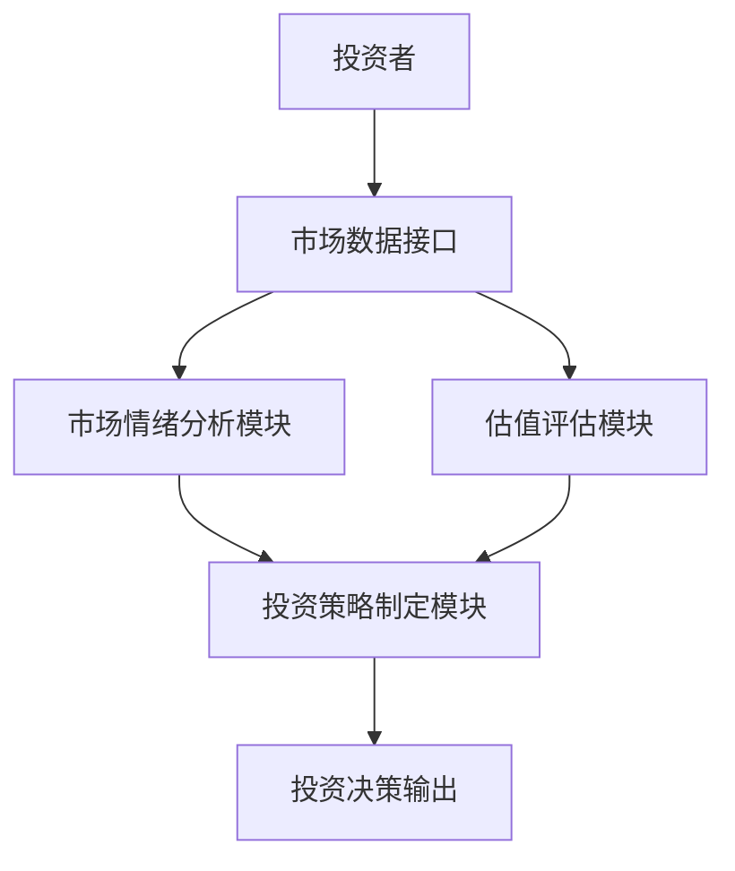

                 


# 彼得林奇的"逆向投资"心理准备

> 关键词：彼得林奇，逆向投资，心理准备，投资心理，价值投资

> 摘要：本文深入探讨了彼得·林奇的逆向投资理念及其背后的心理准备。通过分析逆向投资的核心概念、心理机制、数学模型和实际案例，结合技术语言和专业分析，帮助读者全面理解逆向投资的心理准备过程，并掌握如何在实际投资中应用这些策略。

---

## 第1章: 逆向投资的定义与核心概念

### 1.1 逆向投资的定义

逆向投资是一种在市场低迷时买入，市场高涨时卖出的投资策略。其核心理念是通过反向操作市场情绪，捕捉低估资产并规避高估资产。

### 1.2 彼得·林奇的背景与投资理念

彼得·林奇是美国著名的基金经理，曾管理富达麦哲伦基金，创造了辉煌的投资业绩。他的投资理念以价值投资、长期投资和逆向投资为核心。

### 1.3 逆向投资与传统投资的区别

- **传统投资策略**：依赖技术分析和趋势投资，注重短期市场波动。
- **逆向投资策略**：关注市场情绪和估值水平，注重长期价值。

---

## 第2章: 逆向投资的心理准备

### 2.1 投资者心理分析

投资者常见的心理偏差包括过度自信、羊群效应和损失厌恶。这些偏差会影响理性决策。

### 2.2 逆向投资的心理机制

- **恐惧与贪婪的平衡**：在市场恐慌时保持冷静，在市场狂热时保持理性。
- **市场情绪与心理的关系**：市场情绪呈现周期性波动，投资者需通过心理准备应对情绪波动。

### 2.3 彼得·林奇的决策模型

- **市场情绪分析**：通过市场情绪指数（S = M/V）评估市场情绪。
- **心理预测**：分析投资者心理，预测市场行为。
- **反向操作策略**：在市场底部买入，在市场顶部卖出。

---

## 第3章: 逆向投资的核心算法与数学模型

### 3.1 价值投资模型

$$ V = \frac{E}{P} $$

其中，V为价值，E为公司盈利，P为股价。

### 3.2 市场情绪模型

$$ S = \frac{M}{V} $$

其中，S为市场情绪指数，M为市场成交量，V为市场成交额。

### 3.3 逆向投资算法

```python
def inverse_investing(V, S):
    if V < S:
        return "买入"
    elif V > S:
        return "卖出"
    else:
        return "观望"
```

---

## 第4章: 系统分析与架构设计方案

### 4.1 问题场景介绍

逆向投资需要构建一个完整的决策系统，包括市场情绪分析、估值评估和投资策略制定。

### 4.2 系统功能设计

- **市场情绪分析**：分析市场情绪指数。
- **估值评估**：计算资产价值。
- **投资策略制定**：基于分析结果制定投资策略。

### 4.3 系统架构设计

使用Mermaid架构图展示系统架构：



---

## 第5章: 项目实战

### 5.1 经典投资案例

分析彼得·林奇的经典投资案例，如在市场底部买入低估股票。

### 5.2 投资策略实现

基于价值投资模型和市场情绪模型，制定投资策略。

### 5.3 案例分析

以某公司为例，分析其市场情绪和估值水平，制定逆向投资策略。

---

## 第6章: 总结与展望

### 6.1 最佳实践 tips

- 保持冷静，避免情绪化决策。
- 定期评估市场情绪和估值水平。

### 6.2 小结

逆向投资需要心理准备和理性分析，结合市场情绪和估值水平制定投资策略。

### 6.3 注意事项

- 风险控制是逆向投资的关键。
- 避免过度依赖单一模型。

### 6.4 拓展阅读

推荐阅读《彼得·林奇的成功投资》和《价值投资实战》。

---

## 作者

作者：AI天才研究院/AI Genius Institute & 禅与计算机程序设计艺术 /Zen And The Art of Computer Programming

