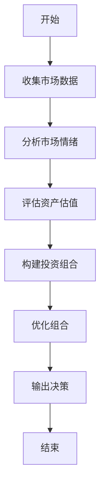
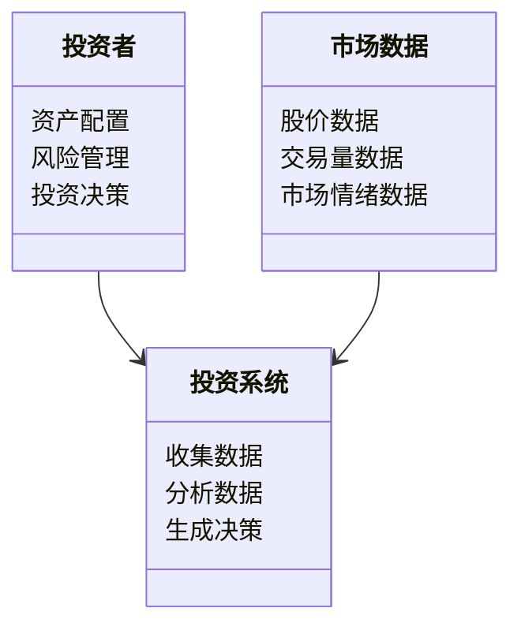
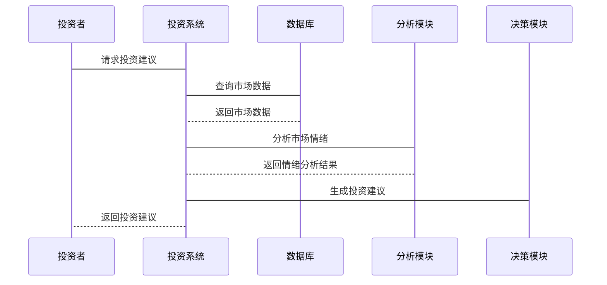

                 


# 彼得林奇的"逆向投资"思想

## 关键词：逆向投资，彼得林奇，价值投资，风险管理，算法模型，系统架构

## 摘要：  
彼得林奇作为全球最著名的逆向投资者之一，提出了许多深刻的逆向投资理念。本文从逆向投资的背景、核心思想、策略方法、数学模型、系统架构以及项目实战等多个角度，详细分析了逆向投资的精髓。通过结合技术分析和算法模型，本文展示了如何将逆向投资思想应用于实际投资中，为投资者提供了一个全面而深入的指导。

---

# 第一部分: 逆向投资的背景与核心概念

## 第1章: 逆向投资的背景与核心概念

### 1.1 逆向投资的定义与特点
#### 1.1.1 逆向投资的定义
逆向投资是一种与传统投资思路相反的投资策略。它强调在市场低迷、投资者情绪低落时买入资产，在市场繁荣、投资者情绪高涨时卖出资产。逆向投资的核心理念是“别人恐惧时我贪婪，别人贪婪时我恐惧”。

#### 1.1.2 逆向投资的核心特点
- **反周期性**：逆向投资关注市场的周期性波动，寻找市场底部和顶部。
- **价值导向**：逆向投资者注重资产的内在价值，而非市场的短期波动。
- **逆向思维**：逆向投资者在市场恐慌时寻找机会，在市场狂热时保持冷静。

#### 1.1.3 逆向投资与传统投资的区别
| 特性         | 逆向投资           | 传统投资           |
|--------------|--------------------|--------------------|
| 投资时机     | 低谷时买入，高点时卖出 | 高涨时买入，低谷时卖出 |
| 风险偏好     | 低风险偏好         | 高风险偏好         |
| 投资心态     | 逆向思维，冷静理性   | 顺向思维，跟随市场 |

### 1.2 彼得林奇与逆向投资
#### 1.2.1 彼得林奇的生平简介
彼得·林奇（Peter Lynch）是美国著名投资家，曾管理富达麦哲伦基金，创造了年化29%的惊人回报率。他以选股能力强、注重基本面分析而闻名。

#### 1.2.2 彼得林奇的投资理念
彼得林奇强调长期投资、价值投资和分散投资。他认为，市场短期是投票机，长期才是称重机。逆向投资正是他理念的体现。

#### 1.2.3 彼得林奇对逆向投资的贡献
彼得林奇通过实践证明了逆向投资的有效性。他指出，在市场恐慌时，许多优质资产会被错杀，此时买入是最佳时机。

### 1.3 逆向投资的背景与现状
#### 1.3.1 逆向投资的市场背景
2008年金融危机后，市场波动加剧，为逆向投资提供了更多机会。近年来，全球市场的不确定性增加，逆向投资理念逐渐被更多投资者接受。

#### 1.3.2 逆向投资的现状分析
当前，逆向投资已成为机构投资者的重要策略之一。然而，普通投资者在实践中容易受到情绪影响，难以真正践行逆向投资。

#### 1.3.3 逆向投资的未来发展
随着大数据和人工智能技术的发展，逆向投资将更加依赖于算法模型和数据分析。技术进步将帮助投资者更好地捕捉市场拐点。

---

## 第2章: 逆向投资的核心思想

### 2.1 市场情绪与逆向思维
#### 2.1.1 市场情绪的波动性
市场情绪受投资者心理影响，往往呈现周期性波动。恐慌和贪婪是市场情绪的极端表现。

#### 2.1.2 逆向思维的定义与应用
逆向思维是指在市场情绪与价值判断相悖时，选择与大多数人相反的操作。例如，在市场恐慌时买入优质资产。

#### 2.1.3 市场情绪与投资决策的关系
市场情绪是投资决策的重要参考，但不应成为决定因素。逆向投资者需要独立思考，避免被情绪牵制。

### 2.2 价值投资与成长投资的结合
#### 2.2.1 价值投资的核心理念
价值投资强调购买价格低于内在价值的资产。逆向投资在市场低迷时，正好可以买到被低估的资产。

#### 2.2.2 成长投资的核心理念
成长投资关注公司未来增长潜力，适合长期看好某一行业的投资者。逆向投资结合成长投资，可以在市场低谷时买入优质成长股。

#### 2.2.3 逆向投资如何结合价值与成长投资
逆向投资者需要同时关注资产的内在价值和成长潜力。例如，在市场低迷时买入估值低、成长性好的股票。

### 2.3 风险管理与逆向投资
#### 2.3.1 风险管理的重要性
逆向投资虽然收益高，但风险也较大。有效的风险管理是保证投资成功的关键。

#### 2.3.2 逆向投资中的风险管理策略
- 分散投资：避免过度集中于某一资产或行业。
- 设置止损：在市场反转时及时止损，避免重大损失。
- 严格纪律：坚持逆向策略，避免情绪化操作。

#### 2.3.3 风险管理与投资回报的关系
良好的风险管理可以降低投资失败的概率，从而提高长期投资回报。逆向投资的成功离不开有效的风险管理。

---

## 第3章: 逆向投资的策略与方法

### 3.1 逆向投资的策略分析
#### 3.1.1 逆向投资的主要策略
- **估值策略**：寻找价格低于内在价值的资产。
- **趋势策略**：在市场趋势反转时进行投资。
- **情绪策略**：在市场情绪极端时进行逆向操作。

#### 3.1.2 逆向投资的实施步骤
1. 确定投资目标：明确投资目的和风险承受能力。
2. 分析市场情绪：通过技术指标和市场数据判断市场状态。
3. 寻找低估资产：筛选价格低于价值的资产。
4. 建立投资组合：分散投资，降低风险。
5. 持股待涨：耐心持有，等待市场反转。

#### 3.1.3 逆向投资的优缺点分析
| 特性         | 优点           | 缺点           |
|--------------|----------------|----------------|
| 收益潜力     | 高             | 高风险         |
| 投资期限     | 长             | 需长期持有     |
| 市场依赖性   | 低             | 高             |

### 3.2 逆向投资的实战技巧
#### 3.2.1 如何识别市场拐点
- **技术分析**：通过K线图、均线、成交量等指标判断市场趋势。
- **基本面分析**：关注宏观经济指标和公司财务数据。
- **市场情绪分析**：通过新闻、社交媒体等判断市场情绪。

#### 3.2.2 如何挖掘被低估的投资机会
- **筛选低估值股票**：使用市盈率、市净率等指标筛选。
- **关注行业周期**：在行业低谷期寻找优质公司。
- **分散投资**：避免过度集中。

#### 3.2.3 逆向投资中的常见误区
- 过度乐观：忽视市场风险，盲目追涨杀跌。
- 情绪化操作：被市场情绪左右，违背投资策略。
- 缺乏耐心：急于求成，未能长期持有。

### 3.3 逆向投资组合的构建
#### 3.3.1 投资组合的基本概念
投资组合是指投资者持有的多种资产，通过分散投资降低风险。

#### 3.3.2 逆向投资组合的构建原则
- **分散化**：避免过度集中。
- **逆向配置**：在市场低谷时增加仓位，市场高位时减少仓位。
- **动态调整**：定期评估组合，根据市场变化进行调整。

#### 3.3.3 逆向投资组合的优化与调整
- 定期评估：每季度或每年评估组合表现。
- 重新平衡：根据市场变化调整资产配置。
- 灵活应对：根据市场环境变化，及时调整策略。

---

## 第4章: 逆向投资的数学模型与算法原理

### 4.1 逆向投资的数学模型
#### 4.1.1 投资回报的数学公式
投资回报率（ROI）=（最终价值 - 初始价值）/ 初始价值 × 100%

#### 4.1.2 风险与收益的数学关系
标准差衡量投资收益的波动性，标准差越大，投资风险越高。

#### 4.1.3 投资组合优化的数学模型
Markowitz有效前沿模型用于优化投资组合，最小化风险或最大化收益。

### 4.2 逆向投资的算法原理
#### 4.2.1 市场情绪分析算法
- 使用自然语言处理（NLP）分析新闻和社交媒体，判断市场情绪。
- 通过情绪指数（如恐慌指数）量化市场情绪。

#### 4.2.2 投资决策模型
基于市场情绪和资产估值，构建投资决策模型，指导买卖时机。

#### 4.2.3 逆向投资组合优化算法
使用数学优化算法（如遗传算法）优化投资组合，最大化收益或最小化风险。

### 4.3 算法流程图


### 4.4 逆向投资的数学公式
- **市场情绪指数计算**：
  $$ 情绪指数 = \frac{\sum \text{情感得分}}{\text{数据量}} $$
- **投资组合优化**：
  $$ \min \sigma^2 \quad \text{subject to} \quad \mu \geq \text{目标收益} $$

---

## 第5章: 逆向投资的系统架构设计

### 5.1 系统功能设计
#### 5.1.1 领域模型（Mermaid 类图）


#### 5.1.2 系统架构设计（Mermaid 架构图）
```mermaid
archi
    网络层 --> 数据库层
    数据库层 --> 业务逻辑层
    业务逻辑层 --> 表现层
    表现层 --> 投资者
```

#### 5.1.3 系统接口设计
- 数据接口：收集市场数据（API）。
- 决策接口：生成投资信号（API）。
- 展示接口：向投资者展示投资建议。

#### 5.1.4 系统交互设计（Mermaid 序列图）


---

## 第6章: 逆向投资的项目实战

### 6.1 项目环境安装
- 数据库：MySQL 或 PostgreSQL。
- 开发工具：Python、Jupyter Notebook。
- 依赖库：pandas、numpy、scikit-learn。

### 6.2 核心代码实现
```python
import pandas as pd
import numpy as np
from sklearn import linear_model

# 示例数据加载
data = pd.read_csv('market_data.csv')

# 市场情绪分析
def calculate_sentiment(data):
    # 简单示例：计算涨跌天数比例
    up_days = data[data['收盘价'] > data['开盘价']].shape[0]
    down_days = data[data['收盘价'] < data['开盘价']].shape[0]
    return up_days / (up_days + down_days)

# 逆向投资信号生成
def generate_signal(data, threshold=0.5):
    sentiment = calculate_sentiment(data)
    if sentiment < threshold:
        return '买入'
    else:
        return '卖出'

# 示例信号生成
signal = generate_signal(data)
print(f'投资信号：{signal}')
```

### 6.3 代码应用解读与分析
- **数据加载**：从CSV文件加载市场数据。
- **市场情绪分析**：通过涨跌天数比例计算市场情绪。
- **投资信号生成**：根据情绪指标生成买入或卖出信号。

### 6.4 实际案例分析
假设当前市场情绪指数为0.4，低于阈值0.5，系统生成买入信号。投资者可以在市场低迷时买入优质资产，等待市场反转。

### 6.5 项目小结
通过代码实现，我们可以自动化地进行市场情绪分析和投资信号生成，帮助投资者更好地践行逆向投资策略。

---

## 第7章: 最佳实践与总结

### 7.1 最佳实践
- **长期视角**：逆向投资需要耐心和长期持有。
- **风险管理**：严格控制仓位和风险，避免重大损失。
- **技术辅助**：利用数据分析和算法模型提升投资决策的科学性。

### 7.2 小结
逆向投资是一种有效的投资策略，但需要结合市场环境和风险管理。通过技术手段辅助逆向投资，可以帮助投资者更好地捕捉市场机会，实现长期收益。

### 7.3 注意事项
- 避免过度依赖算法，保持独立思考。
- 定期评估和调整投资组合，适应市场变化。
- 严格遵守投资纪律，避免情绪化操作。

### 7.4 拓展阅读
- 彼得林奇的《击败市场的秘诀》
- 《算法交易：策略开发与实施》
- 《投资心理学》

---

## 作者：AI天才研究院/AI Genius Institute & 禅与计算机程序设计艺术/Zen And The Art of Computer Programming

---

通过本文，我们深入探讨了彼得林奇的逆向投资思想，并结合技术分析和算法模型，展示了如何将这一理念应用于实际投资中。希望本文能为投资者提供有价值的指导，帮助他们在复杂多变的市场中实现稳健的投资回报。

