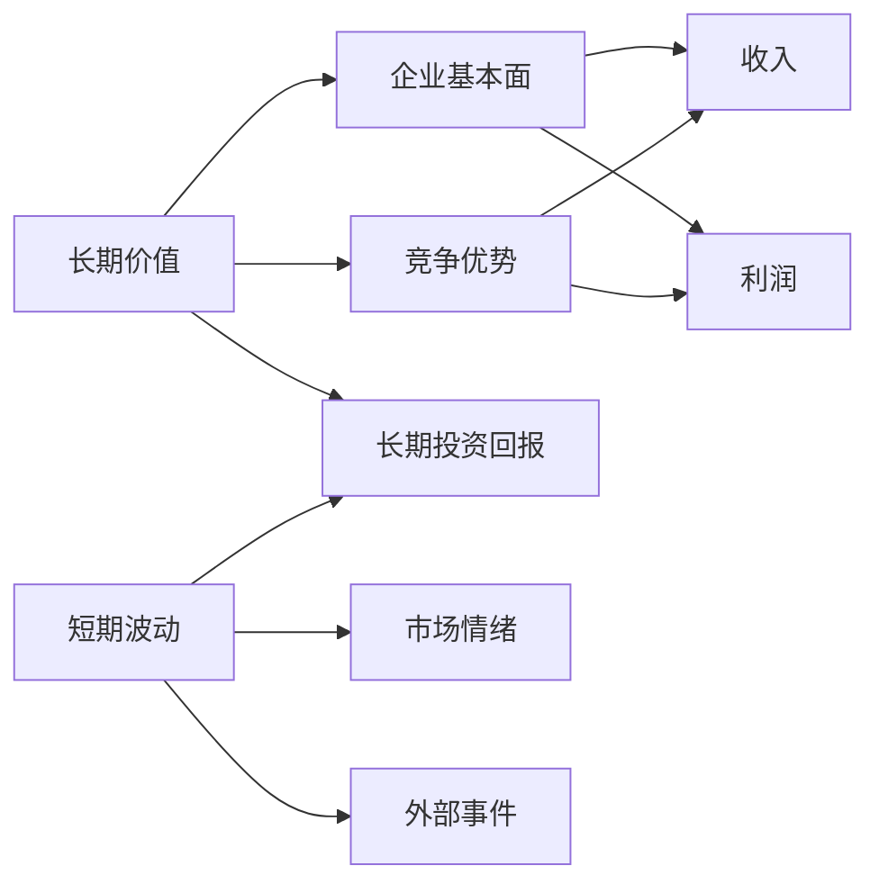
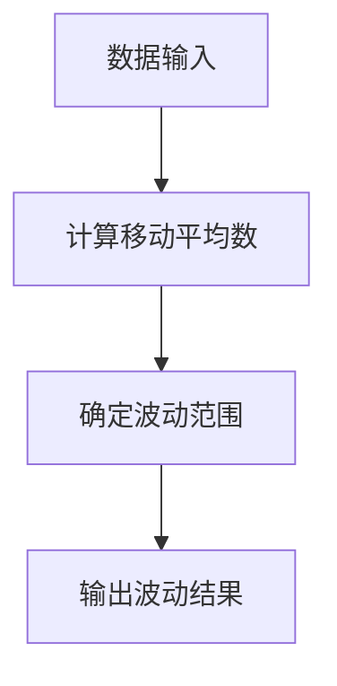
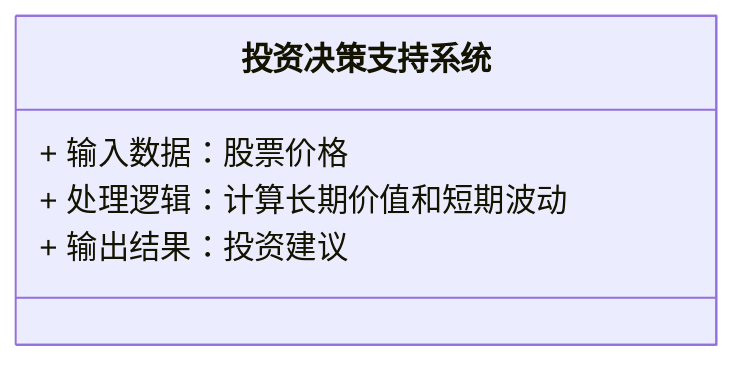
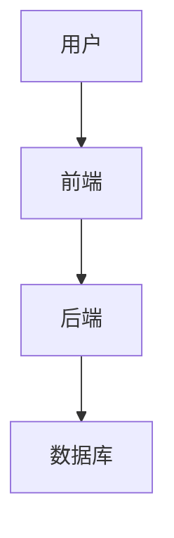

                 


# 彼得林奇的"长期价值"vs"短期波动"

## 关键词：
彼得林奇，长期价值，短期波动，投资策略，股票分析，波动率

## 摘要：
本文深入探讨了彼得林奇在投资中强调的“长期价值”与“短期波动”的关系，分析了两者在投资决策中的作用，并通过算法和数学模型对这两种概念进行了详细解读。文章结合实际案例，展示了如何在投资中平衡长期价值与短期波动，以实现稳健的投资回报。

---

# 第一部分：背景与概念

## 第1章：长期价值与短期波动的定义与背景

### 1.1 长期价值的定义与核心要素
长期价值是指企业在未来较长一段时间内的盈利能力、增长潜力和竞争优势。它关注企业的基本面，如收入、利润、市场份额和管理团队等。长期价值的核心在于企业本身的价值，而非市场的短期波动。

- **长期价值的关键特征**：
  - 稳定性：企业长期盈利能力的稳定性。
  - 持续性：企业的竞争优势能够在较长时期内保持。
  - 可预测性：企业未来财务状况的可预测性。

### 1.2 短期波动的定义与特征
短期波动是指市场在短时间内由于情绪、市场参与者的买卖行为或外部事件导致的价格波动。短期波动的核心在于市场的短期行为和市场参与者的心理预期。

- **短期波动的关键特征**：
  - 不可预测性：短期波动通常难以预测，受到市场情绪和外部事件的影响。
  - 短暂性：波动通常在短时间内发生，但影响可能迅速消散。
  - 可能性：短期波动可能带来收益或损失，但通常不具备持续性。

### 1.3 长期价值与短期波动的关系
长期价值与短期波动在投资中是辩证统一的。长期价值是投资的核心，而短期波动则是市场中不可避免的现象。投资者需要在长期价值的基础上，关注短期波动的影响，以优化投资决策。

---

# 第二部分：核心概念与联系

## 第2章：长期价值与短期波动的核心原理

### 2.1 长期价值的形成机制
长期价值的形成依赖于企业的基本面因素，包括收入增长、利润率、市场份额和管理团队等。企业的长期价值是其内在价值的体现，通常通过财务指标和行业分析来评估。

#### 图表：长期价值与短期波动的对比分析
| **属性**       | **长期价值**                      | **短期波动**                      |
|-----------------|-----------------------------------|-----------------------------------|
| 时间框架       | 长期（数年或更长时间）            | 短期（数周或数月）                |
| 关注点         | 企业的基本面、竞争优势            | 市场情绪、外部事件                |
| 可预测性       | 较高                             | 较低                             |
| 影响因素       | 收入、利润、市场份额、管理团队    | 市场情绪、外部事件、宏观经济因素  |

### 2.2 短期波动的核心要素
短期波动的核心在于市场参与者的情绪和行为。短期波动通常由市场情绪的变化、突发事件或外部环境的变化引发，具有较强的不可预测性。

#### 图表：长期价值与短期波动的联系


---

# 第三部分：算法原理讲解

## 第3章：长期价值与短期波动的算法分析

### 3.1 短期波动的算法模型
短期波动可以通过时间序列分析来建模，例如使用移动平均数（Moving Average）来预测价格波动。

#### 图表：短期波动的算法流程


#### Python代码实现
```python
import pandas as pd

def calculate_fluctuation(prices, window=20):
    # 计算移动平均数
    ma = prices.rolling(window=window).mean()
    # 计算波动范围
    fluctuation = prices - ma
    return fluctuation

# 示例数据
prices = pd.Series([100, 105, 98, 110, 108])
window = 3

# 计算波动
fluctuation = calculate_fluctuation(prices, window)
print(fluctuation)
```

### 3.2 长期价值的数学模型
长期价值可以通过 discounted cash flow (DCF) 模型来评估企业的内在价值。

#### 图表：DCF模型的数学公式
$$DCF = \sum_{t=1}^{n} \frac{CF_t}{(1 + r)^t}$$

其中：
- \( CF_t \)：第 \( t \) 年的现金流
- \( r \)：折现率
- \( n \)：预测期

---

# 第四部分：系统分析与架构设计方案

## 第4章：投资决策支持系统的架构设计

### 4.1 系统功能设计
- **输入**：股票价格数据、市场数据。
- **处理**：计算长期价值和短期波动。
- **输出**：投资建议。

#### 图表：系统功能设计


### 4.2 系统架构设计
- **前端**：用户界面。
- **后端**：算法处理。
- **数据库**：存储历史数据。

#### 图表：系统架构图


---

# 第五部分：项目实战

## 第5章：基于长期价值的股票筛选系统

### 5.1 环境安装
- Python 3.8+
- Pandas、NumPy库。

### 5.2 核心代码实现
```python
import pandas as pd
import numpy as np

def calculate_long_term_value(prices, window=50):
    # 计算移动平均数
    ma = prices.rolling(window=window).mean()
    # 计算长期价值
    lt_value = ma * 1.2  # 示例：长期价值是移动平均数的1.2倍
    return lt_value

# 示例数据
prices = pd.Series([100, 105, 98, 110, 108])
window = 50

# 计算长期价值
lt_value = calculate_long_term_value(prices, window)
print(lt_value)
```

### 5.3 案例分析
通过实际案例分析，展示如何基于长期价值进行股票筛选，并结合短期波动进行投资决策。

---

# 第六部分：最佳实践

## 第6章：长期价值与短期波动的投资策略

### 6.1 小结
- 长期价值是投资的核心，短期波动是市场的波动。
- 投资者需要在长期价值的基础上，关注短期波动的影响。

### 6.2 注意事项
- 避免过度关注短期波动。
- 长期价值投资需要耐心和信心。

### 6.3 拓展阅读
- 彼得·林奇的《投资任何股票的秘诀》
- 投资学经典教材：《证券分析》

---

# 作者信息

作者：AI天才研究院/AI Genius Institute & 禅与计算机程序设计艺术 /Zen And The Art of Computer Programming

---

这篇文章通过详细分析彼得·林奇的长期价值与短期波动的投资理念，结合算法和数学模型，为读者提供了一种在投资中平衡长期价值与短期波动的方法。希望对您在投资决策中有所帮助。

