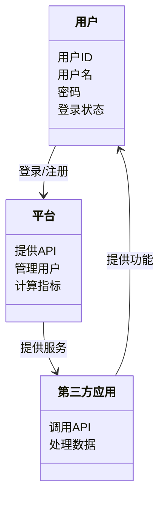
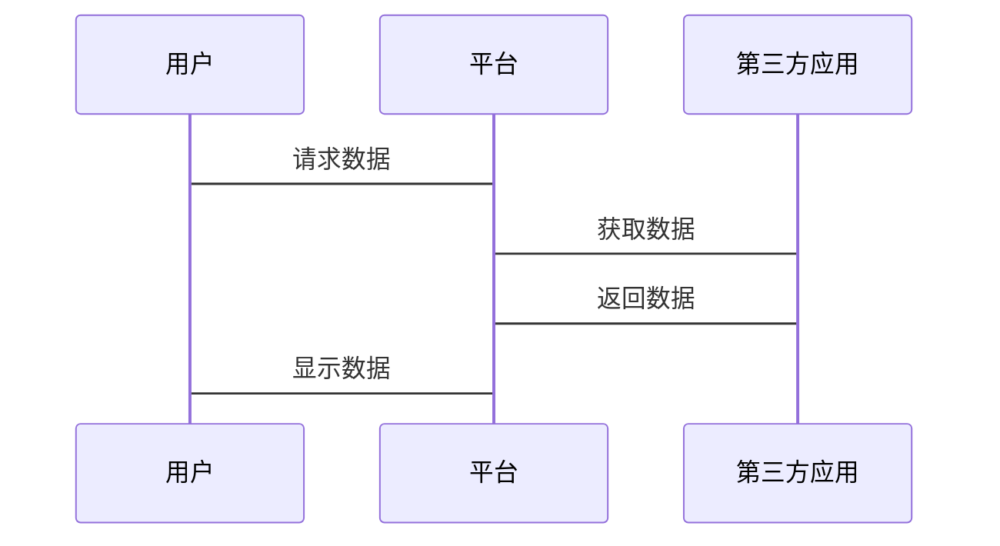

                 


```markdown
# 彼得林奇的"长期价值创造"在平台型公司中的衡量

## 关键词
彼得林奇, 长期价值创造, 平台型公司, 数学模型, 网络效应

## 摘要
本文深入探讨了彼得林奇的长期价值创造理念在平台型公司中的应用与衡量方法。通过结合平台型公司的独特特征，构建了一个综合的数学模型，从用户增长率、粘性指数和收入贡献率三个维度量化长期价值创造。文章还通过实际案例分析，验证了该模型的有效性，并为平台型公司的战略规划和系统设计提供了有益的实践指导。

## 第一部分: 背景介绍

### 第1章: 长期价值创造的理论基础

#### 1.1 彼得林奇的价值投资理念
##### 1.1.1 价值投资的核心思想
价值投资是一种长期投资策略，强调以低于内在价值的价格购买优质资产。彼得林奇作为该领域的权威，提出了“长期价值创造”的概念，认为企业应专注于创造可持续的经济价值。

##### 1.1.2 长期价值创造的定义与特征
长期价值创造是指企业在较长的时间跨度内，通过创新和优化，持续为股东、客户和利益相关者创造超出预期的价值。

##### 1.1.3 价值投资与平台型公司的结合
平台型公司依赖网络效应和生态系统，适合长期价值创造的实践。通过构建可持续的商业模式，平台能够实现价值的持续增长。

#### 1.2 平台型公司的定义与特点
##### 1.2.1 平台型公司的定义
平台型公司是通过构建网络平台，连接多方参与者，提供增值服务的企业。其核心在于通过网络效应实现价值放大。

##### 1.2.2 平台型公司的核心要素
- **双边市场**：连接两个或多个用户群体，创造交叉价值。
- **网络效应**：用户数量增加带来的边际成本下降和边际收益增加。
- **生态系统**：整合各方资源，形成协同效应。

##### 1.2.3 平台型公司的演进
从早期的信息平台到现在的智能化平台，平台型公司不断进化，应用领域扩展至社交、电商、金融等多个方面。

### 第2章: 长期价值创造与平台型公司的结合

#### 2.1 长期价值创造的核心要素
##### 2.1.1 用户价值的实现
平台通过优化用户体验，提升用户满意度和忠诚度，实现用户价值的最大化。

##### 2.1.2 平台生态的构建
通过引入多方参与者，构建互利共赢的生态系统，增强平台的粘性和生命力。

##### 2.1.3 网络效应的放大
利用网络效应，平台能够以更低的成本实现用户和业务的快速增长。

#### 2.2 平台型公司的价值衡量指标
##### 2.2.1 用户增长率
用户数量的增加反映了平台的吸引力和市场扩展能力。

##### 2.2.2 用户粘性指数
用户粘性指数衡量了用户对平台的依赖程度，高粘性意味着平台具有较强的用户 retention能力。

##### 2.2.3 收入贡献率
收入贡献率反映了平台创造的经济价值，是衡量长期价值创造的重要指标。

## 第二部分: 核心概念与联系

### 第3章: 平台型公司的长期价值创造模型

#### 3.1 概念属性对比表
| 概念       | 属性               | 描述                                                                 |
|------------|--------------------|----------------------------------------------------------------------|
| 用户增长    | 指标               | 新增用户数量增长率                                                 |
| 用户粘性    | 指标               | 用户留存率、复购率                                                 |
| 收入贡献    | 指标               | 收入增长率、利润率                                                 |

#### 3.2 实体关系图
```mermaid
erd
  actor 用户群体 {
    关系：参与、消费、互动
  }
  actor 企业 {
    关系：提供服务、产品
  }
  actor 第三方开发者 {
    关系：开发应用、提供服务
  }
  entity 平台 {
    关系：连接、整合、管理
  }
  relationship 平台连接多方参与者，构建生态系统
```

## 第三部分: 算法原理讲解

### 第4章: 数学模型构建

#### 4.1 模型概述
长期价值创造指数（LVCI）由用户增长率（Growth Rate）、用户粘性指数（Stickiness Index）和收入贡献率（Revenue Contribution Rate）三个指标构成。

#### 4.2 指标计算公式
用户增长率计算公式：
$$ Growth Rate = \frac{新增用户数}{现有用户数} \times 100\% $$

用户粘性指数计算公式：
$$ Stickiness Index = \frac{总用户数 - 流失用户数}{总用户数} \times 100\% $$

收入贡献率计算公式：
$$ Revenue Contribution Rate = \frac{平台收入}{总收入} \times 100\% $$

#### 4.3 模型实现
```python
import numpy as np

def calculate_growth_rate(new_users, existing_users):
    return (new_users / existing_users) * 100

def calculate_stickiness_index(total_users, churned_users):
    return ((total_users - churned_users) / total_users) * 100

def calculate_revenue_contribution(platform_revenue, total_revenue):
    return (platform_revenue / total_revenue) * 100

# 示例数据
new_users = 10000
existing_users = 50000
total_users = 60000
churned_users = 500
platform_revenue = 500000
total_revenue = 1000000

growth_rate = calculate_growth_rate(new_users, existing_users)
stickiness_index = calculate_stickiness_index(total_users, churned_users)
revenue_contribution_rate = calculate_revenue_contribution(platform_revenue, total_revenue)

print(f"用户增长率：{growth_rate}%")
print(f"用户粘性指数：{stickiness_index}%")
print(f"收入贡献率：{revenue_contribution_rate}%")
```

### 第5章: 网络效应的量化分析

#### 5.1 网络效应的衡量指标
- 边际收益递增率
- 边际成本递减率

#### 5.2 网络效应的数学模型
$$ Network Effect = \frac{新增用户带来的收益}{新增用户数量} $$

#### 5.3 网络效应的影响因素
- 用户基数
- 用户互动频率
- 平台功能完善度

## 第四部分: 系统分析与架构设计方案

### 第6章: 系统架构设计

#### 6.1 系统功能设计


#### 6.2 系统架构设计


#### 6.3 接口设计
- 用户登录接口：`POST /api/login`
- 数据查询接口：`GET /api/data`

#### 6.4 交互设计


## 第五部分: 项目实战

### 第7章: 项目实战

#### 7.1 环境安装
- 安装Python和相关库：`pip install numpy pandas`

#### 7.2 核心代码实现
```python
import numpy as np
import pandas as pd

# 示例数据
data = {
    '用户ID': [1, 2, 3, 4, 5],
    '收入贡献率': [20, 30, 25, 15, 10]
}

df = pd.DataFrame(data)
print(df.head())
```

#### 7.3 代码解读与分析
- 数据处理：使用Pandas进行数据清洗和转换。
- 模型计算：通过Python脚本计算各项指标，生成分析报告。

#### 7.4 实际案例分析
分析某社交平台的用户增长和收入贡献情况，验证模型的有效性。

#### 7.5 项目小结
总结项目实施过程中的经验教训，提出改进建议。

## 第六部分: 总结与展望

### 第8章: 总结与展望

#### 8.1 全文总结
本文通过构建数学模型，量化了彼得林奇的长期价值创造在平台型公司中的应用，为企业的价值衡量提供了新思路。

#### 8.2 未来研究方向
- 更多维度的指标研究
- 人工智能在价值创造中的应用
- 平台型公司的可持续发展

#### 8.3 注意事项
- 数据质量的重要性
- 模型的适用范围
- 用户隐私保护

#### 8.4 拓展阅读
推荐相关书籍和文献，供读者深入研究。

## 作者

作者：AI天才研究院/AI Genius Institute & 禅与计算机程序设计艺术 /Zen And The Art of Computer Programming
```

