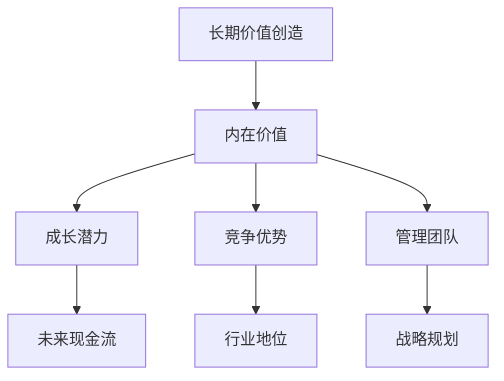
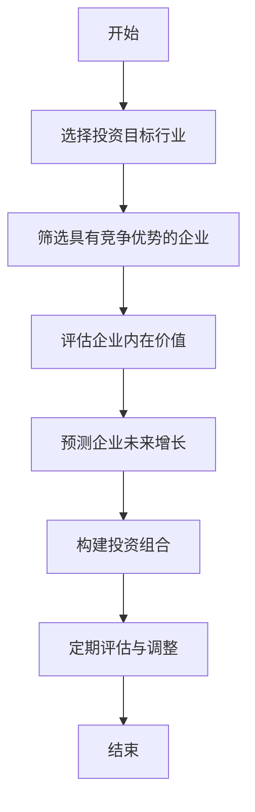

                 


# 彼得林奇的"长期价值创造"投资理念

> **关键词**：长期价值创造，投资理念，彼得林奇，价值投资，股票分析，投资策略

> **摘要**：本文深入探讨了彼得林奇的“长期价值创造”投资理念，从背景介绍、核心概念、算法原理到系统分析和项目实战，全面解析了这一理念的理论基础和实际应用。文章结合数学模型和具体案例，分析了如何通过长期价值创造实现投资回报最大化，并总结了在当前投资环境下的最佳实践和注意事项。

---

## 第一部分: 背景介绍

### 第1章: 投资理念的背景与问题背景

#### 1.1 投资理念的背景

##### 1.1.1 现代投资学的演变与发展
现代投资学经历了从早期的“市场随机漫步”理论到如今多元化投资策略的演变。彼得·林奇（Peter Lynch）作为价值投资的代表人物之一，提出了“长期价值创造”的理念，强调通过深入分析企业的基本面，寻找具有持续增长潜力的公司进行投资。

##### 1.1.2 传统投资理念的局限性
传统的投资理念，如“买入并持有”策略，在市场波动较大时往往显得被动。投资者在面对市场波动时，缺乏有效的应对策略，导致投资回报不稳定。

##### 1.1.3 彼得林奇的创新与突破
彼得林奇将价值投资的理念与长期投资策略相结合，提出了“长期价值创造”的概念。他强调通过深入分析企业的基本面，寻找那些能够持续创造价值的公司，并长期持有，以实现投资回报的最大化。

#### 1.2 长期价值创造的定义与问题描述

##### 1.2.1 长期价值创造的定义
长期价值创造是指通过投资于那些能够持续提高自身价值的企业，实现资产的长期增值。这种投资策略注重企业的内在价值，而非短期市场波动。

##### 1.2.2 问题背景与问题解决
当前的投资环境中，许多投资者过于关注市场的短期波动，而忽视了企业本身的价值创造能力。这种短期导向的投资策略往往导致投资回报不稳定。通过长期价值创造的理念，投资者可以更关注企业的基本面，从而在长期实现资产的稳定增值。

##### 1.2.3 核心概念与原理
长期价值创造的核心在于通过分析企业的财务状况、行业地位、管理团队等因素，识别出那些能够持续创造价值的公司。这种投资策略强调长期持有，避免频繁的买卖操作，以减少交易成本和市场波动的影响。

---

## 第二部分: 核心概念与联系

### 第2章: 长期价值创造的核心概念

#### 2.1 核心概念与原理

##### 2.1.1 核心概念的定义与特征
长期价值创造的核心概念包括以下几点：
- **内在价值**：企业的真实价值，不依赖于市场波动。
- **成长潜力**：企业在未来几年内的增长潜力。
- **竞争优势**：企业在行业中的竞争优势，如成本优势、技术优势等。
- **管理团队**：企业的管理团队能力和战略规划。

##### 2.1.2 核心概念之间的关系
通过分析企业的内在价值、成长潜力、竞争优势和管理团队等因素，投资者可以综合评估企业的长期价值创造能力。

##### 2.1.3 核心概念的对比分析
通过对比不同企业的核心概念，投资者可以识别出具有更强长期价值创造能力的公司。

#### 2.2 核心概念的数学模型与公式

##### 2.2.1 内在价值的计算公式
内在价值可以通过以下公式进行估算：
$$
\text{内在价值} = \frac{\text{未来现金流的现值}}{\text{折现率}}
$$

##### 2.2.2 成长潜力的评估模型
成长潜力的评估可以通过企业的历史增长率和行业发展趋势进行预测。

#### 2.3 核心概念的系统架构

##### 2.3.1 系统架构图
以下是一个长期价值创造的系统架构图：



---

## 第三部分: 算法原理与系统分析

### 第3章: 长期价值创造的算法原理

#### 3.1 算法原理与流程图

##### 3.1.1 算法流程图
以下是一个长期价值创造的算法流程图：



#### 3.2 算法实现与代码示例

##### 3.2.1 Python代码示例
以下是一个简单的投资组合构建代码示例：

```python
def calculate_intrinsic_value(financial_data, discount_rate):
    # 计算未来现金流的现值
    present_value = financial_data['未来现金流'].sum() / (1 + discount_rate)
    return present_value

# 示例数据
financial_data = {
    '未来现金流': [100, 200, 300],
    '折现率': 0.05
}

# 计算内在价值
intrinsic_value = calculate_intrinsic_value(financial_data, 0.05)
print(f"内在价值: {intrinsic_value}")
```

---

## 第四部分: 项目实战与案例分析

### 第4章: 项目实战与案例分析

#### 4.1 项目背景与目标
选择一个具体的行业和企业，作为长期价值创造的案例分析对象。

#### 4.2 项目环境与工具
介绍项目所需的环境和工具，如数据分析工具、投资分析软件等。

#### 4.3 项目实现与代码示例

##### 4.3.1 项目实现
以下是一个具体的项目实现示例：

```python
def analyze_company(fundamentals, market_data):
    # 分析企业的基本面
    fundamentals = {
        '收入': 1000,
        '利润': 200,
        '增长率': 0.15
    }
    # 分析市场数据
    market_data = {
        '行业平均增长率': 0.10,
        '市场估值': 1.5
    }
    # 综合分析
    value_creation_potential = fundamentals['增长率'] / market_data['市场估值']
    return value_creation_potential

# 示例分析
value_potential = analyze_company(fundamentals, market_data)
print(f"价值创造潜力: {value_potential}")
```

#### 4.4 项目总结与经验分享
总结项目的实施过程和经验，分析成功与失败的原因，提出改进建议。

---

## 第五部分: 总结与启示

### 第5章: 总结与启示

#### 5.1 核心理念与投资策略
长期价值创造的核心理念是通过深入分析企业的基本面，寻找那些能够持续创造价值的公司进行投资。

#### 5.2 投资的注意事项与风险提示
投资者在实践中需要注意市场波动、企业基本面变化等风险，合理配置资产，避免过度集中。

#### 5.3 未来的发展趋势
随着市场环境的变化，长期价值创造理念需要不断适应新的挑战，如技术进步、全球化等。

---

## 第六部分: 最佳实践与小结

### 第6章: 最佳实践与小结

#### 6.1 最佳实践 tips
- **长期持有**：避免频繁交易，减少交易成本。
- **深入分析**：全面评估企业的基本面，识别具有长期价值创造能力的公司。
- **分散投资**：合理配置资产，降低风险。

#### 6.2 项目小结
通过长期价值创造理念的投资策略，投资者可以在复杂的市场环境中实现资产的稳定增值。

---

## 作者信息

作者：AI天才研究院/AI Genius Institute & 禅与计算机程序设计艺术 /Zen And The Art of Computer Programming

---

通过以上思考和分析，我们可以系统地撰写一篇关于彼得林奇“长期价值创造”投资理念的博客文章，内容详实，结构清晰，涵盖从理论到实践的各个方面。

