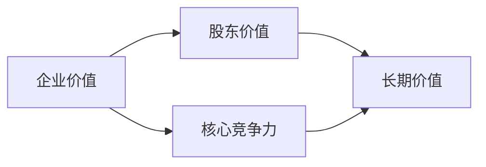
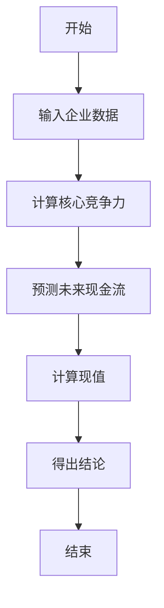
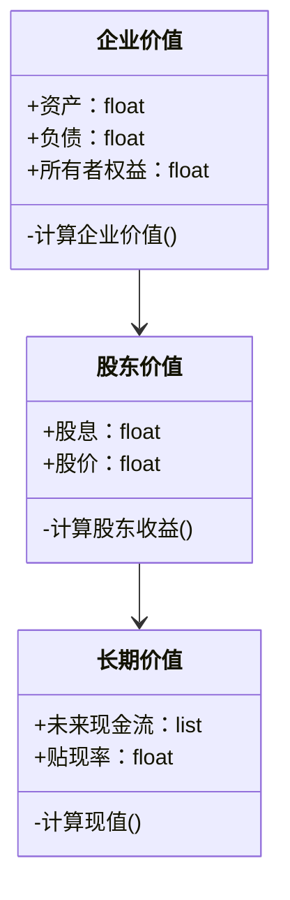

                 


# 彼得林奇的"长期价值创造"评估体系

> 关键词：价值投资、长期价值、彼得·林奇、评估体系、企业价值

> 摘要：本文详细探讨了彼得·林奇提出的“长期价值创造”评估体系，分析其核心概念、算法原理、系统架构及实际应用。通过案例分析和代码实现，展示了如何在投资决策中应用这一评估体系，帮助投资者做出明智决策。

---

# 第一部分：背景介绍

## 第1章：价值投资的背景与发展

### 1.1 价值投资的核心理念
价值投资是一种以内在价值为导向的投资策略，强调购买价格低于内在价值的资产。其核心在于识别市场低估的公司，长期持有，实现收益。

### 1.2 彼得·林奇的生平与成就
彼得·林奇是美国著名投资经理，以管理富达麦哲伦基金而闻名。他的投资理念强调深入研究企业，寻找具有持续盈利能力的公司。

### 1.3 长期价值创造的定义
长期价值创造是指通过评估企业的长期盈利能力、核心竞争力和增长潜力，判断其是否能为股东创造持续价值。

### 1.4 其他投资方法的比较
与短期交易、趋势投资不同，长期价值创造注重企业基本面，强调长期持有的稳定性。

---

# 第二部分：核心概念与联系

## 第2章：长期价值创造的核心概念

### 2.1 企业价值的构成要素
企业价值由资产、负债和所有者权益构成，关键在于其盈利能力和发展潜力。

### 2.2 股东价值的实现路径
股东价值通过企业的持续盈利、股息分红和市值增长实现。

### 2.3 长期价值创造的系统性特征
长期价值创造强调企业持续的创新能力、管理效率和市场适应能力。

### 2.4 核心概念的属性对比
| 要素 | 定义 | 属性 |
|------|------|------|
| 企业价值 | 企业的整体价值 | 可衡量、可预测 |
| 股东价值 | 股东的收益 | 可分配、可增长 |
| 长期价值 | 企业的未来收益 | 可持续、可积累 |

### 2.5 实体关系图（ER图）


---

# 第三部分：算法原理

## 第3章：长期价值创造的算法实现

### 3.1 算法原理概述
评估体系基于 discounted cash flow（DCF）模型，预测未来现金流，计算现值，评估企业价值。

### 3.2 DCF模型的数学公式
DCF模型用于计算企业未来现金流的现值：
$$ PV = \sum_{t=1}^{n} \frac{CF_t}{(1 + r)^t} + \frac{FV}{(1 + r)^n} $$
其中，CF为现金流，r为贴现率，n为期限，FV为终值。

### 3.3 算法流程图


### 3.4 代码实现
```python
def calculate_present_value(cash_flows, discount_rate):
    pv = 0
    for t, cf in enumerate(cash_flows):
        pv += cf / (1 + discount_rate) ** t
    return pv

# 示例：预测未来5年的现金流为100万，贴现率为10%
cf_flows = [100, 100, 100, 100, 100]
discount_rate = 0.10
pv = calculate_present_value(cf_flows, discount_rate)
print(f"现值为：{pv:.2f}")
```

---

# 第四部分：系统分析与架构设计

## 第4章：系统架构设计

### 4.1 领域模型类图


### 4.2 系统架构图


---

# 第五部分：项目实战

## 第5章：长期价值创造评估体系的实际应用

### 5.1 案例分析：苹果公司
以苹果公司为例，预测未来5年的现金流，计算其现值，评估企业价值。

### 5.2 实际操作步骤
1. 收集企业财务数据和市场信息。
2. 应用DCF模型计算现值。
3. 分析结果，判断投资价值。

---

# 第六部分：总结与展望

## 第6章：长期价值创造评估体系的总结

### 6.1 本章小结
长期价值创造评估体系通过系统性分析企业的核心竞争力和未来现金流，帮助投资者做出明智决策。

### 6.2 投资中的注意事项
- 避免短期波动影响判断。
- 深入研究企业基本面。
- 合理选择贴现率。

### 6.3 拓展阅读
推荐阅读彼得·林奇的书籍，深入理解价值投资的精髓。

---

# 作者信息

作者：AI天才研究院 & 禅与计算机程序设计艺术

---

通过以上结构，文章详细阐述了彼得·林奇的长期价值创造评估体系，从理论到实践，帮助读者全面理解和应用这一投资方法。

