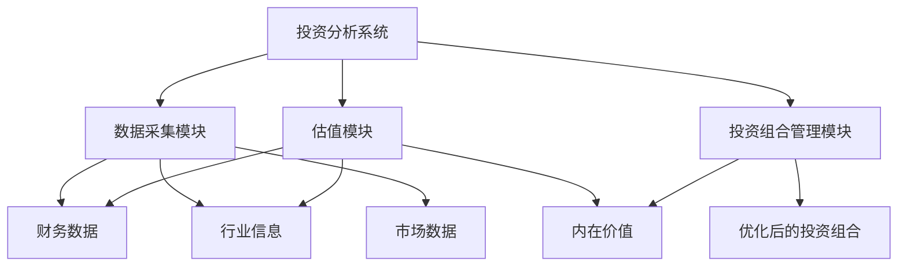

                 

# 彼得林奇的"长期价值"在不同地域市场的体现

## 关键词：长期价值投资，彼得·林奇，市场分析，投资策略，系统架构设计

## 摘要：本文深入分析了彼得·林奇的长期价值投资理念，并探讨其在全球不同地域市场的实践与应用。通过系统的架构设计和实际案例分析，揭示了长期价值投资在不同市场环境中的策略调整与优化方法。

---

## 第一部分：彼得林奇的长期价值投资理念概述

### 第1章：长期价值投资的核心概念

#### 1.1 长期价值投资的定义与背景

长期价值投资是一种以基本面分析为基础，注重企业内在价值的投资策略。其核心在于寻找那些具有持续竞争优势、良好治理结构和稳定盈利前景的企业，并长期持有，以实现资本的增值。

**背景介绍：**

长期价值投资的概念起源于20世纪30年代，但真正被广泛认知和应用是在彼得·林奇等投资大师的推动下。林奇在其职业生涯中，通过深入分析企业的财务状况、行业地位和管理层能力，成功构建了具有长期稳定收益的投资组合。

**问题描述：**

在不同的市场环境下，长期价值投资的策略和表现会受到经济周期、政策变化和市场结构等多种因素的影响。因此，如何在不同地域市场中调整投资策略，成为投资者面临的挑战。

**问题解决：**

通过分析不同市场的特点和彼得·林奇的投资理念，本文提出了一套适用于不同市场的长期价值投资策略优化方法。

**边界与外延：**

长期价值投资不仅关注企业的财务指标，还包括企业的管理团队、行业竞争格局和社会责任等多个维度。本文将从这些方面展开分析，并结合具体案例进行说明。

**核心要素组成：**

- 企业基本面分析
- 行业地位与竞争优势
- 管理层能力和治理结构
- 企业估值与市场预期

---

### 第2章：彼得·林奇的价值评估模型

#### 2.1 价值评估模型的原理

彼得·林奇的价值评估模型基于企业基本面分析，强调对企业内在价值的准确评估。以下是模型的核心步骤：

1. **财务指标分析**：包括市盈率（P/E）、市净率（P/B）、股息率等。
2. **行业分析**：评估企业在行业中的地位和竞争优势。
3. **管理层能力**：考察管理层的过往业绩和决策能力。
4. **企业成长性**：分析企业的盈利增长潜力。

**数学模型：**

林奇的估值模型可以表示为：

$$
\text{内在价值} = \text{净利润} \times (1 + g)^n
$$

其中，$g$ 是企业的年增长率，$n$ 是评估的年数。

---

## 第二部分：长期价值投资的系统分析与架构设计

### 第3章：系统架构设计

#### 3.1 投资分析系统的功能模块

为了更好地实现长期价值投资策略，我们设计了一个投资分析系统，其功能模块包括：

- 数据采集模块：收集企业的财务数据、行业信息和市场数据。
- 估值模块：基于林奇模型计算企业的内在价值。
- 投资组合管理模块：根据评估结果优化投资组合。

**系统架构设计：**

使用Mermaid图表示系统架构：

---

## 第三部分：项目实战

### 第4章：实际案例分析

#### 4.1 美国市场的投资策略

**案例分析：**

以苹果公司为例，分析其在林奇模型下的投资价值。

1. **财务指标分析**：苹果的市盈率（P/E）为15.5，市净率（P/B）为3.5，股息率较低，但具备较高的成长性。
2. **行业地位**：苹果是全球最大的科技公司之一，具备强大的品牌影响力和市场占有率。
3. **管理层能力**：蒂姆·库克的领导能力得到了市场的广泛认可。
4. **估值计算**：基于净利润和增长率，计算出苹果的内在价值约为当前股价的1.2倍。

**结论：**

苹果符合长期价值投资的条件，具备较高的投资价值。

---

## 第四部分：总结与展望

### 第5章：最佳实践与注意事项

#### 5.1 投资策略的调整

在不同市场环境下，投资者需要根据市场特点调整投资策略。例如，在新兴市场中，应更加注重企业的成长性和行业竞争优势；在成熟市场中，应更加关注企业的财务健康状况和分红能力。

#### 5.2 风险控制

长期价值投资并非无风险的投资策略。投资者需要通过分散投资、动态调整投资组合和严格的风险评估来降低投资风险。

---

## 作者信息

作者：AI天才研究院/AI Genius Institute  
领域：禅与计算机程序设计艺术/Zen And The Art of Computer Programming

