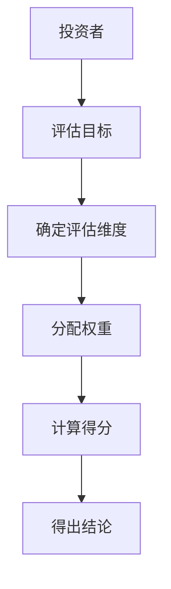
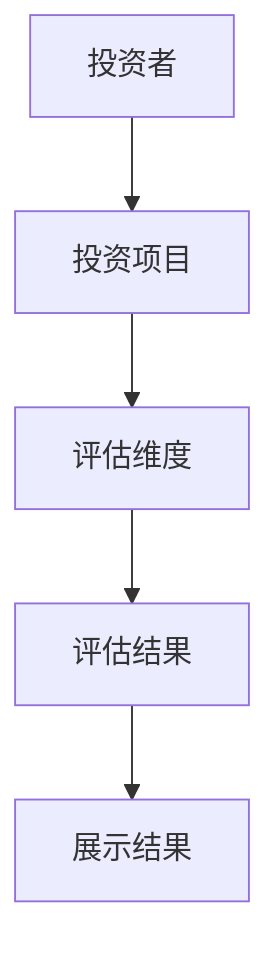

                 


# 彼得林奇的"长期价值"在影响力投资中的新定义与衡量

## 关键词：
- 影响力投资
- 长期价值
- 彼得林奇
- 可持续发展
- 投资评估

## 摘要：
本文探讨了彼得林奇的“长期价值”理念在影响力投资中的新定义与衡量方法。影响力投资作为一种关注社会和环境影响的投资方式，正在改变传统的投资模式。本文通过分析长期价值与影响力投资的核心概念、算法原理、系统架构以及实际案例，提出了新的衡量标准和方法。通过详细的技术分析和实际应用，本文为投资者提供了在影响力投资中实现长期价值的新视角和实践指南。

---

# 目录

## 第一部分: 彼得林奇的长期价值与影响力投资概述

### 第1章: 长期价值与影响力投资的背景

#### 1.1 影响力投资的定义与特点
##### 1.1.1 影响力投资的定义
影响力投资是指投资者在追求财务回报的同时，积极投资于能够产生社会和环境正面影响的项目或企业。其核心在于通过投资行为推动社会进步和可持续发展。

##### 1.1.2 影响力投资的核心特点
- **社会影响**：投资目标不仅关注经济效益，还关注其对社会的积极影响，例如减少贫困、促进教育、改善公共健康等。
- **环境效益**：投资注重环境保护，例如减少碳排放、节约资源、推动可再生能源的发展。
- **经济回报**：影响力投资并不放弃对经济回报的追求，而是将社会和环境目标与经济目标相结合。

##### 1.1.3 影响力投资的边界与外延
影响力投资的边界在于其对社会和环境目标的严格筛选，而外延则体现在其广泛的应用领域，包括教育、医疗、能源、农业等多个行业。

#### 1.2 彼得林奇长期价值理念
##### 1.2.1 彼得林奇长期价值的内涵
彼得林奇是著名的投资专家，他提出的长期价值理念强调投资于具有持续竞争优势和良好治理结构的企业，注重企业的长期盈利能力和社会责任感。

##### 1.2.2 彼得林奇长期价值的核心要素
- **持续竞争优势**：企业应具备在行业中长期保持竞争优势的能力。
- **良好的治理结构**：企业治理透明、高效，能够确保利益相关者的权益。
- **社会责任**：企业应积极履行社会责任，关注环境保护、员工福利和社会公益。

##### 1.2.3 彼得林奇长期价值与传统投资理念的对比
传统的投资理念往往更关注短期的财务回报，而彼得林奇的长期价值理念则强调企业的长期发展和社会责任，注重投资的可持续性和社会影响。

#### 1.3 影响力投资与长期价值的联系
##### 1.3.1 影响力投资与长期价值的共同点
- 两者都强调投资的社会和环境影响。
- 都注重企业的长期发展和持续竞争优势。

##### 1.3.2 影响力投资与长期价值的区别
影响力投资更注重社会和环境目标的实现，而彼得林奇的长期价值理念更强调企业的内在价值和治理结构。

##### 1.3.3 影响力投资对长期价值的新定义
影响力投资将长期价值重新定义为一种综合考虑社会、环境和经济回报的投资理念，强调投资的社会影响力和企业的可持续发展能力。

### 第2章: 影响力投资的现状与挑战

#### 2.1 影响力投资的现状分析
##### 2.1.1 全球影响力投资的发展现状
近年来，全球影响力投资发展迅速，越来越多的投资者开始关注社会和环境目标，影响力投资的市场规模也在快速增长。

##### 2.1.2 中国影响力投资的发展现状
在中国，影响力投资也在逐步发展，尤其是在环保、教育和扶贫等领域，影响力投资逐渐得到更多的关注和应用。

#### 2.2 影响力投资的主要挑战
##### 2.2.1 投资者认知不足的问题
许多投资者对影响力投资的概念和方法缺乏了解，导致其在实际投资中难以广泛应用。

##### 2.2.2 投资标的评估标准不统一的问题
影响力投资的评估标准尚未完全统一，不同机构对社会和环境影响的衡量方式存在差异，影响了投资决策的准确性和可比性。

##### 2.2.3 投资回报与社会价值的平衡问题
如何在追求投资回报的同时实现社会和环境目标，是影响力投资面临的一个重要挑战。

#### 2.3 影响力投资的未来趋势
##### 2.3.1 技术驱动的影响力投资新方向
随着大数据和人工智能技术的发展，影响力投资的评估和筛选将更加精准和高效。

##### 2.3.2 可持续发展成为投资核心目标
未来的影响力投资将更加注重可持续发展，投资目标将围绕联合国可持续发展目标（SDGs）展开。

##### 2.3.3 影响力投资的全球化与本土化结合
影响力投资将更加注重全球化视角，同时结合不同国家和地区的具体国情和文化背景，实现全球化与本土化的有机结合。

---

## 第二部分: 影响力投资的长期价值衡量体系

### 第3章: 影响力投资的核心概念与联系

#### 3.1 影响力投资的核心概念
##### 3.1.1 影响力投资的三要素：社会价值、经济价值、环境价值
影响力投资的核心要素包括：
- **社会价值**：投资对社会的正面影响，例如减少贫困、促进教育等。
- **经济价值**：投资的经济效益，包括财务回报和市场竞争力。
- **环境价值**：投资对环境的正面影响，例如减少碳排放、节约资源等。

##### 3.1.2 影响力投资的衡量维度：财务回报、社会影响、环境效益
影响力投资的衡量维度包括：
- **财务回报**：投资的经济收益，包括本金回收和收益。
- **社会影响**：投资对社会的积极影响，例如创造就业、改善公共健康等。
- **环境效益**：投资对环境的正面影响，例如减少污染、节约能源等。

##### 3.1.3 影响力投资的评价指标体系
影响力投资的评价指标体系包括：
- **社会影响评估指标**：如社会影响价值（SIV）。
- **环境影响评估指标**：如碳足迹、能源效率等。
- **经济回报指标**：如内部收益率（IRR）、净现值（NPV）等。

#### 3.2 影响力投资的核心要素对比
##### 3.2.1 社会价值与经济价值的对比分析
社会价值和经济价值是影响力投资的两个重要维度，社会价值关注社会影响，经济价值关注经济效益。两者相辅相成，缺一不可。

##### 3.2.2 环境效益与社会影响的对比分析
环境效益关注环境保护，社会影响关注社会进步，两者都是影响力投资的重要组成部分，但侧重点不同。

##### 3.2.3 影响力投资的对比分析表格
以下是社会价值、经济价值、环境效益的对比分析表格：

| **维度** | **社会价值** | **经济价值** | **环境效益** |
|----------|--------------|--------------|--------------|
| **定义** | 对社会的积极影响 | 经济收益 | 对环境的积极影响 |
| **侧重点** | 社会公平、公共利益 | 财务回报 | 环境保护 |
| **衡量指标** | 社会影响价值（SIV） | 内部收益率（IRR） | 碳足迹、能源效率 |

##### 3.2.4 影响力投资的核心要素ER图
以下是影响力投资的核心要素ER图：

```mermaid
erDiagram
    actor 投资者 {
        string 投资目标
        string 投资金额
        string 投资期限
    }
    actor 企业 {
        string 企业名称
        string 企业治理结构
        string 企业社会责任
    }
    actor 社会 {
        string 社会影响
        string 环境效益
    }
    investor --> 企业 : 投资
    企业 --> 社会 : 产生影响
```

---

### 第4章: 影响力投资的算法原理与系统架构

#### 4.1 影响力投资的算法原理
##### 4.1.1 影响力投资评分模型
影响力投资评分模型是一种基于多维度评估的投资评估方法，综合考虑社会影响、环境效益和经济回报。

##### 4.1.2 层次分析法（AHP）在影响力投资中的应用
层次分析法是一种常用的决策分析方法，适用于多维度评估问题。以下是层次分析法在影响力投资中的应用流程：



##### 4.1.3 影响力投资评分模型的数学公式
影响力投资评分模型的计算公式如下：

$$
\text{总得分} = \sum (\text{维度权重} \times \text{维度得分})
$$

其中，维度权重是各评估维度的权重，维度得分是各维度的具体得分。

##### 4.1.4 代码示例
以下是影响力投资评分模型的Python代码示例：

```python
import pandas as pd
import numpy as np

# 定义评估维度
dimensions = ['社会影响', '环境效益', '经济回报']

# 定义权重
weights = [0.4, 0.3, 0.3]

# 定义评估指标
scores = {'社会影响': 0.8, '环境效益': 0.7, '经济回报': 0.6}

# 计算总得分
total_score = sum(weights[i] * scores[dimensions[i]] for i in range(len(dimensions)))

print(f"总得分为: {total_score}")
```

#### 4.2 影响力投资的系统架构
##### 4.2.1 系统功能设计
影响力投资系统的功能设计包括：
- 评估维度管理：管理社会影响、环境效益和经济回报等评估维度。
- 投资项目管理：管理投资项目信息，包括项目名称、投资金额、投资期限等。
- 评估结果展示：展示投资项目的影响评估结果。

##### 4.2.2 系统架构图
以下是影响力投资系统的架构图：



---

## 第五部分: 项目实战与最佳实践

### 第5章: 影响力投资的项目实战

#### 5.1 项目环境安装
##### 5.1.1 安装必要的Python库
需要安装以下Python库：
```bash
pip install pandas numpy
```

#### 5.2 核心代码实现
##### 5.2.1 影响力投资评分模型的实现
以下是影响力投资评分模型的Python代码实现：

```python
import pandas as pd
import numpy as np

def calculate_score(dimensions, weights, scores):
    total_score = sum(weights[i] * scores[dimensions[i]] for i in range(len(dimensions)))
    return total_score

# 示例数据
dimensions = ['社会影响', '环境效益', '经济回报']
weights = [0.4, 0.3, 0.3]
scores = {'社会影响': 0.8, '环境效益': 0.7, '经济回报': 0.6}

# 计算总得分
total_score = calculate_score(dimensions, weights, scores)
print(f"总得分为: {total_score}")
```

##### 5.2.2 代码功能解读
上述代码定义了一个计算影响力投资评分的函数 `calculate_score`，并使用示例数据计算总得分。

#### 5.3 实际案例分析
##### 5.3.1 案例背景
假设某投资者计划投资于一个可再生能源项目，项目预计投资金额为1000万元，投资期限为5年。

##### 5.3.2 评估维度
- **社会影响**：减少贫困，提高当地居民生活水平，得分为0.8。
- **环境效益**：减少碳排放，节约能源，得分为0.7。
- **经济回报**：预计内部收益率为10%，得分为0.6。

##### 5.3.3 计算总得分
总得分为：
$$
\text{总得分} = 0.4 \times 0.8 + 0.3 \times 0.7 + 0.3 \times 0.6 = 0.32 + 0.21 + 0.18 = 0.71
$$

##### 5.3.4 结论
该投资项目总得分为0.71，属于高分投资项目，具有较高的社会影响和环境效益，同时具备一定的经济回报。

#### 5.4 项目小结
通过上述案例分析，我们可以看到影响力投资评分模型在实际应用中的有效性和实用性。

---

### 第6章: 最佳实践与小结

#### 6.1 小结
影响力投资是一种以社会和环境目标为导向的投资方式，其长期价值的衡量需要综合考虑社会影响、环境效益和经济回报。彼得林奇的长期价值理念为影响力投资提供了重要的理论基础和实践指导。

#### 6.2 注意事项
- 投资者在进行影响力投资时，需要充分了解投资项目的社会和环境影响，确保投资目标与自身的价值观和投资目标一致。
- 在实际操作中，需要结合具体的投资环境和市场情况，灵活调整评估维度和权重，确保投资决策的科学性和可行性。

#### 6.3 拓展阅读
- 彼得林奇的《彼得林奇的成功投资》
- 联合国可持续发展目标（SDGs）

---

## 作者：AI天才研究院/AI Genius Institute & 禅与计算机程序设计艺术 /Zen And The Art of Computer Programming

---

本文通过详细的技术分析和实际应用，探讨了彼得林奇的长期价值理念在影响力投资中的新定义与衡量方法。通过系统的理论分析、算法原理、系统架构和项目实战，为投资者提供了在影响力投资中实现长期价值的新视角和实践指南。

