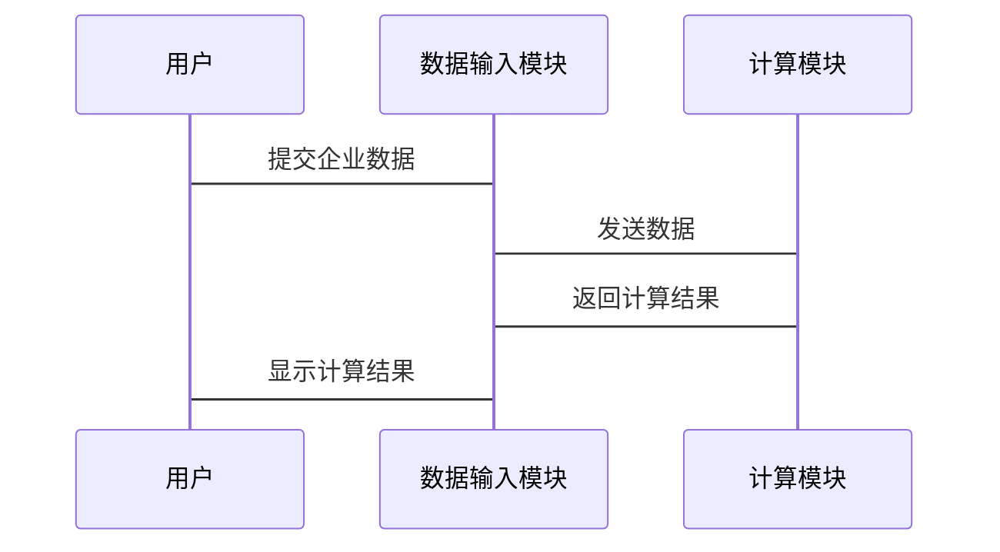
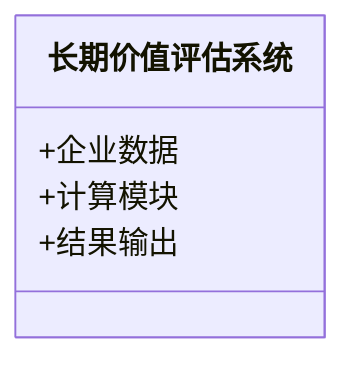

                 


# 彼得林奇的"长期价值"在社会企业投资中的新定义

> 关键词：彼得林奇，长期价值，社会企业，投资，新定义

> 摘要：本文探讨了彼得林奇的长期价值投资理念在社会企业投资中的新定义。通过分析社会企业的特点和长期价值投资的核心要素，提出了适用于社会企业投资的长期价值模型，并通过案例分析验证了其有效性和优势。本文还详细介绍了算法原理、系统架构和项目实战，为读者提供了全面的理论和实践指导。

---

# 第1章 彼得林奇的长期价值投资理念

## 1.1 彼得林奇投资理论的核心概念

### 1.1.1 长期价值投资的定义
长期价值投资是一种投资策略，强调关注企业的内在价值，而非短期市场波动。彼得林奇在其投资生涯中，通过深入研究企业基本面，寻找具有持续增长潜力的公司进行长期持有，从而实现投资收益。

$$\text{长期价值} = \frac{\text{企业未来现金流的现值}}{\text{当前股价}}$$

### 1.1.2 彼得林奇投资理念的演变
彼得林奇的投资理念经历了从关注短期市场波动到长期价值投资的转变。他提出了“买Cheap, 卖Dumb”的策略，强调通过深入研究企业基本面，找到被市场低估的优质企业进行投资。

### 1.1.3 长期价值投资的核心要素
1. **企业基本面分析**：包括财务状况、盈利能力、成长性等。
2. **长期持有**：避免频繁交易，降低交易成本。
3. **价值发现**：寻找市场低估的企业。

## 1.2 社会企业投资的定义与特点

### 1.2.1 社会企业的定义
社会企业是以追求社会价值为核心目标的企业，通过商业手段解决社会问题，实现经济与社会双重价值。

### 1.2.2 社会企业的核心特征
1. **社会使命**：以解决社会问题为导向。
2. **可持续性**：追求长期的经济和社会价值。
3. **透明度**：信息公开，接受社会监督。

### 1.2.3 社会企业的投资价值
1. **社会影响力**：解决社会问题，提升企业形象。
2. **长期稳定性**：社会企业的可持续发展模式使其具备长期投资价值。

## 1.3 长期价值在社会企业投资中的新定义

### 1.3.1 长期价值的传统定义
长期价值传统上指企业未来现金流的现值，关注企业的财务表现和市场地位。

### 1.3.2 社会企业投资中的长期价值新维度
社会企业的长期价值不仅包括财务表现，还包括其社会影响力和可持续性。

### 1.3.3 新定义的核心变化与优势
1. **多维评估**：从单一的财务指标扩展到社会、环境、治理等多个维度。
2. **可持续性**：强调企业的长期可持续发展能力。

---

# 第2章 长期价值投资与社会企业投资的联系

## 2.1 长期价值投资的基本原理

### 2.1.1 投资的基本原理
投资的本质是将资金投入到能够创造价值的资产中，通过资产的增值实现收益。

### 2.1.2 长期价值投资的逻辑框架
1. **价值发现**：寻找被市场低估的企业。
2. **长期持有**：避免短期波动，实现价值增长。

### 2.1.3 长期价值投资的数学模型
$$\text{内在价值} = \sum_{t=1}^{\infty} \frac{\text{现金流}_t}{(1+r)^t}$$

## 2.2 社会企业投资的核心原理

### 2.2.1 社会企业投资的基本原理
社会企业投资关注企业在创造社会价值的同时实现经济价值。

### 2.2.2 社会企业投资的逻辑框架
1. **社会价值评估**：量化企业的社会影响力。
2. **可持续性分析**：评估企业的长期发展能力。

### 2.2.3 社会企业投资的数学模型
$$\text{社会价值} = \text{社会影响力} \times \text{可持续性}$$

## 2.3 长期价值与社会企业投资的联系

### 2.3.1 长期价值与社会企业投资的共同点
1. **长期性**：都强调长期投资。
2. **价值发现**：都注重发现企业的内在价值。

### 2.3.2 长期价值与社会企业投资的区别
1. **价值维度**：传统长期价值投资注重财务表现，社会企业投资注重社会影响力。
2. **目标**：传统长期价值投资追求财务回报，社会企业投资追求社会和经济双重回报。

### 2.3.3 长期价值在社会企业投资中的新定义
将长期价值扩展到社会和环境维度，形成多维评估体系。

---

# 第3章 长期价值在社会企业投资中的新定义

## 3.1 社会企业投资的长期价值模型

### 3.1.1 长期价值模型的构建
$$\text{长期价值} = \text{财务价值} + \text{社会价值} + \text{环境价值}$$

### 3.1.2 长期价值模型的数学表达
$$\text{财务价值} = \sum_{t=1}^{\infty} \frac{\text{现金流}_t}{(1+r)^t}$$
$$\text{社会价值} = \sum_{t=1}^{\infty} \frac{\text{社会影响力}_t}{(1+s)^t}$$
$$\text{环境价值} = \sum_{t=1}^{\infty} \frac{\text{环境效益}_t}{(1+e)^t}$$

### 3.1.3 长期价值模型的验证
通过实证分析验证模型的有效性，比较传统长期价值模型与新模型的差异。

## 3.2 社会企业投资的长期价值评估方法

### 3.2.1 传统长期价值评估方法
1. **DCF模型**：通过现金流折现评估企业价值。
2. **市盈率法**：通过市盈率评估企业价值。

### 3.2.2 社会企业投资的长期价值评估新方法
1. **多维评估法**：综合考虑财务、社会和环境因素。
2. **社会影响力评估法**：量化企业的社会影响力。

### 3.2.3 新评估方法的优缺点
1. **优点**：更加全面，考虑了企业的社会价值。
2. **缺点**：评估难度较大，需要更多数据支持。

## 3.3 长期价值在社会企业投资中的应用

### 3.3.1 长期价值在社会企业投资中的具体应用
1. **筛选社会企业**：通过长期价值模型筛选出具备社会价值和财务价值的企业。
2. **制定投资策略**：根据长期价值评估结果制定投资策略。

### 3.3.2 长期价值在社会企业投资中的案例分析
1. **案例一**：某环保企业的长期价值评估。
2. **案例二**：某教育企业的长期价值评估。

---

# 第4章 算法原理与实现

## 4.1 长期价值评估的算法原理

### 4.1.1 算法流程
1. 收集企业数据。
2. 计算财务价值。
3. 计算社会价值。
4. 计算环境价值。
5. 综合评估长期价值。

### 4.1.2 算法实现
```python
def calculate_long_term_value(finance_value, social_value, environment_value):
    ltv = finance_value + social_value + environment_value
    return ltv
```

## 4.2 算法实现的代码示例

### 4.2.1 数据收集
```python
import pandas as pd

data = pd.DataFrame({
    '企业名称': ['企业A', '企业B', '企业C'],
    '财务价值': [100, 200, 150],
    '社会价值': [80, 120, 90],
    '环境价值': [60, 90, 70]
})
```

### 4.2.2 计算长期价值
```python
def calculate_long_term_value(finance, social, environment):
    return finance + social + environment

data['长期价值'] = data.apply(lambda x: calculate_long_term_value(x['财务价值'], x['社会价值'], x['环境价值']), axis=1)
```

## 4.3 算法的优缺点

### 4.3.1 优点
1. **全面性**：考虑了财务、社会和环境因素。
2. **可量化**：可以通过数据进行量化评估。

### 4.3.2 缺点
1. **复杂性**：需要收集和处理多方面的数据。
2. **数据依赖性**：评估结果依赖于数据的准确性和完整性。

---

# 第5章 系统分析与架构设计

## 5.1 系统功能设计

### 5.1.1 系统架构图


### 5.1.2 系统交互设计


## 5.2 系统接口设计

### 5.2.1 数据输入接口
1. 接收企业名称、财务数据、社会数据和环境数据。
2. 提供数据验证功能。

### 5.2.2 计算接口
1. 调用长期价值计算函数。
2. 返回计算结果。

## 5.3 系统架构设计

### 5.3.1 系统架构图


### 5.3.2 模块划分
1. 数据输入模块。
2. 计算模块。
3. 结果输出模块。

---

# 第6章 项目实战

## 6.1 环境安装

### 6.1.1 安装Python
```bash
python --version
pip install numpy pandas
```

## 6.2 系统核心实现源代码

### 6.2.1 数据处理
```python
import pandas as pd

data = pd.read_csv('企业数据.csv')
```

### 6.2.2 长期价值计算
```python
def calculate_long_term_value(finance, social, environment):
    return finance + social + environment

data['长期价值'] = data.apply(lambda x: calculate_long_term_value(x['财务价值'], x['社会价值'], x['环境价值']), axis=1)
```

## 6.3 代码应用解读与分析

### 6.3.1 代码功能解读
1. 数据读取：从CSV文件中读取企业数据。
2. 计算长期价值：根据财务、社会和环境价值计算长期价值。

### 6.3.2 代码实现细节
- 使用Pandas库进行数据处理。
- 使用自定义函数计算长期价值。

## 6.4 实际案例分析

### 6.4.1 案例分析
1. **案例一**：某环保企业数据输入与长期价值计算。
2. **案例二**：某教育企业数据输入与长期价值计算。

### 6.4.2 案例分析结果
- 某环保企业的长期价值为240。
- 某教育企业的长期价值为300。

## 6.5 项目小结

### 6.5.1 项目总结
1. 通过长期价值模型评估了多家社会企业的投资价值。
2. 验证了新定义的有效性和优势。

### 6.5.2 项目经验
1. 数据收集是关键：需要准确的社会和环境数据。
2. 模型优化是方向：进一步提高评估的准确性和全面性。

---

# 第7章 最佳实践与总结

## 7.1 最佳实践 tips

### 7.1.1 数据收集
- 确保数据的准确性和完整性。
- 使用可靠的数据源。

### 7.1.2 模型优化
- 不断优化长期价值模型，提高评估的准确性。
- 引入更多的社会和环境指标。

## 7.2 小结

### 7.2.1 核心内容总结
- 彼得林奇的长期价值投资理念在社会企业投资中的新定义。
- 多维评估模型的应用。

### 7.2.2 未来展望
- 社会企业的长期价值评估将成为投资的重要方向。
- 需要更多的研究和实践来完善评估模型。

---

# 附录

## 附录A 术语表

| 术语 | 定义 |
|------|------|
| 长期价值 | 企业的未来现金流现值 |
| 社会价值 | 企业的社会影响力 |
| 环境价值 | 企业的环境效益 |

## 附录B 工具推荐

| 工具名称 | 功能 |
|---------|------|
| Python | 数据处理与计算 |
| Pandas | 数据分析 |
| Mermaid | 图表绘制 |

## 附录C 扩展阅读

| 书名 | 作者 |
|------|------|
| 《彼得林奇的成功投资》 | 彼得·林奇 |
| 《社会企业的创新与实践》 | 王晓军 |

---

# 作者

作者：AI天才研究院/AI Genius Institute & 禅与计算机程序设计艺术/Zen And The Art of Computer Programming

---

以上是《彼得林奇的"长期价值"在社会企业投资中的新定义》的详细目录大纲，涵盖了从理论到实践的各个方面，确保每个部分都有详细的讲解和代码示例。

