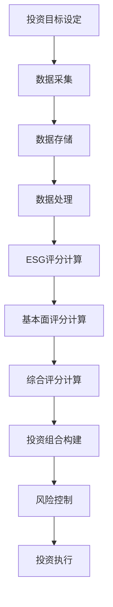

                 


# 彼得林奇的"长期价值"在社会责任投资中的体现

> 关键词：彼得林奇，长期价值，社会责任投资，ESG，投资策略，价值投资

> 摘要：本文探讨了彼得·林奇的长期价值投资理念在社会责任投资中的应用。通过分析长期价值投资的核心要素、社会责任投资的定义与分类，以及两者的结合，文章详细阐述了如何将长期价值理念融入社会责任投资的决策框架中。文章还包括了算法原理、系统架构设计、项目实战等内容，旨在为投资者提供理论和实践指导。

---

## 第一部分：引言

### 第1章：彼得林奇的长期价值投资概述

#### 1.1 彼得林奇与长期价值投资

彼得·林奇是美国著名的投资专家，以其长期价值投资理念闻名。他强调投资的核心在于企业的基本面分析和长期价值的挖掘。长期价值投资不仅仅是关注股票的价格波动，而是关注企业的内在价值和长期发展潜力。林奇的投资理念强调选择那些具有强大竞争优势、良好财务状况和优秀管理团队的企业，并长期持有，等待其内在价值的实现。

#### 1.2 社会责任投资的背景与现状

社会责任投资（Socially Responsible Investment，SRI）是一种关注环境（Environmental）、社会（Social）和公司治理（Governance，ESG）因素的投资策略。随着全球对可持续发展和环境保护的关注增加，社会责任投资逐渐成为投资领域的重要趋势。根据相关数据，全球社会责任投资的市场规模在过去几年快速增长，投资者越来越关注企业在社会责任方面的表现。

#### 1.3 本书的研究意义与目标

本书旨在探讨彼得·林奇的长期价值投资理念如何在社会责任投资中得到体现。通过分析长期价值与社会责任投资的结合，本书试图为投资者提供一种新的投资视角，帮助他们在追求长期收益的同时，关注企业的社会责任表现。本书的目标是为投资者提供理论支持和实践指导，帮助他们在复杂的市场环境中做出更明智的投资决策。

---

## 第二部分：长期价值与社会责任投资的核心概念

### 第2章：长期价值投资的核心要素

#### 2.1 长期价值投资的核心要素

长期价值投资的核心在于对企业内在价值的评估。以下是长期价值投资的几个关键要素：

1. **企业基本面分析**：包括企业的收入、利润、资产、负债等财务指标，以及行业地位、竞争优势等非财务因素。
2. **管理层质量评估**：管理层的能力和道德水平直接影响企业的长期发展。
3. **行业地位与竞争优势**：企业是否处于有增长潜力的行业，并具备竞争优势。
4. **财务健康状况评估**：企业的财务状况是否健康，是否有足够的现金流支持企业的发展。

#### 2.2 长期价值投资的决策框架

长期价值投资的决策框架强调对企业的深入研究和长期持有。以下是其决策框架的主要步骤：

1. **识别具有长期发展潜力的企业**：选择那些具有强大竞争优势和良好财务状况的企业。
2. **评估企业的内在价值**：通过对企业未来现金流的折现，评估其内在价值。
3. **构建投资组合**：根据企业的内在价值和风险特征，构建多元化投资组合。
4. **长期持有与持续监控**：长期持有优质企业，并持续监控企业的经营状况和市场环境。

---

### 第3章：社会责任投资的核心要素

#### 3.1 社会责任投资的定义与分类

社会责任投资（SRI）是一种关注环境、社会和治理（ESG）因素的投资策略。以下是社会责任投资的主要定义和分类：

1. **定义**：社会责任投资是指在投资决策中考虑企业对环境、社会和治理的影响，选择那些在这些方面表现良好的企业进行投资。
2. **分类**：社会责任投资可以分为筛选法、ESG评分法、参与法等。其中，筛选法是通过排除不符合ESG标准的企业来构建投资组合；ESG评分法是通过对企业ESG表现的评分来选择投资标的。

#### 3.2 社会责任投资的评价体系

社会责任投资的评价体系主要包括以下内容：

1. **ESG评分体系**：通过对企业的环境、社会和治理表现进行评分，评估其社会责任履行情况。
2. **绩效评估**：社会责任投资的绩效可以通过其收益和风险的比较来评估，通常使用夏普比率等指标。
3. **风险与收益分析**：社会责任投资需要在风险和收益之间找到平衡点，避免过度关注社会责任而忽视收益。

---

## 第三部分：长期价值与社会责任投资的结合

### 第4章：长期价值视角下的社会责任投资

#### 4.1 长期价值投资与社会责任投资的结合

长期价值投资与社会责任投资的结合是一种新兴的投资理念，旨在在追求长期收益的同时，关注企业的社会责任表现。以下是两者结合的主要体现：

1. **投资目标的统一**：长期价值投资关注企业的长期发展潜力，而社会责任投资关注企业的社会责任表现，两者的目标都是为了实现可持续的收益。
2. **投资策略的协同**：长期价值投资强调对企业基本面的深入分析，社会责任投资强调对ESG因素的关注，两者可以在投资策略中协同作用。
3. **风险控制的结合**：社会责任投资可以通过关注企业的社会责任表现来降低投资风险，而长期价值投资可以通过关注企业的长期发展潜力来控制风险。

---

### 第5章：长期价值与社会责任投资的算法原理

#### 5.1 算法原理

长期价值与社会责任投资的结合需要综合考虑企业的基本面和ESG因素。以下是具体的算法原理：

1. **企业基本面分析**：通过对企业财务数据的分析，评估企业的盈利能力、成长能力和财务健康状况。
2. **ESG评分**：通过对企业的环境、社会和治理表现进行评分，评估其社会责任履行情况。
3. **综合评分**：将企业的基本面评分和ESG评分进行综合，得出企业的综合评分。
4. **投资组合构建**：根据综合评分，选择评分较高的企业构建投资组合，并根据市场环境和企业动态调整投资组合。

#### 5.2 算法实现

以下是基于上述算法的Python代码示例：

```python
import pandas as pd

# 假设企业数据存储在data.csv文件中
data = pd.read_csv('data.csv')

# 计算企业基本面评分
def calculate基本面评分(row):
    # 计算盈利能力、成长能力、财务健康状况的加权评分
    profitability = row['净利率'] * 0.4
    growth = row['收入增长率'] * 0.3
    financial_health = row['资产负债率'] * 0.3
    return profitability + growth + financial_health

data['基本面评分'] = data.apply(calculate基本面评分, axis=1)

# 计算ESG评分
def calculate_ESG评分(row):
    # 计算环境、社会、治理的加权评分
    environment = row['环境评分'] * 0.4
    social = row['社会评分'] * 0.3
    governance = row['治理评分'] * 0.3
    return environment + social + governance

data['ESG评分'] = data.apply(calculate_ESG评分, axis=1)

# 计算综合评分
data['综合评分'] = data['基本面评分'] * 0.6 + data['ESG评分'] * 0.4

# 根据综合评分选择投资组合
top_n = 5
data.sort_values('综合评分', ascending=False, inplace=True)
selected_stocks = data.head(top_n)['股票代码'].tolist()

print(selected_stocks)
```

---

### 第6章：长期价值与社会责任投资的系统架构设计

#### 6.1 系统架构设计

以下是社会责任投资系统的架构图：



---

## 第四部分：项目实战

### 第7章：长期价值与社会责任投资的项目实战

#### 7.1 环境安装

以下是项目实战所需的环境安装步骤：

1. **安装Python**：安装Python 3.8及以上版本。
2. **安装必要的库**：安装pandas、numpy、scipy等库。

```bash
pip install pandas numpy scipy
```

#### 7.2 核心代码实现

以下是核心代码实现：

```python
import pandas as pd
import numpy as np

# 数据处理
data = pd.read_csv('data.csv')

# 计算综合评分
data['综合评分'] = data['基本面评分'] * 0.6 + data['ESG评分'] * 0.4

# 选择综合评分最高的前5家企业
selected_stocks = data.nlargest(5, '综合评分')['股票代码'].tolist()

print(selected_stocks)
```

---

## 第五部分：最佳实践与小结

### 第8章：长期价值与社会责任投资的最佳实践

#### 8.1 最佳实践

1. **定期评估投资组合**：定期评估投资组合的综合评分，及时调整投资策略。
2. **关注企业动态**：关注企业的经营动态和市场环境的变化，及时调整投资组合。
3. **多元化投资**：通过多元化投资降低风险，同时关注不同行业和地区的社会责任表现。

---

## 结论

长期价值与社会责任投资的结合是一种新兴的投资理念，旨在在追求长期收益的同时，关注企业的社会责任表现。通过本文的探讨，我们可以看到，将彼得·林奇的长期价值理念融入社会责任投资的决策框架中，可以帮助投资者实现可持续的投资收益。

---

## 作者：AI天才研究院 & 禅与计算机程序设计艺术

