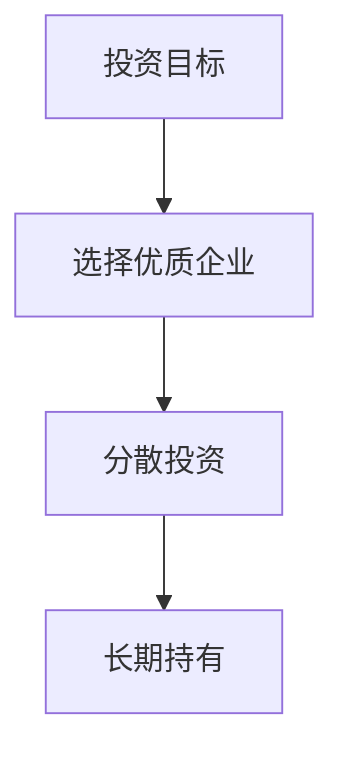

                 

# 彼得林奇的"长期价值"投资哲学

> 关键词：彼得·林奇，长期价值投资，价值投资，投资哲学，投资策略，风险管理

> 摘要：本文深入探讨了彼得·林奇的长期价值投资哲学，分析了其核心概念、内在逻辑、投资策略和风险管理，并通过实际案例展示了如何在现代投资环境中应用这一理念。文章结合技术语言和投资哲学，为读者提供了系统的分析和实践指导。

---

# 引言

彼得·林奇是全球投资领域最具影响力的人物之一，他的长期价值投资哲学深刻影响了无数投资者。本文将从技术分析的角度，逐步解析彼得·林奇的投资理念，并将其与现代投资策略相结合，为读者提供一个系统化、结构化的长期价值投资框架。

---

## 第1章：长期价值投资的背景与重要性

### 1.1 价值投资的定义与核心理念

价值投资是一种以内在价值为导向的投资策略，强调购买价格低于内在价值的资产。彼得·林奇认为，市场波动为投资者提供了以合理价格买入优质资产的机会。以下是价值投资的核心理念：

- **内在价值**：资产的真实价值，不随市场波动而变化。
- **安全边际**：买入价格与内在价值之间的差距，提供了风险缓冲。
- **长期视角**：关注企业的长期增长潜力，而非短期价格波动。

### 1.2 彼得·林奇的投资哲学

彼得·林奇的投资哲学强调以下几个方面：

- **选择优质企业**：投资于具有强大竞争优势、良好管理层和稳定财务状况的企业。
- **分散投资**：通过投资于不同行业的优质企业降低风险。
- **长期持有**：避免频繁交易，耐心等待企业成长带来的价值提升。

### 1.3 长期价值投资的重要性

长期价值投资的重要性在于其能够帮助投资者在市场波动中保持冷静，避免情绪化决策。通过关注企业的内在价值，投资者能够在市场低谷时发现机会，在市场高点时保持理性。

---

## 第2章：长期价值投资的核心概念

### 2.1 价值投资的基本原则

价值投资的基本原则可以用以下公式表示：

$$ \text{内在价值} = \sum_{t=1}^{n} \frac{CF_t}{(1 + r)^t} $$

其中，$CF_t$ 是第 t 年的现金流，$r$ 是折现率。这一公式强调了现金流的现值计算，是价值投资的核心工具。

### 2.2 彼得·林奇的投资理念

彼得·林奇的投资理念可以用以下流程图表示：

### 2.3 内在价值与市场价值的对比

内在价值与市场价值的对比可以用以下表格表示：

| 属性       | 内在价值                 | 市场价值                 |
|------------|--------------------------|--------------------------|
| 定义       | 资产的真实价值             | 市场交易价格             |
| 计算方式   | 现金流折现法               | 市场供需决定             |
| 时间因素   | 长期稳定                   | 短期波动                 |

### 2.4 如何识别优质企业

识别优质企业需要关注以下几个方面：

1. **竞争优势**：企业是否具有独特的竞争优势？
2. **财务状况**：企业是否有稳定的财务状况？
3. **管理层能力**：管理层是否具有良好的管理能力？

---

## 第3章：长期价值投资的内在逻辑

### 3.1 企业基本面分析

企业基本面分析的核心步骤如下：

1. **行业分析**：了解企业的行业地位和竞争环境。
2. **财务分析**：分析企业的财务报表，评估其盈利能力、成长性和风险。
3. **管理层分析**：评估管理层的能力和诚信。

### 3.2 财务指标解读

以下是几个关键的财务指标：

- **市盈率（P/E）**：市价与每股收益的比率，用于评估股票的估值。
- **市净率（P/B）**：市价与每股净资产的比率，用于评估股票的估值。
- **ROE（净资产收益率）**：衡量企业盈利能力的重要指标。

### 3.3 如何评估管理层的能力

评估管理层的能力需要关注以下几个方面：

1. **历史表现**：管理层是否在过去取得了良好的业绩？
2. **战略规划**：管理层是否有清晰的战略规划？
3. **管理风格**：管理层的管理风格是否稳健？

---

## 第4章：长期价值投资的策略与方法

### 4.1 投资组合的构建

投资组合的构建需要遵循以下步骤：

1. **确定投资目标**：明确投资目标和风险承受能力。
2. **选择优质企业**：根据长期价值投资的原则选择优质企业。
3. **分散投资**：通过投资于不同行业和地区的资产降低风险。

### 4.2 长期持有策略

长期持有策略的优势在于：

1. **避免交易成本**：频繁交易会增加交易成本。
2. **减少情绪干扰**：长期持有能够减少市场波动对情绪的影响。
3. **享受复利效应**：长期持有能够享受复利效应带来的收益。

### 4.3 定期复盘与调整

定期复盘和调整投资组合是长期价值投资的重要环节：

1. **定期复盘**：每季度或每年复盘一次，评估投资组合的表现。
2. **动态调整**：根据市场变化和个人财务状况进行动态调整。

---

## 第5章：长期价值投资的风险管理

### 5.1 风险识别与评估

风险管理的第一步是识别和评估潜在的风险：

1. **市场风险**：市场波动对投资组合的影响。
2. **流动性风险**：资产在短期内难以变现的风险。
3. **信用风险**：债券发行人违约的风险。

### 5.2 风险规避与控制

风险规避和控制的策略包括：

1. **分散投资**：通过投资于不同资产类别和行业降低风险。
2. **设置止损**：在投资组合中设置止损点，避免重大损失。
3. **定期评估**：定期评估投资组合的风险，并进行必要的调整。

### 5.3 市场波动应对策略

在市场波动中，投资者需要保持冷静，并采取以下策略：

1. **避免恐慌性抛售**：市场波动是暂时的，恐慌性抛售只会加剧损失。
2. **利用波动性**：市场波动为投资者提供了以更低价格买入优质资产的机会。
3. **坚持长期策略**：短期波动不会影响优质企业的长期价值。

---

## 第6章：长期价值投资的案例分析

### 6.1 成功案例解析

以可口可乐为例，分析其长期价值投资的案例：

- **行业地位**：可口可乐是全球最大的饮料公司之一。
- **财务状况**：公司具有稳定的现金流和良好的盈利能力。
- **管理层能力**：公司管理层在长期发展中表现优异。

### 6.2 失败案例反思

以安然为例，分析其失败的原因：

- **过度杠杆**：公司过度依赖债务融资，导致财务风险过高。
- **管理层欺诈**：管理层通过欺诈手段掩盖财务问题，最终导致公司破产。

### 6.3 案例总结与启示

从案例中可以得到以下启示：

1. **选择优质企业**：投资于具有强大竞争优势的企业。
2. **避免过度杠杆**：保持稳健的财务状况。
3. **关注管理层诚信**：管理层的诚信和能力至关重要。

---

## 第7章：长期价值投资的实践技巧

### 7.1 投资心态的培养

投资心态的培养包括：

1. **耐心**：长期价值投资需要耐心等待企业的成长。
2. **冷静**：避免情绪化决策，保持理性。
3. **持续学习**：不断学习和更新投资知识。

### 7.2 知识储备与能力提升

知识储备与能力提升包括：

1. **学习投资理论**：阅读经典投资书籍，学习投资理论。
2. **分析企业基本面**：掌握企业基本面分析的技巧。
3. **关注行业动态**：了解行业的最新动态和趋势。

### 7.3 投资纪律的坚持

投资纪律的坚持包括：

1. **制定投资计划**：制定明确的投资计划，并严格执行。
2. **定期复盘**：定期复盘投资组合的表现，并进行必要的调整。
3. **避免盲目跟风**：避免盲目跟风，坚持自己的投资策略。

---

## 第8章：长期价值投资的未来展望

### 8.1 投资环境的变化

随着全球经济的变化和技术的进步，投资环境也在不断变化：

1. **科技革命**：科技革命将改变许多行业的竞争格局。
2. **全球化**：全球化使得投资机会更加多元化。
3. **可持续发展**：可持续发展理念将影响企业的长期价值。

### 8.2 投资策略的调整

投资者需要根据市场环境的变化调整投资策略：

1. **适应科技革命**：关注科技行业的投资机会。
2. **全球化布局**：在全球范围内寻找投资机会。
3. **关注可持续发展**：投资于具有可持续发展潜力的企业。

### 8.3 未来投资机会的展望

未来投资机会的展望包括：

1. **科技行业**：人工智能、大数据等科技行业将有巨大的投资机会。
2. **绿色能源**：绿色能源行业将随着可持续发展理念的推进而快速发展。
3. **新兴市场**：新兴市场将随着全球化的深入而提供更多的投资机会。

---

# 结语

彼得·林奇的长期价值投资哲学为我们提供了一个系统化、结构化的投资框架。通过关注企业的内在价值，选择优质企业，分散投资，并长期持有，投资者可以在市场波动中保持冷静，并实现长期的财富增长。

---

# 参考文献与延伸阅读

1. 林奇, P. (2004). *《彼得·林奇的投资哲学》*. 北京: 机械工业出版社.
2. 纳什, J. (1994). *《博弈论与经济行为》*. Princeton University Press.
3. 格雷厄姆, B. (2006). *《证券分析》*. McGraw-Hill Education.
4. 巴菲特, W. (2010). *《巴菲特致股东的信》*. 中信出版社.
5. 布鲁克林, M. (2012). *《投资最重要的事》*. 中信出版社.

---

# 作者：AI天才研究院/AI Genius Institute & 禅与计算机程序设计艺术 /Zen And The Art of Computer Programming

---

> **注**：本文部分内容可能涉及投资建议，但请读者注意，投资有风险，决策需谨慎。本文仅为学术研究和知识分享，不构成实际的投资建议。

