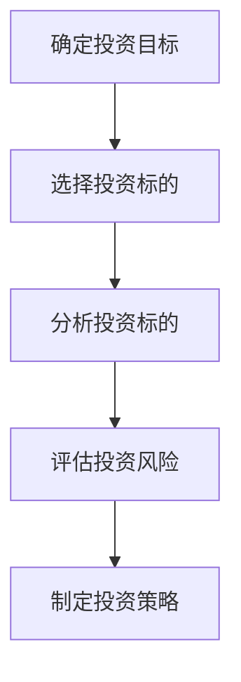
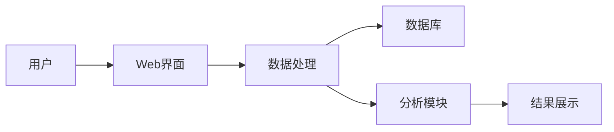

                 


---

# 彼得林奇的"长期价值"投资案例分析

## 关键词：
长期价值投资，彼得·林奇，投资策略，企业基本面分析，财务指标评估，竞争优势识别，投资算法，系统架构

## 摘要：
本文将深入分析彼得·林奇的长期价值投资策略，通过详细阐述其核心概念、算法原理、系统架构以及实际案例，帮助读者理解如何在投资中应用长期价值投资的方法。文章结合理论与实践，提供从背景介绍到系统设计的全面解析，帮助投资者掌握长期价值投资的精髓。

---

## 第一部分：长期价值投资的背景与概念

### 第1章：长期价值投资的定义与背景

#### 1.1 长期价值投资的定义
- **长期价值投资**是一种投资策略，强调以低于内在价值的价格购买并长期持有优质资产。其核心在于识别具有持续竞争优势和良好治理结构的企业，通过长期持有实现资本增值。
- **投资的核心目标**：寻找能够持续创造价值的企业，而非追求短期价格波动。

#### 1.2 彼得·林奇的背景介绍
- **彼得·林奇**是美国著名投资家，曾管理富达麦哲伦基金，创造了辉煌的投资业绩。他提倡长期持有优质股票，反对频繁交易。
- **投资哲学**：林奇认为，成功的投资在于选择那些具有强大竞争优势、管理良好且价格合理的企业。

#### 1.3 长期价值投资的重要性
- **长期价值投资的重要性**：通过深入分析企业基本面，选择真正具备成长潜力的公司，避免短期市场波动的影响。
- **与短期投资的区别**：长期价值投资注重企业的内在价值，而短期投资关注市场情绪和价格波动。

---

## 第二部分：长期价值投资的核心概念与联系

### 第2章：长期价值投资的核心概念

#### 2.1 企业基本面分析
- **财务状况**：评估企业的收入、利润、负债和现金流。
- **盈利能力**：分析净利润率、ROE等指标，判断企业的盈利能力。
- **竞争优势**：识别企业的市场地位、品牌影响力和核心竞争力。

#### 2.2 财务指标评估
- **市盈率（P/E）**：衡量股价与盈利的关系，计算公式为：P/E = 价格 / 每股收益。
- **市净率（P/B）**：衡量股价与账面价值的关系，计算公式为：P/B = 价格 / 每股净资产。
- **股息率**：衡量股票分红能力，计算公式为：股息率 = 每股股息 / 股价。

#### 2.3 企业竞争优势分析
- **核心竞争力**：企业的独特优势，如技术壁垒、成本优势等。
- **竞争优势的评估方法**：通过对比分析行业竞争对手，评估企业的市场地位。
- **可持续竞争优势**：判断企业竞争优势的持久性，确保其能够在长期内保持竞争优势。

### 第3章：长期价值投资的核心原理

#### 3.1 投资决策的流程
- **确定投资目标**：明确投资目的和风险承受能力。
- **选择投资标的**：筛选符合长期价值投资标准的公司。
- **分析投资标的**：深入研究公司的财务状况、行业地位和管理团队。
- **评估投资风险**：识别潜在风险，评估其对投资的影响。
- **制定投资策略**：根据分析结果，制定买入、持有或卖出的策略。

#### 3.2 投资决策的关键要素
- **企业的财务健康状况**：确保企业具有稳定的财务基础。
- **行业竞争格局**：分析行业的发展趋势和竞争态势。
- **宏观经济环境**：考虑宏观经济政策、利率变化等因素对投资的影响。
- **公司治理结构**：评估公司治理的透明度和管理团队的稳定性。

#### 3.3 投资组合的构建与管理
- **分散化原则**：通过投资不同行业和公司的股票，降低投资风险。
- **资产配置策略**：根据市场情况调整股票、债券等资产的比例。
- **定期评估与调整**：定期审视投资组合的表现，及时调整以适应市场变化。

---

## 第三部分：长期价值投资的算法原理与数学模型

### 第4章：长期价值投资的算法原理

#### 4.1 企业估值方法
- **市盈率法**：通过比较P/E比行业平均水平，判断股价是否合理。
- **市净率法**：通过比较P/B比行业平均水平，评估股价的高低。
- **现金流折现法**：通过DCF模型评估企业的内在价值，计算公式为：DCF = 现金流的现值之和。

#### 4.2 投资决策流程图


#### 4.3 投资决策的数学模型
- **市盈率计算公式**：$$P/E = \frac{\text{股价}}{\text{每股收益}}$$
- **市净率计算公式**：$$P/B = \frac{\text{股价}}{\text{每股净资产}}$$

#### 4.4 投资组合管理
- **资产配置策略**：根据市场变化，动态调整股票和债券的比例。
- **风险控制**：设定止损点，避免重大损失。

### 第5章：长期价值投资的系统架构

#### 5.1 系统功能设计
- **用户界面**：提供友好的操作界面，方便用户输入数据和查看分析结果。
- **数据处理**：从数据库中提取企业财务数据，进行清洗和预处理。
- **分析模块**：包括企业基本面分析、财务指标评估和竞争优势识别。
- **结果展示**：以图表和报告的形式展示分析结果。

#### 5.2 系统架构图


#### 5.3 接口设计
- **数据接口**：与第三方数据源（如Yahoo Finance）对接，获取实时数据。
- **API接口**：提供REST API，方便其他系统调用分析结果。

#### 5.4 交互设计
- **用户交互流程**：用户输入查询条件，系统返回分析结果。
- **反馈机制**：系统提供实时反馈，确保用户操作的准确性。

---

## 第四部分：长期价值投资的项目实战

### 第6章：长期价值投资的项目实战

#### 6.1 环境安装
- **Python环境**：安装Python 3.8及以上版本，安装Pandas、NumPy等库。
- **数据获取**：使用Yahoo Finance API获取目标公司的历史数据。

#### 6.2 核心代码实现
```python
import pandas as pd
import numpy as np

# 示例代码：计算市盈率和市净率
def calculate_valuation_ratios(df):
    df['P/E'] = df['Close'] / df['Earnings Per Share']
    df['P/B'] = df['Close'] / df['Book Value Per Share']
    return df

# 示例代码：识别竞争优势
def identify_competitive_advantages(df):
    industry_avg_pe = df['P/E'].mean()
    industry_avg_pb = df['P/B'].mean()
    return (df['P/E'] < industry_avg_pe) & (df['P/B'] < industry_avg_pb)

data = pd.read_csv('stock_data.csv')
data = calculate_valuation_ratios(data)
competitive_edge = identify_competitive_advantages(data)
```

#### 6.3 案例分析
- **案例：苹果公司（AAPL）**
  - 通过分析苹果的市盈率和市净率，判断其股价是否合理。
  - 结合行业平均水平，评估苹果的竞争优势。

#### 6.4 项目总结
- **总结**：长期价值投资的关键在于深入分析企业的基本面，识别其竞争优势，并在合理价格下进行投资。
- **经验**：通过系统化的方法和工具，可以更高效地进行投资分析。

---

## 第五部分：长期价值投资的最佳实践

### 第7章：长期价值投资的最佳实践

#### 7.1 投资策略小结
- **分散投资**：避免过度集中，降低风险。
- **长期持有**：耐心持有优质资产，避免频繁交易。
- **持续学习**：不断更新知识，适应市场变化。

#### 7.2 注意事项
- **风险管理**：设定止损点，避免重大损失。
- **避免情绪化决策**：保持理性，不被市场情绪左右。
- **定期复盘**：定期评估投资组合的表现，及时调整策略。

#### 7.3 拓展阅读
- **推荐书籍**：《彼得·林奇的成功投资》
- **推荐网站**：Seeking Alpha、Morningstar

---

## 作者：AI天才研究院/AI Genius Institute & 禅与计算机程序设计艺术 /Zen And The Art of Computer Programming

---

通过以上内容，读者可以系统地了解彼得·林奇的长期价值投资策略，从理论到实践，全面掌握投资的精髓。

