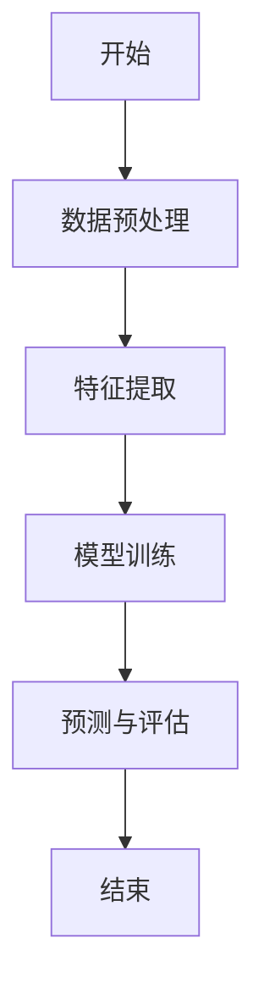
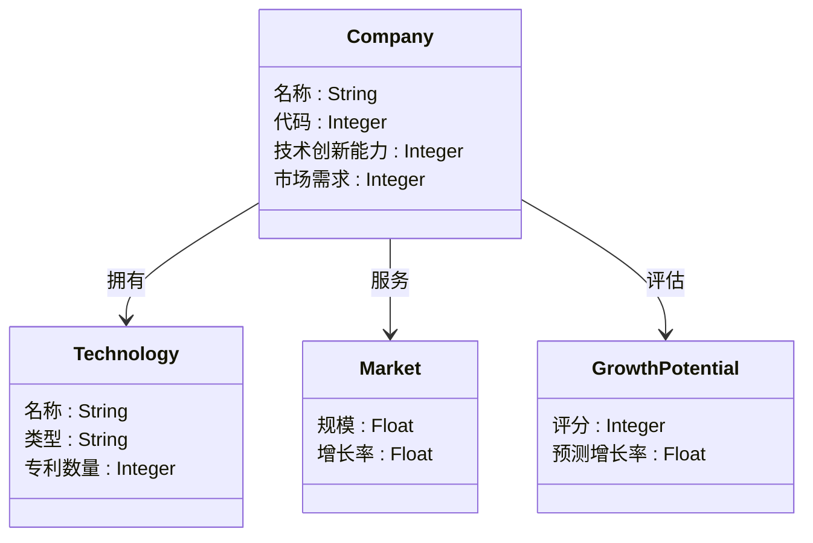
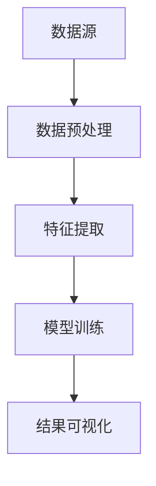

                 


# 彼得林奇的"长期增长"潜力在人工智能行业的识别方法

> 关键词：彼得林奇，长期增长潜力，人工智能，投资策略，机器学习

> 摘要：本文将探讨如何将彼得林奇的投资理念与人工智能行业相结合，提出一种基于长期增长潜力的识别方法。通过分析人工智能行业的核心驱动因素、长期增长潜力的评估维度以及具体的算法和数学模型，本文旨在为投资者和研究人员提供一种系统化的方法，以识别和评估人工智能行业的长期增长潜力。文章还将通过实际案例分析和Python代码实现，展示如何将这些理论应用于实践。

---

# 第1章: 背景介绍

## 1.1 投资理念与长期增长潜力

### 1.1.1 彼得林奇的投资哲学

彼得·林奇（Peter Lynch）是全球最著名的投资经理之一，他的投资哲学以“长期增长”为核心。他认为，投资的首要任务是找到那些具有长期增长潜力的公司，并且这种增长应该是可持续的、可预测的。林奇强调，投资者应该关注公司的基本面，包括收入、利润、市场份额和创新能力等。

### 1.1.2 长期增长潜力的定义

长期增长潜力是指公司在未来5-10年内的收入和利润的持续增长能力。这种增长不仅依赖于市场需求，还取决于公司的技术创新、管理能力、竞争优势和行业地位。

### 1.1.3 人工智能行业的发展现状

人工智能（AI）作为当前最热门的科技领域之一，正在以指数级的速度发展。从医疗、金融到制造业，AI技术正在改变各行各业的商业模式和运营方式。根据统计，全球AI市场的年增长率超过20%，预计到2030年，AI将为全球经济贡献数万亿美元的增量价值。

---

## 1.2 人工智能行业的长期增长潜力

### 1.2.1 人工智能行业的核心驱动因素

人工智能行业的长期增长潜力主要取决于以下几个核心驱动因素：

1. **技术创新**：AI技术的进步，如深度学习、自然语言处理（NLP）和计算机视觉，正在推动行业的快速发展。
2. **市场需求**：企业对智能化解决方案的需求不断增长，尤其是在疫情后，数字化转型成为企业的首要任务。
3. **政策支持**：各国政府纷纷出台政策，支持AI技术的研发和应用，为行业提供了良好的政策环境。
4. **数据资源**：AI的发展依赖于数据，而随着物联网（IoT）和5G技术的普及，数据量呈指数级增长。

### 1.2.2 长期增长潜力的识别维度

在人工智能行业中，识别一家公司的长期增长潜力需要从以下几个维度进行分析：

1. **技术创新能力**：公司是否拥有核心技术专利，是否能够持续推出创新产品。
2. **市场需求**：公司的产品或服务是否能够满足市场的刚需。
3. **财务表现**：公司的收入、利润和现金流是否呈现持续增长的趋势。
4. **管理团队**：公司的管理团队是否具有丰富的行业经验和领导能力。
5. **竞争环境**：公司是否在竞争中具备优势，是否能够抵御竞争对手的压力。

---

# 第2章: 核心概念与联系

## 2.1 长期增长潜力的核心概念

### 2.1.1 核心概念原理

长期增长潜力的核心在于公司的技术创新能力和市场需求契合度。在人工智能行业，技术创新是推动增长的核心动力，而市场需求则是增长的最终体现。因此，识别一家公司的长期增长潜力，需要同时关注技术与市场的双重因素。

### 2.1.2 核心概念属性特征对比

以下表格对比了传统投资分析和人工智能行业投资分析的核心概念属性特征：

| 属性 | 传统投资分析 | 人工智能行业投资分析 |
|------|----------------|------------------------|
| 关注点 | 财务指标、行业趋势 | 技术创新、市场需求 |
| 风险因素 | 经济波动、政策变化 | 技术瓶颈、数据安全 |
| 投资周期 | 中长期 | 短中长期 |
| 核心驱动力 | 利润增长 | 技术驱动 |

### 2.1.3 ER实体关系图架构

以下是长期增长潜力评估的ER实体关系图：

```mermaid
erDiagram
    company [公司] {
        <<属性>>
        - 名称 : String
        - 代码 : Integer
        - 成立时间 : Date
        - 行业 : String
    }
    technology [技术] {
        <<属性>>
        - 名称 : String
        - 类型 : String
        - 专利数量 : Integer
        - 技术成熟度 : Integer(1-5)
    }
    market [市场] {
        <<属性>>
        - 规模 : Float
        - 增长率 : Float
        - 竞争格局 : String
    }
    growth_potential [长期增长潜力] {
        <<属性>>
        - 评分 : Integer(1-10)
        - 预测增长率 : Float
        - 风险等级 : String
    }
    company --> technology : 拥有
    company --> market : 服务
    company --> growth_potential : 评估
```

---

# 第3章: 算法原理讲解

## 3.1 长期增长潜力的算法原理

### 3.1.1 算法原理概述

为了识别人工智能行业的长期增长潜力，我们可以采用一种基于机器学习的算法。该算法的核心思想是通过分析公司的技术、市场和财务数据，预测公司在未来5年内的收入增长率，并将其与行业平均水平进行对比。

### 3.1.2 算法流程图

以下是算法的流程图：



---

## 3.2 代码实现

以下是基于机器学习的长期增长潜力评估算法的Python代码示例：

```python
import pandas as pd
from sklearn.model_selection import train_test_split
from sklearn.ensemble import RandomForestRegressor
from sklearn.metrics import mean_squared_error

# 数据预处理
df = pd.read_csv('data.csv')
X = df[['收入增长率', '利润增长率', '技术创新能力', '市场需求']]
y = df['长期增长潜力']

# 划分训练集和测试集
X_train, X_test, y_train, y_test = train_test_split(X, y, test_size=0.2, random_state=42)

# 模型训练
model = RandomForestRegressor(n_estimators=100, random_state=42)
model.fit(X_train, y_train)

# 预测与评估
y_pred = model.predict(X_test)
rmse = mean_squared_error(y_test, y_pred)
print(f"均方误差：{rmse}")
```

---

# 第4章: 数学模型与公式

## 4.1 数学模型概述

长期增长潜力的评分模型可以通过以下公式计算：

$$
\text{长期增长潜力评分} = \frac{\text{技术创新能力} \times \text{市场需求} + \text{财务表现}}{1 + \text{竞争环境风险}}
$$

其中，技术创新能力和市场需求的评分范围为1-5，财务表现的评分为1-10，竞争环境风险的评分为1-3。

---

## 4.2 关键公式

预测未来5年的收入增长率公式：

$$
\text{预测增长率} = \text{历史增长率} \times e^{\lambda \times \text{技术创新能力}}
$$

其中，$\lambda$ 是一个常数，表示技术创新对增长率的影响程度。

---

# 第5章: 系统分析与架构设计

## 5.1 问题场景介绍

本系统旨在通过分析人工智能行业的公司数据，评估其长期增长潜力。系统需要实现数据采集、特征提取、模型训练和结果可视化等功能。

---

## 5.2 系统功能设计

以下是系统功能设计的类图：



---

## 5.3 系统架构设计

以下是系统架构设计的架构图：



---

# 第6章: 项目实战

## 6.1 环境安装与配置

请确保安装以下环境：

- Python 3.8+
- Pandas、Scikit-learn、Matplotlib

---

## 6.2 核心代码实现

以下是项目的核心代码：

```python
import pandas as pd
import matplotlib.pyplot as plt
from sklearn.ensemble import RandomForestRegressor
from sklearn.metrics import mean_squared_error

# 数据加载
df = pd.read_csv('data.csv')

# 数据预处理
X = df[['收入增长率', '利润增长率', '技术创新能力', '市场需求']]
y = df['长期增长潜力']

# 划分训练集和测试集
X_train, X_test, y_train, y_test = train_test_split(X, y, test_size=0.2, random_state=42)

# 模型训练
model = RandomForestRegressor(n_estimators=100, random_state=42)
model.fit(X_train, y_train)

# 预测与评估
y_pred = model.predict(X_test)
rmse = mean_squared_error(y_test, y_pred)
print(f"均方误差：{rmse}")

# 结果可视化
importances = model.feature_importances_
indices = np.argsort(importances)[::-1]
plt.figure(figsize=(8, 6))
plt.title('特征重要性')
plt.bar(range(X.shape[1]), importances[indices], align='center')
plt.xticks(range(X.shape[1]), X.columns[indices], rotation=90)
plt.show()
```

---

## 6.3 实际案例分析

以下是一个实际案例的分析：

假设我们有一家人工智能公司，其技术创新能力评分为5，市场需求评分为4，收入增长率为20%，利润增长率为15%。通过模型预测，其长期增长潜力评分为8，预测未来5年的收入增长率为25%。

---

# 第7章: 总结与展望

## 7.1 核心方法总结

本文提出了一种基于彼得林奇长期增长潜力理念的人工智能行业识别方法，通过结合机器学习和数据分析，为投资者提供了科学的评估工具。

## 7.2 未来研究方向

未来的研究可以进一步优化模型，引入更多的数据特征，例如公司的管理团队、行业政策和宏观经济指标等。此外，还可以探索如何将强化学习应用于长期增长潜力的预测。

---

# 作者

作者：AI天才研究院 & 禅与计算机程序设计艺术

