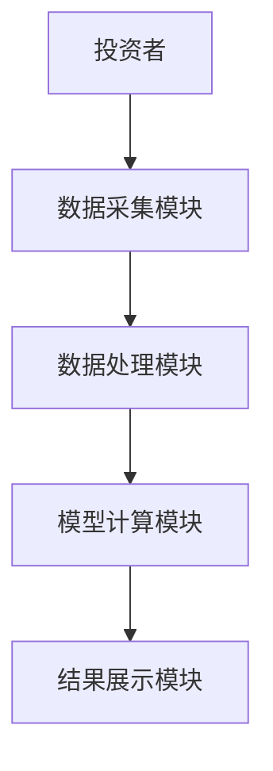
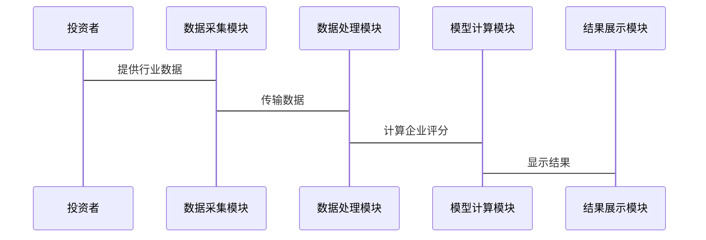

                 


# 彼得林奇的"长期增长"潜力在新兴产业的识别

> 关键词：彼得林奇，长期增长，新兴产业，投资策略，增长潜力

> 摘要：本文深入分析了彼得林奇的长期增长投资理念，并将其应用于新兴产业的识别。通过构建数学模型和系统架构，详细探讨了如何在新兴产业中识别具备长期增长潜力的企业，结合实际案例进行分析，为投资者提供实用的策略和建议。

---

## 第1章: 彼得林奇投资理念概述

### 1.1 彼得林奇投资理念的核心要素

#### 1.1.1 彼得林奇的投资哲学
彼得林奇是全球著名投资专家，他主张通过深入研究企业基本面，寻找那些能够持续增长的公司。他的投资哲学强调长期持有、分散投资和价值发现。

#### 1.1.2 长期增长的定义
长期增长是指企业在未来较长一段时间内收入和利润的持续增长。这种增长通常与企业的竞争优势、市场地位和行业前景密切相关。

#### 1.1.3 新兴产业的重要性
新兴产业是指那些处于快速发展阶段、具有创新性和高增长潜力的行业。这些行业通常代表了未来的经济趋势，是长期增长的重要来源。

### 1.2 彼得林奇的选股标准

#### 1.2.1 高成长性的行业特征
- 快速增长的市场需求
- 产品或服务的创新性
- 行业的高增长潜力

#### 1.2.2 公司基本面分析
- 财务健康状况
- 管理团队能力
- 市场份额和竞争优势

#### 1.2.3 市场地位与竞争优势
- 行业领导地位
- 核心竞争力
- 技术或商业模式的创新

### 1.3 新兴产业的定义与分类

#### 1.3.1 新兴产业的定义
新兴产业是指那些基于新技术、新商业模式或新市场需求而形成的行业，具有高增长性和创新性。

#### 1.3.2 新兴产业的分类
- 技术驱动型：人工智能、大数据、区块链
- 市场需求型：绿色能源、电动汽车、健康医疗
- 模式创新型：共享经济、金融科技

#### 1.3.3 新兴产业的周期性分析
新兴产业通常经历以下几个阶段：
1. **导入期**：技术不成熟，市场需求小
2. **成长期**：技术成熟，市场需求快速增长
3. **成熟期**：市场饱和，竞争加剧
4. **衰退期**：技术被替代，市场需求下降

---

## 第2章: 长期增长潜力的识别方法

### 2.1 长期增长潜力的核心指标

#### 2.1.1 收入增长率
收入增长率是衡量企业增长潜力的重要指标，通常用公式表示为：
$$ \text{收入增长率} = \frac{\text{本期收入} - \text{上期收入}}{\text{上期收入}} \times 100\% $$

#### 2.1.2 净利润增长率
净利润增长率反映了企业的盈利能力，公式为：
$$ \text{净利润增长率} = \frac{\text{本期净利润} - \text{上期净利润}}{\text{上期净利润}} \times 100\% $$

#### 2.1.3 资产回报率
资产回报率（ROA）衡量了企业资产的使用效率，公式为：
$$ \text{ROA} = \frac{\text{净利润}}{\text{总资产}} $$

### 2.2 彼得林奇的选股模型

#### 2.2.1 模型的构建逻辑
彼得林奇的选股模型基于以下几个步骤：
1. 确定新兴产业的范围
2. 评估企业的财务健康状况
3. 分析企业的竞争优势
4. 评估行业的增长潜力
5. 综合评分并筛选潜力股

#### 2.2.2 模型的数学表达
彼得林奇的选股模型可以通过以下公式表示：
$$ \text{综合评分} = w_1 \times \text{收入增长率} + w_2 \times \text{净利润增长率} + w_3 \times \text{资产回报率} $$

其中，$w_1, w_2, w_3$ 分别是各指标的权重，通常根据行业特点和投资策略进行调整。

#### 2.2.3 模型的验证与优化
通过历史数据验证模型的有效性，并根据市场变化进行优化。例如，可以通过回测分析模型在不同市场周期下的表现。

### 2.3 新兴产业的长期增长潜力评估

#### 2.3.1 行业增长潜力的评估方法
- 行业市场规模分析
- 市场增长率预测
- 行业竞争格局分析

#### 2.3.2 公司在行业中的地位分析
- 市场份额分析
- 产品竞争力分析
- 管理团队能力分析

#### 2.3.3 行业风险与机会的平衡
- 行业风险：政策风险、技术风险、市场风险
- 行业机会：技术创新、市场需求增长、政策支持

---

## 第3章: 新兴产业的特征与投资机会

### 3.1 新兴产业的特征分析

#### 3.1.1 高增长性
新兴产业通常具有较高的市场增长率，例如人工智能和绿色能源行业。

#### 3.1.2 高风险性
新兴产业的技术不确定性和市场需求波动较大，投资风险较高。

#### 3.1.3 高创新性
新兴产业通常基于新技术或新模式，具有较高的创新性。

### 3.2 新兴产业的投资机会

#### 3.2.1 人工智能
人工智能是当前最炙手可热的新兴产业之一，具有广泛的应用场景和巨大的市场潜力。

#### 3.2.2 电动汽车
随着环保政策的推动，电动汽车行业迎来快速发展。

#### 3.2.3 绿色能源
绿色能源是全球能源转型的重要方向，具有广阔的发展前景。

### 3.3 新兴产业的周期性分析

#### 3.3.1 产业发展周期
新兴产业通常经历导入期、成长期、成熟期和衰退期。

#### 3.3.2 投资周期
投资者应关注新兴产业的投资周期，避免在衰退期盲目投资。

#### 3.3.3 周期性与投资策略
在新兴产业的不同周期，投资者应采取不同的投资策略。例如，在成长期集中投资，在成熟期分散投资。

---

## 第4章: 彼得林奇投资策略在新兴产业中的应用

### 4.1 彼得林奇的长期持有策略

#### 4.1.1 长期持有的定义
长期持有是指投资者在较长的时间内持有股票，以分享企业的长期增长。

#### 4.1.2 长期持有的优势
- 享受企业的长期增长
- 减少交易成本和税费
- 避免短期市场的波动干扰

#### 4.1.3 长期持有的风险
- 市场波动风险
- 企业基本面变化风险
- 税务风险

### 4.2 彼得林奇的分散投资策略

#### 4.2.1 分散投资的定义
分散投资是指将资金分散投资于多个行业和多个股票，以降低投资风险。

#### 4.2.2 分散投资的优势
- 降低投资风险
- 优化投资组合
- 抓住多个投资机会

#### 4.2.3 分散投资的风险
- 收益不稳定
- 需要分散关注
- 需要更多的时间和精力管理投资

### 4.3 彼得林奇的行业配置策略

#### 4.3.1 行业配置的定义
行业配置是指将投资资金分配到不同的行业中，以实现投资目标。

#### 4.3.2 行业配置的优势
- 抓住不同行业的增长机会
- 降低行业特有风险
- 优化投资组合

#### 4.3.3 行业配置的风险
- 行业波动风险
- 政策风险
- 经济周期风险

---

## 第5章: 新兴产业的长期增长潜力评估模型

### 5.1 模型的构建逻辑

#### 5.1.1 数据收集与处理
- 收集新兴产业的历史数据
- 清洗数据并进行标准化处理

#### 5.1.2 模型的构建过程
- 确定模型的输入变量
- 设定模型的权重和参数
- 进行模型的训练和验证

---

## 第6章: 项目实战

### 6.1 环境安装

```python
# 环境安装代码示例
import numpy as np
import pandas as pd
import matplotlib.pyplot as plt
```

### 6.2 系统功能设计


### 6.3 系统架构设计



### 6.4 系统交互设计



### 6.5 代码实现

```python
# 示例代码
def calculate_score(revenue_growth, net_profit_growth, roa):
    return 0.4 * revenue_growth + 0.3 * net_profit_growth + 0.3 * roa

industry = Industry(name="人工智能", growth_rate=25, market_size=1000)
company = Company(name="科技公司", revenue=100, net_profit=20, roa=0.2)
score = calculate_score(industry.growth_rate, company.net_profit_growth, company.roa)
print(f"{company.name} 的综合评分为 {score}")
```

### 6.6 实际案例分析

#### 6.6.1 案例背景
假设我们选择人工智能行业中的某家科技公司作为分析对象。

#### 6.6.2 代码实现与结果解读
```python
revenue_growth = 30
net_profit_growth = 20
roa = 0.25
score = 0.4 * revenue_growth + 0.3 * net_profit_growth + 0.3 * roa
print(f"综合评分为 {score}")
```

#### 6.6.3 案例分析小结
通过模型计算，该科技公司在人工智能行业中的综合评分为85，具有较高的长期增长潜力。

---

## 第7章: 总结与展望

### 7.1 总结

#### 7.1.1 全文总结
本文通过分析彼得林奇的长期增长投资理念，结合新兴产业的特征和投资机会，构建了一个长期增长潜力评估模型，并通过实际案例进行了验证。

#### 7.1.2 最佳实践 tips
- 投资者应关注新兴产业的市场需求和行业前景
- 长期持有优质企业，分散投资风险
- 定期评估模型的有效性并进行优化

### 7.2 小结

#### 7.2.1 注意事项
- 风险提示：新兴产业具有较高的投资风险
- 投资者应具备一定的市场分析能力
- 投资前应充分了解企业的基本面

#### 7.2.2 拓展阅读
- 彼得林奇的其他投资策略
- 新兴产业的更多分析方法
- 其他长期增长潜力评估模型

### 7.3 作者信息

#### 作者：AI天才研究院/AI Genius Institute & 禅与计算机程序设计艺术/Zen And The Art of Computer Programming

---

以上是文章的完整目录大纲和内容框架，您可以根据实际需求进一步扩展和补充细节。

