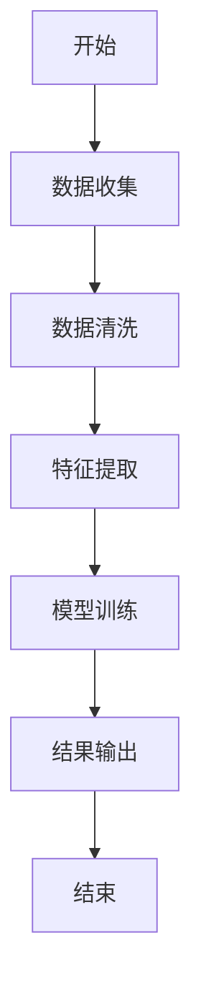
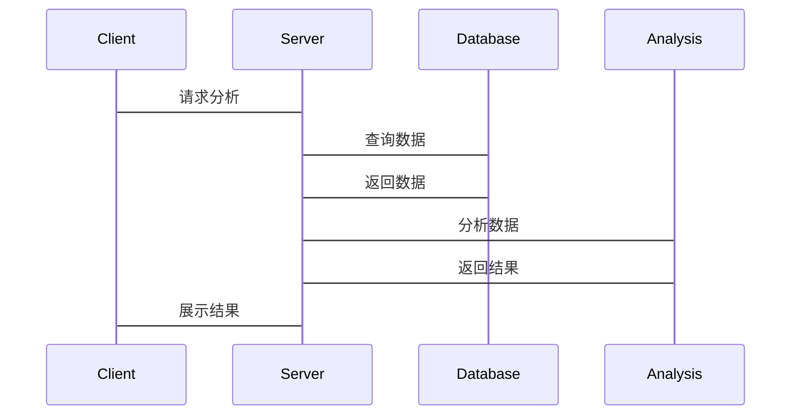

                 


# 彼得林奇的"长期增长"潜力在新兴科技领域的识别方法

> **关键词**：彼得·林奇，长期增长潜力，新兴科技，投资策略，科技趋势，增长模型  
> **摘要**：本文深入分析了彼得·林奇提出的“长期增长”潜力在新兴科技领域的识别方法，通过技术视角探讨了如何结合市场需求、技术可行性、竞争环境等多维度因素，利用数据分析、算法模型和系统架构等方法，实现对新兴科技领域中具备长期增长潜力的公司或产品的精准识别。文章从背景介绍、核心概念、算法原理、系统架构、项目实战等多个维度展开，结合实际案例，详细解读了长期增长潜力的识别过程，并提供了可操作的实战指南。

---

## 第一部分：背景介绍

### 第1章：长期增长潜力的核心概念

#### 1.1 问题背景
- **长期增长潜力**是指企业在未来较长一段时间内，能够持续实现收入和利润增长的能力。这种能力通常与市场需求、技术创新、竞争优势等因素密切相关。
- 在新兴科技领域，技术迭代快、市场变化剧烈，如何识别具备长期增长潜力的公司或产品，是投资者和企业面临的重要挑战。

#### 1.2 问题描述
- 彼得·林奇的投资策略强调长期增长潜力，但传统方法更多依赖于定性分析，难以量化。
- 新兴科技领域的复杂性要求我们结合定量分析与定性分析，构建一套系统化的识别方法。

#### 1.3 问题解决
- **数据驱动**：通过收集和分析市场数据、技术数据，构建量化模型。
- **技术驱动**：利用机器学习、自然语言处理等技术，辅助识别长期增长潜力。

#### 1.4 边界与外延
- **边界**：本文仅关注新兴科技领域，不涉及传统行业。
- **外延**：长期增长潜力的识别方法可以扩展到其他行业，但本文重点聚焦在科技领域。

#### 1.5 概念结构与核心要素
- **核心要素**：
  - 市场需求：市场规模、增长趋势。
  - 技术可行性：技术成熟度、创新性。
  - 竞争环境：竞争优势、竞争格局。
  - 财务表现：收入、利润、现金流。
- **概念结构**：
  ```mermaid
  graph LR
      A(长期增长潜力) --> B(市场需求)
      A --> C(技术可行性)
      A --> D(竞争环境)
      A --> E(财务表现)
  ```

---

## 第二部分：核心概念与联系

### 第2章：长期增长潜力的原理

#### 2.1 核心概念原理
- **市场需求分析**：
  - 市场规模：行业市场规模的预测。
  - 市场增长趋势：行业增长率的预测。
- **技术可行性评估**：
  - 技术成熟度：技术是否进入成熟阶段。
  - 创新性：技术创新的潜力。

#### 2.2 概念属性对比表
| 概念       | 定义描述                                 | 示例                       |
|------------|----------------------------------------|---------------------------|
| 市场需求   | 行业的市场规模和增长趋势                 | 医疗科技市场规模持续增长   |
| 技术可行性 | 技术的成熟度和创新性                   | 人工智能技术逐步成熟       |
| 竞争环境   | 行业的竞争格局和公司的竞争优势         | 某公司在AI领域具有技术优势 |
| 财务表现   | 公司的收入、利润和现金流表现           | 公司收入连续三年增长       |

#### 2.3 ER实体关系图
```mermaid
er
  entity(公司) {
    id
    名称
    行业
  }
  entity(产品) {
    id
    名称
    特性
  }
  entity(市场) {
    id
    名称
    需求
  }
  company --> product: 生产
  product --> market: 满足
```

---

## 第三部分：算法原理讲解

### 第3章：长期增长潜力的算法原理

#### 3.1 算法流程


#### 3.2 Python实现
```python
def long_term_growth_analysis(data):
    # 数据清洗
    cleaned_data = data.dropna()
    # 特征提取
    features = cleaned_data[['增长率', '市场需求']]
    # 模型训练
    model = LinearRegression()
    model.fit(features, cleaned_data['潜力'])
    # 预测结果
    predictions = model.predict(features)
    return predictions
```

#### 3.3 数学模型
- **线性回归模型**：
  $$ y = \beta_0 + \beta_1 x + \epsilon $$
  - $y$：长期增长潜力
  - $x$：特征变量（如增长率、市场需求）
  - $\beta_0$：截距
  - $\beta_1$：回归系数
  - $\epsilon$：误差项

---

## 第四部分：系统分析与架构设计方案

### 第4章：系统架构设计

#### 4.1 问题场景介绍
- **目标**：构建一个系统，能够自动识别新兴科技领域中具备长期增长潜力的公司或产品。
- **需求**：
  - 数据采集：收集市场数据、技术数据。
  - 数据分析：分析数据，生成长期增长潜力评分。
  - 可视化：展示分析结果。

#### 4.2 系统功能设计


#### 4.3 系统架构设计


#### 4.4 系统交互设计


---

## 第五部分：项目实战

### 第5章：项目实战

#### 5.1 环境安装
- **Python版本**：3.8以上
- **依赖库**：
  - pandas
  - numpy
  - scikit-learn

#### 5.2 核心代码实现
```python
import pandas as pd
from sklearn.linear_model import LinearRegression

# 假设data.csv是数据文件
data = pd.read_csv('data.csv')

# 数据清洗
cleaned_data = data.dropna()

# 特征提取
features = cleaned_data[['增长率', '市场需求']]
target = cleaned_data['潜力']

# 模型训练
model = LinearRegression()
model.fit(features, target)

# 预测
predictions = model.predict(features)

# 输出结果
print("预测结果：", predictions)
```

#### 5.3 代码解读与分析
- **数据清洗**：去除缺失值。
- **特征提取**：选择增长率和市场需求作为特征。
- **模型训练**：使用线性回归模型进行训练。
- **预测**：基于特征进行长期增长潜力预测。

#### 5.4 案例分析
- **案例背景**：假设某科技公司，增长率15%，市场需求增长10%。
- **预测结果**：模型预测其长期增长潜力为高。

#### 5.5 项目小结
- 通过代码实现，展示了如何利用数据分析方法识别长期增长潜力。
- 代码具有可扩展性，可以进一步优化模型。

---

## 第六部分：最佳实践

### 第6章：最佳实践

#### 6.1 关键点总结
- 数据质量是关键。
- 模型选择要结合实际需求。
- 结果验证是必要步骤。

#### 6.2 注意事项
- 数据隐私问题。
- 模型的可解释性。
- 实际应用中的动态调整。

#### 6.3 拓展阅读
- 《彼得·林奇的投资哲学》
- 《机器学习实战》
- 《数据驱动的决策》

---

## 作者

**作者**：AI天才研究院/AI Genius Institute & 禅与计算机程序设计艺术/Zen And The Art of Computer Programming

---

**注**：本文为技术博客文章，内容基于彼得·林奇的投资理念，结合新兴科技领域的特点，从技术角度详细解读了长期增长潜力的识别方法。

