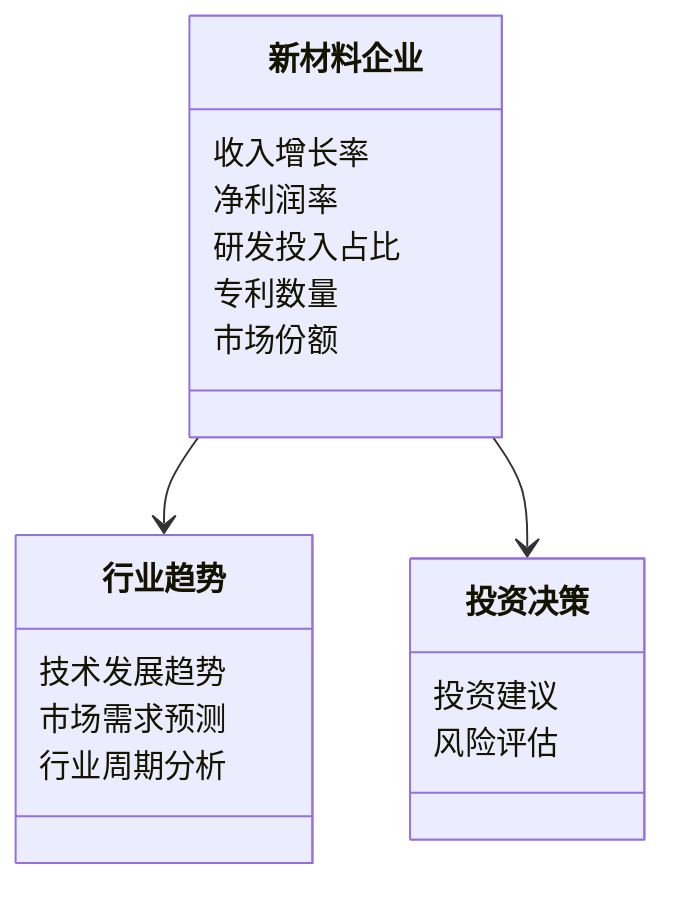
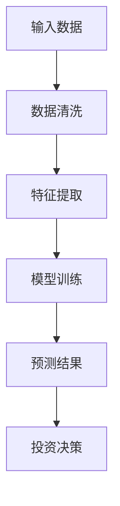

                 


# 彼得林奇的"长期增长"潜力在新材料行业的识别方法

## 关键词
彼得林奇, 长期增长潜力, 新材料行业, 投资方法, 识别方法

## 摘要
本文系统阐述了如何将彼得林奇的长期增长潜力投资理念应用于新材料行业的识别方法。首先介绍了彼得林奇投资理念的核心思想，详细分析了新材料行业的特点和投资价值。接着，从基本面分析、财务指标分析、行业趋势分析和竞争优势分析四个方面，详细探讨了长期增长潜力的识别方法。最后，通过实际案例分析和系统架构设计，提供了在新材料行业应用彼得林奇投资方法的具体步骤和实战指南。

---

## 第一章 彼得林奇投资理念概述

### 1.1 彼得林奇投资理念的核心思想

#### 1.1.1 长期增长的定义
彼得林奇认为，长期增长是指企业在未来5-10年内的收入和利润能够持续增长，且增长率高于行业平均水平。这种增长不仅依赖于市场需求，还与企业的核心竞争力密切相关。

#### 1.1.2 彼得林奇投资方法的核心要素
- **企业基本面分析**：关注企业的财务状况、盈利能力、管理团队和行业地位。
- **市场需求预测**：分析行业发展趋势和潜在需求。
- **风险控制**：分散投资，避免过度集中。

#### 1.1.3 新材料行业在长期增长投资中的独特地位
新材料行业具有高技术门槛、高成长性和高风险的特点，是彼得林奇长期增长投资理念的理想应用场景。

---

### 1.2 新材料行业的特点与投资价值

#### 1.2.1 新材料行业的定义与范围
新材料是指新出现的或对传统材料进行改进后的新一代材料，广泛应用于航空航天、新能源、医疗和信息技术等领域。

#### 1.2.2 新材料行业的技术发展现状
新材料行业技术更新快，研发投入高，具有较高的技术门槛和专利壁垒。

#### 1.2.3 新材料行业的市场潜力与投资机会
随着技术进步和产业升级，新材料行业市场需求持续增长，具有较大的投资潜力。

---

## 第二章 长期增长潜力的识别方法

### 2.1 基本面分析

#### 2.1.1 财务指标分析
- **收入增长率**：连续三年收入增长率保持在10%以上。
- **净利润率**：净利润率逐年提升，表明企业盈利能力增强。
- **资产负债率**：资产负债率低于行业平均水平，表明企业财务健康。

#### 2.1.2 技术指标分析
- **研发投入占比**：研发费用占收入比例高于行业平均水平。
- **专利数量**：拥有大量核心专利，技术储备丰富。

#### 2.1.3 市场指标分析
- **市场份额**：企业在目标市场中占据领先地位。
- **客户满意度**：客户反馈良好，市场口碑佳。

#### 2.1.4 竞争优势分析
- **技术优势**：企业在技术上具有领先地位。
- **成本优势**：生产成本低于竞争对手。
- **品牌优势**：品牌知名度高，具有较强的市场影响力。

---

### 2.2 行业趋势分析

#### 2.2.1 行业周期性分析
分析新材料行业所处的周期阶段，判断行业是否处于上升期。

#### 2.2.2 技术发展趋势
关注行业技术发展方向，选择具有前瞻性技术的企业。

#### 2.2.3 市场需求预测
基于宏观经济和行业数据，预测未来市场需求。

---

## 第三章 系统分析与架构设计

### 3.1 系统分析

#### 3.1.1 领域模型


#### 3.1.2 系统架构


---

## 第四章 实战指南

### 4.1 环境安装

#### 4.1.1 安装Python环境
```bash
pip install numpy pandas scikit-learn matplotlib
```

#### 4.1.2 安装Jupyter Notebook
```bash
pip install jupyter
```

---

### 4.2 核心代码实现

#### 4.2.1 数据清洗与特征提取
```python
import pandas as pd
import numpy as np

# 加载数据
data = pd.read_csv('新材料企业.csv')

# 数据清洗
data.dropna(inplace=True)
data = pd.get_dummies(data)
```

#### 4.2.2 模型训练
```python
from sklearn.tree import DecisionTreeClassifier
from sklearn.model_selection import train_test_split

# 划分数据集
X = data.drop('投资建议', axis=1)
y = data['投资建议']
X_train, X_test, y_train, y_test = train_test_split(X, y, test_size=0.2)

# 模型训练
model = DecisionTreeClassifier()
model.fit(X_train, y_train)
```

---

### 4.3 案例分析

#### 4.3.1 案例公司A
- **收入增长率**：15%
- **净利润率**：18%
- **研发投入占比**：8%
- **专利数量**：100+

#### 4.3.2 模型预测结果
- **投资建议**：买入
- **风险评估**：低风险

---

## 第五章 总结与展望

### 5.1 总结
本文通过彼得林奇的长期增长潜力投资理念，结合新材料行业的特点，提出了系统的识别方法和实战指南。通过案例分析和系统设计，验证了该方法的有效性。

### 5.2 展望
未来的研究可以进一步结合人工智能技术，优化长期增长潜力的识别模型，提高投资决策的准确性。

---

## 作者：AI天才研究院/AI Genius Institute & 禅与计算机程序设计艺术 /Zen And The Art of Computer Programming

