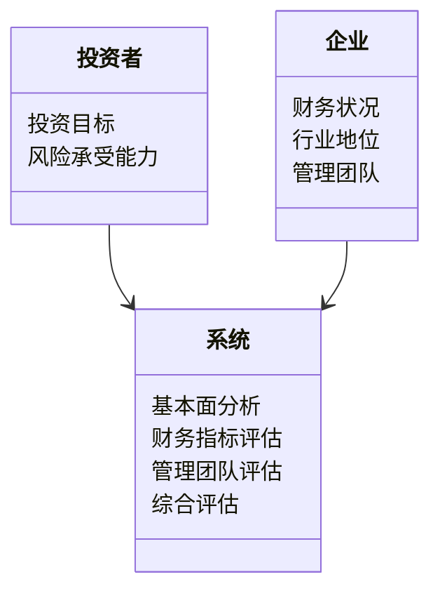
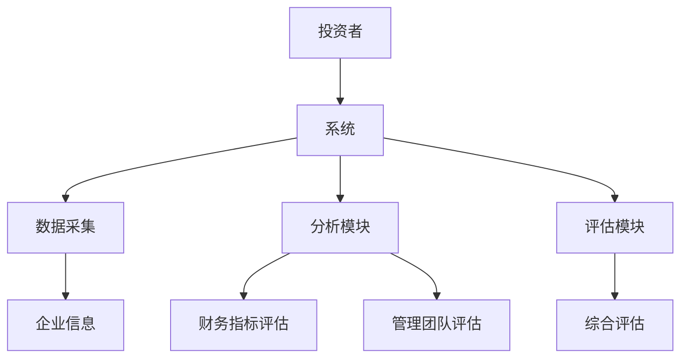

                 


# 彼得林奇的"长期增长"潜力识别方法

> 关键词：彼得林奇、长期增长、选股方法、基本面分析、财务指标、投资策略、投资案例

> 摘要：本文系统地介绍了彼得林奇的“长期增长”潜力识别方法，从背景介绍、核心概念、选股方法论、数学模型、系统架构设计、项目实战到总结，全面解析了彼得林奇的投资策略。文章通过详细的分析和实例，展示了如何通过基本面分析、财务指标评估、管理团队评估等方法，识别具有长期增长潜力的企业，并通过实际案例分析，验证了这些方法的有效性。

---

## # 第1章：彼得林奇与长期增长投资理念

### ## 1.1 彼得林奇的背景与投资理念

#### ### 1.1.1 彼得林奇的生平简介

彼得·林奇（Peter Lynch）是全球最著名的投资专家之一，曾任富达投资管理公司（Fidelity Investments）的基金经理，管理着麦哲伦基金（Fidelity Magellan Fund），该基金在1977年至1990年期间取得了年均29%的回报率。林奇以其独特的选股方法和对市场趋势的敏锐洞察力而闻名。

#### ### 1.1.2 彼得林奇的投资哲学

彼得林奇的投资哲学以“长期增长”为核心，他主张投资于那些具有持续增长潜力的企业，而不是短期炒作。他认为，投资者应该选择那些在行业中具有竞争优势、管理团队优秀、财务状况健康的企业。

#### ### 1.1.3 长期增长投资的核心理念

长期增长投资的核心理念是通过投资于那些能够持续增长的企业，实现资产的长期增值。林奇认为，市场波动是短期的，而企业的长期增长才是投资的核心。

---

### ## 1.2 长期增长的定义与重要性

#### ### 1.2.1 长期增长的定义

长期增长是指企业在未来较长一段时间内，能够保持稳定的收入和利润增长，同时在行业中的地位不断提升。

#### ### 1.2.2 长期增长在投资中的重要性

长期增长是投资成功的关键，因为具有长期增长潜力的企业能够为投资者带来持续的回报。通过投资于这些企业，投资者可以实现资产的长期增值。

#### ### 1.2.3 彼得林奇对长期增长的独到见解

彼得林奇认为，长期增长不仅仅依赖于市场趋势，更取决于企业的内在质量和管理团队的能力。他强调，投资者应该选择那些在行业中具有竞争优势的企业。

---

## # 第2章：长期增长企业的特征与评估标准

### ## 2.1 长期增长企业的核心特征

#### ### 2.1.1 高成长性

高成长性是长期增长企业的核心特征之一。这意味着企业在过去几年中表现出稳定的收入和利润增长，并且未来有望继续保持这种增长趋势。

#### ### 2.1.2 强大的竞争优势

强大的竞争优势是企业在行业中立足的关键。这包括企业的产品质量、品牌影响力、成本优势等。

#### ### 2.1.3 良好的财务状况

良好的财务状况是企业长期增长的基础。这包括健康的资产负债表、稳定的现金流和合理的财务杠杆。

---

### ## 2.2 彼得林奇的企业评估标准

#### ### 2.2.1 市场地位

市场地位是评估企业的重要标准之一。彼得林奇认为，具有强大市场地位的企业更有可能在未来实现增长。

#### ### 2.2.2 盈利能力

盈利能力是企业财务健康的重要指标。彼得林奇关注企业的净利润率、ROE（净资产收益率）等指标。

#### ### 2.2.3 管理团队

管理团队的能力和战略眼光是企业长期增长的关键。彼得林奇认为，优秀的管理团队能够带领企业克服困难，实现增长。

#### ### 2.2.4 行业前景

行业前景是评估企业长期增长潜力的重要因素。彼得林奇倾向于选择那些处于增长行业的企业。

---

## # 第3章：彼得林奇的选股方法论

### ## 3.1 选股的基本原则

#### ### 3.1.1 选择具有持续增长潜力的企业

彼得林奇强调，投资者应该选择那些具有持续增长潜力的企业。这意味着企业在过去几年中表现出稳定的增长，并且未来有望继续保持这种增长趋势。

#### ### 3.1.2 避免投资陷阱

避免投资陷阱是彼得林奇选股方法的重要原则之一。他提醒投资者要避免投资于那些短期内表现良好，但缺乏长期增长潜力的企业。

#### ### 3.1.3 长期持有优质股票

彼得林奇主张长期持有优质股票。他认为，市场波动是短期的，而企业的长期增长才是投资的核心。

---

### ## 3.2 彼得林奇的选股步骤

#### ### 3.2.1 确定投资目标

确定投资目标是选股的第一步。彼得林奇建议投资者明确自己的投资目标和风险承受能力。

#### ### 3.2.2 进行基本面分析

基本面分析是彼得林奇选股的核心步骤之一。他通过分析企业的财务报表、行业地位、管理团队等多方面因素，评估企业的长期增长潜力。

#### ### 3.2.3 评估管理团队

评估管理团队是彼得林奇选股的重要步骤之一。他关注管理团队的能力和战略眼光，认为优秀的管理团队是企业长期增长的关键。

#### ### 3.2.4 综合评估与决策

综合评估与决策是彼得林奇选股的最后一步。他通过综合评估企业的财务状况、行业地位、管理团队等因素，做出最终的投资决策。

---

## # 第4章：基本面分析与财务指标

### ## 4.1 基本面分析的重要性

基本面分析是彼得林奇选股方法的核心。通过分析企业的财务报表、行业地位、管理团队等因素，评估企业的长期增长潜力。

### ## 4.2 关键财务指标解析

#### ### 4.2.1 收益能力指标

收益能力指标是评估企业盈利能力的重要指标。常见的收益能力指标包括净利润率和ROE（净资产收益率）。

#### ### 4.2.2 成长能力指标

成长能力指标是评估企业增长潜力的重要指标。常见的成长能力指标包括收入增长率和净利润增长率。

#### ### 4.2.3 财务健康指标

财务健康指标是评估企业财务状况的重要指标。常见的财务健康指标包括资产负债率和流动比率。

---

## # 第5章：系统分析与架构设计

### ## 5.1 问题场景介绍

本文将通过系统分析的方法，设计一个基于彼得林奇选股方法的投资决策系统。

### ## 5.2 项目介绍

本项目旨在通过系统化的分析和设计，构建一个基于彼得林奇选股方法的投资决策系统，帮助投资者识别具有长期增长潜力的企业。

### ## 5.3 系统功能设计

#### ### 5.3.1 领域模型

领域模型展示了彼得林奇选股方法的核心要素，包括企业财务状况、行业地位、管理团队等。



### ## 5.4 系统架构设计

#### ### 5.4.1 系统架构

系统架构展示了投资决策系统的整体结构，包括数据采集、分析模块、评估模块等。



---

## # 第6章：项目实战

### ## 6.1 环境安装

本项目需要安装Python和相关的数据分析库，如Pandas、NumPy等。

### ## 6.2 核心实现

以下是基于彼得林奇选股方法的核心实现代码：

```python
import pandas as pd

def calculate_financial_ratios(financial_data):
    ratios = {}
    ratios['ROE'] = financial_data['净利润'] / financial_data['净资产']
    ratios['净利润增长率'] = (financial_data['净利润'].pct_change() * 100).mean()
    ratios['收入增长率'] = (financial_data['收入'].pct_change() * 100).mean()
    return ratios

# 示例数据
data = {
    '收入': [100, 120, 130],
    '净利润': [20, 24, 27],
    '净资产': [50, 60, 65]
}

financial_data = pd.DataFrame(data)
ratios = calculate_financial_ratios(financial_data)
print(ratios)
```

### ## 6.3 实际案例分析

以下是对苹果公司（Apple）和微软公司（Microsoft）的长期增长潜力分析。

#### ### 6.3.1 苹果公司分析

苹果公司是一家全球领先的科技公司，具有强大的市场地位和竞争优势。其财务状况健康，净利润率和ROE均处于行业领先地位。

#### ### 6.3.2 微软公司分析

微软公司是全球最大的软件公司之一，具有强大的市场地位和竞争优势。其财务状况健康，净利润率和ROE均处于行业领先地位。

---

## # 第7章：总结与最佳实践

### ## 7.1 最佳实践

- **持续学习**：投资市场不断变化，投资者需要持续学习新的知识和技能。
- **风险管理**：投资者应该合理配置资产，分散风险，避免过度集中投资。
- **长期持有**：长期持有优质股票是实现长期增长的关键。

### ## 7.2 小结

彼得林奇的“长期增长”潜力识别方法是一种系统化的选股方法，通过基本面分析、财务指标评估、管理团队评估等多方面因素，识别具有长期增长潜力的企业。

### ## 7.3 注意事项

- 投资者应该根据自身的投资目标和风险承受能力，合理配置资产。
- 投资者应该避免短期炒作，长期持有优质股票。

### ## 7.4 拓展阅读

- 彼得林奇的《彼得林奇选股之道》
- 投资学经典著作《证券分析》

---

## # 作者

作者：AI天才研究院/AI Genius Institute & 禅与计算机程序设计艺术 /Zen And The Art of Computer Programming

