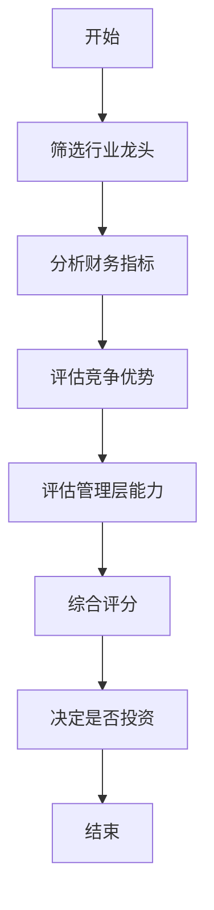
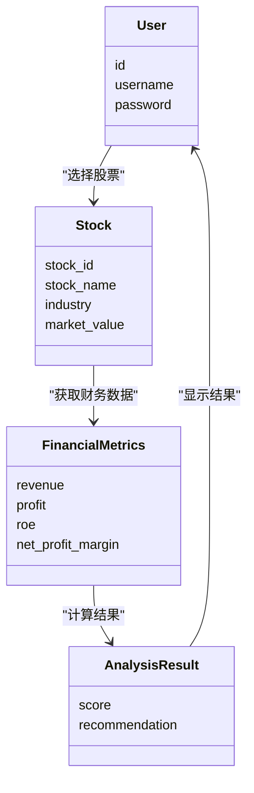

                 


# 彼得林奇的"长期增长"选股策略详解

## 关键词：彼得林奇，长期增长，选股策略，投资分析，财务指标，竞争优势

## 摘要：彼得·林奇是著名的投资专家，以其长期增长选股策略闻名。本文详细解析该策略的核心概念、实施步骤及实际案例，帮助读者掌握如何通过分析公司基本面、竞争优势和管理层能力来选择具备长期增长潜力的股票。

---

## 正文

### 第一部分：背景介绍

#### 1.1 长期增长选股策略的核心概念

长期增长选股策略关注公司未来数年的收入和利润增长潜力，而非短期股价波动。这种策略基于公司的基本面分析，寻找那些具备持续竞争优势、良好财务状况和优秀管理层的企业。

#### 1.2 长期增长的重要性

- **稳定性**：长期增长公司受经济波动影响较小，投资风险较低。
- **复利效应**：长期稳定的增长能带来复利收益，显著提升投资回报。
- **抗跌性**：在市场低迷时，长期增长股往往表现更优。

### 第二部分：核心概念与联系

#### 2.1 长期增长与其他选股策略的对比

| 策略类型       | 关注点                  | 投资期限      | 风险程度 |
|----------------|-------------------------|---------------|-----------|
| 短期交易       | 股价波动                | 短期           | 高         |
| 价值投资       | 低估值                  | 中期           | 中         |
| 成长投资       | 高成长                  | 长期           | 高         |
| 长期增长选股   | 持续增长潜力             | 长期           | 中         |

#### 2.2 ER实体关系图

```mermaid
erDiagram
    company --> industry : "属于"
    company --> financialMetrics : "拥有"
    company --> management : "依赖"
    company --> competitiveAdvantage : "具备"
```

### 第三部分：算法原理讲解

#### 3.1 长期增长选股算法流程图



#### 3.2 Python实现的选股模型

```python
def calculate_financial_health(company_data):
    # 计算ROE
    roe = company_data['净利润'] / company_data['股东权益']
    # 计算净利率
    net_profit_margin = company_data['净利润'] / company_data['营业收入']
    # 计算研发投入占比
    r_d_ratio = company_data['研发费用'] / company_data['营业收入']
    # 综合评分
    score = 0.4 * roe + 0.3 * net_profit_margin + 0.3 * r_d_ratio
    return score

# 示例数据
company_data = {
    '净利润': 100,
    '股东权益': 500,
    '营业收入': 1000,
    '研发费用': 200
}

score = calculate_financial_health(company_data)
print(f"公司综合评分为：{score}")
```

### 第四部分：系统分析与架构设计方案

#### 4.1 项目介绍

设计一个基于长期增长策略的投资分析系统，帮助用户筛选具备长期增长潜力的股票。

#### 4.2 系统功能设计



#### 4.3 系统架构设计


### 第五部分：项目实战

#### 5.1 实战环境安装

- **工具安装**：安装Python、Pandas、Matplotlib、Scikit-learn。
- **数据获取**：使用Yahoo Finance API获取股票数据。

#### 5.2 核心实现源代码

```python
import pandas as pd
import numpy as np

def calculate_growth(company_data):
    revenue_growth = (company_data['revenue_ttm'] - company_data['revenue_1y']) / company_data['revenue_1y']
    profit_growth = (company_data['net_profit_ttm'] - company_data['net_profit_1y']) / company_data['net_profit_1y']
    return (revenue_growth + profit_growth) / 2

# 示例数据
data = {
    'revenue_ttm': 10000,
    'revenue_1y': 9000,
    'net_profit_ttm': 1000,
    'net_profit_1y': 800
}

growth_score = calculate_growth(data)
print(f"增长评分为：{growth_score}")
```

#### 5.3 案例分析

以微软为例，分析其长期增长潜力：

1. **行业地位**：科技行业领导者，具有强大的市场支配力。
2. **财务状况**：稳定的收入和利润增长，ROE保持高位。
3. **管理层能力**：Satya Nadella领导下的微软持续创新，投资云服务和AI领域。

### 第六部分：最佳实践 tips

- **小结**：长期增长选股策略注重公司的基本面和长期发展潜力，适合长期投资者。
- **注意事项**：定期重新评估投资组合，避免单一行业过度集中。
- **拓展阅读**：推荐彼得·林奇的书籍，深入理解其投资哲学。

---

# 作者：AI天才研究院 & 禅与计算机程序设计艺术

