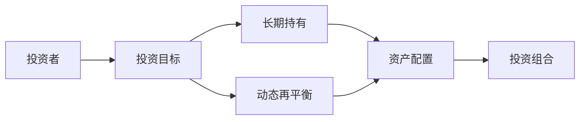
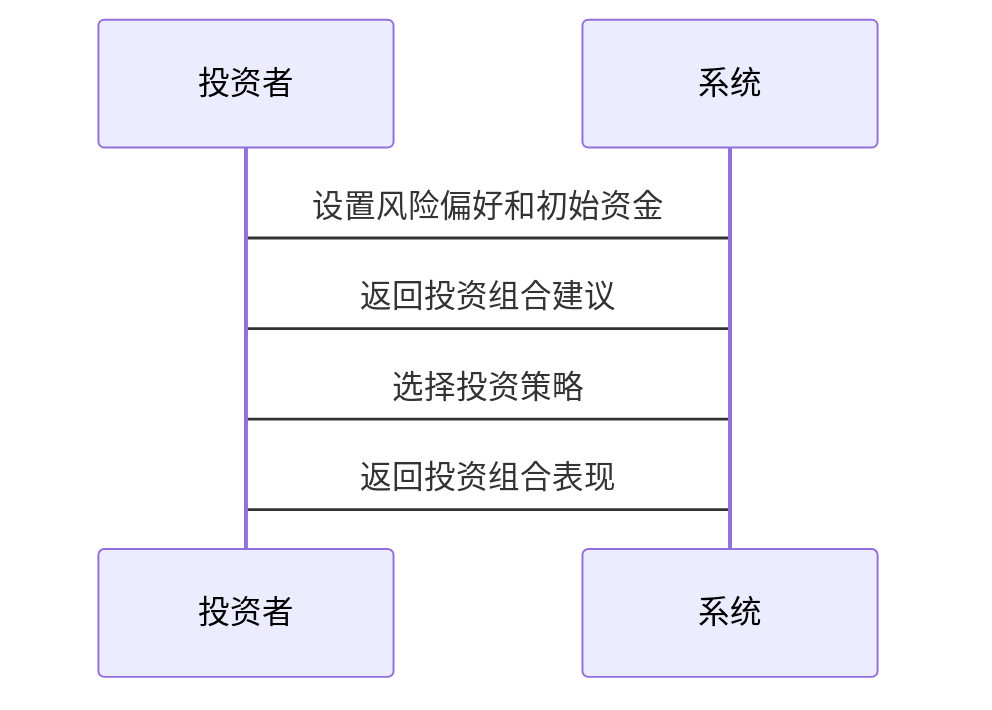

                 


# 彼得林奇的"长期持有"vs"动态再平衡"

> 关键词：投资策略，彼得林奇，长期持有，动态再平衡，资产配置，风险管理，投资回报

> 摘要：本文深入分析了彼得林奇的两种投资策略：长期持有和动态再平衡。通过对比这两种策略的核心概念、优缺点、数学模型和实际应用，探讨了在不同市场环境和投资者需求下，如何选择和优化投资策略。本文旨在为投资者提供理论指导和实践参考，帮助他们在复杂多变的市场中做出明智的投资决策。

---

## 第一部分：引言

### 1.1 投资市场的背景与问题背景

#### 1.1.1 投资市场的基本概念
投资市场是金融体系的重要组成部分，投资者通过购买股票、债券、基金等资产，期望在长期或短期中获得收益。投资市场的核心是资产定价与资源配置，而投资者的决策则受到市场波动、经济周期、政策变化等多重因素的影响。

#### 1.1.2 股票市场的运作机制
股票市场是企业融资和投资者投资的主要场所，其运作机制包括发行、交易、信息传递等功能。股票价格的波动反映了市场参与者的预期和信心，而投资者的行为则进一步影响市场的供需关系。

#### 1.1.3 投资者的角色与分类
投资者可以分为机构投资者和个人投资者。机构投资者通常具备专业的知识和资金优势，而个人投资者则更多依赖于个人判断和经验。不同类型的投资者在市场中的行为和策略选择上存在显著差异。

### 1.2 长期持有与动态再平衡的背景

#### 1.2.1 投资策略的基本分类
投资策略可以分为主动型和被动型两大类。主动型策略强调积极选股和择时，而被动型策略则通过指数基金等工具进行投资。长期持有和动态再平衡分别属于这两种类型的核心策略。

#### 1.2.2 长期持有与动态再平衡的定义
- **长期持有**：指投资者买入优质资产后，长期持有，较少干预，主要依靠资产增值和复利效应实现收益。
- **动态再平衡**：指根据市场变化和个人风险偏好，定期调整投资组合，以优化资产配置和降低风险。

#### 1.2.3 问题背景与研究意义
在复杂的市场环境中，投资者需要在收益与风险之间找到平衡点。长期持有策略的优势在于简单高效，但其缺点是忽视市场波动和风险控制；动态再平衡策略则能够及时应对市场变化，但操作复杂且需要频繁调整。本文通过对比分析这两种策略，为投资者提供理论依据和实践指导。

---

## 第二部分：彼得林奇的投资理念

### 2.1 彼得林奇的投资者画像

#### 2.1.1 投资者的心理特征
彼得林奇认为，成功的投资者具备耐心、纪律性和对市场的深刻理解。投资者需要克服贪婪和恐惧，避免情绪化决策。

#### 2.1.2 投资者的知识储备
投资者需要具备扎实的金融知识，了解资产定价、公司基本面分析等核心内容。彼得林奇强调，投资决策应基于事实和数据，而非市场传言。

#### 2.1.3 投资者的决策模式
彼得林奇提倡“买入并持有优质资产”的策略，强调选择具有竞争优势和良好管理的公司。他反对频繁交易和短期投机，认为长期持有是实现财富增长的最佳方式。

### 2.2 彼得林奇的投资哲学

#### 2.2.1 长期持有策略的核心思想
长期持有策略的核心在于选择优质资产，长期持有，依靠复利效应实现财富增长。彼得林奇认为，市场波动是短期的，优质资产的长期价值是确定的。

#### 2.2.2 动态再平衡策略的理论基础
动态再平衡策略强调根据市场变化和个人风险偏好，定期调整投资组合。这种方法能够有效应对市场波动，降低投资风险，但需要投资者具备较高的市场敏感性和操作能力。

#### 2.2.3 两种策略的优缺点对比
- **长期持有**：优点是简单、高效，缺点是忽视短期波动和风险控制。
- **动态再平衡**：优点是灵活性高、风险可控，缺点是操作复杂且需要频繁调整。

---

## 第三部分：长期持有与动态再平衡的核心概念对比

### 3.1 核心概念原理

#### 3.1.1 长期持有的核心原理
长期持有策略的核心在于选择优质资产，长期持有，依靠复利效应实现财富增长。彼得林奇认为，市场波动是短期的，优质资产的长期价值是确定的。

#### 3.1.2 动态再平衡的核心原理
动态再平衡策略强调根据市场变化和个人风险偏好，定期调整投资组合。这种方法能够有效应对市场波动，降低投资风险，但需要投资者具备较高的市场敏感性和操作能力。

#### 3.1.3 两种策略的数学模型对比
- 长期持有策略的收益模型：
  $$ R_{total} = (1 + R_1) \times (1 + R_2) \times \cdots \times (1 + R_n) - 1 $$
  其中，$R_i$ 为各年收益。

- 动态再平衡策略的收益模型：
  $$ R_{total} = \sum_{i=1}^{n} R_i $$
  其中，$R_i$ 为各年的收益。

### 3.2 核心概念属性特征对比

#### 3.2.1 战略目标对比
- 长期持有：追求长期稳定的资产增值。
- 动态再平衡：追求短期风险可控下的收益最大化。

#### 3.2.2 风险承受能力对比
- 长期持有：风险承受能力较高，适合风险偏好较高的投资者。
- 动态再平衡：风险承受能力较低，适合风险偏好较低的投资者。

#### 3.2.3 时间周期对比
- 长期持有：时间周期较长，通常为数年甚至数十年。
- 动态再平衡：时间周期较短，通常为季度或半年。

#### 3.2.4 操作复杂度对比
- 长期持有：操作简单，仅需定期复核投资组合。
- 动态再平衡：操作复杂，需要频繁调整资产配置。

### 3.3 ER实体关系图


---

## 第四部分：长期持有与动态再平衡的系统分析与架构设计

### 4.1 问题场景介绍
投资者在选择投资策略时，需要考虑市场环境、风险偏好和投资目标。本文通过构建投资组合管理系统，模拟长期持有和动态再平衡两种策略在不同市场环境下的表现。

### 4.2 系统功能设计

#### 4.2.1 领域模型


#### 4.2.2 系统架构设计


#### 4.2.3 系统接口设计
- 输入接口：投资者的风险偏好、初始资金、投资期限。
- 输出接口：投资组合的收益与风险评估。

#### 4.2.4 系统交互流程


---

## 第五部分：项目实战

### 5.1 环境安装
本文通过Python编写投资组合模拟器，读者需要安装Python和相关库（如numpy、pandas、matplotlib）。

### 5.2 核心实现源代码

```python
import numpy as np
import pandas as pd
import matplotlib.pyplot as plt

# 定义投资组合模拟器
class InvestmentSimulator:
    def __init__(self, initial资本, strategy):
        self.capital = initial_capital
        self.strategy = strategy
        self.portfolio = {}

    def simulate(self, market_data, period):
        for i in range(period):
            # 根据策略调整投资组合
            if self.strategy == '长期持有':
                self.portfolio = self.long_term_hold(market_data[i])
            elif self.strategy == '动态再平衡':
                self.portfolio = self.dynamic_rebalance(market_data[i])
            # 计算收益
            self.capital *= (1 + self.portfolio['收益'])
        return self.capital

    def long_term_hold(self, market_data):
        # 简单的长期持有策略，假设持有股票
        return {'收益': market_data['股票收益']}

    def dynamic_rebalance(self, market_data):
        # 简单的动态再平衡策略，假设根据市场调整
        return {'收益': market_data['债券收益'] if market_data['市场风险'] > 0.5 else market_data['股票收益']}

# 示例数据
market_data = {
    '股票收益': [0.1, -0.05, 0.08, -0.02, 0.06],
    '债券收益': [0.02, 0.03, 0.01, 0.04, 0.02],
    '市场风险': [0.6, 0.3, 0.7, 0.4, 0.5]
}

# 初始化模拟器
simulator_lt = InvestmentSimulator(10000, '长期持有')
simulator_dr = InvestmentSimulator(10000, '动态再平衡')

# 模拟投资
capital_lt = simulator_lt.simulate(market_data, 5)
capital_dr = simulator_dr.simulate(market_data, 5)

print(f'长期持有策略最终资金：{capital_lt}')
print(f'动态再平衡策略最终资金：{capital_dr}')
```

### 5.3 代码应用解读与分析
上述代码定义了一个投资组合模拟器，分别模拟长期持有和动态再平衡策略在不同市场环境下的表现。通过输入市场数据，模拟器计算出两种策略下的最终资金情况。

---

## 第六部分：结论与建议

### 6.1 结论
通过对比分析，长期持有和动态再平衡各有优劣。长期持有策略适合风险承受能力强且具备长期投资视野的投资者，而动态再平衡策略则适合风险偏好较低且需要灵活应对市场变化的投资者。

### 6.2 最佳实践 tips
- **长期持有策略**：选择具有竞争优势和良好管理的公司，长期持有，避免频繁交易。
- **动态再平衡策略**：根据市场变化和个人风险偏好，定期调整资产配置，降低投资风险。
- **组合投资**：在实际操作中，投资者可以结合两种策略，根据市场环境灵活调整。

### 6.3 小结
本文通过深入分析彼得林奇的长期持有和动态再平衡策略，为投资者提供了理论指导和实践参考。投资者应根据自身的风险偏好和市场环境，选择合适的策略，并在实践中不断优化和调整。

### 6.4 注意事项
- 投资有风险，入市需谨慎。
- 本文仅为理论分析，实际投资需结合具体市场环境和专业建议。

### 6.5 拓展阅读
- 彼得林奇的《彼得林奇选股》
- 现代投资组合理论（MPT）

---

## 作者信息

作者：AI天才研究院/AI Genius Institute & 禅与计算机程序设计艺术 /Zen And The Art of Computer Programming

