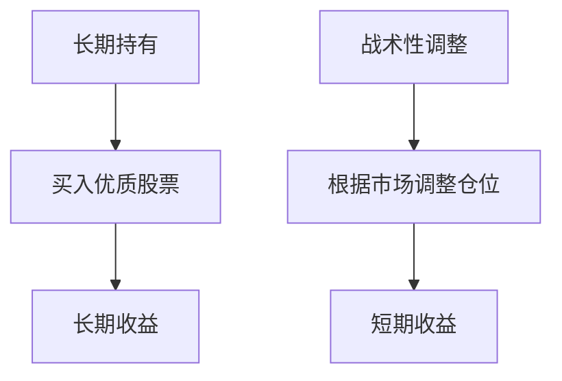
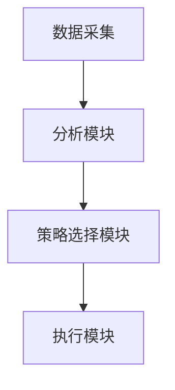

                 


# 彼得林奇的"长期持有"vs"战术性调整"

## 关键词：投资策略，彼得·林奇，长期持有，战术性调整，投资组合，风险控制

## 摘要：本文深入探讨了彼得·林奇的两种投资策略：长期持有和战术性调整。通过分析其优缺点、数学模型和实际应用，帮助投资者理解何时及如何应用这些策略以优化投资组合。文章结合理论与实践，提供系统化的投资决策框架。

---

# 第一章：投资策略背景与核心概念

## 1.1 长期持有与战术性调整概述

### 1.1.1 长期持有策略

长期持有策略强调买入优质股票并长期持有，核心理念是基于企业的内在价值。投资者关注企业的财务健康、行业地位和长期盈利能力，而非短期市场波动。该策略的优势包括税收效率高、交易成本低、避免市场择时风险，但其局限性在于市场低迷时可能承受较大回撤。

### 1.1.2 战术性调整策略

战术性调整策略强调根据市场环境变化进行短期买卖决策，以捕捉市场波动带来的收益。其优势在于灵活性强，能在市场顶部减少风险敞口，但频繁交易增加了交易成本和税务负担，且需要较高的市场判断能力。

### 1.1.3 两种策略的对比

| **对比维度** | **长期持有** | **战术性调整** |
|--------------|---------------|----------------|
| **目标**     | 稳定收益      | 短期收益最大化  |
| **风险**     | 较低          | 较高            |
| **适用场景** | 稳定市场       | 波动性市场       |

---

# 第二章：长期持有与战术性调整的核心概念

## 2.1 长期持有策略的核心概念

长期持有的核心在于价值投资，强调买入并持有优质股票。关键概念包括：

1. **内在价值**：企业未来现金流的现值，计算公式为：
   $$ V = \frac{E}{k} $$
   其中，E为企业未来现金流，k为折现率。

2. **安全边际**：买入价格低于内在价值，以降低风险。

## 2.2 战术性调整策略的核心概念

战术性调整基于技术分析和市场情绪，关键概念包括：

1. **技术指标**：如RSI、移动平均线等，用于判断买卖时机。
   - RSI计算公式：
     $$ RSI = \frac{100}{1 + \frac{a}{b}} $$
     其中，a为上涨幅度，b为下跌幅度。

2. **市场周期**：识别市场顶部和底部，进行短期买卖。

## 2.3 实体关系图

图2-1展示了长期持有与战术性调整的关系：



---

# 第三章：数学模型与算法原理

## 3.1 长期持有策略的数学模型

长期持有策略基于对企业内在价值的评估。假设某企业未来现金流为$E$，折现率为$k$，则内在价值$V$为：
$$ V = \frac{E}{k} $$

例如，若$E=100$，$k=10\%$，则$V=1000$。

## 3.2 战术性调整策略的数学模型

战术性调整策略使用技术指标，如RSI。RSI计算公式：
$$ RSI = \frac{100}{1 + \frac{a}{b}} $$
其中，$a$为上涨幅度，$b$为下跌幅度。当RSI超过70，可能进入超买状态；低于30，可能进入超卖状态。

---

# 第四章：系统分析与架构设计

## 4.1 投资决策系统架构

构建一个投资决策系统，需考虑数据采集、分析和策略执行。系统架构包括：

1. 数据采集模块：获取市场数据。
2. 分析模块：评估股票价值、分析技术指标。
3. 策略选择模块：根据分析结果选择策略。

系统架构图如下：



---

# 第五章：项目实战与案例分析

## 5.1 项目环境与工具安装

使用Python、Pandas、Matplotlib进行数据处理和可视化。代码实现如下：

```python
import pandas as pd
import matplotlib.pyplot as plt

# 示例数据
data = {'股票': ['A', 'B', 'C'], '价格': [100, 200, 300}
df = pd.DataFrame(data)
print(df)
df.plot(kind='bar')
plt.show()
```

## 5.2 核心代码实现

### 长期持有策略代码

```python
def calculate_intrinsic_value(E, k):
    return E / k

E = 100
k = 0.1
print(f"内在价值：{calculate_intrinsic_value(E, k)}")
```

### 战术性调整策略代码

```python
def calculate_rsi(a, b):
    return 100 / (1 + a / b)

a = 5
b = 5
print(f"RSI值：{calculate_rsi(a, b)}")
```

## 5.3 案例分析

以2008年金融危机为例，长期持有策略在市场复苏后表现优异，而战术性调整策略在危机期间减少了损失。通过代码实现数据处理和策略应用，投资者可评估不同策略下的收益和风险。

---

# 第六章：总结与建议

## 6.1 总结

长期持有策略适合风险承受能力较低的投资者，而战术性调整策略适合能够应对市场波动的投资者。两者结合使用，可优化投资组合的风险收益比。

## 6.2 投资建议

1. **长期持有**：买入优质企业股票，耐心持有，避免频繁交易。
2. **战术性调整**：在市场剧烈波动时，适当调整仓位，减少风险。
3. **结合使用**：根据市场环境和自身风险偏好，灵活运用两种策略。

---

# 作者：AI天才研究院 & 禅与计算机程序设计艺术

