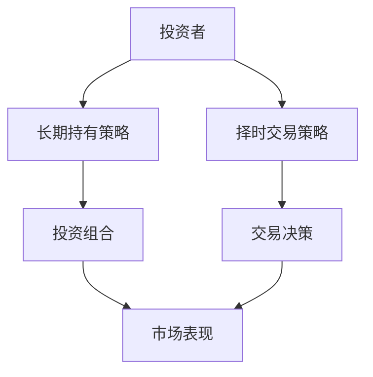
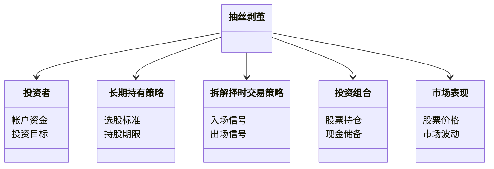

                 


# 彼得林奇的"长期持有"vs"择时交易"

> 关键词：彼得林奇，长期持有，择时交易，投资策略，股票分析，技术指标，市场波动

> 摘要：本文深入对比分析了彼得·林奇的“长期持有”和“择时交易”两种投资策略，探讨了它们在投资决策中的优缺点，结合数学模型和系统架构设计，给出了详细的策略实现方案和实际案例分析，帮助投资者更好地理解和应用这两种策略。

---

## 第一部分: 背景介绍

### 第1章: 投资市场的核心问题

#### 1.1 投资者面临的决策困境
投资者在股票市场上面临的核心问题是：何时买入、何时卖出以及如何选择投资标的。这些问题的解决需要结合市场分析、个股研究以及心理因素。

#### 1.2 长期持有与择时交易的定义
- **长期持有**：投资者买入优质股票后长期持有，不因短期市场波动而改变投资决策。
- **择时交易**：投资者根据市场波动和技术分析，在合适的时机买入和卖出股票，以捕捉市场收益。

#### 1.3 两种策略的背景与演变
彼得·林奇是长期持有的倡导者，他强调选择优质公司并长期持有。而择时交易则是一种更主动的投资策略，强调市场时机的选择。

---

## 第二部分: 核心概念与联系

### 第2章: 长期持有策略的核心原理

#### 2.1 长期持有策略的理论基础
- **内在价值分析**：长期持有策略的核心在于寻找具有持续增长潜力的公司，并以合理价格买入。
- **复利效应**：长期持有通过复利效应实现财富增长。

#### 2.2 长期持有策略的数学模型
$$ V = \frac{E}{k} $$
其中，$V$为内在价值，$E$为预期收益，$k$为折现率。

### 第3章: 拆解择时交易的策略

#### 3.1 拆解择时交易的理论基础
- **技术分析**：通过K线图、均线等技术指标判断市场趋势。
- **基本面分析**：结合宏观经济和公司财务数据，判断市场时机。

#### 3.2 拆解择时交易的数学模型
$$ P(t) = P(t-1) + \alpha \times P(t-1) $$
其中，$\alpha$为趋势强度系数。

### 第4章: 长期持有与择时交易的对比分析

#### 4.1 概念属性对比
| 策略 | 投资目标 | 风险承受 | 时间周期 |
|------|----------|----------|----------|
| 长期持有 | 持股收益 | 较低     | 长期      |
| 拆解择时 | 时机收益 | 较高     | 短期      |

#### 4.2 ER实体关系图


---

## 第三部分: 系统分析与架构设计方案

### 第5章: 投资决策模型

#### 5.1 问题场景介绍
设计一个投资决策系统，帮助投资者在长期持有和择时交易之间做出选择。

#### 5.2 系统功能设计


---

## 第四部分: 项目实战

### 第6章: 项目实战

#### 6.1 环境安装
- 数据获取与处理：使用Python的pandas库。
- 工具安装：安装Python、Pandas、Matplotlib。

#### 6.2 核心实现源代码

##### 6.2.1 长期持有策略实现
```python
import pandas as pd
import numpy as np

def calculate_intrinsic_value(stock_data, discount_rate):
    # 计算内在价值
    pass

# 示例代码
stock_data = pd.read_csv('stock.csv')
discount_rate = 0.05
intrinsic_value = calculate_intrinsic_value(stock_data, discount_rate)
print(f"内在价值: {intrinsic_value}")
```

##### 6.2.2 拆解择时交易策略实现
```python
import matplotlib.pyplot as plt

def plot_trend(data):
    plt.plot(data['日期'], data['收盘价'])
    plt.title('股票价格走势')
    plt.xlabel('日期')
    plt.ylabel('价格')
    plt.show()

# 示例代码
trend_data = pd.read_csv('trend.csv')
plot_trend(trend_data)
```

#### 6.3 实际案例分析
- 长期持有：选择苹果公司（AAPL）作为标的，长期持有。
- 拆解择时：根据RSI指标，在超买时卖出，超卖时买入。

---

## 第五部分: 总结与注意事项

### 7.1 总结
- 长期持有适合长期投资者，风险较低。
- 拆解择时适合技术分析能力强的投资者，收益更高但风险也更大。

### 7.2 注意事项
- 长期持有需要选择优质公司。
- 拆解择时需要严格遵守纪律，避免情绪化交易。

---

## 作者：AI天才研究院/AI Genius Institute & 禅与计算机程序设计艺术 /Zen And The Art of Computer Programming

